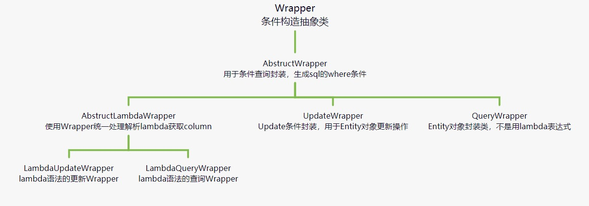
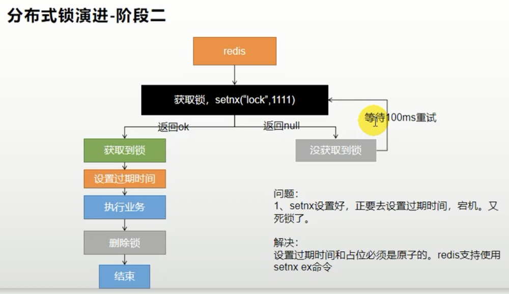
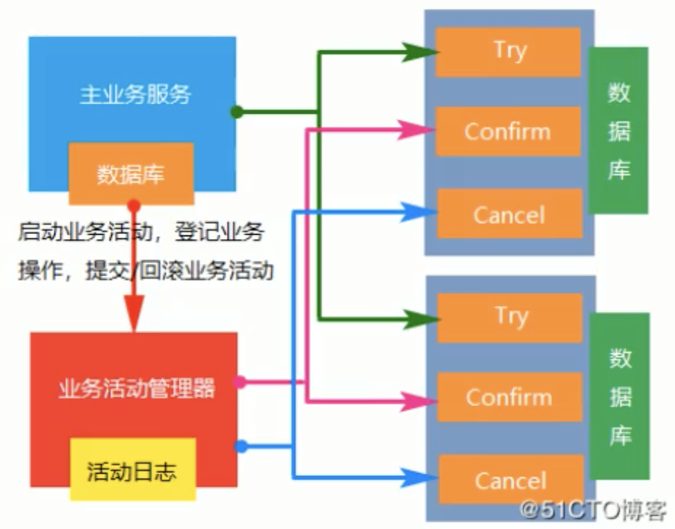
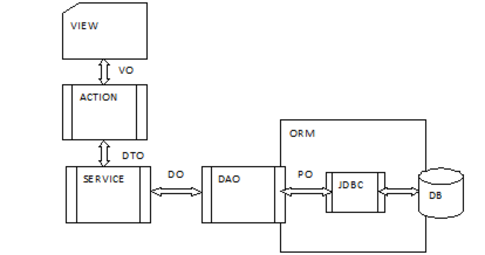

#   一、主流技术

## 1、MybatisPlus

### 1、说明

```java
针对mybatis做的增强,简化开发
```
### 2、在线学习地址

```java
http://mp.baomidou.com
```
### 3、整合过程

```markdown
# 导入依赖
<!-- mybatisplus依赖 -->
<dependency>            
	<groupId>com.baomidou</groupId>      
	<artifactId>mybatis-plus-boot-starter</artifactId>   
	<version>3.2.0</version>  
</dependency>
<!-- mysql驱动 -->
<!-- https://mvnrepository.com/artifact/mysql/mysql-connector-java -->
<dependency>
	<groupId>mysql</groupId>
	<artifactId>mysql-connector-java</artifactId>    
	<version>8.0.17</version>
</dependency>

# 配置文件配置
-- application.yml中配置数据源相关信息
#配置mysql数据源
spring:
	datasource:
		username: root
		password: root
		url: jdbc:mysql://192.168.56.106:3306/db_mall_sms
		driver-class-name: com.mysql.jdbc.Driver
		
-- 配置mybatisplus相关配置
    #配置mybatis-plus查找sql映射文件
    mybatis-plus.mapper-locations=classpath:/mapper/**/*.xml
    #配置主键自增
    mybatis-plus.global-config.db-config.id-type=auto
    #全局逻辑删除的实体字段名[since 3.3.0,配置后可以忽略不配置步骤2
    mybatis-plus.global-config.db-config.logic-delete-field=flag 
    #逻辑已删除值[默认为1]
    mybatis-plus.global-config.db-config.logic-delete-value=1 
    #逻辑未删除值[默认为0]    
    mybatis-plus.global-config.db-config.logic-not-delete-value=0                     
```
### 4、使用步骤

```markdown
# 创建数据库，创建数据表，添加数据用于mp操作

# 初始化工程
-- 使用Spring Initializr快速初始化一个SpringBoot工程
-- 当前使用版本：2.2.1.RELEASE
-- Artifact中安装mybatis-plus插件

# 添加依赖                     
<dependencies>
	<!--springboot启动器依赖-->
	<dependency>
		<groupId>org.springframework.boot</groupId>
		<artifactId>spring-boot-starter</artifactId>
	</dependency>

	<!--springboot测试依赖-->
	<dependency>
		<groupId>org.springframework.boot</groupId>
		<artifactId>spring-boot-starter-test</artifactId>
		<scope>test</scope>
		<exclusions>
			<exclusion>
      <groupId>org.junit.vintage</groupId>
      <artifactId>junit-vintage-engine</artifactId>
      </exclusion>
    </exclusions>
  </dependency>

  <!--mybatis-plus依赖-->
  <dependency>
  	<groupId>com.baomidou</groupId>
  	<artifactId>mybatis-plus-boot-starter</artifactId>
  	<version>3.0.5</version>
  </dependency>

  <!--mysql依赖-->
  <dependency>
  	<groupId>mysql</groupId>
  	<artifactId>mysql-connector-java</artifactId>
  </dependency>

  <!--lombok用来简化实体类的开发（通过注解形式就不需要写get和set方法）-->
  <dependency>
  	<groupId>org.projectlombok</groupId>
  	<artifactId>lombok</artifactId>
  </dependency>
</dependencies>

# 安装lombok插件
Settings-->Plugins-->Marketplace-->搜索lombok进行安装  

# 创建配置文件[application.properties或application.yml],并添加配置项内容如下:
#mysql5
#spring.datasource.driver-class-name=com.mysql.jdbc.Driver
#spring.datasource.url=jdbc:mysql://localhost:3306/mybatis_plus
#mysql8以上（springboot2.1以上）
spring.datasource.driver-class-name=com.mysql.cj.jdbc.Driver
##【serverTimezone=GMT%2B8】表示时区;【&useUnicode=true&characterEncoding=utf8】用于设置编码格式，防止中文乱码
spring.datasource.url=jdbc:mysql://localhost:3306/mybatis_plus?serverTimezone=GMT%2B8&useUnicode=true&characterEncoding=utf8
spring.datasource.username=root
spring.datasource.password=root
#mybatis日志
##查看更详细的内容
mybatis-plus.configuration.log-impl=org.apache.ibatis.logging.stdout.StdOutImpl
#设置逻辑删除默认值配置，可自动以配置
mybatis-plus.global-config.db-config.logic-delete-value=1
mybatis-plus.global-config.db-config.logic-not-delete-value=0

# 编写代码
-- 创建对应实体类
-- 创建对应mapper接口文件继承自BaseMapper<对应实体类名>                     
```

### 5、主键生成策略

```markdown
# 分类
AUTO_INCREMENT————自动增长,缺点是进行分表操作时，下一张表需要知道上一张表的最后一个id
UUID————每次操作都会生成随机的一个唯一的值,缺点是无法通过生成的值进行排序
Redis实现————依据redis的原子操作INCR和INCRBY来实现
MP自带策略————snowflake算法：使用41bit作为毫秒数，10bit作为机器的ID（5个bit是数据中心，5个bit的机器ID），12bit作为毫秒内的流水号（意味着每个节点在每毫秒可以产生 4096 个 ID），最后还有一个符号位，永远是0。	

# 使用
在要生成主键的属性上添加注解:@TableId（type=IdType.xxx）
```

### 6、自动填充

```markdown
# 实现步骤
-- 在实体类中进行自动填充的属性上添加注解：@TableField（fill=FieldFill.xxx）
	@TableField(fill = FieldFill.INSERT)
  private Date createTime;
  @TableField(fill = FieldFill.INSERT_UPDATE)
  private Date updateTime;
  
-- 创建类（元对象处理类），实现接口MetaObjectHandler，并实现接口中的方法，同时将该类交由spring管理
    @Component//将该类交由spring容器管理
    public class MyMetaObjectHandler implements MetaObjectHandler {
        @Override
        public void insertFill(MetaObject metaObject) {
            //metaObject:元数据对象
            this.setFieldValByName("createTime", new Date(), metaObject);
            this.setFieldValByName("updateTime", new Date(), metaObject);
        }
    
        @Override
        public void updateFill(MetaObject metaObject) {
            //metaObject:元数据对象
            this.setFieldValByName("updateTime", new Date(), metaObject);
        }
    }
```

### 7、乐观锁

```markdown
# 作用
主要解决丢失更新问题(并发修改同一条记录时，最后一次的提交会将之前的更新覆盖。)

# 解决方案
-- 悲观锁(串行)
-- 乐观锁

# 实现原理
-- 1、取出记录时，获取当前version
-- 2、更新时，带上这个version
-- 3、执行更新时，set version=newVersion where version=oldVersion
-- 4、如果version不对，就更新失败

# 具体实现
-- 1、表添加字段，作为乐观锁的版本号
-- 2、对应实体添加版本号属性
-- 3、在实体类版本号属性添加注解@Version
-- 4、配置乐观锁插件（写到配置类中）
// Spring xml方式
<bean class="com.baomidou.mybatisplus.extension.plugins.inner.OptimisticLockerInnerInterceptor" id="optimisticLockerInnerInterceptor"/>  
<bean id="mybatisPlusInterceptor" class="com.baomidou.mybatisplus.extension.plugins.MybatisPlusInterceptor">    
  <property name="interceptors">        
    <list>              
      <ref bean="optimisticLockerInnerInterceptor"/>    
    </list>   
  </property>
</bean>
// Springboot 注解方式
@Bean
public MybatisPlusInterceptor mybatisPlusInterceptor() {  
MybatisPlusInterceptor interceptor = new MybatisPlusInterceptor();    
interceptor.addInnerInterceptor(new OptimisticLockerInnerInterceptor());  
return interceptor;
}
```

### 8、分页实现

```markdown
# 说明
PageHelper类似

# 实现步骤
-- 1、配置分页插件
  /**    
  * 分页插件
  * 
  * @return 
  */ 
  @Bean 
  public PaginationInterceptor paginationInterceptor() {
    return new PaginationInterceptor();
  }
  
-- 2、编写分页代码
  /**     
  * 分页查询    
  */
  @Test
  void testPageSelect() {  
    //1、创建page对象(分页当前页，每页条数)  
    Page<User> page = new Page<>(2, 2);  
    //2、调用mp分页查询方法(分页对象，条件)，会将分页所有的对象封装到page对象中 
    userMapper.selectPage(page, null);  
    //3、通过page对象获取分页数据  
    System.out.println("当前页：" + page.getCurrent());  
    System.out.println("每页数据list集合：" + page.getRecords()); 
    System.out.println("每页显示记录数：" + page.getSize());  
    System.out.println("总记录数：" + page.getTotal()); 
    System.out.println("总页数：" + page.getPages());  
    System.out.println("是否有下一页：" + page.hasNext()); 
    System.out.println("是否有上一页：" + page.hasPrevious()); 
  }
```

### 9、简单查询

```markdown
# 根据ID查询————xxxMapper.selectById([id值])
  /**     
  * 根据id查询
  */
  @Test
  void selectById() {
    //根据id查询数据   
    User user = userMapper.selectById(1409337486740770818L);  
    System.out.println(user);    
	}

# 通过多个id批量查询————xxxMapper.selectBatchIds([id集合])
  /**     
  * 根据多个id批量查询    
  */
  @Test
  void testSelectByIds(){
    List<User> users = userMapper.selectBatchIds(Arrays.asList(1409341740750704641L, 1409341829028179969L)); 
    System.out.println(users);
  }

# 通过map封装查询条件————xxxMapper.selectByMap([map对象])
  /**
  * 通过map封装查询条件    
  */
  @Test 
  void testSelectByMap() {
    Map<String, Object> map = new HashMap<>();
    map.put("name", "mary"); 
    map.put("age", 16);
    List<User> users = userMapper.selectByMap(map);
    System.out.println(users);    
  }
```

### 10、复杂条件查询

```markdown
# 一般复杂查询使用QueryWrapper对象,结构图如下:
```



```markdown
# 包含的常见操作,如图所示:
	select                                     指定查询的列                                      
```


```markdown
# 代码实现步骤
  /**     
  * 复杂查询操作实现 
  */ 
  @Test
  void testSelectByQueryWrapper() {   
    //1、创建QueryWrapper对象        
    QueryWrapper<User> wrapper = new QueryWrapper<>();       
    //2、使用QueryWrapper对象设置条件       
    //ge【大于等于】、gt【大于】、le【小于等于】、lt【小于】 
    //  查询大于ag>25的      
    wrapper.gt("age", 25);    
    //eq【等于】、ne【不等于】       
    //  查询name等于mary的值       
    wrapper.eq("name", "mary");       
    //  查询name不等于mary的值       
    wrapper.ne("name", "mary");       
    //between【在范围内】包含边界       
    //  查询age在20-30之间的      
    wrapper.between("age", 20, 40);  
    //like【模糊查询】       
    //  查询名字中包含“骨”的数据   
    wrapper.like("name", "骨");
    //orderByDesc【排序】     
    //  根据id降序排列       
    wrapper.orderByDesc("id");  
    //last【直接拼接到sql最后】   
    wrapper.last("limit 1");      
    //指定查询列       
    wrapper.select("name", "age", "id");   
    List<User> users = userMapper.selectList(wrapper);  
    System.out.println(users); 
  }
```

### 11、物理删除

```markdown
# 说明
	直接从数据库中将数据记录删除

# 代码实现
-- 根据id删除
	/**     
	* 根据id删除
  */
  @Test
  void deleteById() {
  	int i = userMapper.deleteById(1409341740750704641L);   
  	System.out.println(i);    
 	}
	
-- 根据id批量删除
	/**     
	* 根据id集合批量删除  
  */
  @Test  
  void deleteByIds() {
  	int i = userMapper.deleteBatchIds(Arrays.asList(1409341740750704641L, 1409341829028179969L));   			
  	System.out.println(i);    
  }

-- 根据map条件删除
	/**
  * 根据map条件删除    
  */
  @Test
  void deleteByMap() {
  	Map<String, Object> map = new HashMap<>(); 
    map.put("name", "mary");
    map.put("age", 16);  
    int i = userMapper.deleteByMap(map);  
    System.out.println(i); 
  }
```


### 12、逻辑删除

```markdown
# 1、表中添加逻辑删除字段，标识数据是否被删除

# 2、实体类中添加对应属性，并添加@TableLogic和@TableField(fill=FieldFill.INSERT)注解
	/**     
	* 逻辑删除标识，并添加自动填充注解，以及逻辑删除注解     
	*/ 
  @TableLogic 
  @TableField(fill = FieldFill.INSERT)    
  private Integer deleted;

# 3、元对象处理类添加自动填充设置
	/**     
	* 数据插入操作自动填充属性    
  *
  * @param metaObject 元数据对象     
  */
  @Override 
  public void insertFill(MetaObject metaObject) { 
  	//自动填充createTime字段   
  	this.setFieldValByName("createTime", new Date(), metaObject);
    //自动填充updateTime字段 
    this.setFieldValByName("updateTime", new Date(), metaObject);   
    //自动填充乐观锁版本号version默认值
    this.setFieldValByName("version", 1, metaObject);   
    //自动填充逻辑删除标志deleted默认值 
    this.setFieldValByName("deleted", 0, metaObject);
  }

# 4、配置类文件（application.xml）中添加配置
	# 逻辑删除配置(设置删除标志值，以及未删除标志值，可自定义)
	mybatis-plus.global-config.db-config.logic-delete-value=1
	mybatis-plus.global-config.db-config.logic-not-delete-value=0
	
# 5、配置类中添加实现逻辑删除的插件
	/**     
	* 逻辑删除插件 
  */ 
  @Bean
  public ISqlInjector iSqlInjector(){   
  	return  new LogicSqlInjector();  
  }
# 注意：配置了之后就查询不了删除的数据，要查只能自己配置Mapper对应的xml文件进行自定义语句查询
```

### 13、性能分析插件

```markdown
# 作用
	性能分析拦截器，用于输出每条SQL语句及其执行时间

# 配置插件
	/**     
	* SQL执行性能分析插件   
  * 
  * @return
  */ 
  @Bean
  @Profile({"dev", "test"})//设置dev、test环境开启
  public PerformanceInterceptor performanceInterceptor() {    
    PerformanceInterceptor performanceInterceptor = new PerformanceInterceptor();      
    //SQL执行最大时长，超时自动停止运行，有助于发现问题   
    performanceInterceptor.setMaxTime(100);   
    //SQL是否格式化，默认为false   
    performanceInterceptor.setFormat(true); 
    return performanceInterceptor; 
  }

# 超过配置的时间会发生异常
	Caused by: com.baomidou.mybatisplus.core.exceptions.MybatisPlusException: The SQL execution time is too large, please optimize !
```

### 14、代码生成器生成接口结构

```markdown
# 说明
	AutoGenerator 是 MyBatis-Plus 的代码生成器，通过 AutoGenerator 可以快速生成 Entity、Mapper、Mapper XML、Service、Controller 等各个模块的代码，极大的提升了开发效率。

# 代码实现 
  /**
	* Mp代码生成模版
	*/
  @Test    
  public void run() { 
  	// 1、创建代码生成器      
    AutoGenerator mpg = new AutoGenerator();  
    
    // 2、全局配置    
    GlobalConfig gc = new GlobalConfig();
    //获取项目路径   
    String projectPath = System.getProperty("user.dir");     
    //设置代码生成后的输出目录(建议设置成绝对路径)        
    projectPath = "E:\\项目开发\\edu_parent\\service\\service_edu"; 
    gc.setOutputDir(projectPath + "/src/main/java");    
    //作者     
    gc.setAuthor("Pigskin");       
    //生成后是否打开资源管理器   
    gc.setOpen(false);
    //重新生成时文件是否覆盖     
    gc.setFileOverride(false); 
    //去掉Service接口的首字母I     
    gc.setServiceName("%sService");  
    //主键策略    
    gc.setIdType(IdType.ID_WORKER_STR);    
    //定义生成的实体类中日期类型     
    gc.setDateType(DateType.ONLY_DATE);
    //开启Swagger2模式  
    gc.setSwagger2(true);  
    mpg.setGlobalConfig(gc);      
    
    // 3、数据源配置     
    DataSourceConfig dsc = new DataSourceConfig();    
    dsc.setUrl("jdbc:mysql://localhost:3306/db_online_education?serverTimezone=GMT%2B8&useUnicode=true&characterEncoding=utf8");        
    dsc.setDriverName("com.mysql.cj.jdbc.Driver");        dsc.setUsername("root");        
    dsc.setPassword("root"); 
    dsc.setDbType(DbType.MYSQL);     
    mpg.setDataSource(dsc);     
    
    // 4、包配置  
    PackageConfig pc = new PackageConfig();     
    //包名   
    pc.setParent("com.pigskin");     
    //模块名     
    pc.setModuleName("edu_service");  
    pc.setController("controller");   
    pc.setEntity("entity");      
    pc.setService("service");     
    pc.setMapper("mapper");    
    mpg.setPackageInfo(pc);     
    
    // 5、策略配置     
    StrategyConfig strategy = new StrategyConfig();      
    strategy.setInclude("edu_teacher");       
    //数据库表映射到实体的命名策略    
    strategy.setNaming(NamingStrategy.underline_to_camel);    
    //生成实体时去掉表前缀      
    strategy.setTablePrefix(pc.getModuleName() + "_");    
    //数据库表字段映射到实体的命名策略      
    strategy.setColumnNaming(NamingStrategy.underline_to_camel);       
    // lombok 模型 @Accessors(chain = true) setter链式操作  
    strategy.setEntityLombokModel(true);    
    //restful api风格控制器 
    strategy.setRestControllerStyle(true); 
    //url中驼峰转连字符 
    strategy.setControllerMappingHyphenStyle(true); 
    mpg.setStrategy(strategy);
    
    // 6、执行   
    mpg.execute(); 
  }	
```


## 2、Swagger

```markdown
# 说明
	生成在线接口文档,方便接口测试

# 实现步骤
-- 1、在父工程下创建maven模块【common】

-- 2、pom中引入相关依赖
	<!--swagger相关依赖-->       
  <dependency>  
  	<groupId>io.springfox</groupId>    
  	<artifactId>springfox-swagger2</artifactId>
  	<scope>provided</scope>   
  </dependency>  
  <dependency>    
  	<groupId>io.springfox</groupId>   
  	<artifactId>springfox-swagger-ui</artifactId>       
  	<scope>provided</scope>    
  </dependency>

-- 3、common模块下创建子模块【service_base】

-- 4、在其中创建swagger配置类
  package com.pigskin.service_base;
  import com.google.common.base.Predicates;
  import org.springframework.context.annotation.Bean;
  import org.springframework.context.annotation.Configuration;
  import springfox.documentation.builders.ApiInfoBuilder;
  import springfox.documentation.builders.PathSelectors;
  import springfox.documentation.service.ApiInfo;
  import springfox.documentation.service.Contact;
  import springfox.documentation.spi.DocumentationType;
  import springfox.documentation.spring.web.plugins.Docket;
  import springfox.documentation.swagger2.annotations.EnableSwagger2;
  
  @Configuration
  @EnableSwagger2//swagger注解
  public class SwaggerConfig {  
  	private ApiInfo webApiInfo() {   
    	return new ApiInfoBuilder().title("在线教育网-课程中心API文档")       
      	.description("本文档描述了课程中心微服务接口定义")    
        .version("1.0")  
        .contact(new Contact("Pigskin", "http://pigskin.com", "123456789@qq.com"))  
        .build();
    }
    /**     
    * swagger插件
    *
    * @return
    */
    @Bean    
    public Docket webApiConfig() {
    	return new Docket(DocumentationType.SWAGGER_2)//类型   
      	.groupName("WebApi")//表示分组      
        .apiInfo(webApiInfo())//设置在线文档信息     
        .select() 
        .paths(Predicates.not(PathSelectors.regex("/admin/.*")))//忽略显示的              
        .paths(Predicates.not(PathSelectors.regex("/error/.*")))//忽略显示的   
        .build(); 
    }
  }

-- 5、具体使用
	-- 1、在对应模块中引入配置的依赖
		<dependency>           
    	<groupId>com.pigskin</groupId> 
      <artifactId>service_base</artifactId>   
      <version>0.0.1-SNAPSHOT</version> 
    </dependency>
    
	-- 2、在对应模块启动类中添加相应注解
		@ComponentScan(basePackages = {"com.pigskin"})
		
	-- 3、访问swagger
		http://localhost:[对应服务端口]/swagger-ui.html
```


## 3、Nginx

```markdown
# 说明————反向代理服务器
-- 正向代理与反向代理
	1、正向代理————帮助隐藏客户端信息
	2、反向代理————帮助屏蔽内网服务器信息,负载均衡访问
	3、图示:
```


```markdown
# Nginx配置文件说明
	-- 如图所示:
```


```markdown
# 设置本地域名配置,配置本地hosts文件
	-- 安装switchhosts————brew install switchhosts

	-- 添加本地本配置[mac的hosts文件所在位置/etc/hosts]
		#pigskin_mall
		192.168.56.xxx pigskin.com
# 域名映射效果
-- 请求接口和请求页面都同时访问域名

-- nginx直接将请求代理给网关,网关进行判断
	1、如果/api/***,负载均衡给对应服务器
	2、如果满足域名规则,转交给对应的服务

# 功能
  -- 请求转发
  	-- 说明————根据用户请求，路径匹配，将请求转发到对应服务器
  	-- 示例————如下:
  		1、客户端浏览器发起请求
  		2、nginx得到用户的请求（9001），根据请求转发到具体服务器（路径匹配）
  		3、如果地址包含（eduservice），请求转发到（eduservice）8001，如果地址包含（ossservice），请求转发到（ossservice）8002
  	-- 实现步骤————如下:
  		1、找到nginx配置文件【nginx.conf】
  		2、修改nginx配置文件【nginx.conf】的【server{}】中的默认端口【80】，改为【81】————listen 81;
  		3、配置nginx转发规则,图示如下.在【http{}】中创建如下配置:
  			 server {		
  			 	# 对外监听端口		
  			 	listen 9001;
          # 主机名称		
          server_name localhost;	
          # 规则(请求地址包含匹配路径，请求就会转发到对应地址；【~】表示匹配方式为正则匹配)	
          location ~/edu_service/ {# 设置匹配路径		
          	#设置请求转发地址			
          	proxy_pass http://localhost:8001;	
          }
          location ~/oss_service/ {# 设置匹配路径		
          	#设置请求转发地址			
          	proxy_pass http://localhost:8002;
          }	
        }
```


```markdown
			4、重启nginx
				#先停掉
				nginx.exe -s stop
				#再重启
				nginx.exe

-- 负载均衡
  	1、说明————多台服务器中放相同的内容（集群效果），多台服务器平均分摊压力
  		1)分摊规则
  			-- 轮询
  			-- 根据请求时间
  	2、示例
  		1)客户端浏览器发起请求
  		2)nginx得到用户的请求（9001），根据请求转发到具体服务器（路径匹配）
  	3、具体实现配置过程
  		1)配置server,如下图所示
```


```markdown
  		2)配置http,如下图所示
```


```markdown
  		3)网关配置(放到配置最后),如下图所示
```


```markdown
  		4)解决nginx代理给网关时,会丢失请求的host信息————配置文件中添加如下配置
  			#设置代理时加上Header中加上Host(解决nginx反向代理时丢失相关请求头数据问题)     
        #proxy_set_header Host $host;

  -- 动静分离
  	1、说明————将java代码和普通页面分开进行部署，每个请求分开访问————如图所示
```


```markdown
  	2、使用示例
  		1)将所有项目静态资源,放在nginx中————/mydata/nginx/html/下
  		2)指定规则:/static/**所有请求都由ngixn直接返回————将html静态资源请求路径进行如下规则设定
  			-- href="替换成href="/static/
  			-- <script src="替换成<script src="/static/
  			--      
    	<!--easyexcel相关依赖，本质对poi的封装，父工程已经引入poi,此版本easyexcel对应poi3.17--> 
      <dependency>
      	<groupId>com.alibaba</groupId>     
        <artifactId>easyexcel</artifactId>         
        <version>2.1.1</version>   
      </dependency>  
      <!--xls-->
      <dependency>
      	<groupId>org.apache.poi</groupId>            
      	<artifactId>poi</artifactId>        
      </dependency> 
    </dependencies>
    
	-- 2、实现Excel写操作,步骤如下:
		-- 1、创建实体类和Excel对应
			@Datapublic class ExcelDemo {   
        /**
        * 设置表头名称 
        */
        @ExcelProperty("学生编号")
        private Integer sno;    
        /**
        * 设置表头名称  
        */
        @ExcelProperty("学生姓名")  
        private String sname;
      }
		-- 2、最终实现写操作
			public class TestEasyExcel {  
      	public static void main(String[] args) {     
        	//实现excel写操作      
          //1、设置写入文件夹地址和Excel文件名称      
          String fileName = "E:\\课程分类.xlsx";   
          //2、调用easyexcel中的方法实现写操作(文件路径名称，实体类class)   
          EasyExcel.write(fileName, ExcelDemo.class)              
          	.sheet("学生列表")              
          	.doWrite(getData());  
        }  
        /**    
        * 返回list集合   
        *  
        * @return    
        */    
        private static List<ExcelDemo> getData() {  
        	ArrayList<ExcelDemo> excelDemos = new ArrayList<>();     
          for (int i = 0; i < 10; i++) {       
          	ExcelDemo excelDemo = new ExcelDemo();          
            excelDemo.setSno(i);           
            excelDemo.setSname("lucy" + i);   
            excelDemos.add(excelDemo);     
          }       
          return excelDemos;  
        }
      }
		
	-- 3、实现Excel读操作————步骤如下:
		-- 1、创建实体类和Excel对应
			package com.pigskin.code_generator.excel;
			
			import com.alibaba.excel.annotation.ExcelProperty;
			import lombok.Data;
			
			/** 
			* EasyExcel测试类 
			*/
			@Data
			public class ExcelDemo {    
				/**
        * 设置表头名称，index表示对应excel的列 
        */
        @ExcelProperty(value = "学生编号",index = 0)   
        private Integer sno;  
        /**
        * 设置表头名称 
        */
        @ExcelProperty(value = "学生姓名",index = 1)  
        private String sname;
      }
		-- 2、创建读取excel监听器
			package com.pigskin.code_generator.excel;
			
			import com.alibaba.excel.context.AnalysisContext;
			import com.alibaba.excel.event.AnalysisEventListener;
			import java.util.Map;
			
			public class ExcelLister extends AnalysisEventListener<ExcelDemo> {  
      	/**    
        * 一行一行读取excel内容   
        * 
        * @param excelDemo  
        * @param analysisContext    
        */ 
        @Override   
        public void invoke(ExcelDemo excelDemo, AnalysisContext analysisContext) {  
        	System.out.println("****" + excelDemo);  
        }   
        
        /**   
        * 读取表头内容   
        *   
        * @param headMap 
        * @param context  
        */   
        @Override   
        public void invokeHeadMap(Map<Integer, String> headMap, AnalysisContext context) {   
        	System.out.println("表头" + headMap);   
        }
        
        /**   
        * 读完之后执行的方法  
        *   
        * @param analysisContext   
        */    
        @Override
        public void doAfterAllAnalysed(AnalysisContext analysisContext) {   
        	//TODO:
        }
      }
		-- 3、最终实现读取
			 //实现excel读操作       
       String fileName2 = "E:\\课程分类.xlsx";    
       EasyExcel.read(fileName2,ExcelDemo.class,new ExcelLister()).sheet().doRead();
```


## 6、Spring

```markdown
```


## 7、SpringBoot

### 1、说明

```markdown
	spring的一套快速配置脚手架,用于快速开发单个微服务
```


### 2、SpringBoot多环境配置

```markdown
# 作用
	针对不同环境，使用不同的配置文件
	
# 分类
-- dev————开发环境————application-dev.properties
-- test————测试环境————application-test.properties
-- prod————生产环境————application-prod.properties

# 使用
	# 配置文档配置(代表当前配置文档是dev类型)
	spring.profiles.active=dev
```


### 3、SpringBoot定时任务

([玩转SpringBoot之定时任务详解](https://www.cnblogs.com/mmzs/p/10161936.html#_labelTop))

```markdown
# 说明
	在固定时间自动执行程序

# Cron表达式（七子/域表达式）
-- 在线生成地址————https://cron.qqe2.com/|https://www.pppet.net/

-- 每一位分别代表的意义————秒 分钟 小时 日 月 星期 年
	1、秒（0~59） 例如0/5表示每5秒
	2、分（0~59）
	2、时（0~23）
	4、日（0~31）的某天，需计算
	5、月（0~11）
	6、周几（可填1~7 或 SUN/MON/TUE/WED/THU/FRI/SAT）

-- springboot默认当年，只能指定六位，指定第七位会报错

-- Cron表达式示例
	1)每隔5秒执行一次————*/5 * * * * ?
	2)每隔1分钟执行一次————0 */1 * * * ?
	3)每天23点执行一次————0 0 23 * * ?
	4)每天凌晨1点执行一次————0 0 1 * * ?
	5)每月1号凌晨1点执行一次————0 0 1 1 * ?
	6)每月最后一天23点执行一次————0 0 23 L * ?
	7)每周星期天凌晨1点实行一次————0 0 1 ? * L
	8)在26分、29分、33分执行一次————0 26,29,33 * * * ?
	9)每天的0点、13点、18点、21点都执行一次————0 0 0,13,18,21 * * ?

# 使用SpringBoot创建定时任务非常简单，目前主要有以下三种创建方式:
-- 静态————基于注解(@Scheduled)
	1、说明
		1)基于注解@Scheduled默认为单线程，开启多个任务时，任务的执行时机会受上一个任务执行时间的影响。
		2)除了支持灵活的参数表达式cron之外，还支持简单的延时操作，例如 fixedDelay ，fixedRate 填写相应的毫秒数即可.
	2、缺点————当我们调整了执行周期的时候，需要重启应用才能生效，这多少有些不方便。为了达到实时生效的效果，可以使用接口来完成定时任务。
	3、使用步骤————如下:
		1)创建定时器
			@Configuration      //1.主要用于标记配置类，兼备Component的效果。
			@EnableScheduling   //2.开启定时任务
      public class SaticScheduleTask {
          //3.添加定时任务
          @Scheduled(cron = "0/5 * * * * ?")
          //或直接指定时间间隔，例如：5秒
          //@Scheduled(fixedRate=5000)
          private void configureTasks() {
              System.err.println("执行静态定时任务时间: " + LocalDateTime.now());
          }
      }
    2)启动测试————启动应用，可以看到控制台打印对应内容.

-- 动态————基于接口(SchedulingConfigurer)————用于从数据库库中读取指定时间来动态执行定时任务
	1、说明————基于接口（SchedulingConfigurer）,能够达到实时生效的效果.
	2、注意————如果在数据库修改时格式出现错误，则定时任务会停止，即使重新修改正确,此时只能重新启动项目才能恢复。
	3、使用步骤————如下:
		1)导入依赖包
			<parent>
        <groupId>org.springframework.boot</groupId>
        <artifactId>spring-boot-starter</artifactId>
        <version>2.0.4.RELEASE</version>
      </parent>

      <dependencies>
        <dependency><!--添加Web依赖 -->
          <groupId>org.springframework.boot</groupId>
          <artifactId>spring-boot-starter-web</artifactId>
        </dependency>
        <dependency><!--添加MySql依赖 -->
          <groupId>mysql</groupId>
          <artifactId>mysql-connector-java</artifactId>
        </dependency>
        <dependency><!--添加Mybatis依赖 配置mybatis的一些初始化的东西-->
          <groupId>org.mybatis.spring.boot</groupId>
          <artifactId>mybatis-spring-boot-starter</artifactId>
          <version>1.3.1</version>
        </dependency>
        <dependency><!-- 添加mybatis依赖 -->
          <groupId>org.mybatis</groupId>
          <artifactId>mybatis</artifactId>
          <version>3.4.5</version>
          <scope>compile</scope>
        </dependency>
      </dependencies>
    2)添加数据库记录————开启本地数据库mysql，随便打开查询窗口，然后执行脚本内容
    	DROP DATABASE IF EXISTS `socks`;
      CREATE DATABASE `socks`;
      USE `SOCKS`;
      DROP TABLE IF EXISTS `cron`;
      CREATE TABLE `cron`  (
        `cron_id` varchar(30) NOT NULL PRIMARY KEY,
        `cron` varchar(30) NOT NULL  
      );
      INSERT INTO `cron` VALUES ('1', '0/5 * * * * ?');
    3)配置文件application.yml配置数据源信息
    	spring:
        datasource:
          url: jdbc:mysql://localhost:3306/socks
          username: root
          password: 123456
    4)创建定时器————注意这里添加的是TriggerTask，目的是循环读取我们在数据库设置好的执行周期，以及执行相关定时任务的内容。
    	@Configuration      //1.主要用于标记配置类，兼备Component的效果。
      @EnableScheduling   //2.开启定时任务
      public class DynamicScheduleTask implements SchedulingConfigurer {
        @Mapper
        public interface CronMapper {
          @Select("select cron from cron limit 1")
          public String getCron();
        }

        @Autowired      //注入mapper
        @SuppressWarnings("all")
        CronMapper cronMapper;

        /**
        * 执行定时任务.
        */
        @Override
        public void configureTasks(ScheduledTaskRegistrar taskRegistrar) {
          taskRegistrar.addTriggerTask(
            //1.添加任务内容(Runnable)
            () -> System.out.println("执行动态定时任务: " + LocalDateTime.now().toLocalTime()),
            //2.设置执行周期(Trigger)
            triggerContext -> {
              //2.1 从数据库获取执行周期
              String cron = cronMapper.getCron();
              //2.2 合法性校验.
              if (StringUtils.isEmpty(cron)) {
              	// Omitted Code ..
              }
              //2.3 返回执行周期(Date)
              return new CronTrigger(cron).nextExecutionTime(triggerContext);
            }
          );
        }
      }
		5)启动测试
			-- 启动应用后，查看控制台，打印时间是我们预期的每10秒一次
			-- 然后打开Navicat ，将执行周期修改为每6秒执行一次
			-- 查看控制台，发现执行周期已经改变，并且不需要我们重启应用，十分方便。
-- 多线程定时任务
	1、说明————基于注解设定多线程定时任务
	2、注意————第一个定时任务和第二个定时任务互不影响；并且，由于开启了多线程，第一个任务的执行时间也不受其本身执行时间的限制，所以需要注意可能会出现重复操作导致数据异常。
	3、使用步骤————如下
		1)创建多线程定时任务
			//@Component注解用于对那些比较中立的类进行注释；
      //相对与在持久层、业务层和控制层分别采用 @Repository、@Service 和 @Controller 对分层中的类进行注释
      @Component
      @EnableScheduling   // 1.开启定时任务
      @EnableAsync        // 2.开启多线程
      public class MultithreadScheduleTask {
        @Async //这里的@Async注解很关键
        @Scheduled(fixedDelay = 1000)  //间隔1秒
        public void first() throws InterruptedException {
          System.out.println("第一个定时任务开始 : " + LocalDateTime.now().toLocalTime() + "\r\n线程 : " + Thread.currentThread().getName());
          System.out.println();
          Thread.sleep(1000 * 10);
        }

        @Async //这里的@Async注解很关键
        @Scheduled(fixedDelay = 2000)
        public void second() {
          System.out.println("第二个定时任务开始 : " + LocalDateTime.now().toLocalTime() + "\r\n线程 : " + Thread.currentThread().getName());
          System.out.println();
        }
      }
    2)启动测试————启动应用后，查看控制台
```


## 8、SpringCloud

### 1、微服务简介

```markdown
# 特点
-- 一个项目中有多个端口的服务端口进行启动的
-- 一个项目拆分成独立的多个服务，每个服务能够独立运行

# 常用微服务开发框架
-- Spring Cloud(现在比较流行的)————https://spring.io/projects/spring-cloud

-- Dubbo(出现的早，有些公司也在用)————https://dubbo.apache.org/zh/

-- DropWizard（关注单个微服务的开发）————https://www.dropwizard.io/en/latest/

-- Consul、etcd&etc(微服务的模块)

# 动静分离
-- 静————图片,JS,CSS等静态资源(以实际文件存在的方式)

-- 动————服务器需要处理的请求
```


### 2、分布式简介

```markdown
# 说明
 一个项目不同服务单独部署到不同的服务器
```


### 3、SpringCloud说明

```markdown
-- 不是一种技术，而是多种技术的集合
-- 包含多种框架（技术），使用这些技术实现微服务操作
-- 依赖于springboot技术
```

### 4、SpringCloudAlibaba相关服务组件

```markdown
# 地址
	https://github.com/alibaba/spring-cloud-alibaba/blob/master/spring-cloud-alibaba-examples/nacos-example/nacos-discovery-example/readme-zh.md

# SpringCloudAlibaba整体依赖
-- 导入依赖
	<dependencyManagement>   
    <dependencies>          
      <dependency>           
        <groupId>com.alibaba.cloud</groupId>    
        <artifactId>spring-cloud-alibaba-dependencies</artifactId>        
        <version>2.1.0.RELEASE</version>     
        <type>pom</type>             
        <scope>import</scope>         
      </dependency>      
    </dependencies> 
  </dependencyManagement>


# 服务发现【SpringCloudAlibaba-Nacos作为注册中心】——注册中心
-- 作用
	将多个模块(微服务)在注册中心注册，就能实现多个模块之间的互相调用，【相当于中介】

-- 服务注册实现步骤
  1、相关模块引入依赖
    <!--服务注册-->
    <dependency>
      <groupId>org.springframework.cloud</groupId>
      <artifactId>spring-cloud-starter-alibaba-nacos-discovery</artifactId>
    </dependency>
  2、在要注册服务的配置文件中进行Nacos地址配置
    #nacos服务地址
    spring.cloud.nacos.discovery.server-addr=127.0.0.1:8848
  3、在启动类添加注解，进行nacos注册
  	@EnableDiscoveryClient
  4、启动测试
  	在nacos的服务列表中就会列举出来

# 分布式配置【SpringCloudAlibaba-Nacos作为配置中心】————Nacos配置中心
-- 作用
	基于配置中心进行配置文件的统一动态配置管理

-- 相关依赖
	<!--nacos配置中心依赖-->       
  <dependency>      
    <groupId>org.springframework.cloud</groupId>  
    <artifactId>spring-cloud-starter-alibaba-nacos-config</artifactId>    
  </dependency>
 
-- Spring Boot配置文件加载顺序
	1、先加载[bootstrap.yml(.properties)]
	2、后加载[application.yml(.properties)]
	3、如果application.yml中存在[spring.profiles.active=dev],就会接着去加载[application-dev.yml]

-- 实现过程
	1、调用服务中添加依赖[spring-cloud-starter-alibaba-nacos-config]
	2、在nacos配置管理的配置列表中添加配置————如果配置文件和本地都有对应属性,优先采用配置中心的配置
		-- Data ID:读取的配置文件名称
			1)名称规则
				第一部分:服务名
				第二部分:配置文件所使用的环境(不指定可省略)
				第三部分:文件类型扩展名
			2)完整格式
				${spring.application.name}-${spring.profiles.active}.${file.exetension}
		-- Group:默认组
		-- 配置格式:配置文件格式
		-- 配置内容:配置文件内容
	3、添加配置到配置文件[bootstrap.yml]
		#配置中心地址
		spring.cloud.nacos.config.server-addr=127.0.0.1:8848
		#通过这个环境去配置中心找对应配置
		#spring.profiles.active=dev
		#通过这个名字去配置中心找对应配置
		spring.application.name=staService
	4、说明
		-- 使用@RefreshScope注解标识控制器每次自动刷新配置,并使用@Value("${配置属性名}")
		-- @ConfigurationProperties("${配置属性名}")获取配置属性

-- 名称空间切换环境
	1、实际开发包含的开发环境
		-- dev:开发环境
		-- test:测试环境
		-- prod:生产环境
	2、使用
    -- 在nacos中创建不同的名称空间
      public:默认名称空间
      dev:开发名称空间
      test:测试名称空间
      prod:生产名称空间
    -- 不同名称空间创建不同的配置文件
    -- 配置文件[bootstrap.yml]中追加内容
      #通过此设置去nacos配置中心找对应配置命名空间(值为创建出的不同名称空间对应的)
      spring.cloud.nacos.config.namespace=aa10b21c-9642-46c2-8422-7ea095ffe3c0

-- 多配置文件加载
 	1、创建不同的配置文件,用于设置不同的配置
 	2、修改配置文件[bootstrap.yml],加载nacos中的多个配置文件
 		#加载nacos配置中心的多个配置文件
 		##设置加载的配置文件名称
 		spring.cloud.nacos.config.ext-config[0].data-id=port.properties
 		##开启动态刷新配置，否则配置文件修改，工程无法感知
 		spring.cloud.nacos.config.ext-config[0].refresh=true
 		...
-- 细节
	1、命名空间__默认public,用于配置隔离
		1)开发、测试、生产:利用命名空间来做环境隔离
			#bootstrap.properties设置使用的命名空间
			spring.cloud.nacos.config.namespace=2c67d4xc-217e-4e82-95f5-66d05b01c5b9
			#设置使用的配置分组
			spring.cloud.nacos.config.group=dev
		2)每个微服务之间互相隔离配置,每个微服务创建自己的命名空间,只加载自己命名空间下的配置
	2、配置集__一组相关或不相关的配置项的集合
		1)加载多个
			#加载多个配置文件
			##配置加载的属性文件ID
			spring.cloud.nacos.config.ext-config[0].data-id=datasource.yml
			##配置对应组
			spring.cloud.nacos.config.ext-config[0].group=dev
			##配置是否动态刷新
			spring.cloud.nacos.config.ext-config[0].refresh=true
	3、配置集ID————类似于配置文件名
	4、配置分组————默认所有的配置文件都属于DEFAULT_GROUP
		1)通过在bootstrap.properties文件中如下配置设定使用的配置
			#设置使用的配置分组
			spring.cloud.nacos.config.group=DEFAULT_GROUP

# 服务容错【SpringCloudAlibaba-Sentinel】————限流、降级、熔断

# 分布式事务解决方案【SpringCloudAlibaba-Seata】————原Fescar

```


### 5、SpringCloud相关基础服务组件（框架）

```markdown
# 地址
	https://spring.io/projects/spring-cloud

# 服务发现【Netflix Eureka（现多用Nacos）】——注册中心
-- 作用
	将多个模块(微服务)在注册中心注册，就能实现多个模块之间的互相调用，【相当于中介】

-- 常见的注册中心
  Eureka(原生，2.0遇到性能瓶颈，停止维护)
  Zookeeper(支持，专业的独立产品。例如：dubbo)
  Consul(原生，Go语言开发)
  Nacos内容详见【1.9————Nacos】

-- SpringCloudAlibaba使用Nacos作为注册中心————详见1-1-8-4、SpringCloudAlibaba相关服务组件

# 分布式配置【Spring Cloud Config（现多用Nacos）】
	Nacos内容详见【1-1-8-4、SpringCloudAlibaba相关服务组件】

# 负载均衡[SpringCloud-Ribbon]

# 服务调用【Netflix Feign】
-- Feign说明————声明式Http客户端(调用远程服务)
  1、Feign是Netflix开发的声明式、模板化的HTTP客户端， Feign可以帮助我们更快捷、优雅地调用HTTP API。
  2、Feign支持多种注解，例如Feign自带的注解或者JAX-RS注解等。
  3、Spring Cloud对Feign进行了增强，使Feign支持了Spring MVC注解，并整合了Ribbon和Eureka，从而让Feign的使用更加方便。
  4、Spring Cloud Feign是基于Netflix feign实现，整合了Spring Cloud Ribbon和Spring Cloud Hystrix，除了提供这两者的强大功能外，还提供了一种声明式的Web服务客户端定义的方式。
  5、Spring Cloud Feign帮助我们定义和实现依赖服务接口的定义。在Spring Cloud feign的实现下，只需要创建一个接口并用注解方式配置它，即可完成服务提供方的接口绑定，简化了在使用Spring Cloud Ribbon时自行封装服务调用客户端的开发量。

-- 远程调用逻辑————只要json数据模型兼容,双方服务无需同一个TO
	1、本地服务调用编写的Feign服务,并传入一个对象参数
	2、SpringCloud根据@RequestBody注解,将该对象转为json对象
	3、SpringCloud从注册中心找到该Feign服务,并根据Mapping路径给指定路径发送请求,同时将上一步转换的json对象放入请求体中,发送请求
	4、远端服务接收到该请求.并根据@RequestBody注解,将请求体中的json对象转换成对应的对象
-- 

-- 服务调用实现步骤
  1、调用方引入相关依赖
    <!--服务调用-->
    <dependency>
      <groupId>org.springframework.cloud</groupId>
      <artifactId>spring-cloud-starter-openfeign</artifactId>
    </dependency>
  2、调用端启动类添加注解
  	@EnableFeignClients
  3、创建调用服务接口【@FeignClient("被调用的服务名")】，并设置被调用的方法【要设置完全路径、PathVariable一定要指定名称】
    packagecom.pigskin.eduservice.client;

    importcom.pigskin.common_utils.R;
    importorg.springframework.cloud.openfeign.FeignClient;
    importorg.springframework.stereotype.Component;
    importorg.springframework.web.bind.annotation.DeleteMapping;
    importorg.springframework.web.bind.annotation.PathVariable;

    /**
    * 定义服务调用接口
    */
    @Component
    @FeignClient("vod-service")//设置要调用的服务名
    public interface VodClient{
      /**
      * @param videoId
      * @return
      */
      @PathVariable("videoId")//定义要调用方法的路径,PathVariable一定要指定名称
      @DeleteMapping("/vod_service/video/removeVideoSourceById/{videoId}")
      R removeVideoSource(@PathVariable("videoId")StringvideoId);
    }
  4、将创建的服务接口注入到要使用的服务类中，进行调用即可
    //远端服务接口注入
    @Autowired private VodClient vodClient;

    @Override    
    public void deleteVideoById(String videoId) {  
      //获取视频ID      
      EduVideo eduVideo = baseMapper.selectById(videoId);    
      if (eduVideo != null && StringUtils.isEmpty(eduVideo.getVideoSourceId())) {   
      //TODO:根据视频ID,进行远程调用，实现对应阿里云视频删除         
      vodClient.removeVideoSource(eduVideo.getVideoSourceId()); 
      }      
      //删除小节      
      baseMapper.deleteById(videoId);  
    }

# 熔断器【Netflix Hystrix————可以使用SpringCloudAlibaba的Sentinel】
-- Hystrix说明
  1、查看被调用服务是否宕机（挂掉了），如果宕机，则进行熔断，否则继续执行
  2、一个供分布式系统使用，提供延迟和容错功能，保证复杂的分布系统在面临不可避免的失败时，仍能有其弹性。

-- Feign结合Hystrix使用步骤
  1、添加依赖
    <!--提供负载均衡-->  
    <dependency>
      <groupId>org.springframework.cloud</groupId> 
      <artifactId>spring-cloud-starter-netflix-ribbon</artifactId> 
    </dependency>
    <!--hystrix依赖，主要是用  @HystrixCommand -->
    <dependency>
      <groupId>org.springframework.cloud</groupId>
      <artifactId>spring-cloud-starter-netflix-hystrix</artifactId>   
    </dependency>
  2、调用端配置文件中添加hystrix配置
    #开启熔断机制
    feign.hystrix.enabled=true
    #设置hystrix超时时间，默认1000ms
    hystrix.command.default.execution.isolation.thread.timeoutInMilliseconds=6000
  3、设置的服务调用接口添加实现类，用于当发生熔断时，进行的处理操作
    /** 
    * vod服务远端接口实现类(用于实现熔断机制) 
    */
    @Component
    public class VodFileDegradeFeignClient implements VodClient { 
      @Override   
      public R removeVideoSource(String videoId) {     
      	return R.error().message("删除视频出错！");  
      }   

      @Override   
      public R removeVideoSources(List<String> videoIdList) {   
      	return R.error().message("删除多个视频出错！");  
      }
    }
  4、服务调用接口注解添加属性【fallback】,值为其实现类
  	@FeignClient(name="vod",fallback=VodFileDegradeFeignClient.class)

# 服务网关【Spring Cloud GateWay】
-- 地址
	https://docs.spring.io/spring-cloud-gateway/docs/2.2.9.RELEASE/reference/html/#glossary

-- 说明
	1、什么是网关?
		API网关(webflux编程模式),在客户端和服务端中间存在的一堵墙，可以起到【请求转发】【负载均衡】【权限控制】等,替代nginx
	2、常用功能————路由转发、权限校验,限流控制,用来替换zuul网关

-- Gateway图示,如下:
```


```markdown
-- 核心概念
	1、路由————路由是网关最基础的部分，路由信息有一个ID、一个目的URL、一组断言和一组Filter组成。如果断言路由为真，则说明请求的URL和配置匹配
	2、断言————Java8中的断言函数。Spring Cloud Gateway中的断言函数输入类型是Spring5.0框架中的ServerWebExchange。Spring Cloud Gateway中的断言函数允许开发者去定义匹配来自于http request中的任何信息，比如请求头和参数等。
	3、过滤器————一个标准的Spring webFilter。Spring cloud gateway中的filter分为两种类型的Filter，分别是Gateway Filter和Global Filter。过滤器Filter将会对请求和响应进行修改处理

-- 执行过程
	Spring cloud Gateway发出请求。然后再由Gateway Handler Mapping中找到与请求相匹配的路由，将其发送到Gateway web handler。Handler再通过指定的过滤器链将请求发送到我们实际的服务执行业务逻辑，然后返回。如下图所示:
```


```markdown
-- 代码实现
	1、创建对应微服务模块————api_gateway
	2、引入相关依赖
		<dependencies>      
      <dependency>      
        <groupId>com.pigskin</groupId>      
        <artifactId>common_utils</artifactId>      
        <version>0.0.1-SNAPSHOT</version>   
      </dependency>   
      <dependency>          
        <groupId>org.springframework.cloud</groupId> 
        <artifactId>spring-cloud-starter-alibaba-nacos-discovery</artifactId>    
      </dependency>   
      <dependency>        
        <groupId>org.springframework.cloud</groupId> 
        <artifactId>spring-cloud-starter-gateway</artifactId>  
        <version>2.1.2.RELEASE</version>    
      </dependency>      
      <!--gson-->   
      <dependency>  
        <groupId>com.google.code.gson</groupId> 
        <artifactId>gson</artifactId>        
      </dependency>      
      <!--服务调用-->       
      <dependency>     
        <groupId>org.springframework.cloud</groupId>    
        <artifactId>spring-cloud-starter-openfeign</artifactId>     
      </dependency>  
    </dependencies>
	3、编写application.properties配置文件
    # 服务端口
    server.port=8222
    # 服务名
    spring.application.name=service-gateway

    # nacos服务地址
    spring.cloud.nacos.discovery.server-addr=127.0.0.1:8848

    #使用服务发现路由
    spring.cloud.gateway.discovery.locator.enabled=true
    #服务路由名小写
    #spring.cloud.gateway.discovery.locator.lower-case-service-id=true

    #设置路由id(建议服务名)
    spring.cloud.gateway.routes[0].id=service-acl
    #设置路由的uri（lb://nacos中注册的服务名称）
    spring.cloud.gateway.routes[0].uri=lb://service-acl
    #设置路由断言,代理servicerId为auth-service的/auth/路径（匹配规则）
    spring.cloud.gateway.routes[0].predicates= Path=/*/acl/**

    #配置service-edu服务
    spring.cloud.gateway.routes[1].id=eduService
    spring.cloud.gateway.routes[1].uri=lb://eduService
    spring.cloud.gateway.routes[1].predicates= Path=/eduService/**
	4、创建启动类
		package com.pigskin.gateway;
		
		import org.springframework.boot.SpringApplication;
		import org.springframework.boot.autoconfigure.SpringBootApplication;
		import org.springframework.cloud.client.discovery.EnableDiscoveryClient;
		
		@SpringBootApplication
		@EnableDiscoveryClient
		public class ApiGatewayApplication {   
    	public static void main(String[] args) {    
      	SpringApplication.run(ApiGatewayApplication.class, args); 
      }
    }

-- Gateway网关负载均衡
	1、负载均衡————将请求平均分摊到多台服务器
	2、实现负载均衡的几种方式
		轮询————
		权重————
		请求时间————
	3、实现原理
		如下图所示,默认不需要额外配置，只要多个服务名字一样，Gateway自动实现负载均衡

-- 相关工具类
	1、Gateway网关跨域【就不需要给每个控制器添加@CrossOrigin】
		package com.pigskin.gateway.config;
		
		import org.springframework.context.annotation.Bean;
		import org.springframework.context.annotation.Configuration;
		import org.springframework.web.cors.CorsConfiguration;
		import org.springframework.web.cors.reactive.CorsWebFilter;
		import org.springframework.web.cors.reactive.UrlBasedCorsConfigurationSource;
		import org.springframework.web.util.pattern.PathPatternParser;
		
		/** * 统一处理跨域 */
		@Configuration
		public class CorsConfig {  
    	@Bean  
    	public CorsWebFilter corsFilter() {  
    		CorsConfiguration config = new CorsConfiguration();  
    		config.addAllowedMethod("*");     
    		config.addAllowedOrigin("*");   
        config.addAllowedHeader("*");    
        UrlBasedCorsConfigurationSource source = new UrlBasedCorsConfigurationSource(new PathPatternParser()); 
        source.registerCorsConfiguration("/**", config);  
        return new CorsWebFilter(source); 
    	}
    }
	2、Gateway访问控制过滤器
    package com.pigskin.gateway.filter;

    import com.google.gson.JsonObject;
    import org.springframework.cloud.gateway.filter.GatewayFilterChain;
    import org.springframework.cloud.gateway.filter.GlobalFilter;
    import org.springframework.core.Ordered;
    import org.springframework.core.io.buffer.DataBuffer;
    import org.springframework.http.server.reactive.ServerHttpRequest;
    import org.springframework.http.server.reactive.ServerHttpResponse;
    import org.springframework.stereotype.Component;
    import org.springframework.util.AntPathMatcher;
    import org.springframework.web.server.ServerWebExchange;
    import reactor.core.publisher.Mono;
    import java.nio.charset.StandardCharsets;
    import java.util.List;

    /**
    * 全局Filter，统一处理会员登录与外部不允许访问的服务 
    */
    @Component
    public class AuthGlobalFilter implements GlobalFilter, Ordered {  
      private AntPathMatcher antPathMatcher = new AntPathMatcher();  
      @Override   
      public Mono<Void> filter(ServerWebExchange exchange, GatewayFilterChain chain) {  
        ServerHttpRequest request = exchange.getRequest();  
        String path = request.getURI().getPath();   
        //api接口，校验用户必须登录     
        if (antPathMatcher.match("/api/**/auth/**", path)) {  
          List<String> tokenList = request.getHeaders().get("token");
          if (null == tokenList) {       
            ServerHttpResponse response = exchange.getResponse();      
            return out(response);      
          } else {
            //Boolean isCheck = JwtUtils.checkToken(tokenList.get(0));
            //if(!isCheck) {  
            ServerHttpResponse response = exchange.getResponse();  
            return out(response);
            //}       
          }      
        }      
        //内部服务接口，不允许外部访问      
        if (antPathMatcher.match("/**/inner/**", path)) {        
          ServerHttpResponse response = exchange.getResponse();   
          return out(response);     
        }        
        return chain.filter(exchange);  
      }   

      @Override   
      public int getOrder() { 
        return 0;  
      }    

      private Mono<Void> out(ServerHttpResponse response) {   
        JsonObject message = new JsonObject();   
        message.addProperty("success", false);    
        message.addProperty("code", 28004);      
        message.addProperty("data", "鉴权失败");    
        byte[] bits = message.toString().getBytes(StandardCharsets.UTF_8);  
        DataBuffer buffer = response.bufferFactory().wrap(bits);  
        //response.setStatusCode(HttpStatus.UNAUTHORIZED);     
        //指定编码，否则在浏览器中会中文乱码      
        response.getHeaders().add("Content-Type", "application/json;charset=UTF-8");  
        return response.writeWith(Mono.just(buffer));  
      }
    }
	3、Gateway异常处理
    package com.pigskin.gateway.handler;

    import org.springframework.beans.factory.ObjectProvider;
    import org.springframework.boot.autoconfigure.web.ResourceProperties;
    import org.springframework.boot.autoconfigure.web.ServerProperties;
    import org.springframework.boot.context.properties.EnableConfigurationProperties;
    import org.springframework.boot.web.reactive.error.ErrorAttributes;
    import org.springframework.boot.web.reactive.error.ErrorWebExceptionHandler;
    import org.springframework.context.ApplicationContext;
    import org.springframework.context.annotation.Bean;
    import org.springframework.context.annotation.Configuration;
    import org.springframework.core.Ordered;
    import org.springframework.core.annotation.Order;
    import org.springframework.http.codec.ServerCodecConfigurer;
    import org.springframework.web.reactive.result.view.ViewResolver;
    import java.util.Collections;import java.util.List;

    /**
    * 覆盖默认的异常处理 
    * 
    * @author yinjihuan 
    *
    */
    @Configuration
    @EnableConfigurationProperties({ServerProperties.class, ResourceProperties.class})
    public class ErrorHandlerConfig {  
      private final ServerProperties serverProperties; 
      private final ApplicationContext applicationContext; 
      private final ResourceProperties resourceProperties;  
      private final List<ViewResolver> viewResolvers;  
      private final ServerCodecConfigurer serverCodecConfigurer; 

      public ErrorHandlerConfig(ServerProperties serverProperties, 
        ResourceProperties resourceProperties,      
        ObjectProvider<List<ViewResolver>> viewResolversProvider,    
        ServerCodecConfigurer serverCodecConfigurer,          
        ApplicationContext applicationContext) {      
        this.serverProperties = serverProperties;   
        this.applicationContext = applicationContext;   
        this.resourceProperties = resourceProperties;   
        this.viewResolvers = viewResolversProvider.getIfAvailable(Collections::emptyList);   
        this.serverCodecConfigurer = serverCodecConfigurer;    
      }   

      @Bean  
      @Order(Ordered.HIGHEST_PRECEDENCE) 
      public ErrorWebExceptionHandler errorWebExceptionHandler(ErrorAttributes errorAttributes) { 
        JsonExceptionHandler exceptionHandler = new JsonExceptionHandler(   
        errorAttributes,              
        this.resourceProperties,      
        this.serverProperties.getError(),    
        this.applicationContext);      
        exceptionHandler.setViewResolvers(this.viewResolvers);        
        exceptionHandler.setMessageWriters(this.serverCodecConfigurer.getWriters());  
        exceptionHandler.setMessageReaders(this.serverCodecConfigurer.getReaders());  
        return exceptionHandler;  
      }
    }

    package com.pigskin.gateway.handler;

    import org.springframework.boot.autoconfigure.web.ErrorProperties;
    import org.springframework.boot.autoconfigure.web.ResourceProperties;
    import org.springframework.boot.autoconfigure.web.reactive.error.DefaultErrorWebExceptionHandler;
    import org.springframework.boot.web.reactive.error.ErrorAttributes;
    import org.springframework.context.ApplicationContext;
    import org.springframework.web.reactive.function.server.*;
    import java.util.HashMap;import java.util.Map;

    /**
    * 自定义异常处理(异常时用JSON代替HTML异常信息) 
    */
    public class JsonExceptionHandler extends DefaultErrorWebExceptionHandler {   
      public JsonExceptionHandler(ErrorAttributes errorAttributes, 
        ResourceProperties resourceProperties,           
        ErrorProperties errorProperties,
        ApplicationContext applicationContext) {  
        super(errorAttributes, resourceProperties, errorProperties, applicationContext);   
      }   

      /**   
      * 获取异常属性  
      */    
      @Override 
      protected Map<String, Object> getErrorAttributes(ServerRequest request, boolean includeStackTrace) {  
        Map<String, Object> map = new HashMap<>(); 
        map.put("success", false);  
        map.put("code", 20005);    
        map.put("message", "网关失败");     
        map.put("data", null);       
        return map;  
      }  

      /**  
      * 指定响应处理方法为JSON处理的方法 
      *  
      * @param errorAttributes  
      */
      @Override   
      protected RouterFunction<ServerResponse> getRoutingFunction(ErrorAttributes errorAttributes) {      
        return RouterFunctions.route(RequestPredicates.all(), this::renderErrorResponse); 
      }  

      /**    
      * 根据code获取对应的HttpStatus    
      *    
      * @param errorAttributes 
      */  
      @Override   
      protected int getHttpStatus(Map<String, Object> errorAttributes) {
        return 200;    
      }
    }
```


```markdown
# 消息总线【Spring Cloud Bus（Nacos）】

# 调用链监控【SpringCloud-Sleuth】

```


### 6、调用接口过程

```markdown
# 名词解释
-- 消费者（调用者）
	1、接口化请求调用（创建服务接口）
	2、Feign（根据定义的服务名，找到服务接口进行调用）
	3、Hystrix（查看被调用服务是否正常启动，如果没有正常启动，则进行熔断）
	4、Ribbon
	5、HttpClient/OkHttp

-- 生产者（被调用者）

# 调用过程
	Feign-->Hystrix-->Ribbon-->Http Client(apache http components/Okhttp),详细过程如图:
```


### 7、小版本划分

```markdown
SNAPSHOT————快照版本，随时可能修改

M(MileStone)————表示里程碑版本，一般同时标注PRE,表示预览版本

SR(Service Relese )————表示正式版本，一般同时标注GA
```


## 9、Nacos

```markdown
# 说明
	阿里巴巴推出的一个开源项目。Nacos=Spring Cloud Eureka + Spring Cloud Config。可与Spring、Spring Boot、Spring Cloud集成.并能替代它们两者，通过Nacos Server和spring-cloud-starter-alibaba-nacos-discovery实现服务的注册和发现.以服务为主要服务对象的中间件，支持所有主流的服务发现、配置和管理

# 主要提供功能
-- 服务发现和服务健检测
-- 动态配置服务
-- 动态DNS服务
-- 服务及其元数据管理

# 结构图
	如下所示:
```


```markdown
# 下载安装
-- 下载
	地址:https://github.com/alibaba/nacos/releases(建议先进入github,再去搜索nacos下载)
	下载版本：nacos-server-1.1.4.tar.gz或nacos-server-1.1.4.zip,解压到任意目录即可
-- 启动
	windows————运行解压的【startup.cmd】
	mac————终端进入nacos的bin目录下,执行命令【./startup.sh -m standalone】
-- 终端测试是否启动成功
	终端执行命令————curl 127.0.0.1:8848/nacos
-- 访问
	浏览器访问地址————http://localhost:8848/nacos/#/login
	默认用户名和密码————【nacos/nacos】
-- 启动问题
	nacos单机模式报错
		错误内容————server is DOWN now, please try again later!
    解决方式————如下:
      #删除nacos目录下data/protocol目录
      cd nacos/data
      rm -rf protocol/
      #重新启动nacos服务
      sh startup.sh -m standalone &
```


## 10、Redis

```markdown
# 说明
	Redis（Remote Dictionary Server)，即远程字典服务，是一个开源的使用ANSI C语言编写、支持网络、可基于内存亦可持久化的日志型、Key-Value数据库，并提供多种语言的API。

# 作用
	对数据进行缓存，能够提高查询效率（基于内存存储）

# 特点
	-- NoSQL系统之一
	-- 基于Key-Value存储
	-- 读写速度很高效
	-- 支持多种数据结构————String（字符串）、List（列表）、Hash（哈希）、Set（无须集合）、ZSet（有序集合）
	-- 支持持久化，集群部署————通过内存对数据进行存储，也可以存储到硬盘（即持久化）
	-- 支持过期时间（存储的数据可以设定有效时间），支持事务、消息订阅

# 与Memcache的区别
	Redis和Memcache数据都是缓存在计算机内存中，不同的是，后者只能将数据缓存到内存中，无法自动定期写入硬盘，所以后者适用于缓存无需持久化的数据

# 适用场景
	一般将经常进行查询并且不经常修改的，不是特别重要的数据
	
# 安装
	-- docker中安装,详见————1-5-6、Docker中安装redis
	-- 虚拟机中安装,详见————1-5-11、Linux虚拟机中安装Redis
```

[ 1-5-6、Docker中安装redis](https://gitee.com/PeppaPigskin/note/blob/master/1%E3%80%81Java%E5%BC%80%E5%8F%91%E4%B9%8B%E5%B7%A5%E5%85%B7%E7%8E%AF%E5%A2%83%E7%AF%87.md#6docker%E4%B8%AD%E5%AE%89%E8%A3%85redis)

[1-5-11、Linux虚拟机中安装Redis](https://gitee.com/PeppaPigskin/note/blob/master/1%E3%80%81Java%E5%BC%80%E5%8F%91%E4%B9%8B%E5%B7%A5%E5%85%B7%E7%8E%AF%E5%A2%83%E7%AF%87.md#11linux%E8%99%9A%E6%8B%9F%E6%9C%BA%E4%B8%AD%E5%AE%89%E8%A3%85redis)

```markdown
# key生成规则
	value::key

# SpringBoot整合Redis
-- 1、添加依赖
	<!--redis-->
	<dependency>
    <groupId>org.springframework.boot</groupId>
    <artifactId>spring-boot-starter-data-redis</artifactId>
	</dependency>
	<!--spring2.X集成redis所需common-pool2-->
	<dependency>
    <groupId>org.apache.commons</groupId>
    <artifactId>commons-pool2</artifactId>
    <version>2.6.0</version>
	</dependency>

-- 2、添加Redis配置类【RedisConfig.java】
    package com.pigskin.service_base;

    import com.fasterxml.jackson.annotation.JsonAutoDetect;
    import com.fasterxml.jackson.annotation.PropertyAccessor;
    import com.fasterxml.jackson.databind.ObjectMapper;
    import org.springframework.cache.CacheManager;
    import org.springframework.cache.annotation.CachingConfigurerSupport;
    import org.springframework.cache.annotation.EnableCaching;
    import org.springframework.context.annotation.Bean;
    import org.springframework.context.annotation.Configuration;
    import org.springframework.data.redis.cache.RedisCacheConfiguration;
    import org.springframework.data.redis.cache.RedisCacheManager;
    import org.springframework.data.redis.connection.RedisConnectionFactory;
    import org.springframework.data.redis.core.RedisTemplate;
    import org.springframework.data.redis.serializer.Jackson2JsonRedisSerializer;
    import org.springframework.data.redis.serializer.RedisSerializationContext;
    import org.springframework.data.redis.serializer.RedisSerializer;
    import org.springframework.data.redis.serializer.StringRedisSerializer;
    import java.time.Duration;

    /**
    * Redis缓存配置类
    */
    //开启缓存注解
    @EnableCaching
    //配置类
    @Configuration
    public class RedisConfigextendsCachingConfigurerSupport{
      /**
      * SpringBoot集成Redis模板
      *
      * @paramfactory
      * @return
      */
      @Bean
      public RedisTemplate<String,Object> redisTemplate(RedisConnectionFactoryfactory){
        RedisTemplate<String,Object> template = new RedisTemplate<>();
        RedisSerializer<String> redisSerializer = new StringRedisSerializer();
        Jackson2JsonRedisSerializer jackson2JsonRedisSerializer = new Jackson2JsonRedisSerializer(Object.class);
        ObjectMapper om = new ObjectMapper();
        om.setVisibility(PropertyAccessor.ALL,JsonAutoDetect.Visibility.ANY);
        om.enableDefaultTyping(ObjectMapper.DefaultTyping.NON_FINAL);
        jackson2JsonRedisSerializer.setObjectMapper(om);
        template.setConnectionFactory(factory);
        //key序列化方式
        template.setKeySerializer(redisSerializer);
        //value序列化
        template.setValueSerializer(jackson2JsonRedisSerializer);
        //valuehashMap序列化
        template.setHashValueSerializer(jackson2JsonRedisSerializer);
        return template;
      }

      /**
      * 针对缓存的管理
      *
      * @paramfactory
      * @return
      */
      @Bean
      public CacheManager cacheManager(RedisConnectionFactoryfactory){
        RedisSerializer<String> redisSerializer = new StringRedisSerializer();
        Jackson2JsonRedisSerializer jackson2JsonRedisSerializer = new Jackson2JsonRedisSerializer(Object.class);

        //解决查询缓存转换异常的问题
        ObjectMapper om = new ObjectMapper();
        om.setVisibility(PropertyAccessor.ALL,JsonAutoDetect.Visibility.ANY);
        om.enableDefaultTyping(ObjectMapper.DefaultTyping.NON_FINAL);
        jackson2JsonRedisSerializer.setObjectMapper(om);

        //配置序列化（解决乱码的问题）,过期时间600秒	
        RedisCacheConfigurationconfig=RedisCacheConfiguration.defaultCacheConfig()
        //设置数据缓存时间
        .entryTtl(Duration.ofSeconds(600))
        .serializeKeysWith(RedisSerializationContext.SerializationPair.fromSerializer(redisSerializer))
	.serializeValuesWith(RedisSerializationContext.SerializationPair.fromSerializer(jackson2JsonRedisSerializer))
        .disableCachingNullValues();
        RedisCacheManagercacheManager=RedisCacheManager.builder(factory).cacheDefaults(config).build();
        return cacheManager;
      }
    }

-- 3、配置文件添加Redis配置
	spring.redis.host=192.168.44.132
	spring.redis.port=6379
	spring.redis.database=0
	spring.redis.timeout=1800000
	spring.redis.lettuce.pool.max-active=20
	spring.redis.lettuce.pool.max-wait=-1
	#最大阻塞等待时间(负数表示没限制)
	spring.redis.lettuce.pool.max-idle=5
	spring.redis.lettuce.pool.min-idle=0

-- 4、方法添加Redis缓存注解（基于SpringBoot缓存注解）
	1)@Cacheable【一般用在查询方法上】
		-- 使用对象————一般使用到Service中的方法
		-- 使用说明————根据方法对其返回结果进行缓存，下次请求时如果缓存还存在，则直接读取缓存数据；如果缓存不存在，则执行方法并把返回的结果存入缓存中
		-- 属性值
			value【缓存名，必填，它指定了你的缓存存放在哪块命名空间】
			cacheNames【与value差不多，二选一即可】
			key【可选属性，可以使用SpEL标签自定义缓存的key】
		-- 使用(注意key要是用“''”)————@Cacheable(key="'selectIndexList'",value="banner")

	2)@CachePut【一般用在新增方法上】
		-- 使用对象————一般使用到Service中的方法
		-- 使用说明————使用该注解标志的方法，每次都会执行，并将结果存入指定的缓存中。其他方法可以直接从响应的缓存中读取缓存数据，而不需要再去查询数据库
		-- 属性值
			value【缓存名，必填，它指定了你的缓存存放在哪块命名空间】
			cacheNames【与value差不多，二选一即可】
			key【可选属性，可以使用SpEL标签自定义缓存的key】

	3)@CacheEvict【一般用在更新或者删除方法上】
		-- 使用对象————一般使用到Service中的方法
		-- 使用说明————使用该注解标志的方法，会清空指定的缓存
		-- 属性值
			value【缓存名，必填，它指定了你的缓存存放在哪块命名空间】
			cacheNames【与value差不多，二选一即可】
			key【可选属性，可以使用SpEL标签自定义缓存的key】
			allEntries【是否清空所有缓存，默认为false。如果指定为true，则方法调用后将立即清空所有的缓存】
			beforeInvocation【是否在方法执行前就清空，默认为false。如果指定为true，则在方法执行前就会清空缓存】

-- 相关问题
	1)两个系统间访问可能存在的问题————详见「开发经验2-3-11、Redis相关问题解决」
```


## 11、MD5加密

```markdown
# MD5(Message Digest algorithm 5)
	-- 说明————信息摘要算法,	只能加密，不能解密

# 特性
	-- 压缩性————任意长度的数据,计算出来的MD5值长度都是固定的
	-- 容易计算————从原数据计算MD5值很容易
	-- 抗修改性————对原数据进行任何改动,哪怕只修改一个字节,所得到的MD5值都有很大的区别(彩虹表————暴力破解算法)
	-- 强抗碰撞————想找到两个不相同的数据,使他们具有相同的MD5值,是非常困难的
	-- 不可逆

# 加密分类
	-- 可逆————加密后,可根据加密算法得到明文
	-- 不可逆————加密后,不可获取到明文

# MD5盐值加密
	-- 加盐————通过生成随机数与MD5生成字符串进行组合
		1、数据库沟通是存储MD5值与盐salt值,验证正确性时使用salt进行MD5即可

# 代码实现MD5加密
	package com.pigskin.common_utils;
	
	import java.security.MessageDigest;
	import java.security.NoSuchAlgorithmException;
	
	/** 
	* MD5加密 
	*/
	public final class MD5 {  
  	/**    
    * 获取MD5加密后的密码   
    *    
    * @param strSrc 密码明文 
    * @return 加密密码   
    */  
    public static String encrypt(String strSrc) {   
    	try {         
    		char hexChars[] = {'0', '1', '2', '3', '4', '5', '6', '7', '8','9', 'a', 'b', 'c', 'd', 'e', 'f'};         
    		byte[] bytes = strSrc.getBytes();       
        MessageDigest md = MessageDigest.getInstance("MD5"); 
        md.update(bytes);       
        bytes = md.digest();     
        int j = bytes.length;    
        char[] chars = new char[j * 2];      
        int k = 0;          
        for (int i = 0; i < bytes.length; i++) {      
        	byte b = bytes[i];         
          chars[k++] = hexChars[b >>> 4 & 0xf];   
          chars[k++] = hexChars[b & 0xf];         
        }     
        return new String(chars);  
      } catch (NoSuchAlgorithmException e) {   
      	e.printStackTrace();        
        throw new RuntimeException("MD5加密出错！！+" + e);     
      } 
    }   
    
    public static void main(String[] args) {  
    	System.out.println(MD5.encrypt("111111")); 
    }
  }
```


## 12、OAuth2

```markdown
# 提出背景
	照片拥有者想要在云冲服务上打印照片，云冲印服务需要访问云存储服务上的资源,之间存在权限的关系

# 说明
	针对特定问题一种解决方案

# 图示
```


```markdown


# 主要解决问题
-- 开放系统间的授权
	1)说明————给对应需要访问某个服务授权访问权限
	2)授权方式
		-- 方式一：用户名密码复制
			适用场景————适用于同一公司内部的多个系统，不适用于不受信的第三方应用
			实现过程————如下图所示
```


```markdown
		-- 方式二：通用开发者key（万能钥匙）
			适用场景————适合用于合作商或者授信的不同业务部门之间（实力不对等的双方存在局限性）
			实现过程————如下图所示,客户应用和受保护的资源双方约定好了，使用key能够打开双方
```


```markdown
		-- 方式三：办法令牌（特殊令牌）
			适用场景————接近OAuth2方式，需要考虑如何管理令牌、颁发令牌、吊销令牌，需要统一的协议，因此就有了OAuth2协议
			实现过程————如下图所示,访问者使用受保护资源颁发的令牌（字符串），就能够访问
```


```markdown
-- 分布式访问问题（即单点登录）
	详见1-1-1-19、登陆方式——单点登录

# 对OAuth2误解
-- 并没有支持HTTP以外的协议
-- 并不是一个认证协议
-- 并没有定义授权处理机制
-- 并没有定义token格式
-- 并没有定义加密方法
-- 并不是单个协议
-- 仅是授权框架，仅用于授权代理
```


## 13、Canal数据同步工具

```markdown
# 说明
	阿里巴巴旗下开发的一款开源项目，纯Java开发。目前支持Mysql数据库
	
# 应用场景
	解决采取服务调用获取数据，耦合度高，效率相对低

# 应用原理
	通过实时同步数据库表的方式，解决服务调用获取数据的缺点（将远程库中的数据同步到本地库中）
	例如：我们要统计每天注册与登录人数，只需要把会员表同步到统计库中，实现本地统计就可以了，此方式，效率高，耦合度低

# Linux中Canal环境搭建
	详见————1-5-14、Linux中Canal环境搭建
	
# 使用步骤
-- 准备工作
	1、虚拟机Linux和本地windows系统都装上mysql数据库，并创建同样的数据库和表
		1)创建数据库
			CREATE DATABASE `db_online_canal` CHARACTER SET utf8 COLLATE utf8_general_ci;
		2)创建表
			use db_online_canal;
			create Table  members(
      	id   int  primary key,    
      	username varchar(100),
        age int
      );

-- canal代码编写
	1、创建模块————canal_client
	2、引入依赖
		<dependencies>     
      <!--web工程-->    
      <dependency>      
        <groupId>org.springframework.boot</groupId>     
        <artifactId>spring-boot-starter-web</artifactId>    
      </dependency>    
      <!--mysql-->  
      <dependency>     
        <groupId>mysql</groupId>        
        <artifactId>mysql-connector-java</artifactId>      
      </dependency>    
      <!--数据库操作工具-->    
      <dependency>        
        <groupId>commons-dbutils</groupId>  
        <artifactId>commons-dbutils</artifactId>  
      </dependency>       
      <!--数据库操作工具-->   
      <dependency>         
        <groupId>org.springframework.boot</groupId>  
        <artifactId>spring-boot-starter-jdbc</artifactId>  
      </dependency>    
      <!--canal客户端同步工具依赖-->     
      <dependency>         
        <groupId>com.alibaba.otter</groupId> 
        <artifactId>canal.client</artifactId>   
      </dependency>   
    </dependencies>
	3、配置文件application.properties添加配置信息
		# 服务端口
		server.port=10000
		# 服务名
		spring.application.name=canal-client
		# 环境设置
		spring.profiles.active=dev

		# mysql数据库连接
		spring.datasource.driver-class-name=com.mysql.cj.jdbc.Driver
		spring.datasource.url=dbc:mysql://localhost:3308/db_online_education?serverTimezone=GMT%2B8&useUnicode=true&characterEncoding=utf8
		spring.datasource.username=root
		spring.datasource.password=root123456
	4、创建canal客户端同步类，在启动类中执行
		package com.pigskin.canal.clienet;

		import com.alibaba.otter.canal.client.CanalConnector;
		import com.alibaba.otter.canal.client.CanalConnectors;
		import com.alibaba.otter.canal.protocol.CanalEntry.*;
		import com.alibaba.otter.canal.protocol.Message;
		import com.google.protobuf.InvalidProtocolBufferException;
		import org.apache.commons.dbutils.DbUtils;
		import org.apache.commons.dbutils.QueryRunner;
		import org.springframework.stereotype.Component;
		import javax.annotation.Resource;
		import javax.sql.DataSource;
		import java.net.InetSocketAddress;
		import java.sql.Connection;
		import java.sql.SQLException;
		import java.util.List;
		import java.util.Queue;
		import java.util.concurrent.ConcurrentLinkedQueue;

		@Component
		public class CanalClient {   
    	/**   
      * sql队列  
      */   
      private Queue<String> SQL_QUEUE = new ConcurrentLinkedQueue<>();   

      @Resource   
      private DataSource dataSource;  
      /**    
      * canal入库方法  
      */   
      public void run() { 
      	CanalConnector connector = CanalConnectors.newSingleConnector(new InetSocketAddress("192.168.44.132",11111), "example", "", "");  
        int batchSize = 1000;    
        try {        
        	connector.connect();   
          connector.subscribe(".*\\..*"); 
          connector.rollback();      
          try {             
          	while (true) {       
              //尝试从master那边拉去数据batchSize条记录，有多少取多少      
              Message message = connector.getWithoutAck(batchSize);    
              long batchId = message.getId();        
              int size = message.getEntries().size();    
              if (batchId == -1 || size == 0) {       
                Thread.sleep(1000);          
              } else {            
                dataHandle(message.getEntries());  
              }                 
              connector.ack(batchId);    
              //当队列里面堆积的sql大于一定数值的时候就模拟执行    
              if (SQL_QUEUE.size() >= 1) {    
                executeQueueSql();            
              }          
            }          
          } catch (InterruptedException e) {   
          	e.printStackTrace();     
          } catch (InvalidProtocolBufferException e) {  
          	e.printStackTrace();         
          }
        } finally {
        	connector.disconnect();   
        }
      }

      /**
      * 模拟执行队列里面的sql语句  
      */   
      public void executeQueueSql() {  
      	int size = SQL_QUEUE.size();   
        for (int i = 0; i < size; i++) {    
        	String sql = SQL_QUEUE.poll();      
          System.out.println("[sql]----> " + sql);    
          this.execute(sql.toString());    
        }  
      }     

      /**   
      * 数据处理      
      *       
      * @param entrys 
      */   
      private void dataHandle(List<Entry> entrys) throws InvalidProtocolBufferException { 
      	for (Entry entry : entrys) {    
        	if (EntryType.ROWDATA == entry.getEntryType()) {   
          	RowChange rowChange = RowChange.parseFrom(entry.getStoreValue());  
            EventType eventType = rowChange.getEventType();    
            if (eventType == EventType.DELETE) {    
            	saveDeleteSql(entry);           
            } else if (eventType == EventType.UPDATE) {   
            	saveUpdateSql(entry);        
            } else if (eventType == EventType.INSERT) {  
            	saveInsertSql(entry);               
            }           
          }     
        }   
      }     

      /**  
      * 保存更新语句       
      *      
      * @param entry   
      */   
      private void saveUpdateSql(Entry entry) {        
      	try {       
          RowChange rowChange = RowChange.parseFrom(entry.getStoreValue());     
          List<RowData> rowDatasList = rowChange.getRowDatasList(); 
          for (RowData rowData : rowDatasList) {     
            List<Column> newColumnList = rowData.getAfterColumnsList();    
            StringBuffer sql = new StringBuffer("update " + entry.getHeader().getTableName() + " set ");          
            for (int i = 0; i < newColumnList.size(); i++) {        
              sql.append(" " + newColumnList.get(i).getName()+ " = '" + newColumnList.get(i).getValue() + "'");    
              if (i != newColumnList.size() - 1) {     
                sql.append(",");              
              }              
            }          
            sql.append(" where ");    
            List<Column> oldColumnList = rowData.getBeforeColumnsList();   
            for (Column column : oldColumnList) {     
              if (column.getIsKey()) {                  
                //暂时只支持单一主键              
                sql.append(column.getName() + "=" + column.getValue());    
                break;                 
              }              
            }            
            SQL_QUEUE.add(sql.toString());     
          }      
        } catch (InvalidProtocolBufferException e) {    
        	e.printStackTrace();     
        }   
      }      

      /**  
      * 保存删除语句   
      *        
      * @param entry      
      */  
      private void saveDeleteSql(Entry entry) {    
      	try {    
        	RowChange rowChange = RowChange.parseFrom(entry.getStoreValue());
          List<RowData> rowDatasList = rowChange.getRowDatasList();         
          for (RowData rowData : rowDatasList) {          
          	List<Column> columnList = rowData.getBeforeColumnsList(); 
            StringBuffer sql = new StringBuffer("delete from " + entry.getHeader().getTableName() + " where ");
            for (Column column : columnList) {             
              if (column.getIsKey()) {               
                //暂时只支持单一主键               
                sql.append(column.getName() + "=" + column.getValue());  
                break;              
              }    
            }     
            SQL_QUEUE.add(sql.toString());        
          }       
      	} catch (InvalidProtocolBufferException e) { 
      		e.printStackTrace();      
      	}   
      }       

      /**       
      * 保存插入语句     
      *        
      * @param entry  
      */   
      private void saveInsertSql(Entry entry) { 
      	try {    
      		RowChange rowChange = RowChange.parseFrom(entry.getStoreValue());    
          List<RowData> rowDatasList = rowChange.getRowDatasList();       
          for (RowData rowData : rowDatasList) {   
          	List<Column> columnList = rowData.getAfterColumnsList();     
            StringBuffer sql = new StringBuffer("insert into " + entry.getHeader().getTableName() + " ("); 
            for (int i = 0; i < columnList.size(); i++) {   
            	sql.append(columnList.get(i).getName());        
              if (i != columnList.size() - 1) {  
              	sql.append(","); 
              }
            }
            sql.append(") VALUES (");
            for (int i = 0; i < columnList.size(); i++) {                 
            	sql.append("'" + columnList.get(i).getValue() + "'");        
              if (i != columnList.size() - 1) {        
              	sql.append(",");             
              }               
            }             
            sql.append(")");     
            SQL_QUEUE.add(sql.toString()); 
          }     
        } catch (InvalidProtocolBufferException e) {   
        	e.printStackTrace();     
        }   
      }      

      /**        
      * 入库   
      * @param sql   
      */  
      public void execute(String sql) {  
        Connection con = null;      
        try {         
          if(null == sql) return;     
          con = dataSource.getConnection();   
          QueryRunner qr = new QueryRunner();        
          int row = qr.execute(con, sql);       
          System.out.println("update: "+ row);     
        } catch (SQLException e) {   
          e.printStackTrace();    
        } finally {        
          DbUtils.closeQuietly(con);   
        }   
      }
    }
  5、创建启动类，并实现监控
    package com.pigskin.canal;

    import com.pigskin.canal.clienet.CanalClient;
    import org.springframework.boot.CommandLineRunner;
    import org.springframework.boot.SpringApplication;
    import org.springframework.boot.autoconfigure.SpringBootApplication;
    import javax.annotation.Resource;

    @SpringBootApplication
    public class CanalApplication implements CommandLineRunner {  
    	@Resource   
      private CanalClient canalClient;  

      public static void main(String[] args) {    
      	SpringApplication.run(CanalApplication.class, args);  
      }   

      @Override  
      public void run(String... args) throws Exception {   
      	//项目启动执行canal客户端监控
        canalClient.run(); 
      }
    }

-- 测试使用
	1、启动canal
	2、启动项目
	3、在远程库中添加一条数据
	3、结果————本地库中也将会同步到远程库中的数据
```


## 14、Spring Security权限框架

```markdown
# 说明
	Spring 是一个非常流行和成功的 Java 应用开发框架。Spring Security 基于 Spring 框架，提供了一套 Web 应用安全性的完整解决方案。一般来说，Web 应用的安全性包括用户认证（Authentication）和用户授权（Authorization）两个部分。
	
# 主要部分
-- 用户认证【Authentication】
	验证某个用户是否为系统中的合法主体，也就是说用户能否访问该系统。用户认证一般要求用户提供用户名和密码。系统通过校验用户名和密码来完成认证过程。

-- 用户授权【Authorization】
	验证某个用户是否有权限执行某个操作。在一个系统中，不同用户所具有的权限是不同的。比如对一个文件来说，有的用户只能进行读取，而有的用户可以进行修改。一般来说，系统会为不同的用户分配不同的角色，而每个角色则对应一系列的权限。

# 本质
	Spring Security其实就是用filter，对请求的路径进行过滤。
	-- 如果是基于Session，那么Spring-security会对cookie里的sessionid进行解析，找到服务器存储的sesion信息，然后判断当前用户是否符合请求的要求。
	-- 如果是token，则是解析出token，然后将当前请求加入到Spring-security管理的权限信息中去

# 实现过程
-- 说明
	-- 如果系统的模块众多，每个模块都需要就行授权与认证，所以我们选择基于token的形式进行授权与认证
	-- 用户根据用户名密码认证成功，然后获取当前用户角色的一系列权限值，并以用户名为key，权限列表为value的形式存入redis缓存中
	-- 根据用户名相关信息生成token返回，浏览器将token记录到cookie中
	-- 每次调用api接口都默认将token携带到header请求头中
	-- Spring-security解析header头获取token信息
	-- 解析token获取当前用户名，根据用户名就可以从redis中获取权限列表，这样Spring-security就能够判断当前请求是否有权限访问

-- 图示,如下图所示:
```


```markdown
# 代码整合
-- 创建对应模块
	权限管理模块目录结构,如下图所示:
```


```markdown
-- 引入依赖
	<dependencies>   
  	<!--自定义公共组件-->      
    <dependency>   
      <groupId>com.pigskin</groupId>    
      <artifactId>common_utils</artifactId>    
      <version>0.0.1-SNAPSHOT</version>     
    </dependency>     
    <!-- Spring Security权限控制依赖 -->     
    <dependency>      
      <groupId>org.springframework.boot</groupId>   
      <artifactId>spring-boot-starter-security</artifactId>
    </dependency>       
    <!--jwt依赖用于生成token-->       
    <dependency>     
      <groupId>io.jsonwebtoken</groupId>  
      <artifactId>jjwt</artifactId>     
    </dependency>   
  </dependencies>

-- 编写核心代码
	1、核心配置类代码
		package com.pigskin.serurity.config;
		
		import com.pigskin.serurity.filter.TokenAuthenticationFilter;
		import com.pigskin.serurity.filter.TokenLoginFilter;
		import com.pigskin.serurity.security.DefaultPasswordEncoder;
		import com.pigskin.serurity.security.TokenLogoutHandler;
		import com.pigskin.serurity.security.TokenManager;
		import com.pigskin.serurity.security.UnauthorizedEntryPoint;
		import org.springframework.beans.factory.annotation.Autowired;
		import org.springframework.context.annotation.Configuration;
		import org.springframework.data.redis.core.RedisTemplate;
		import org.springframework.security.config.annotation.authentication.builders.AuthenticationManagerBuilder;
		import org.springframework.security.config.annotation.method.configuration.EnableGlobalMethodSecurity;
		import org.springframework.security.config.annotation.web.builders.HttpSecurity;
		import org.springframework.security.config.annotation.web.builders.WebSecurity;
		import org.springframework.security.config.annotation.web.configuration.EnableWebSecurity;
		import org.springframework.security.config.annotation.web.configuration.WebSecurityConfigurerAdapter;
		import org.springframework.security.core.userdetails.UserDetailsService;
		
		/**
    * Security配置类 
    */
    @Configuration
    @EnableWebSecurity
    @EnableGlobalMethodSecurity(prePostEnabled = true)
    public class TokenWebSecurityConfig extends WebSecurityConfigurerAdapter {  
    	/**   
      * 自定义查询数据库类     
      */   
      private UserDetailsService userDetailsService;   
      /**   
      * Token操作工具类   
      */  
      private TokenManager tokenManager; 
      /**    
      * 密码处理工具类  
      */   
      private DefaultPasswordEncoder defaultPasswordEncoder;  
      /**     
      * redis操作类  
      */   
      private RedisTemplate redisTemplate; 
      
      @Autowired  
      public TokenWebSecurityConfig(UserDetailsService userDetailsService, 
      		DefaultPasswordEncoder defaultPasswordEncoder,                            
      		TokenManager tokenManager, RedisTemplate redisTemplate) {    
        this.userDetailsService = userDetailsService;  
        this.defaultPasswordEncoder = defaultPasswordEncoder; 
        this.tokenManager = tokenManager;      
        this.redisTemplate = redisTemplate;  
      }   
      
      /** 
      * 配置设置    
      *    
      * @param http   
      * @throws Exception  
      */   
      @Override  
      protected void configure(HttpSecurity http) throws Exception {  
      	http.exceptionHandling()          
        .authenticationEntryPoint(new UnauthorizedEntryPoint())     
        .and().csrf().disable()   
        .authorizeRequests()    
        .anyRequest().authenticated()      
        //设置退出请求地址（可以不用改）          
        .and().logout().logoutUrl("/admin/acl/index/logout")   
        .addLogoutHandler(new TokenLogoutHandler(tokenManager, redisTemplate)).and()   
        .addFilter(new TokenLoginFilter(authenticationManager(), tokenManager, redisTemplate))    
        .addFilter(new TokenAuthenticationFilter(authenticationManager(), tokenManager, redisTemplate))
        .httpBasic();  
      }   
      
      /**   
      * 密码处理   
      *    
      * @param auth   
      * @throws Exception     
      */   
      @Override   
      public void configure(AuthenticationManagerBuilder auth) throws Exception {   
      	auth.userDetailsService(userDetailsService).passwordEncoder(defaultPasswordEncoder);   
      }   
      
      /**   
      * 配置哪些请求不拦截  
      *   
      * @param web   
      * @throws Exception     
      */  
      @Override  
      public void configure(WebSecurity web) throws Exception {    
      	web.ignoring()
      	.antMatchers("/api/**", "/swagger-resources/**", "/webjars/**", "/v2/**", "/swagger-ui.html/**");       
        //web.ignoring().antMatchers("/*/**");   
      }
    }
	2、相关实体类
		-- 安全认证用户详情信息类
			package com.pigskin.serurity.entity;
			
			import lombok.Data;
			import lombok.extern.slf4j.Slf4j;
			import org.springframework.security.core.GrantedAuthority;
			import org.springframework.security.core.authority.SimpleGrantedAuthority;
			import org.springframework.security.core.userdetails.UserDetails;
			import org.springframework.util.StringUtils;
			import java.util.ArrayList;
			import java.util.Collection;
			import java.util.List;
			
			/**
      * 安全认证用户详情信息,需实现SpringSecurity提供的UserDetails接口 
      */
      @Data
      @Slf4j
      public class SecurityUser implements UserDetails { 
      	/**    
        * 当前登录用户   
        */   
        private transient User currentUserInfo;  
        /**    
        * 当前权限  
        */   
        private List<String> permissionValueList;
        
        public SecurityUser(User user) {   
        	if (user != null) {    
          	this.currentUserInfo = user;      
          }  
        }    
        
        @Override   
        public Collection<? extends GrantedAuthority> getAuthorities() {  
        	Collection<GrantedAuthority> authorities = new ArrayList<>();  
          permissionValueList.stream().forEach(permissionValue -> {   
          	if (!StringUtils.isEmpty(permissionValue)) {    
            	SimpleGrantedAuthority authority = new SimpleGrantedAuthority(permissionValue); 
              authorities.add(authority);          
            }     
          });   
          return authorities; 
        }   
        
        @Override  
        public String getPassword() {  
        	return currentUserInfo.getPassword();    
        }
        
        @Override
        public String getUsername() {
        	return currentUserInfo.getUsername();
        }
        
        @Override  
        public boolean isAccountNonExpired() {
        	return true;
        }  
        
        @Override  
        public boolean isAccountNonLocked() {   
        	return true;  
        }   
        
        @Override   
        public boolean isCredentialsNonExpired() {    
        	return true; 
        }   
        
        @Override   
        public boolean isEnabled() {  
      	  return true;  
        }
      }
		-- 用户实体类
			package com.pigskin.serurity.entity;
			
			import io.swagger.annotations.ApiModel;
			import io.swagger.annotations.ApiModelProperty;
			import lombok.Data;import java.io.Serializable;
			
			/** 
			* 用户实体类
      */
      @Data
      @ApiModel(description = "用户实体类")
      public class User implements Serializable { 
      	private static final long serialVersionUID = 1L; 
        
        @ApiModelProperty(value = "微信openid")  
        private String username;   
        
        @ApiModelProperty(value = "密码")  
        private String password;   
        
        @ApiModelProperty(value = "昵称") 
        private String nickName;   
        
        @ApiModelProperty(value = "用户头像")  
        private String salt;   
        
        @ApiModelProperty(value = "用户签名")  
        private String token;
      }
	3、核心过滤器
		-- 授权过滤器
			package com.pigskin.serurity.filter;
			
			import com.pigskin.common_utils.R;
			import com.pigskin.common_utils.ResponseUtil;
			import com.pigskin.serurity.security.TokenManager;
			import org.springframework.data.redis.core.RedisTemplate;
			import org.springframework.security.authentication.AuthenticationManager;
			import org.springframework.security.authentication.UsernamePasswordAuthenticationToken;
			import org.springframework.security.core.GrantedAuthority;
			import org.springframework.security.core.authority.SimpleGrantedAuthority;
			import org.springframework.security.core.context.SecurityContextHolder;
			import org.springframework.security.web.authentication.www.BasicAuthenticationFilter;
			import org.springframework.util.StringUtils;
			import javax.servlet.FilterChain;
			import javax.servlet.ServletException;
			import javax.servlet.http.HttpServletRequest;
			import javax.servlet.http.HttpServletResponse;
			import java.io.IOException;
			import java.util.ArrayList;
			import java.util.Collection;
			import java.util.List;
			
			/**
      * 访问(授权)过滤器 
      */
      public class TokenAuthenticationFilter extends BasicAuthenticationFilter { 
      	private TokenManager tokenManager;   
        private RedisTemplate redisTemplate;    
        public TokenAuthenticationFilter(AuthenticationManager authManager,
        		TokenManager tokenManager, RedisTemplate redisTemplate) {    
        	super(authManager);     
          this.tokenManager = tokenManager;  
          this.redisTemplate = redisTemplate;  
        }    
        
        @Override  
        protected void doFilterInternal(HttpServletRequest req, HttpServletResponse res, FilterChain chain)  
        		throws IOException, ServletException {     
        	logger.info("=================" + req.getRequestURI());    
          if (req.getRequestURI().indexOf("admin") == -1) {   
          	chain.doFilter(req, res);           
            return;      
          }    
          UsernamePasswordAuthenticationToken authentication = null;      
          try {       
          	authentication = getAuthentication(req); 
          } catch (Exception e) {          
          	ResponseUtil.out(res, R.error());      
          }
          if (authentication != null) {            
          	SecurityContextHolder.getContext().setAuthentication(authentication);  
          } else {          
            ResponseUtil.out(res, R.error());   
          }       
          chain.doFilter(req, res);   
        } 
        
        private UsernamePasswordAuthenticationToken getAuthentication(HttpServletRequest request) {   
        	// token置于header里    
          String token = request.getHeader("token");   
          if (token != null && !"".equals(token.trim())) {    
          	String userName = tokenManager.getUserFromToken(token); 
            List<String> permissionValueList = (List<String>) redisTemplate.opsForValue().get(userName);  
            Collection<GrantedAuthority> authorities = new ArrayList<>();         
            for (String permissionValue : permissionValueList) {              
            	if (StringUtils.isEmpty(permissionValue)) continue;           
              SimpleGrantedAuthority authority = new SimpleGrantedAuthority(permissionValue);  
              authorities.add(authority);         
            }       
            if (!StringUtils.isEmpty(userName)) {   
            	return new UsernamePasswordAuthenticationToken(userName, token, authorities);      
            }          
            return null; 
          }     
          return null;
        }
      }
		-- 认证过滤器
			package com.pigskin.serurity.filter;
			
			import com.fasterxml.jackson.databind.ObjectMapper;
			import com.pigskin.common_utils.R;
			import com.pigskin.common_utils.ResponseUtil;
			import com.pigskin.serurity.entity.SecurityUser;
			import com.pigskin.serurity.entity.User;
			import com.pigskin.serurity.security.TokenManager;
			import org.springframework.data.redis.core.RedisTemplate;
			import org.springframework.security.authentication.AuthenticationManager;
			import org.springframework.security.authentication.UsernamePasswordAuthenticationToken;
			import org.springframework.security.core.Authentication;
			import org.springframework.security.core.AuthenticationException;
			import org.springframework.security.web.authentication.UsernamePasswordAuthenticationFilter;
			import org.springframework.security.web.util.matcher.AntPathRequestMatcher;
			import javax.servlet.FilterChain;
			import javax.servlet.ServletException;
			import javax.servlet.http.HttpServletRequest;
			import javax.servlet.http.HttpServletResponse;
			import java.io.IOException;import java.util.ArrayList;
			
			/**
      * 登录过滤器，继承UsernamePasswordAuthenticationFilter，对用户名密码进行登录校验 
      */
      public class TokenLoginFilter extends UsernamePasswordAuthenticationFilter { 
      	private AuthenticationManager authenticationManager; 
        private TokenManager tokenManager;   
        private RedisTemplate redisTemplate; 
        
        /**   
        * 构造，传递参数  
        *   
        * @param authenticationManager  
        * @param tokenManager    
        * @param redisTemplate    
        */   
        public TokenLoginFilter(AuthenticationManager authenticationManager, TokenManager tokenManager, 
        		RedisTemplate redisTemplate) {     
        	this.authenticationManager = authenticationManager;     
          this.tokenManager = tokenManager;      
          this.redisTemplate = redisTemplate;     
          this.setPostOnly(false);      
          //设置登录请求地址      
          this.setRequiresAuthenticationRequestMatcher(new AntPathRequestMatcher("/admin/acl/login", "POST")); 
        }   
        
        /**   
        * 得到用户名和密码  
        *    
        * @param req  
        * @param res  
        * @return  
        * @throws AuthenticationException   
        */  
        @Override  
        public Authentication attemptAuthentication(HttpServletRequest req, HttpServletResponse res)  
        		throws AuthenticationException {     
        	try {        
          	User user = new ObjectMapper().readValue(req.getInputStream(), User.class);      
            return authenticationManager.authenticate(new UsernamePasswordAuthenticationToken(
            	user.getUsername(), user.getPassword(), new ArrayList<>()));    
          } catch (IOException e) {      
          	throw new RuntimeException(e);    
          }  
        }   
        
        /**  
        * 登录认证成功  
        *   
        * @param req   
        * @param res   
        * @param chain    
        * @param auth    
        * @throws IOException   
        * @throws ServletException   
        */   
        @Override  
        protected void successfulAuthentication(HttpServletRequest req, HttpServletResponse res, 
        		FilterChain chain,  Authentication auth) throws IOException, ServletException {    
          SecurityUser user = (SecurityUser) auth.getPrincipal();        
          //采用jwt方式生成token字符串        
          String token = tokenManager.createToken(user.getCurrentUserInfo().getUsername());  
          //将数据存到redis中   
          redisTemplate.opsForValue().set(
          	user.getCurrentUserInfo().getUsername(), user.getPermissionValueList());     
          ResponseUtil.out(res, R.ok().data("token", token)); 
        }    
        
        /**  
        * 登录失败  
        *    
        * @param request 
        * @param response  
        * @param e     
        * @throws IOException    
        * @throws ServletException  
        */   
        @Override   
        protected void unsuccessfulAuthentication(HttpServletRequest request, 
        		HttpServletResponse response,AuthenticationException e) throws IOException, ServletException {     
        	ResponseUtil.out(response, R.error());    
        }
      }
	4、相关工具类
		-- 密码处理工具类
			package com.pigskin.serurity.security;
			
			import com.pigskin.common_utils.MD5;
			import org.springframework.security.crypto.password.PasswordEncoder;
			import org.springframework.stereotype.Component;
			
			/**
      * 密码的处理方法类型
      */
      @Component
      public class DefaultPasswordEncoder implements PasswordEncoder {  
      	public DefaultPasswordEncoder() {    
        	this(-1);   
        }   
        
        /**   
        * @param strength 要使用的位数介于4和31之间  
        */    
        public DefaultPasswordEncoder(int strength) {
        
        }  
        
        /**   
        * MD5加密   
        *   
        * @param rawPassword 要加密的密码    
        * @return   
        */   
        public String encode(CharSequence rawPassword) {   
        	return MD5.encrypt(rawPassword.toString());  
        }   
        
        /**   
        * 密码匹配验证  
        *    
        * @param rawPassword     要验证的密码     
        * @param encodedPassword 已加密密码   
        * @return   
        */   
        public boolean matches(CharSequence rawPassword, String encodedPassword) {    
        	return encodedPassword.equals(MD5.encrypt(rawPassword.toString())); 
        }
      }
		-- token操作工具类
			package com.pigskin.serurity.security;
			
			import io.jsonwebtoken.CompressionCodecs;
			import io.jsonwebtoken.Jwts;
			import io.jsonwebtoken.SignatureAlgorithm;
			import org.springframework.stereotype.Component;
			import java.util.Date;
			
			/**
      * token管理 
      */
      @Component
      public class TokenManager {  
      	private long tokenExpiration = 24 * 60 * 60 * 1000;  
        private String tokenSignKey = "123456";   
        
        /**    
        * 根据用户名创建token字符串    
        *    
        * @param username 用户名   
        * @return 
        */    
        public String createToken(String username) {  
        	return Jwts.builder().setSubject(username)    
          	.setExpiration(new Date(System.currentTimeMillis() + tokenExpiration))         
            .signWith(SignatureAlgorithm.HS512, tokenSignKey).compressWith(CompressionCodecs.GZIP).compact();  
        }  
        
        /**  
        * 从token中获取用户信息   
        *    
        * @param token   
        * @return   
        */   
        public String getUserFromToken(String token) {     
        	return Jwts.parser().setSigningKey(tokenSignKey).parseClaimsJws(token).getBody().getSubject();  
        }  
        
        /**    
        * 移除token  
        *     
        * @param token
        */   
        public void removeToken(String token) {    
        	//jwttoken无需删除，客户端扔掉即可。  
        }
      }
		-- 退出工具类
			package com.pigskin.serurity.security;
			
			import com.pigskin.common_utils.R;
			import com.pigskin.common_utils.ResponseUtil;
			import org.springframework.data.redis.core.RedisTemplate;
			import org.springframework.security.core.Authentication;
			import org.springframework.security.web.authentication.logout.LogoutHandler;
			import javax.servlet.http.HttpServletRequest;
			import javax.servlet.http.HttpServletResponse;
			
			/**
      * 登出业务逻辑类 
      */
      public class TokenLogoutHandler implements LogoutHandler {   
      		private TokenManager tokenManager;  
          private RedisTemplate redisTemplate;  
          
          public TokenLogoutHandler(TokenManager tokenManager, RedisTemplate redisTemplate) {   
            this.tokenManager = tokenManager;  
            this.redisTemplate = redisTemplate;   
          }    
          
          @Override  
          public void logout(HttpServletRequest request, HttpServletResponse response, Authentication authentication) {    
          	String token = request.getHeader("token");     
            if (token != null) {   
              tokenManager.removeToken(token);     
              //清空当前用户缓存中的权限数据          
              String userName = tokenManager.getUserFromToken(token);  
              redisTemplate.delete(userName);   
            }     
            ResponseUtil.out(response, R.ok());  
          }
        }
		-- 未授权统一处理类
			package com.pigskin.serurity.security;
			
			import com.pigskin.common_utils.R;
			import com.pigskin.common_utils.ResponseUtil;
			import org.springframework.security.core.AuthenticationException;
			import org.springframework.security.web.AuthenticationEntryPoint;
			import javax.servlet.ServletException;
			import javax.servlet.http.HttpServletRequest;
			import javax.servlet.http.HttpServletResponse;
			import java.io.IOException;
			
			/** 
			* 未授权的统一处理方式 
			*/
			public class UnauthorizedEntryPoint implements AuthenticationEntryPoint { 
      	@Override    
      	public void commence(HttpServletRequest request, HttpServletResponse response,                         AuthenticationException authException) throws IOException, ServletException {   
        	ResponseUtil.out(response, R.error());   
        }
      }
	5、公共工具类添加
		-- 响应工具类
			package com.pigskin.common_utils;
			
			import com.fasterxml.jackson.databind.ObjectMapper;
			import org.springframework.http.HttpStatus;
			import org.springframework.http.MediaType;
			import javax.servlet.http.HttpServletResponse;
			import java.io.IOException;
			
			/**
			* 响应工具类
      */
      public class ResponseUtil {  
      	public static void out(HttpServletResponse response, R r) {   
        	ObjectMapper mapper = new ObjectMapper();   
          response.setStatus(HttpStatus.OK.value());    
          response.setContentType(MediaType.APPLICATION_JSON_UTF8_VALUE);  
          try {          
          	mapper.writeValue(response.getWriter(), r);   
          } catch (IOException e) { 
          	e.printStackTrace();    
          }   
        }
      }
		
		-- MD5加密工具类————详见2-1-11、MD5加密

-- 对应的需要认证服务的模块中引入该模块依赖

# 代码执行过程
-- 1、模块登录后，进入认证过滤器，获取输入的登录用户名和密码
	@Override
	public Authentication attemptAuthentication(HttpServletRequest req, HttpServletResponse res){
		...
	}

-- 2、调用自己写的类，根据用户名查询用户信息和用户具有的权限，并通过security对象返回
	@Service("userDetailsService")
	public class UserDetailsServiceImpl implements UserDetailsService {
		...
	}

-- 3、认证成功后，执行认证过滤器中的认证成功后的方法，得到用户信息，并根据用户名生成token值，同时将用户名和权限信息放到redis中。返回token值
	@Override    
	protected void successfulAuthentication(HttpServletRequest req, HttpServletResponse res, FilterChain chain,Authentication auth) throws IOException, ServletException {
		...
	}

-- 4、进入授权过滤器，从header中根据token信息获取用户名称，根据用户名称从redis查询数据，给用户授权
	private UsernamePasswordAuthenticationToken getAuthentication(HttpServletRequest request) {       
		// token置于header里 
  	String token = request.getHeader("token");
	}

# 前端代码整合
-- 替换element-ui
-- 替换代码
-- 安装依赖————npm install --save vuex-persistedstate
-- 修改
```


## 15、Git

```markdown
# 说明
	开源的分布式版本控制系统，用以有效、高速的处理从很小到非常大的项目版本管理。

# 安装及配置
-- 详见1-4-6、Git 环境配置

# Git 命令速查表
-- 常用的Git命令,如下表:
```

| 命令                   | 简要说明                                 |
| :--------------------- | ---------------------------------------- |
| git add                | 添加至暂存区                             |
| git add–interactive    | 交互式添加                               |
| git apply              | 应用补丁                                 |
| git am                 | 应用邮件格式补丁                         |
| git annotate           | 同义词，等同于 git blame                 |
| git archive            | 文件归档打包                             |
| git bisect             | 二分查找                                 |
| git blame              | 文件逐行追溯                             |
| git branch             | 分支管理                                 |
| git cat-file           | 版本库对象研究工具                       |
| git checkout           | 检出到工作区、切换或创建分支             |
| git cherry-pick        | 提交拣选                                 |
| git citool             | 图形化提交，相当于 git gui 命令          |
| git clean              | 清除工作区未跟踪文件                     |
| git clone              | 克隆版本库                               |
| git commit             | 提交                                     |
| git config             | 查询和修改配置                           |
| git describe           | 通过里程碑直观地显示提交ID               |
| git diff               | 差异比较                                 |
| git difftool           | 调用图形化差异比较工具                   |
| git fetch              | 获取远程版本库的提交                     |
| git format-patch       | 创建邮件格式的补丁文件。参见 git am 命令 |
| git grep               | 文件内容搜索定位工具                     |
| git gui                | 基于Tcl/Tk的图形化工具，侧重提交等操作   |
| git help               | 帮助                                     |
| git init               | 版本库初始化                             |
| git init-db*           | 同义词，等同于 git init                  |
| git log                | 显示提交日志                             |
| git merge              | 分支合并                                 |
| git mergetool          | 图形化冲突解决                           |
| git mv                 | 重命名                                   |
| git pull               | 拉回远程版本库的提交                     |
| git push               | 推送至远程版本库                         |
| git rebase             | 分支变基                                 |
| git rebase–interactive | 交互式分支变基                           |
| git reflog             | 分支等引用变更记录管理                   |
| git remote             | 远程版本库管理                           |
| git repo-config*       | 同义词，等同于 git config                |
| git reset              | 重置改变分支“游标”指向                   |
| git rev-parse          | 将各种引用表示法转换为哈希值等           |
| git revert             | 反转提交                                 |
| git rm                 | 删除文件                                 |
| git show               | 显示各种类型的对象                       |
| git stage*             | 同义词，等同于 git add                   |
| git stash              | 保存和恢复进度                           |
| git status             | 显示工作区文件状态                       |
| git tag                | 里程碑管理                               |

```markdown
-- git对象库操作相关命令,如下表:
```

| 命令             | 简要说明                             |
| ---------------- | ------------------------------------ |
| git commit-tree  | 从树对象创建提交                     |
| git hash-object  | 从标准输入或文件计算哈希值或创建对象 |
| git ls-files     | 显示工作区和暂存区文件               |
| git ls-tree      | 显示树对象包含的文件                 |
| git mktag        | 读取标准输入创建一个里程碑对象       |
| git mktree       | 读取标准输入创建一个树对象           |
| git read-tree    | 读取树对象到暂存区                   |
| git update-index | 工作区内容注册到暂存区及暂存区管理   |
| git unpack-file  | 创建临时文件包含指定 blob 的内容     |
| git write-tree   | 从暂存区创建一个树对象               |

```markdown
-- git引用操作相关命令,如下表:
```

| 命令                 | 简要说明                       |
| -------------------- | ------------------------------ |
| git check-ref-format | 检查引用名称是否符合规范       |
| git for-each-ref     | 引用迭代器，用于shell编程      |
| git ls-remote        | 显示远程版本库的引用           |
| git name-rev         | 将提交ID显示为友好名称         |
| git peek-remote*     | 过时命令，请使用 git ls-remote |
| git rev-list         | 显示版本范围                   |
| git show-branch      | 显示分支列表及拓扑关系         |
| git show-ref         | 显示本地引用                   |
| git symbolic-ref     | 显示或者设置符号引用           |
| git update-ref       | 更新引用的指向                 |
| git verify-tag       | 校验 GPG 签名的Tag             |

```markdown
-- git版本库管理相关命令,如下表:
```

| 命令               | 简要说明                               |
| ------------------ | -------------------------------------- |
| git count-objects  | 显示松散对象的数量和磁盘占用           |
| git filter-branch  | 版本库重构                             |
| git fsck           | 对象库完整性检查                       |
| git fsck-objects*  | 同义词，等同于 git fsck                |
| git gc             | 版本库存储优化                         |
| git index-pack     | 从打包文件创建对应的索引文件           |
| git lost-found*    | 过时，请使用 git fsck –lost-found 命令 |
| git pack-objects   | 从标准输入读入对象ID，打包到文件       |
| git pack-redundant | 查找多余的 pack 文件                   |
| git pack-refs      | 将引用打包到 .git/packed-refs 文件中   |
| git prune          | 从对象库删除过期对象                   |
| git prune-packed   | 将已经打包的松散对象删除               |
| git relink         | 为本地版本库中相同的对象建立硬连接     |
| git repack         | 将版本库未打包的松散对象打包           |
| git show-index     | 读取包的索引文件，显示打包文件中的内容 |
| git unpack-objects | 从打包文件释放文件                     |
| git verify-pack    | 校验对象库打包文件                     |

```markdown
-- git数据传输相关命令,如下表:
```

| 命令               | 简要说明                                                     |
| ------------------ | ------------------------------------------------------------ |
| git fetch-pack     | 执行 git fetch 或 git pull 命令时在本地执行此命令，用于从其他版本库获取缺失的对象 |
| git receive-pack   | 执行 git push 命令时在远程执行的命令，用于接受推送的数据     |
| git send-pack      | 执行 git push 命令时在本地执行的命令，用于向其他版本库推送数据 |
| git upload-archive | 执行 git archive –remote 命令基于远程版本库创建归档时，远程版本库执行此命令传送归档 |
| git upload-pack    | 执行 git fetch 或 git pull 命令时在远程执行此命令，将对象打包、上传 |

```markdown
-- git邮件相关命令,如下表:
```

| 命令             | 简要说明                                        |
| ---------------- | ----------------------------------------------- |
| git imap-send    | 将补丁通过 IMAP 发送                            |
| git mailinfo     | 从邮件导出提交说明和补丁                        |
| git mailsplit    | 将 mbox 或 Maildir 格式邮箱中邮件逐一提取为文件 |
| git request-pull | 创建包含提交间差异和执行PULL操作地址的信息      |
| git send-email   | 发送邮件                                        |

```markdown
-- git协议相关命令,如下表:
```

| 命令                   | 简要说明                                    |
| ---------------------- | ------------------------------------------- |
| git daemon             | 实现Git协议                                 |
| git http-backend       | 实现HTTP协议的CGI程序，支持智能HTTP协议     |
| git instaweb           | 即时启动浏览器通过 gitweb 浏览当前版本库    |
| git shell              | 受限制的shell，提供仅执行Git命令的SSH访问   |
| git update-server-info | 更新哑协议需要的辅助文件                    |
| git http-fetch         | 通过HTTP协议获取版本库                      |
| git http-push          | 通过HTTP/DAV协议推送                        |
| git remote-ext         | 由Git命令调用，通过外部命令提供扩展协议支持 |
| git remote-fd          | 由Git命令调用，使用文件描述符作为协议接口   |
| git remote-ftp         | 由Git命令调用，提供对FTP协议的支持          |
| git remote-ftps        | 由Git命令调用，提供对FTPS协议的支持         |
| git remote-http        | 由Git命令调用，提供对HTTP协议的支持         |
| git remote-https       | 由Git命令调用，提供对HTTPS协议的支持        |
| git remote-testgit     | 协议扩展示例脚本                            |

```markdown
-- git版本库转换和交互相关命令,如下表:
```

| 命令                | 简要说明                                     |
| ------------------- | -------------------------------------------- |
| git archimport      | 导入Arch版本库到Git                          |
| git bundle          | 提交打包和解包，以便在不同版本库间传递       |
| git cvsexportcommit | 将Git的一个提交作为一个CVS检出               |
| git cvsimport       | 导入CVS版本库到Git。或者使用 cvs2git         |
| git cvsserver       | Git的CVS协议模拟器，可供CVS命令访问Git版本库 |
| git fast-export     | 将提交导出为 git-fast-import 格式            |
| git fast-import     | 其他版本库迁移至Git的通用工具                |
| git svn             | Git 作为前端操作 Subversion                  |

```markdown
-- git合并相关的辅助命令,如下表:
```

| 命令                | 简要说明                                                     |
| ------------------- | ------------------------------------------------------------ |
| git merge-base      | 供其他脚本调用，找到两个或多个提交最近的共同祖先             |
| git merge-file      | 针对文件的两个不同版本执行三向文件合并                       |
| git merge-index     | 对index中的冲突文件调用指定的冲突解决工具                    |
| git merge-octopus   | 合并两个以上分支。参见 git merge 的octopus合并策略           |
| git merge-one-file  | 由 git merge-index 调用的标准辅助程序                        |
| git merge-ours      | 合并使用本地版本，抛弃他人版本。参见 git merge 的ours合并策略 |
| git merge-recursive | 针对两个分支的三向合并。参见 git merge 的recursive合并策略   |
| git merge-resolve   | 针对两个分支的三向合并。参见 git merge 的resolve合并策略     |
| git merge-subtree   | 子树合并。参见 git merge 的 subtree 合并策略                 |
| git merge-tree      | 显式三向合并结果，不改变暂存区                               |
| git fmt-merge-msg   | 供执行合并操作的脚本调用，用于创建一个合并提交说明           |
| git rerere          | 重用所记录的冲突解决方案                                     |

```markdown
-- git杂项命令,如下表:
```

| 命令                  | 简要说明                                            |
| --------------------- | --------------------------------------------------- |
| git bisect–helper     | 由 git bisect 命令调用，确认二分查找进度            |
| git check-attr        | 显示某个文件是否设置了某个属性                      |
| git checkout-index    | 从暂存区拷贝文件至工作区                            |
| git cherry            | 查找没有合并到上游的提交                            |
| git diff-files        | 比较暂存区和工作区，相当于 git diff –raw            |
| git diff-index        | 比较暂存区和版本库，相当于 git diff –cached –raw    |
| git diff-tree         | 比较两个树对象，相当于 git diff –raw A B            |
| git difftool–helper   | 由 git difftool 命令调用，默认要使用的差异比较工具  |
| git get-tar-commit-id | 从 git archive 创建的 tar 包中提取提交ID            |
| git gui–askpass       | 命令 git gui 的获取用户口令输入界面                 |
| git notes             | 提交评论管理                                        |
| git patch-id          | 补丁过滤行号和空白字符后生成补丁唯一ID              |
| git quiltimport       | 将Quilt补丁列表应用到当前分支                       |
| git replace           | 提交替换                                            |
| git shortlog          | 对 git log 的汇总输出，适合于产品发布说明           |
| git stripspace        | 删除空行，供其他脚本调用                            |
| git submodule         | 子模组管理                                          |
| git tar-tree          | 过时命令，请使用 git archive                        |
| git var               | 显示 Git 环境变量                                   |
| git web–browse        | 启动浏览器以查看目录或文件                          |
| git whatchanged       | 显示提交历史及每次提交的改动                        |
| git-mergetool–lib     | 包含于其他脚本中，提供合并/差异比较工具的选择和执行 |
| git-parse-remote      | 包含于其他脚本中，提供操作远程版本库的函数          |
| git-sh-setup          | 包含于其他脚本中，提供 shell 编程的函数库           |


## 16、Jenkins

```markdown
# 说明
	持续化部署工具

# 手动打包运行过程
-- 微服务项目打包说明————https://www.freesion.com/article/12741168370/

-- 手动打包运行过程
	1、创建普通SpringBoot项目
	2、将工程进行打包.运行————前提条件:安装好maven,配置好maven环境变量/因为SpringBoot项目通过main方法执行,打包变成jar包形式,使用Maven进行打包操作[mvn clean package]
	3、在项目中会创建target目录,里边有打包好的jar
	4、运行打包好的jar————java -jar jar包名称

# 使用Jenkins实现完整过程
-- 准备工作
	1、安装JDK环境————详见1-5-12、Linux中JDK环境搭建
	2、安装maven环境————详见1-5-15、Linux中Maven环境搭建
	3、安装git环境————详见1-5-16、Linux中Git环境搭建
	4、安装docker————详见1-5-4、Linux中Docker环境搭建
	5、安装jenkins————详见1-5-17、Linux中Jenkins搭建
-- Jekins自动化过程
	1、项目根目录下添加DockerFile文件,内容如下:
		#拉取JDK环境
		FROM openjdk:8-jdk-alpine
		#缓存处理
		VOLUME /tmp
		#复制指定位置的jar包，并设置新的名字
		COPY ./target/edu_parent.jar edu_parent.jar
		#执行拷贝的jar包
		ENTRYPOINT ["java","-jar","/edu_parent.jar","&"]
	2、项目的pom文件中添加打包类型以及Maven打包插件
  	添加打包类型————<packaging>jar</packaging>
  	设置打包插件————如下:
      <build>       
        <plugins>    
          <plugin>      
            <groupId>org.springframework.boot</groupId>       
            <artifactId>spring-boot-maven-plugin</artifactId>   
          </plugin>     
        </plugins>  
      </build>
	3、jenkins管理界面,创建自动化任务
		-- 依次点击[新建任务]————>添加任务名————>选择任务类型,一般选择第一项————>点击确定
		-- 设置源码管理————>提交代码到码云————>添加git代码存储仓库地址
		-- 配置构建选项————>选择[执行shell]————>添加脚本,如下:
			#!/bin/bash
			# maven打包
			mvn clean install -pl ./infrastructure/api_gateway -am -DskipTests
			echo 'package ok!'
			
			# docker构建
			echo 'build start!'
			
			# 进入构建目录
			cd ./infrastructure/api_gateway
			
			# 设置服务名和端口
			service_name="api_gateway"
			service_port=8222
			
			# 查看镜像id
			IID=$(docker images | grep "$service_name" | awk '{print $3}')
			echo "IID $IID"
			if [ -n "$IID" ]
			then  
      	echo "exist $service_name image,IID=$IID"   
        # 删除镜像   
        docker rmi -f $service_name   
        echo "delete $service_name image"  
        # 构建   
        docker build -t $service_name .  
        echo "build $service_name image"
      else
      	echo "no exist $service_name image,build docker" 
        # 构建   
        docker build -t $service_name .  
        echo "build $service_name image"
      fi
      # 查看容器id
      CID=$(docker ps | grep "$service_name" | awk '{print $1}')
      echo "CID $CID"
      if [ -n "$CID" ]
      then  
      	echo "exist $service_name container,CID=$CID" 
        # 停止   
        docker stop $service_name   
        # 删除容器  
        docker rm $service_nameelse  
        echo "no exist $service_name container"
      fi
      # 启动
      docker run -d --name $service_name --network=bridge -p $service_port:$service_port $service_name
      # 查看启动日志
      #docker logs -f  $service_name
		-- 执行作业
			1、在对应任务展开下拉菜单
				1)需要启动docker
				2)选择立即构建————拉取代码——>下载依赖——>BUILD SUCCESS之后,执行添加的Dockfile文件
				3)可以右键构建任务,点击[控制台输出]查看执行过程
			2、图标代表含义
				1)蓝色——代表上次一个构建成功
				2)黄色——代表上次一个构建可能成功,但有错误
				3)红色——代表上一次构建失败
				4)灰色——代表项目从未被构建,或者被禁用

# Jenkins复制和导出导入job
-- 复制全部job
	cd .jenkins
	# 在源Jenkins上压缩jobs目录
	tar -czvf jobs.tar.gz jobs
	# 在目标Jenkins上解压jobs目录
	tar -zxvf jobs.tar.gz

-- 复制单个job
	cd .jenkins/jobs
	# 在源Jenkins上压缩指定的job目录
	tar -czvf myjob.tar.gz myjob
	# 在目标Jenkins上解压指定的job目录
	tar -zxvf myjob.tar.gz
```


## 17、Docker

```markdown
# 说明
	Docker 是一个开源的应用容器引擎，让开发者可以打包他们的应用以及依赖包到一个可移植的镜像中，然后发布到任何流行的Linux或Windows操作系统的机器上，也可以实现虚拟化。容器是完全使用沙箱机制，相互之间不会有任何接口.
# 特点
	容器化虚拟技术[一次封装,到处运行]

# Docker安装
	详见1-5-4、Linux中Docker环境搭建
	
# Docker常用命令
	docker images————查看所有镜像包
	docker ps————查看正在启动的实例
	docker start 实例名————启动指定实例
	docker restart 实例名————重新启动指定实例
	docker stop 实例名————停止运行指定实例
	docker logs 实例名————查看指定实例的运行日志

# Dockerfile体系结构（保留字指令）
	-- FROM————基础镜像，当前镜像是基于那个镜像的
	-- MAINTAINER————镜像维护者的姓名、邮箱地址
	-- RUN————容器构建时需要运行的命令
	-- EXPOSE————当前容器对外暴露的端口号
	-- WORKDIR————指定在创建容器后，终端默认登录进来的工作目录，一个落脚点
	-- ENV————用来在构建镜像过程中设置环境变量
	-- ADD————将宿主机目录下的文件拷贝进镜像，且ADD命令会自动处理url和解压tar压缩包
	-- COPY————类似ADD，拷贝文件到镜像
	-- VOLUME————容器数据卷，用于数据保存和持久化
	-- CMD————指定一个容器启动时需要执行的命令。（dockerfile中可以有多个CMD指令，但只有最后一个生效。CMD会被docker run之后的参数替换）
	-- ENTRYPOINT————指定一个容器启动时需要执行的命令。（ENTRYPOINT的目的和CMD一样，但是CMD会被最后一条替换，ENTRYPOINT则是追加执行）
	-- ONBUILD————当构建一个被继承的Dockerfile时运行命令。父镜像在被子镜像继承后，父镜像的ONBUILD触发
```


## 18、JWT

```markdown
# 说明
	给我们规定好的规则，使用其规则可以生成字符串，包含用户信息

# 规则（包含三部分）
-- 第一部分【jwt头信息】
 	{ 
    “alg”:"HS256",
    "type":"JWT"
	}
-- 第二部分【有效载荷】
	{   
		//主体信息
	}
-- 第三部分【签名Hash】
	{    
		//字符串的防伪标志
	}

# SpringBoot项目整合
-- 引入依赖
    <!--JWT依赖--> 
    <dependency>  
      <groupId>io.jsonwebtoken</groupId>     
      <artifactId>jjwt</artifactId>   
    </dependency>

-- 创建工具类
    package com.pigskin.common_utils;

    import io.jsonwebtoken.Claims;
    import io.jsonwebtoken.Jws;
    import io.jsonwebtoken.Jwts;
    import io.jsonwebtoken.SignatureAlgorithm;
    import org.springframework.util.StringUtils;
    import javax.servlet.http.HttpServletRequest;
    import java.util.Date;

    /**
    * JWT工具类
    */
    public class JwtUtils {  
      /**   
      * 表示设置token过期时间    
      */   
      public static final long EXPIRE = 1000 * 60 * 60 * 24;   
      /**    
      * 秘钥，用于后期加密和编码（实际情况，按照公司的规则生成）    
      */   
      public static final String APP_SECRET = "ukc8BDbRigUDaY6pZNfWus2jZWLPHO";   
      
      /**     
      * 生成token字符串（可以根据自己需求传多个值）    
      *    
      * @param id       用户ID    
      * @param nickname 用户昵称   
      * @return 生成的token字符串   
      */   
      public static String getJwtToken(String id, String nickname) {    
        String JwtToken = Jwts.builder()//构建JWT字符串    
        //设置JWT头信息（固定）      
        .setHeaderParam("typ", "JWT")      
        .setHeaderParam("alg", "HS256")     
        //设置JWT过期时间            
        .setSubject("pigskinEdu")//分类  
        .setIssuedAt(new Date())     
        .setExpiration(new Date(System.currentTimeMillis() + EXPIRE))    
        //设置token主体部分（存储用户信息）         
        .claim("id", id)              
        .claim("nickname", nickname)       
        //设置签名哈希（根据秘钥和方式进行编码）          
        .signWith(SignatureAlgorithm.HS256, APP_SECRET)    
        .compact();      
        return JwtToken;  
      } 
      
      /**    
      * 判断token是否存在与有效    
      *    
      * @param jwtToken token字符串  
      * @return    
      */   
      public static boolean checkToken(String jwtToken) {   
        if (StringUtils.isEmpty(jwtToken)) return false;    
        try {       
          //根据秘钥进行验证token字符串      
          Jwts.parser().setSigningKey(APP_SECRET).parseClaimsJws(jwtToken);  
        } catch (Exception e) {       
          e.printStackTrace();    
          return false;    
        }      
        return true; 
      }   

      /**    
      * 判断token是否存在与有效    
      *     
      * @param request request请求    
      * @return  
      */   
      public static boolean checkToken(HttpServletRequest request) { 
        try {     
          //通过request获取header中的token字符串，进行验证      
          String jwtToken = request.getHeader("token");   
          if (StringUtils.isEmpty(jwtToken)) return false;    
          Jwts.parser().setSigningKey(APP_SECRET).parseClaimsJws(jwtToken);   
        } catch (Exception e) {     
          e.printStackTrace();         
          return false;   
        }      
        return true;  
      }  

      /**    
      * 根据token获取用户信息  
      *    
      * @param request request请求  
      * @param name    主体key     
      * @return 获取主体信息, 得不到返回null 
      */   
      public static String getMemberIdByJwtToken(HttpServletRequest request, String name) {  
        String jwtToken = request.getHeader("token");   
        if (StringUtils.isEmpty(jwtToken)) return "";     
        Jws<Claims> claimsJws = Jwts.parser().setSigningKey(APP_SECRET).parseClaimsJws(jwtToken);    
        //获得token字符串的主体部分    
        Claims claims = claimsJws.getBody();   
        if (claims.containsKey(name)) {  
        	return (String) claims.get(name);   
        }     
        return null;  
      }
    }
```

## 19、登录方式

### 1、单一服务器模式——Session对象实现

```markdown
# 特点————没有集群，没有分布式

# 缺点————单点性能压力，无法扩展

# 实现方式————【Session对象实现】

# 实现过程
	登录成功后将用户信息放到session中，判断是否登录，通过判断是否能够从session中取到数据

# 核心代码
	-- 向session中放数据————session.setAttribute("user",user);
	-- 从session中获取数据————session.getAttribute("user");

# 实现原理————基于cookie实现
```


### 2、服务器集群模式——SSO（Single sign on）单点登录模式

```markdown
# 解决的问题
	多系统时,因为通过Session只能将作用范围扩展到xxx.com这一级,所以就不能使用redis共享session方式

# 特点————集群部署（多台服务器，部署不同的服务，构成一个项目）

# 说明
	一个项目有多个模块，每个模块独立运行，相互不产生影响，在一个模块登录了之后，其他模块都不需要进行二次登录

# 核心————多个系统使用不同的域名,想办法给这多个系统同步同一个用户的票据
	1、中央认证服务器:登录认证服务器
	2、其他系统想要登录去中央认证服务器登录,登陆成功跳转回来
	3、只要有一个登陆,其他都不用登陆
	4、全系统统一一个唯一标识的cookie,所有系统可能域名都不相同

# 常见实现方式
	-- session广播机制实现【session的复制】
		1、实现过程
			1)一个模块登录后，通过session.setAttribute()将session保存起来
			2)同时将session数据复制到其他各个模块
		2、缺点————模块太多的话。进行复制太消耗资源，同时浪费空间
		3、过期时间————session默认失效时间30分钟（可以自定义）

	-- 使用cookie+redis实现
		1、实现过程
			1)在项目中任何一个模块进行登录，登录之后，将数据放到两个地方
				redis————在key中放【生成唯一随机值】，ip\用户id\UUid等,在value中放【用户数据】
				cookie————将redis中生成的key值放到cookie中
			2)访问项目中其他模块，发送请求带着cookie进行发送，获取cookie值，拿着cookie,把cookie获取值，到redis进行查询，根据key进行查询，如果查到数据就代表已经登录
		2、过期时间————通过配置redis的过期时间来实现
		3、cookie————客户端技术:每次发送请求，都会带着cookie值进行发送
		4、redis————基于key-value存储

	-- 使用token实现【自包含令牌】
		1、实现过程
			1)在项目中某个模块登录，登录之后，按照骨子生成字符串，将登陆之后的用户信息包含到生成的字符串中，将字符串返回（1、放到cookie中；2、把字符串通过地址栏返回）
			2)再去访问项目其他模块，每次访问在地址栏带着生成字符串，在访问模块里面获取地址栏字符串，根据字符串获取用户信息。能获取到就是已经登录
		2、过期时间————可以进行设置，详见1-1-18、JWT
		3、token————即按照一定规则（可以自己指定一定的规则）生成的字符串，生成的字符串可以包含用户信息.通用（官方）规则【JWT】，详见JWT

	-- 使用OAuth2方式
		1、实现过程
			1)登录成功之后，【按照一定规则生成字符串】，字符串包含用户信息
			2)将生成的字符串通过路径传递，或者放入cookie中
			3)再发送请求时，每次带着字符串发送（从字符串中能获取到用户信息就是已经登录，否则未登录）

# 单点登陆流程图如下:
```


```markdown
# 单点登录框架&原理演示
	-- 源码地址
		https://gitee.com/xuxueli0323/xxl-sso
	-- 说明
		XXL-SSO 是一个分布式单点登录框架。只需要登录一次就可以访问所有相互信任的应用系统。 拥有"轻量级、分布式、跨域、Cookie+Token均支持、Web+APP均支持"等特性。现已开放源代码，开箱即用。
	-- 原理演示
		1、xxl-sso-server域名编排
			1)www.ssoserver.com————登录认证服务器
			2)www.client1.com————项目1
			3)www.client2.com————项目2
		2、服务搭建(端口/服务)
			1)8080/xxl-sso-server
			2)8081/xxl-sso-web-sample-springboot
			3)8082/xxl-sso-web-sample-springboot
		3、打包并启动
			1)打包————sudo mvn clean package -Dmaven.skip.test=true
			2)启动jar包
				java -jar xxl-sso-server-1.1.1-SNAPSHOT.jar
				java -jar xxl-sso-web-sample-springboot-1.1.1-SNAPSHOT.jar --server.port=8081
				java -jar xxl-sso-web-sample-springboot-1.1.1-SNAPSHOT.jar --server.port=8082
			3)访问
				http://ssoserver.com:8080/xxl-sso-server
				http://client1.com:8081/xxl-sso-web-sample-springboot
				http://client2.com:8082/xxl-sso-web-sample-springboot
```


## 20、Json格式转换

```markdown
# fastjson
	-- 引入依赖
		<!--json转换工具-->       
    <dependency>     
      <groupId>com.alibaba</groupId>   
      <artifactId>fastjson</artifactId>     
    </dependency>
	-- 具体使用
		//将map转换成Json对象
		JSONObject.toJSONString(hashMap)

# gson
	-- 引入依赖
    <!--gson-->    
    <dependency>  
      <groupId>com.google.code.gson</groupId>     
      <artifactId>gson</artifactId>      
    </dependency>
	-- 具体使用
		//将json对象转换成map集合
		Gson gson = new Gson();
		gson.fromJson(accessTokenInfo, HashMap.class);

# jackson
	@RestController注解，返回json数据。其底层使用的就是这种方式
```

## 21、ElasticSearch全文检索引擎

```markdown
# 说明————底层是开源库Lucene,是Lucene的封装,提供了REST API(天然跨平台)的操作接口.开箱即用
-- 官方文档————https://www.elastic.co/guide/en/elasticsearch/reference/current/index.html
-- 中文官方文档————https://www.elastic.co/guide/cn/elasticsearch/guide/current/foreword_id.html
-- 社区中文文档————https://doc.codingdict.com/elasticsearch/0/

# 基本概念
-- 概念
	1、Index(索引)————相当于Mysql的Insert/相当于Mysql的Database
	2、Type(类型)————在索引(Index)中可以定义一个或多个类型,类似于Mysql中的Table,每种类型的数据放在一起
	3、Document(文档)————类似于Mysql中某个表中的内容,保存在某个索引(Index)下,某种类型(Type)的一个数据(Document),文档是Json格式
-- 图示,如下图所示:
```


```markdown
# 倒排索引机制
-- 概念
	1、分词————将整句拆分为单词,并维护那些单词在那些记录中存在
	2、检索————将检索的内容拆分成单词,在单词维护表中得到包含检索内容单词的记录
	3、相关性得分————通过单词维护表,选择命中率最高的记录
--图示,如下图所示:
```


```markdown
#	安装
-- 详见1-5-7、Docker中安装elasticSearch、kibana、ik分词器及自定义扩展词库

# 初步检索
-- 查看相关信息
	1、GET /_cat/nodes————查看所有节点
	2、GET /_cat/health————查看ES健康状况
	3、GET /_cat/master————查看主节点
	4、GET /_cat/indices————查看所有索引

-- 索引一个文档————保存在那个索引的那个类型下,指定那个唯一标识
	1、PUT————PUT保存(必须携带ID)
		1)新增————带ID,之前没数据
		2)修改————带ID,之前有数据
		3)示例
			[put]
			http://192.168.xx.xxx:9200/customer/external/1[body-raw-json]{  
      	"name":"zhangsan"
      }
    4)结果说明
    	#返回结果说明,带[_]称为元数据
    	{
    		#该条数据在那个索引下   
        "_index": "customer",
        #在那个类型下   
        "_type": "external",
        #唯一标识   
        "_id": "1",
        #数据版本   
        "_version": 1,
        #最终结果   
        "result": "created",
        #分片   
        "_shards": {   
        	"total": 2,   
          "successful": 1,   
          "failed": 0  
        },   
        "_seq_no": 0,  
        "_primary_term": 1
      }
	2、POST————POST保存(可以不携带ID)
		1)新增————不带ID(会自定生成唯一ID)/带ID但之前没数据
		2)修改————带ID,并且之前有数据

-- 查询文档
	1、GET
		1)示例————[get]http://192.168.xx.xxx:9200/customer/external/1
		2)结果说明
			{   
      	"_index": "customer",   
        "_type": "external",  
        "_id": "1",   
        "_version": 1,
        #乐观锁操作(并发控制字段,每次更新就会+1)  
        "_seq_no": 0,
        #乐观锁操作(主分片重新分配,例如重启)   
        "_primary_term": 1,
        #代表找到了
        "found": true,
        #查找到的结果   
        "_source": {    
        	"name": "zhangsan" 
        }
      }
		3)更新携带模拟————同时修改当其中一个修改成功后,seq_no会发生变化,另外一个修改会被报409异常
			-- 第一遍请求————[post]http://192.168.56.101:9200/customer/external/1?if_seq_no=2&if_primary_term=1
			-- 第二遍请求————[post]http://192.168.56.101:9200/customer/external/1?if_seq_no=2&if_primary_term=1
			-- 结果————第二遍请求会报409异常

-- 更新文档
	1、POST
		1)带_update————会对更新的数据做对比,相同不进行任何操作,同时要添加doc,示例如下:
			[post]
			http://192.168.xx.xxx:9200/customer/external/1/_update
			[body-raw-json]
			{ 
      	"doc":{  
        	"name":"zhangsan" 
        }
      }
		2)不带_update————不会对更新数据进行对比,示例如下:
			[post]
			http://192.168.xx.xxx:9200/customer/external/1
			[body-raw-json]
			{   
      	"name":"zhangsan"
      }
	2、PUT————和POST更新不带_update效果相同,示例如下:
    [put]
    http://192.168.xx.xxx:9200/customer/external/1
    [body-raw-json]
    { 
    	"name":"zhangsan"
    }

-- 删除文档&索引
	1、DELETE
		1)删除文档————[delete]http://192.168.56.101:9200/customer/external/1
		2)删除索引————[delete]http://192.168.56.101:9200/customer

-- bulk批量导入API
	1、语法格式
		{action:{metadata}}
		{request body}
		
		{action:{metadata}}
		{request body}
	2、示例1
		-- 简单示例
      POST /customer/external/_bulk
      {"index":{"_id":"1"}}
      {"name":"zhangsan"}
      {"index":{"_id":"2"}}
      {"name":"lisi"}
    -- 结果说明
    	#! Deprecation: [types removal] Specifying types in bulk requests is deprecated.
    	{  
    		"took" : 139,#花费毫秒数  
    		"errors" : false,#是否有异常 
        "items" : [#每一项的结果    
        {   
        	"index" : {   
          	"_index" : "customer",   
            "_type" : "external",    
            "_id" : "1",     
            "_version" : 1,  
            "result" : "created", 
            "_shards" : {    
            	"total" : 2,      
              "successful" : 1,   
              "failed" : 0     
            },     
            "_seq_no" : 0,  
            "_primary_term" : 1, 
            "status" : 201     
          }   
        },  
        {    
        	"index" : {    
          	"_index" : "customer",  
            "_type" : "external",   
            "_id" : "2",       
            "_version" : 1,    
            "result" : "created", 
            "_shards" : {      
              "total" : 2,     
              "successful" : 1,   
              "failed" : 0       
            },   
            "_seq_no" : 1,   
            "_primary_term" : 1,
            "status" : 201 
          }    
        }]
      }
	3、示例2
		-- 复杂示例
			POST /_bulk
			#删除操作
			{"delete":{"_index":"website","_type":"blog","_id":"123"}}
			#创建操作
			{"create":{"_index":"website","_type":"blog","_id":"123"}}
			#创建操作的内容
			{"title":"My first blog post"}
			#保存记录
			{"index":{"_index":"website","_type":"blog"}}
			#保存的内容
			{"title":"My seacond blog post"}
			#更新操作(更新失败,重试三次)
			{"update":{"_index":"website","_type":"blog","_id":"123"}}
			#更新内容
			{"doc":{"title":"My updated blog post"}}
		-- 结果说明
			#! Deprecation: [types removal] Specifying types in bulk requests is deprecated.
			{  
				"took" : 165,  
				"errors" : false,  
				"items" : [ 
        	{    
          	"delete" : {   
            	"_index" : "website",   
            	"_type" : "blog",   
              "_id" : "123",   
              "_version" : 1,  
              "result" : "not_found",   
              "_shards" : {      
              	"total" : 2,   
                "successful" : 1,      
                "failed" : 0    
              },      
              "_seq_no" : 0,   
              "_primary_term" : 1,  
              "status" : 404     
            }    
          },  
          {   
          		"create" : {    
              	"_index" : "website",  
              	"_type" : "blog",   
                "_id" : "123",    
                "_version" : 2,      
                "result" : "created", 
                "_shards" : {     
                	"total" : 2,    
                  "successful" : 1,    
                  "failed" : 0      
                },       
                "_seq_no" : 1,   
                "_primary_term" : 1,  
                "status" : 201   
              }  
            },   
            {   
            		"index" : {  
                "_index" : "website",   
                "_type" : "blog",   
                "_id" : "NMt38nsBG_KdaabAasAK",  
                "_version" : 1,      
                "result" : "created", 
                "_shards" : {          
                	"total" : 2,       
                  "successful" : 1,      
                  "failed" : 0    
                },        
                "_seq_no" : 2,   
                "_primary_term" : 1,     
                "status" : 201   
              }   
            },  
            {    
            	"update" : {  
              	"_index" : "website",  
                "_type" : "blog",    
                "_id" : "123",     
                "_version" : 3,      
                "result" : "updated",   
                "_shards" : {       
                	"total" : 2,  
                  "successful" : 1,     
                  "failed" : 0     
                },      
                "_seq_no" : 3,  
                "_primary_term" : 1,  
                "status" : 200    
              }   
            }]
          }
-- 样本测试数据
	1、数据地址————https://github.com/elastic/elasticsearch/blob/v7.4.2/docs/src/test/resources/accounts.json
	2、查询数据————POST /bank/account/_bulk

# 进阶检索
-- SearchAPI(支持两种基本方式检索)
	1、方式一————通过REST request URL发送搜索参数(url+搜索参数)
		#测试查询(q=*:查询所有)
		GET /bank/_search?q=*&sort=account_number:asc
	2、方式二————通过REST request body发送请求体(url+请求体)
		GET /bank/_search
		{ 
   	 	#查询条件  
   	 	"query": {   
      	"match_all": {}  
     	},  
     	#排序规则 
      "sort": [    
      	{      "account_number": "asc"    } 
      ]
    }
-- Query DSL(查询领域对象语言)
	1、基本语法格式
  	1)典型结构
  		{ 
      	#要做什么  
      	QUERY_NAME:{  
        	#操作详细信息  
          ARGUMENT:VALUE,  
          ARGUMENT:VALUE, 
          ... 
        }
      }
    2)针对某个字段
    	{  
    		QUERY_NAME:{
        	FIELD_NAME:{   
          	ARGUMENT:VALUE, 
          	ARGUMENT:VALUE,
          	...   
          } 
        }
      }
    2、返回部分字段
    	#返回部分字段
    	GET /bank/_search
    	{ 
      	"query": { 
        	"match_all": {} 
        }, 
        "sort": [ 
        	{    
            "balance": { 
              "order": "desc"  
            }  
          } 
        ], 
        "from": 0, 
        "size": 5, 
        #指定返回的字段  
        "_source": [    "balance",    "account_number"  ]
      }
    3、match匹配查询————数字类型精确查找,字符串类型模糊查询(分词+全文检索)
    	GET /bank/_search{ 
      	"query": {  
        	"match": {      "address": "mill lane"    } 
        }
      }
    4、match_phrase短语匹配————将需要的值当作一个整体进行检索,不进行分词
    	GET /bank/_search{ 
      	"query": {  
      		"match_phrase": {      "address": "mill Road",    }  
      	}
     	}
    5、Field.keyword精确匹配
    	GET /bank/_search
    	{
      	"query": {   
        	"match_phrase": {      "address.keyword": "mill Road"    }  
        }
      }
    6、multi_match多字段匹配————获取多个字段中,任意一个字段包含了检索条件的(会分词)
    	GET /bank/_search
    	{ 
      	"query": {  
        	"multi_match": {    
          	"query": "mill",    
            "fields": ["state","address"]  
          } 
        }
      }
		7、bool复合查询————bool复合查询(must:必须满足,must_not:必须不满足,should:应该满足)
			GET /bank/_search
			{  
				"query": 
				{   
        	"bool": {  
          	"must": [       
            	{
            		"match": {       
                	"gender": "M"       
                }
              },
              {
              	"match": {    
                	"address": "mill"     
                }
              }   
            ],    
            "must_not": [    
            	{
            		"match": {   
                	"age": "38"      
                }
              }   
            ],   
            "should": [   
            	{
            		"match": {   
              		"lastname": "Wallace"    
                }
              }  
            ]  
          }  
        }
      }
    8、filter结果过滤————filter过滤查询,不会计算相关性得分
    	GET /bank/_search
    	{  
    		"query": {    
    			"bool": {     
          	"filter": {   
            	"range": {  
              	"age": {   
                	"gte": 10,   
                  "lte": 20   
                }       
              }    
            }    
          }  
        }
      }
    9、term————term建议针对非文本使用,文本类型建议使用match
    	GET /bank/_search
    	{ 
      	"query": 
      	{   
        	"term": {  
          	"age": "28"  
          } 
        }
      }
-- aggregations(执行聚合)
	1、搜索address中包含mill的所有人的平局年龄分布以及平均年龄
		GET /bank/_search
		{ 
      "query": {  
        "match": {   
        	"address": "mill"  
        } 
      }, 
      "aggs": {  
        "age_agg": {   
        	"terms": {       
        		"field": "age",   
        		"size": 10     
        	}   
        },   
        "age_avg":{  
        	"avg": {    
        		"field": "age"   
        	}   
        },   
        "balance_avg":{   
        	"avg": {   
        		"field": "balance"   
        	}  
        } 
      }
    }
	2、按照年龄聚合,并且按照年龄获取平均薪资(使用size:0,可以只看聚合结果)
		GET /bank/_search
		{  
			"query": {   
      	"match_all": {}  
      }, 
      "aggs": {  
        "age_agg": {  
          "terms": {    
            "field": "age",  
            "size": 100    
          },    
          "aggs": {    
            "age_avg": {      
              "avg": {     
              	"field": "balance"  
              }       
            }   
          }  
        }  
      },
      "size": 0
      }
	3、获取所有年龄分布,并且这些年龄中M的平均薪资和F的平均薪资,以及这个年龄的总体平均薪资,以及总薪资
		GET /bank/_search
		{  
      "query": {    
      	"match_all": {}  
      },  
      "aggs": {   
      	"age_agg": {   
      		"terms": {      
      			"field": "age",   
      			"size": 100  
      		},    
      		"aggs": {      
      			"gender_agg": {     
      				"terms": {     
      					"field": "gender.keyword",   
      					"size": 2      
      				},       
      				"aggs": {     
      					"blance_avg": {      
      						"avg": {          
      							"field": "balance"    
      						}        
      					}         
      				}    
      			},      
            "all_blance_avg":{   
            	"avg": {       
      					"field": "balance"   
      				}      
      			},      
      			"all_blance_sum":{  
      				"sum": {       
      					"field": "balance"    
      				}     
      			}    
      		}  
      	}  
      }, 
      "size": 0
    }

-- Mapping(映射)
	1、字段类型
		1)说明
			-- 从ES8开始为了提高ES效率,不再支持定义类型.
		2)地址————https://www.elastic.co/guide/en/elasticsearch/reference/6.0/mapping-types.html
		3)详细,如下图所示:
```


```markdown
	2、映射————用来定义一个文档,以及它包含的属性是如何存储和索引的
		1)比如使用mapping来定义
			-- 那些字符串属性应该被看作全文属性(full text fields)
			-- 那些属性包含数字,日期或地理位置
			-- 文档中所有的属性是否能都被索引(_all配置)
			-- 日期的格式
			-- 自定义映射规则,来执行动态添加属性
		2)查看mapping信息————GET /bank/_mapping
		3)创建mapping信息
			PUT /my_index
			{  
				"mappings": {   
        	"properties": {   
          	"age": {    
            	"type": "integer"  
            },  
            "email":{   
            	"type": "keyword" 
            },   
            "name":{   
            	"type": "text"   
            }  
          }
        }
      }
		4)修改mapping信息,如下图所示:
```


```markdown
-- 新版本改变
	1、创建索引并映射
		PUT /my_index
		{ 
    	"mappings": {  
      	"properties": {   
          "age": {     
          	"type": "integer"  
          },     
          "email":{  
          	"type": "keyword"   
          },    
          "name":{   
          	"type": "text"   
          }   
        } 
      }
    }

	2、添加新的字段映射
		PUT /my_index/_mapping
		{  
			"properties": {    
				"employee_id": {   
        	"type": "keyword",   
          #不需要被索引    
          "index": false  
        } 
      }
    }

	3、更新字段映射————需要创建新的索引,然后进行数据迁移
		#创建新索引
		PUT /new——bank
		{ 
    	"mappings": {  
      	"properties": {    
        	"account_number": {   
          	"type": "long"  
          },     
          "address": {   
          	"type": "text",    
            "fields": {  
            	"keyword": {     
              	"type": "keyword",    
                "ignore_above": 256  
              }      
            }   
          },   
          "age": {    
          	"type": "integer"   
          },    
          "balance": {   
          	"type": "long"   
          },    
          "city": {   
          	"type": "keyword"    
          },    
          "email": {  
          	"type": "keyword"  
          },     
          "employer": { 
          	"type": "keyword"   
          },     
          "firstname": {  
          	"type": "text"   
          },    
          "gender": {  
          	"type": "keyword"  
          },     
          "lastname": {
            "type": "text",   
            "fields": {     
              "keyword": {     
                "type": "keyword",     
                "ignore_above": 256     
              }     
            }    
          },  
          "state": {  
          	"type": "keyword"  
          }   
        } 
      }
    }

	4、数据迁移
		1)不用类型迁移
			POST _reindex
			{
      	#迁移源
        "source": {    "index": ""  },
        #迁移目标 
        "dest": {    "index": ""  }
      }
		2)使用了类型时迁移
			POST _reindex
			{  
				#迁移源  
				"source": {    
					#老索引   
          "index": "",   
          #老类型  
          "type": ""  
        }, 
        #迁移目标 
        "dest": { 
        	#新索引  
          "index": "" 
        }
      }

# 分词
	-- 详见1-5-7、Docker中安装elasticSearch及kibana中的分词器部分

# 代码整合————ElasticSearch-Rest-Client
-- 说明

-- SpringBoot整合
	1、创建ElasticSearch检索服务模块————search
	2、引入依赖
		<!--elasticsearch依赖-->    
    <dependency>         
      <groupId>org.elasticsearch.client</groupId>  
      <artifactId>elasticsearch-rest-high-level-client</artifactId> 
      <version>7.4.2</version>      
    </dependency>
    <!--        导入公共依赖模块-->      
    <dependency>         
      <groupId>com.pigskin.mall</groupId>   
      <artifactId>mall-common</artifactId>  
      <version>0.0.1-SNAPSHOT</version>      
    </dependency>
	3、修改基带版本
		<properties>   
    	<java.version>1.8</java.version>   
      <elasticsearch.version>7.4.2</elasticsearch.version>   
    </properties>
	4、添加配置类,给容器中注入一个RestHighLevelClient
		package com.pigskin.search.config;
		
		import org.apache.http.HttpHost;
		import org.elasticsearch.client.RestClient;
		import org.elasticsearch.client.RestHighLevelClient;
		import org.springframework.context.annotation.Bean;
		import org.springframework.context.annotation.Configuration;
		
		/** 
		* ElasticSearch配置类
    */
    @Configuration
    public class MallElasticSearchConfig {   
    	@Bean   
      public RestHighLevelClient restClient() {
      	RestHighLevelClient client = new RestHighLevelClient(  
        	/*多个es创建多个HttpHost*/         
          RestClient.builder(             
            /*主机地址，端口号，协议名*/  
            new HttpHost("192.168.56.101", 9200, "http")
          )
        );   
        return client;  
      }
    }
	5、使用Spring测试类测试
		1)添加注解————@RunWith(SpringRunner.class)
		2)注入对象
			@Autowired
			private RestHighLevelClient restHighLevelClient;
		3)测试实例是否可以创建成功
			@Test    
			public void contextLoads() {    
      	System.out.println(restHighLevelClient);  
      }

-- 配置
	1、配置类中添加通用配置
		/**    
    * 创建通用设置项   
    */   
    public static final RequestOptions COMMON_OPTIONS;  
    static {      
    	RequestOptions.Builder builder = RequestOptions.DEFAULT.toBuilder();
    	//        builder.addHeader("Authorization", "Bearer " + TOKEN);
    	//        builder.setHttpAsyncResponseConsumerFactory(
    	//                new HttpAsyncResponseConsumerFactory
    	//                        .HeapBufferedResponseConsumerFactory(30 * 1024 * 1024 * 1024));  
      COMMON_OPTIONS = builder.build();  
    }

-- 使用
	0、设置数据映射
    PUT mall_product
    {
        "mappings" : {
          "properties" : {
            "attrs" : {
              "type" : "nested",
              "properties" : {
                "attrId" : {
                  "type" : "long"
                },
                "attrName" : {
                  "type" : "keyword"
                },
                "attrValue" : {
                  "type" : "keyword"
                }
              }
            },
            "brandId" : {
              "type" : "long"
            },
            "brandImg" : {
              "type" : "keyword"
            },
            "brandName" : {
              "type" : "keyword"
            },
            "catalogId" : {
              "type" : "long"
            },
            "catalogName" : {
              "type" : "keyword"
            },
            "hasStock" : {
              "type" : "boolean"
            },
            "hotScore" : {
              "type" : "long"
            },
            "saleCount" : {
              "type" : "long"
            },
            "skuId" : {
              "type" : "long"
            },
            "skuImg" : {
              "type" : "keyword"
            },
            "skuPrice" : {
              "type" : "keyword"
            },
            "skuTitle" : {
              "type" : "text",
              "analyzer" : "ik_smart"
            },
            "spuId" : {
              "type" : "keyword"
            }
          }
        }
    }
	1、批量存储数据到ES
		package com.pigskin.search.service.impl;

    import com.alibaba.fastjson.JSON;
    import com.pigskin.common.to.es.SkuEsModel;
    import com.pigskin.search.config.MallElasticSearchConfig;
    import com.pigskin.search.constant.EsConstant;
    import com.pigskin.search.service.ProductSaveService;
    import lombok.extern.slf4j.Slf4j;
    import org.elasticsearch.action.bulk.BulkItemResponse;
    import org.elasticsearch.action.bulk.BulkRequest;
    import org.elasticsearch.action.bulk.BulkResponse;
    import org.elasticsearch.action.index.IndexRequest;
    import org.elasticsearch.client.RestHighLevelClient;
    import org.elasticsearch.common.xcontent.XContentType;
    import org.springframework.beans.factory.annotation.Autowired;
    import org.springframework.stereotype.Service;

    import java.io.IOException;
    import java.util.Arrays;
    import java.util.List;
    import java.util.stream.Collectors;

    @Slf4j
    @Service
    public class ProductSaveServiceImpl implements ProductSaveService {
        @Autowired
        private RestHighLevelClient restHighLevelClient;

        @Override
        public boolean productStatusUp(List<SkuEsModel> skuEsModels) throws IOException {
            /*创建好映射关系*/
            // 详见第一步
            /*批量保存到ES*/
            BulkRequest bulkRequest = new BulkRequest();
            for (SkuEsModel skuEsModel : skuEsModels) {
                /*建立索引*/
                IndexRequest indexRequest = new IndexRequest(EsConstant.PRODUCT_INDEX);
                indexRequest.id(skuEsModel.getSkuId().toString());
                String jsonString = JSON.toJSONString(skuEsModel);
                indexRequest.source(jsonString, XContentType.JSON);
                bulkRequest.add(indexRequest);
            }
            /*BulkRequest,RequestOptions*/
            BulkResponse bulk = restHighLevelClient.bulk(bulkRequest, MallElasticSearchConfig.COMMON_OPTIONS);
            boolean b = bulk.hasFailures();
            if (b) {
                List<String> collect = Arrays.stream(bulk.getItems()).map(BulkItemResponse::getId).collect(Collectors.toList());
                log.error("商品上架发生异常:{},{}！", collect, bulk.buildFailureMessage());
            }else {
                List<String> collect = Arrays.stream(bulk.getItems()).map(BulkItemResponse::getId).collect(Collectors.toList());
                log.error("商品上架完成:{},{}！", collect, bulk.toString());
            }
            return b;
        }
    }

	2、进行复杂检索
		package com.pigskin.search.service.impl;

    import com.alibaba.fastjson.JSON;
    import com.alibaba.fastjson.TypeReference;
    import com.pigskin.common.to.es.SkuEsModel;
    import com.pigskin.common.utils.R;
    import com.pigskin.search.config.MallElasticSearchConfig;
    import com.pigskin.search.constant.EsConstant;
    import com.pigskin.search.feign.ProductFeignService;
    import com.pigskin.search.service.MallSearchService;
    import com.pigskin.search.vo.AttrResponseVo;
    import com.pigskin.search.vo.BrandVo;
    import com.pigskin.search.vo.SearchParamVo;
    import com.pigskin.search.vo.SearchResponseVo;
    import org.apache.commons.lang.StringUtils;
    import org.apache.lucene.search.join.ScoreMode;
    import org.elasticsearch.action.search.SearchRequest;
    import org.elasticsearch.action.search.SearchResponse;
    import org.elasticsearch.client.RestHighLevelClient;
    import org.elasticsearch.index.query.*;
    import org.elasticsearch.search.SearchHit;
    import org.elasticsearch.search.SearchHits;
    import org.elasticsearch.search.aggregations.Aggregation;
    import org.elasticsearch.search.aggregations.AggregationBuilders;
    import org.elasticsearch.search.aggregations.bucket.nested.NestedAggregationBuilder;
    import org.elasticsearch.search.aggregations.bucket.nested.ParsedNested;
    import org.elasticsearch.search.aggregations.bucket.terms.ParsedLongTerms;
    import org.elasticsearch.search.aggregations.bucket.terms.ParsedStringTerms;
    import org.elasticsearch.search.aggregations.bucket.terms.Terms;
    import org.elasticsearch.search.aggregations.bucket.terms.TermsAggregationBuilder;
    import org.elasticsearch.search.builder.SearchSourceBuilder;
    import org.elasticsearch.search.fetch.subphase.highlight.HighlightBuilder;
    import org.elasticsearch.search.fetch.subphase.highlight.HighlightField;
    import org.elasticsearch.search.sort.SortOrder;
    import org.springframework.beans.factory.annotation.Autowired;
    import org.springframework.stereotype.Service;

    import java.io.IOException;
    import java.io.UnsupportedEncodingException;
    import java.net.URLEncoder;
    import java.util.ArrayList;
    import java.util.List;
    import java.util.stream.Collectors;

    @Service
    public class MallSearchServiceImpl implements MallSearchService {

        @Autowired
        private RestHighLevelClient client;
        @Autowired
        private ProductFeignService productFeignService;

        @Override
        public SearchResponseVo search(SearchParamVo searchParamVo) {
            /*动态构建查询所需DSL语句，依据详见mall_product_search_dsl.txt*/
            /*1、准备检索请求*/
            SearchRequest searchRequest = buildSearchRequest(searchParamVo);

            SearchResponseVo searchResponseVo = null;
            try {
                /*2、执行检索请求*/
                SearchResponse response = client.search(searchRequest, MallElasticSearchConfig.COMMON_OPTIONS);
                /*3、分析响应数据封装成我们需要的数据*/
                searchResponseVo = buildSearchResult(response, searchParamVo);
            } catch (IOException e) {
                e.printStackTrace();
            }
            return searchResponseVo;
        }

        /**
         * 构建查询结果
         *
         * @param response
         * @param searchParamVo
         * @return
         */
        private SearchResponseVo buildSearchResult(SearchResponse response, SearchParamVo searchParamVo) {
            SearchResponseVo searchResponseVo = new SearchResponseVo();

            /*1、封装查询到的商品*/
            SearchHits hits = response.getHits();
            List<SkuEsModel> skuEsModelList = new ArrayList<>();
            if (hits.getHits() != null && hits.getHits().length > 0) {
                for (SearchHit hit : hits.getHits()) {
                    String sourceAsString = hit.getSourceAsString();
                    SkuEsModel skuEsModel = JSON.parseObject(sourceAsString, SkuEsModel.class);
                    /*高亮显示*/
                    if (hit.getHighlightFields() != null && hit.getHighlightFields().size() > 0) {
                        HighlightField skuTitle = hit.getHighlightFields().get("skuTitle");
                        String string = skuTitle.getFragments()[0].string();
                        skuEsModel.setSkuTitle(string);
                    }
                    skuEsModelList.add(skuEsModel);
                }
            }
            searchResponseVo.setProducts(skuEsModelList);

            /*2、当前所有商品涉及到的所有属性信息*/
            ParsedNested attrAgg = response.getAggregations().get("attrAgg");
            List<SearchResponseVo.AttrVo> attrVos = new ArrayList<>();
            ParsedLongTerms attrIdAgg = attrAgg.getAggregations().get("attr_id_agg");
            for (Terms.Bucket bucket : attrIdAgg.getBuckets()) {
                SearchResponseVo.AttrVo attrVo = new SearchResponseVo.AttrVo();
                //设置属性ID
                long attrId = bucket.getKeyAsNumber().longValue();
                attrVo.setAttrId(attrId);
                //设置属性名
                String attrName = ((ParsedStringTerms) bucket.getAggregations().get("attr_name_agg")).getBuckets().get(0).getKeyAsString();
                attrVo.setAttrName(attrName);
                //设置属性值
                List<String> attrValue = ((ParsedStringTerms) bucket.getAggregations().get("attr_value_agg")).getBuckets().stream().map(item -> item.getKeyAsString()).collect(Collectors.toList());
                attrVo.setAttrValue(attrValue);

                attrVos.add(attrVo);
            }
            searchResponseVo.setAttrs(attrVos);
            /*3、当前所有商品涉及到的所有品牌信息*/
            ParsedLongTerms brandAgg = response.getAggregations().get("brandAgg");
            List<SearchResponseVo.BrandVo> brandVos = new ArrayList<>();
            for (Terms.Bucket bucket : brandAgg.getBuckets()) {
                SearchResponseVo.BrandVo brandVo = new SearchResponseVo.BrandVo();
                //获取品牌ID
                brandVo.setBrandId(bucket.getKeyAsNumber().longValue());
                //获取品牌名字
                String brandName = ((ParsedStringTerms) bucket.getAggregations().get("brandNameAgg")).getBuckets().get(0).getKeyAsString();
                brandVo.setBrandName(brandName);
                //获取品牌图片
                String brandImg = ((ParsedStringTerms) bucket.getAggregations().get("brandImgAgg")).getBuckets().get(0).getKeyAsString();
                brandVo.setBrandImg(brandImg);
                brandVos.add(brandVo);
            }
            searchResponseVo.setBrands(brandVos);

            /*4、当前所有商品涉及到的所有分类信息*/
            ParsedLongTerms catalogAgg = response.getAggregations().get("catalogAgg");
            List<SearchResponseVo.CatalogVo> catalogVos = new ArrayList<>();
            for (Terms.Bucket bucket : catalogAgg.getBuckets()) {
                SearchResponseVo.CatalogVo catalogVo = new SearchResponseVo.CatalogVo();
                //得到分类ID
                catalogVo.setCatalogId(Long.parseLong(bucket.getKeyAsString()));
                //得到分类名
                ParsedStringTerms catalogNameAgg = bucket.getAggregations().get("catalogNameAgg");
                String catalogName = catalogNameAgg.getBuckets().get(0).getKeyAsString();
                catalogVo.setCatalogName(catalogName);

                catalogVos.add(catalogVo);
            }
            searchResponseVo.setCatalogs(catalogVos);


            /*5、分页信息*/
            if (hits.getTotalHits() != null) {
                searchResponseVo.setPageNumber(searchParamVo.getPageNum());//当前页码
                searchResponseVo.setTotal(hits.getTotalHits().value);//总记录数
                int totalPages = (((int) hits.getTotalHits().value % EsConstant.PRODUCT_PAGE_SIZE == 0) ? ((int) hits.getTotalHits().value / EsConstant.PRODUCT_PAGE_SIZE) : ((int) hits.getTotalHits().value / EsConstant.PRODUCT_PAGE_SIZE + 1));
                searchResponseVo.setTotalPages(totalPages);//总页码
                List<Integer> pageNavs = new ArrayList<>();
                for (int i = 1; i <= totalPages; i++) {
                    pageNavs.add(i);
                }
                searchResponseVo.setPageNavs(pageNavs);
            }


            /*6、构建面包屑导航数据*/
            if (searchParamVo.getAttrs() != null && searchParamVo.getAttrs().size() > 0) {
                List<SearchResponseVo.NavVo> navVos = searchParamVo.getAttrs().stream().map(attr -> {
                    SearchResponseVo.NavVo navVo = new SearchResponseVo.NavVo();
                    String[] s = attr.split("_");
                    navVo.setNavValue(s[1]);
                    R r = productFeignService.attrInfo(Long.parseLong(s[0]));

                    /*设置被筛选的属性ID*/
                    searchResponseVo.getAttrIds().add(Long.parseLong(s[0]));
                    if (r.getCode() == 0) {
                        AttrResponseVo vo = r.getData("attr", new TypeReference<AttrResponseVo>() {
                        });
                        navVo.setNavName(vo.getAttrName());
                    } else {
                        navVo.setNavName(s[0]);
                    }
                    //设置取消之后跳转的位置,将请求地址中的条件取消掉
    //            navVo.setLink();
                    String replace = replaceQueryString(searchParamVo, attr, "attrs");
                    navVo.setLink("http://search.pigskinmall.com/list.html?" + replace);
                    return navVo;
                }).collect(Collectors.toList());
                searchResponseVo.setNavs(navVos);
            }
            //品牌，分类设置到面包屑导航
            if (searchParamVo.getBrandId() != null && searchParamVo.getBrandId().size() > 0) {
                List<SearchResponseVo.NavVo> navs = searchResponseVo.getNavs();
                SearchResponseVo.NavVo navVo = new SearchResponseVo.NavVo();
                navVo.setNavName("品牌");
                /*TODO:远程查询所有品牌*/
                R r = productFeignService.brandInfos(searchParamVo.getBrandId());
                if (r.getCode() == 0) {
                    List<BrandVo> brand = r.getData("brands", new TypeReference<List<BrandVo>>() {
                    });
                    StringBuffer buffer = new StringBuffer();
                    String replace = "";
                    for (BrandVo brandVo : brand) {
                        buffer.append(brandVo.getBrandName() + ";");
                        replace = replaceQueryString(searchParamVo, brandVo.getBrandId() + "", "brandId");

                    }
                    navVo.setNavValue(buffer.toString());
                    navVo.setLink("http://search.pigskinmall.com/list.html?" + replace);
                }
                navs.add(navVo);
            }

            //TODO:分类，不需要导航取消


            return searchResponseVo;
        }

        private String replaceQueryString(SearchParamVo searchParamVo, String attr, String key) {
            String encode = null;
            try {
                encode = URLEncoder.encode(attr, "UTF-8");
                /*todo:浏览器对空格的编码和java的不一样，所以要差异化处理*/
                encode = encode.replace("+", "%20");
            } catch (UnsupportedEncodingException e) {
                e.printStackTrace();
            }
            if (searchParamVo.get_queryString().contains("&" + key)) {
                String replace = searchParamVo.get_queryString().replace("&" + key + "=" + encode, "");
                return replace;
            } else if (searchParamVo.get_queryString().contains("?" + key)) {
                String replace = searchParamVo.get_queryString().replace("?" + key + "=" + encode, "");
                return replace;
            } else {
                String replace = searchParamVo.get_queryString().replace(key + "=" + encode, "");
                return replace;
            }
        }

        /**
         * 构建查询请求
         * # 模糊匹配
         * # 过滤(按照属性,分类,品牌,价格区间,库存)
         * # 排序
         * # 分页
         * # 高亮
         * # 聚合分析
         *
         * @param searchParamVo
         * @return
         */
        private SearchRequest buildSearchRequest(SearchParamVo searchParamVo) {
            SearchSourceBuilder builder = new SearchSourceBuilder();
            /*1、TODO:构建查询：模糊匹配、过滤*/
            /*构建boolQuery*/
            BoolQueryBuilder boolQuery = QueryBuilders.boolQuery();
            //1.1、按照商品名模糊匹配
            if (!StringUtils.isEmpty(searchParamVo.getKeyword())) {
                /*must模糊匹配*/
                boolQuery.must(QueryBuilders.matchQuery("skuTitle", searchParamVo.getKeyword()));
            }
            //1.2、按照三级分类ID查
            if (null != searchParamVo.getCatalog3Id()) {
                boolQuery.filter(QueryBuilders.termQuery("catalogId", searchParamVo.getCatalog3Id()));
            }
            //1.3、按照品牌ID查
            if (null != searchParamVo.getBrandId() && searchParamVo.getBrandId().size() > 0) {
                boolQuery.filter(QueryBuilders.termsQuery("brandId", searchParamVo.getBrandId()));
            }
            //1.4、按照所有指定属性查
            if (searchParamVo.getAttrs() != null && searchParamVo.getAttrs().size() > 0) {
                //attrs=1_5s:6s&attrs=2_rsx:ads:ggg
                for (String attrStr : searchParamVo.getAttrs()) {
                    String[] s = attrStr.split("_");
                    //检索获取的属性ID
                    String attrId = s[0];
                    //获取检索的属性值
                    String[] splitValues = s[1].split(":");
                    BoolQueryBuilder nestedBoolQuery = QueryBuilders.boolQuery();
                    nestedBoolQuery.must(QueryBuilders.termQuery("attrs.attrId", attrId));
                    nestedBoolQuery.must(QueryBuilders.termsQuery("attrs.attrValue", splitValues));
                    //每个属性生成一个嵌入式查询
                    NestedQueryBuilder nestedQueryBuilder = QueryBuilders.nestedQuery("attrs", nestedBoolQuery, ScoreMode.None);
                    boolQuery.filter(nestedQueryBuilder);
                }
            }
            //1.5、按照库存是否有查询
            if (searchParamVo.getHasStock() != null) {
                boolQuery.filter(QueryBuilders.termQuery("hasStock", searchParamVo.getHasStock() == 1));
            }
            //1.6、按照价格区间
            if (!StringUtils.isEmpty(searchParamVo.getSkuPrice())) {
                //1_500/_500/500_
                RangeQueryBuilder rangeQuery = QueryBuilders.rangeQuery("skuPrice");
                String[] s = searchParamVo.getSkuPrice().split("_");
                if (s.length == 2) {//区间
                    rangeQuery.gte(s[0]).lte(s[1]);
                } else if (s.length == 1) {//大于或小于
                    if (searchParamVo.getSkuPrice().startsWith("_")) {//小于
                        rangeQuery.lte(s[0]);
                    } else if (searchParamVo.getSkuPrice().endsWith("_")) {//大于
                        rangeQuery.gte(s[0]);
                    }
                }
                boolQuery.filter(rangeQuery);
            }
            builder.query(boolQuery);
            /*2、构建：排序、分页、高亮*/
            //2.1、排序sort=hotScore_asc/desc
            if (!StringUtils.isEmpty(searchParamVo.getSort())) {
                String sortStr = searchParamVo.getSort();
                String[] strings = sortStr.split("_");
                String sortName = strings[0];
                builder.sort(sortName, strings[1].equalsIgnoreCase("asc") ? SortOrder.ASC : SortOrder.DESC);

            }
            //2.2、TODO:分页
            //开始记录
            builder.from((searchParamVo.getPageNum() - 1) * EsConstant.PRODUCT_PAGE_SIZE);
            //每页个数
            builder.size(EsConstant.PRODUCT_PAGE_SIZE);
            //2.4、高亮
            if (!StringUtils.isEmpty(searchParamVo.getKeyword())) {
                HighlightBuilder highlightBuilder = new HighlightBuilder();
                //高亮字段
                highlightBuilder.field("skuTitle");
                //高亮前置标签
                highlightBuilder.preTags("<b style='color:red'>");
                //高亮后置标签
                highlightBuilder.postTags("</b>");
                builder.highlighter(highlightBuilder);
            }
            /*3、TODO:构建：聚合分析*/
            //3.1、品牌聚合
            TermsAggregationBuilder brandAgg = AggregationBuilders.terms("brandAgg").field("brandId").size(50);
            //3.1.1、品牌聚合子聚合(品牌名/品牌图片)
            brandAgg.subAggregation(AggregationBuilders.terms("brandNameAgg").field("brandName").size(1));
            brandAgg.subAggregation(AggregationBuilders.terms("brandImgAgg").field("brandImg").size(1));
            builder.aggregation(brandAgg);
            //3.2、分类聚合
            TermsAggregationBuilder catalogAgg = AggregationBuilders.terms("catalogAgg").field("catalogId").size(50);
            //3.2.1、分类名聚合
            catalogAgg.subAggregation(AggregationBuilders.terms("catalogNameAgg").field("catalogName").size(1));
            builder.aggregation(catalogAgg);
            //3.3、属性聚合
            NestedAggregationBuilder attrAggNested = AggregationBuilders.nested("attrAgg", "attrs");
            //聚合出当前所有的属性ID
            TermsAggregationBuilder attrIdAgg = AggregationBuilders.terms("attr_id_agg").field("attrs.attrId");
            //聚合分析当前属性对应的名字和所有可能的属性值
            attrIdAgg.subAggregation(AggregationBuilders.terms("attr_name_agg").field("attrs.attrName").size(1));
            attrIdAgg.subAggregation(AggregationBuilders.terms("attr_value_agg").field("attrs.attrValue").size(50));
            attrAggNested.subAggregation(attrIdAgg);
            builder.aggregation(attrAggNested);


            String s = builder.toString();
            System.out.println("构建的dsl:" + s);

            return new SearchRequest(new String[]{EsConstant.PRODUCT_INDEX}, builder);
        }
    }

	3、数组扁平化

# 注意说明————如果是嵌入式属性(nested),查询,聚合,分析都应该使用嵌入式
```

## 22、Thymeleaf

```markdown
# 说明
	Thymeleaf是一个XML/XHTML/HTML5模板引擎，可用于Web与非Web环境中的应用开发。

# 语法
-- th:echo

-- th:attr

# 使用
-- 引入依赖
	<!--thymeleaf依赖(模板引擎)-->     
  <dependency>      
    <groupId>org.springframework.boot</groupId> 
    <artifactId>spring-boot-starter-thymeleaf</artifactId> 
  </dependency>

-- resource/static目录,引入静态资源————可以直接访问

-- resource/tempatles目录,引入html页面资源————可以直接访问,springboot访问该项目默认会找index

-- 配置文件添加配置
	#关闭缓存，这样开发期间就能看到实时效果
	spring.thymeleaf.cache=false
	#前缀（用于我们去找页面文件所在位置,默认classpath:/templates/）
	spring.thymeleaf.prefix=classpath:/templates/
	#后缀（用于配置我们去找那种后缀名的文件，默认.html）
	spring.thymeleaf.suffix=.html

-- 添加web包————用于添加页面跳转的Controller
	package com.pigskin.mall.product.web;
	import org.springframework.stereotype.Controller;
	import org.springframework.web.bind.annotation.GetMapping;

	/**
	* 页面跳转Controller 
	*/
	@Controller
	public class IndexController {  
  	@GetMapping({"/", "/index.html"})   
    public String index() {   
    	/*视图解析器进行拼串：配置的前缀+"返回值"+后缀*/     
      return "index"; 
    }
  }

# 增强使用
-- 智能提示————修改html页面名称空间
	<!DOCTYPE html>
	<html lang="en" xmlns:th="http://www.thymeleaf.org">

-- 不重启服务器,页面修改实时刷新
	1、引入springboot提供的devtooles
		<!-- spring boot devtools 依赖包. -->  
    <dependency>         
      <groupId>org.springframework.boot</groupId> 
      <artifactId>spring-boot-devtools</artifactId>     
      <optional>true</optional>   
    </dependency>
	2、修改完页面,control+shift+f9重新自编译页面,如果是代码配置,建议重启服务
```


## 23、缓存与分布式锁

### 1、缓存

```markdown
# 缓存使用————为提高系统性能的提升,一般会将部分数据放入缓存中,加速访问.而DB承担数据落盘工作
-- 那些数据适合放入缓存?
	1、即时性,数据一致性要求不高的
	2、访问量大且更新频率不高的数据(读多写少)

-- 读模式缓存使用流程,如下图所示:
```


```markdown
# 缓存说明
-- 本地缓存————将缓存内容放在本地

-- 分布式缓存的本地模式
	1、存在问题————因为分布式会负载到不同的服务,缓存在本地各顾各的,修改数据时,会导致数据一致性问题
	2、解决方案————所有服务的缓存都在统一的一个缓存中间件中

# 缓存中间件
-- 整合redis作为缓存中间件
	1、引入redis依赖
		<!--redis作为缓存依赖-->     
    <dependency>         
      <groupId>org.springframework.boot</groupId>     
      <artifactId>spring-boot-starter-data-redis</artifactId>     
    </dependency>
	2、创建Redis配置信息
		#指定redis主机地址
		spring.redis.host=192.168.56.101
		#指定redis端口（默认6379）
		spring.redis.port=6379
	3、使用springboot自动配置好的SpringRedisTemplate来操作Redis
	4、lettuce和jedisd都是操作redis最底层的客户端.redisTemplate是spring对其再次封装的结果

-- 内存泄漏及解决
	1、内存泄漏问题————会产生堆外内存溢出异常：OutOfDirectMemoryError。
	2、原因————没有得到内存的及时释放
		1)springboot2.0以后默认使用lettuce作为操作redis的客户端。它使用netty进行网络通信
		2)lettuce的BUG导致netty堆外内存溢出，我们在VM Options中设置了最大内存-Xmx300m，netty如果没有指定堆外内存，他就默认使用VM Options中设置的最大内存-Xmx300m
		3)可以通过(PlatformDependent类进行读取)-Dio.netty.maxDirectMemory虚拟机参数进行设置
	3、解决方案————不能使用虚拟机参数直接调大最大堆外内存(-Xmx300m),因为只是调大内存,一定时间后,还是会出现
		1)方案一————升级lettuce客户端————还没有现成的方式,只能修改源码
		2)方案二————切换使用jedis————pom依赖排除
			<!--redis作为缓存依赖-->   
      <dependency>          
        <groupId>org.springframework.boot</groupId>     
        <artifactId>spring-boot-starter-data-redis</artifactId>   
        <exclusions>       
          <!--排除使用lettuce，因为其没有好的方案解决堆外内存溢出问题-->       
          <exclusion>              
            <groupId>io.lettuce</groupId>        
            <artifactId>lettuce-core</artifactId>     
          </exclusion>        
        </exclusions>     
      </dependency>    
      <!--引入jedis解决lettuce导致的堆外内存溢出问题-->    
      <dependency>         
        <groupId>redis.clients</groupId>  
        <artifactId>jedis</artifactId>      
      </dependency>

# 高并发下缓存失效问题
-- 缓存穿透————如下图
```


```markdown
	1、说明————指查询一个一定不存在的数据,由于缓存是不命中,将去查询数据库,但是数据库也无此记录,我们没有将此次查询的null写入缓存,这将导致这个不存在的数据每次请求都要去存储层去查询,失去了缓存的意义
	2、存在风险————利用不存在的数据进行攻击,数据库瞬时压力增大,最终导致崩溃
	3、解决方案————null结果缓存,并加入短暂过期时间

-- 缓存雪崩————如下图
```


```markdown
	1、说明————指我们设置缓存时key采用了相同的过期时间,导致缓存在某一时刻同时失效,请求全部转发到DB,DB瞬间压力过重雪崩
	2、解决方案————原有的失效时间基础上增加一个随机值,这样每一个缓存的过期时间的重复率就会降低,就很难引发集体失效的事件

-- 缓存击穿————如下图
```


```markdown
	1、说明————对于一些设置了过期时间的key,如果这些key可能在某些时间点被超高并发的访问,是一种非常“热点”的数据,如果这个key在大量请求同时进来前正好失效,那么所有对这个key的数据查询都落到DB
	2、解决方式————加锁,大并发只让一个人去查,其他人等待查到以后释放锁,其他人获取到锁,先查缓存,就会有数据,就不用去DB查
		1)同步代码块————将要同步的代码放到 synchronized (this) {...}中,如下示例:
			//synchronized (this):当前对象————springboot所有组件在容器中都是单例的
			synchronized (this){        
				//只要是同一把锁,就能锁住需要这个锁的线程                
				/*TODO:得到锁之后再去缓存中确定下*/      
        String jsonString = stringRedisTemplate.opsForValue().get("catalogJson"); 
        if (!StringUtils.isEmpty(jsonString)) {      
        	/*将redis缓存中的json字符串数据进行转换*/            
          Map<String, List<Catalog2Vo>> catalogJson = JSON.parseObject(jsonString,
          	new TypeReference<Map<String, List<Catalog2Vo>>>() {}); 
          return catalogJson;
        }
        //TODO:进行查询操作

        //TODO:将查出的对象转换为json放入缓存中(也在锁中进行，防止出现时序行问题)
        String s = JSON.toJSONString(listMap);
        stringRedisTemplate.opsForValue().set("catalogJson", s, 1, TimeUnit.DAYS);
      }
    2)同步方法
    	public synchronized Map<String, List<Catalog2Vo>> getCatalogJsonFromDB()
    	{
    		...
    	}
	3、锁的时序问题————redis交互存储数据时可能比较慢,导致会查多遍数据,所以将放数据也加进锁内

# 缓存数据一致性
-- 双写模式————修改数据库数据,同时修改缓存,还是会产生脏数据,如图:
```


```markdown
-- 失效模式————修改数据库后,删除对应缓存,让下一次查询再重新缓存,还是会产生脏数据,如图:
```


```markdown
-- 解决方案————都会产生暂时性脏数据问题,可以加上读写锁,如图:
```


```markdown
-- 解决-Canal————canal订阅binlog方式,进行数据的同步,如图:
```


```markdown
# SpringCache
-- 链接————https://docs.spring.io/spring-framework/docs/current/reference/html/integration.html#cache

-- 简介
	1、Spring从3.1开始定义了org.springframework.cache.Cache和org.srpingframework.cache.CacheManger接口来统一不同的缓存技术,并支持使用JCache(JSR-107)注解简化我们的开发
	2、Cache接口为缓存的组件规范定义,包含缓存的各种操作集合;Cache接口下,Spring提供了各种xxxCache的实现:如RedisCache、EhCacheCache、ConcurrentMapCache等
	3、每次调用需要缓存功能的方法时,Spring会检查指定参数的指定目标方法是否已经被调用过.如果有就直接从缓存中获取方法调用后的结果,如果没有就调用方法并缓存结果后返回给用户
	4、Spring缓存抽象时,需要关注以下两点:
		1)确定方法需要被缓存,以及他们的缓存策略
		2)从缓存中读取之前缓存存储的数据

-- 原理
	1、缓存自动配置类CacheAutoConfiguration帮我们导入redis缓存自动配置类RedisCacheConfiguration,
	2、redis缓存自动配置类帮我们自动配置了缓存管理器RedisCacheManger,
	3、缓存管理器初始化所有缓存,决定使用那种缓存到的配置(如果RedisCacheConfiguration有,就用已有的配置,否则创建一个默认的).
	4、所有想改缓存的配置,只需要给容器中加入一个RedisCacheConfiguration,就会应用到当前缓存管理器管理的所有缓存分区中

-- 图示
```


```markdown
# SpringBoot整合SpringCache简化缓存开发
-- 引入依赖
	<!--引入spring缓存场景，和spring-boot-starter-data-redis依赖-->       
  <dependency>   
    <groupId>org.springframework.boot</groupId>    
    <artifactId>spring-boot-starter-cache</artifactId>  
  </dependency><!--redis作为缓存依赖-->       
  <dependency>  
    <groupId>org.springframework.boot</groupId> 
    <artifactId>spring-boot-starter-data-redis</artifactId>        
    <exclusions>            
      <!--排除使用lettuce，因为其没有好的方案解决堆外内存溢出问题-->      
      <exclusion>    
        <groupId>io.lettuce</groupId>    
        <artifactId>lettuce-core</artifactId>       
      </exclusion>         
    </exclusions>     
  </dependency>     
  <!--引入jedis解决lettuce导致的堆外内存溢出问题-->   
  <dependency>           
    <groupId>redis.clients</groupId>
    <artifactId>jedis</artifactId>     
  </dependency>

-- 添加配置
	1、自动配置了那些[CacheAutoConfiguration]————会导入redisCacheConfiguration————自动配好了缓存管理器RedisCacheManger
	2、需要手动配置那些
		#配置缓存类型
		spring.cache.type=redis
		#缓存名（配置了之后，就会按照配置的写，而不在创建）
		#spring.cache.cache-names=productCache
		#指定混存数据存活时间(毫秒为单位)
		spring.cache.redis.time-to-live=600000
		#添加前缀(指定了使用该前缀，没指定默认使用缓存名作为前缀)
		#spring.cache.redis.key-prefix=CACHE_
		#设置是否启用前缀
		spring.cache.redis.use-key-prefix=true
		#是否缓存空值（解决缓存穿透问题）
		spring.cache.redis.cache-null-values=true
	3、测试使用————启动类使用注解@EnableCaching开启缓存功能————使用对应注解,详见注解说明

-- 注解说明
	1、@Cacheable: Triggers cache population.(触发将数据保存到缓存的操作)
		1)说明————代表当前方法的结果需要缓存,如果缓存中有,方法不用调用,如果缓存中没有,调用方法,将最后的结果放入缓存.
		2)注意————每一个需要缓存的数据都来指定要放入那个名字的缓存@Cacheable({缓存名}),建议缓存的分区按照业务类型区分
		3)默认行为
			-- 如果缓存中有,方法不用调用
			-- key默认自动生成:缓存名::自主生产的key值
			-- value默认使用jdk序列化机制,将序列化后的数据存入redis
			-- 默认过期时间[-1]
		4)需要自定义操作
			-- 指定生成的缓存使用的key————key属性指定,接收一个spEL表达式,字符串需要使用''再次包裹
				SPEL表达式详见————
			-- 指定过期时间
				#指定混存数据存活时间(毫秒为单位)
				spring.cache.redis.time-to-live=60000
			-- 指定JSON序列化机制
				#添加配置类,从而修改缓存管理器
					package com.pigskin.mall.product.config;
					
					import com.alibaba.fastjson.support.spring.GenericFastJsonRedisSerializer;
					import org.springframework.boot.autoconfigure.cache.CacheProperties;
					import org.springframework.boot.context.properties.EnableConfigurationProperties;
					import org.springframework.cache.annotation.EnableCaching;
					import org.springframework.context.annotation.Bean;
					import org.springframework.context.annotation.Configuration;
					import org.springframework.data.redis.cache.RedisCacheConfiguration;
					import org.springframework.data.redis.serializer.RedisSerializationContext;
					import org.springframework.data.redis.serializer.StringRedisSerializer;
					
					/**
          * 自定义缓存配置类 
          */
          @EnableConfigurationProperties(CacheProperties.class)
          @Configuration
          @EnableCaching
          public class MyCacheConfig {  
          /**  
          * @param cacheProperties 自动从容器中获取  
          * @return   
          */   
          @Bean    
          RedisCacheConfiguration redisCacheConfiguration(CacheProperties cacheProperties) { 
          /*1、获取默认配置*/   
          RedisCacheConfiguration config = RedisCacheConfiguration.defaultCacheConfig(); 
          /*2、设置自定义的要求*/       
          /*设置主键序列机制*/   
          config = config.serializeKeysWith(
            RedisSerializationContext
            .SerializationPair
            .fromSerializer(new StringRedisSerializer())
          );   
          /*设置值序列化机制*/   
          config = config.serializeValuesWith(
          	RedisSerializationContext
          	.SerializationPair
          	.fromSerializer(new GenericFastJsonRedisSerializer())
          );    
          /*3、将配置文件中的配置生效*/      
          /*获取所有redis配置*/   
          CacheProperties.Redis redisProperties = cacheProperties.getRedis();  
          /*进行配置生效*/       
          if (redisProperties.getTimeToLive() != null) {   
          config = config.entryTtl(redisProperties.getTimeToLive());      
          }       
          if (redisProperties.getKeyPrefix() != null) {  
          config = config.prefixKeysWith(redisProperties.getKeyPrefix());    
          }    
          if (!redisProperties.isCacheNullValues()) {        
          config = config.disableCachingNullValues();      
          }    
          if (!redisProperties.isUseKeyPrefix()) {          
          config = config.disableKeyPrefix();   
          }     
          return config;  
          }}
				#自定义配置类后,配置文件未生效
					//原始配置文件绑定为
					@ConfigurationProperties(prefix = "spring.cache")public class CacheProperties {
					//要让他生效之需要在自定义的配置类上添加注解
					@EnableConfigurationProperties(CacheProperties.class)————用来使指定类绑定生效
	2、@CacheEvict: Triggers cache eviction.(触发将数据从缓存移除的操作)
		1)使用
			-- @CacheEvict(value = "category", key = "'getLevelOneCategorys'")//失效模式
			-- @CacheEvict(value = "category", allEntries = true),//失效模式,删除某个分区下的所有数据
	3、@CachePut: Updates the cache without interfering with the method execution.(不影响方法执行去更新缓存)
		1)说明————双写模式使用,如果返回的结果是最新的结果,使用该注解可以讲结果重新写入缓存
	4、@Caching: Regroups multiple cache operations to be applied on a method.(组合以上多个操作)
		1)使用
			@Caching(evict = {//同时进行多种缓存操作          
      	@CacheEvict(value = "category", key = "'getLevelOneCategorys'"),//失效模式        
      	@CacheEvict(value = "category", key = "'getCatalogJson'")//失效模式  
      })
	5、@CacheConfig: Shares some common cache-related settings at class-level.(在类级别共享缓存的相同配置)

-- 不足之处————
	1、读模式
		1)缓存穿透:查询一个null数据.解决:缓存null.spring.cache.redis.cache-null-values=true
		2)缓存雪崩:大量key同时过期.解决:加随机时间.spring.cache.redis.time-to-live=600000
		3)缓存击穿:大量并发进来同时查询一个正好过期数据.解决方案:加锁.默认无加锁,Cacheable使用sync属性启用
	2、写模式(缓存数据一致性)
		1)读写加锁.适用于读多写少
		2)引入中间件,Canal,感知到mysql数据库的更新去更新数据库
	3、读多写多————直接去数据库

-- 使用总结
	常规数据(读多写少,及时性、一致性不高的):完全可以使用SpringCache,写模式,只要缓存的数据有过期时间就足够了特殊数据——特殊设计
```


### 2、分布式锁

```markdown
# 说明
	-- 本地锁(synchronized/JUC(lock))————只锁当前进程
	-- 分布式如何加锁?————本地锁只能锁住当前进程,所以我们需要分布式锁

# 基本原理
	1、我们可以同时去公共的一个地方“占坑”,如果占到,就执行逻辑.否则就必须等待,知道释放锁
	2、占坑可以去redis,可以去数据库,可以去任何大家都能访问到的地方
	3、等待可以自旋的方式(递归调用)

# 分布式锁演进
	-- 分布式锁演进——阶段一
```


```markdown
	-- 分布式锁演进——阶段二
```



```markdown
	-- 分布式锁演进——阶段三
```


```markdown
	-- 分布式锁演进——阶段四
```


```markdown
	-- 分布式锁演进——最终形态
```


```markdown
# redis分布式锁(自旋锁)使用
    /**    
    * 将多次查询数据库变为一次查询(从数据库查询，并封装分类数据，分布式锁方式)    
    *   
    * @return  
    */   
    public Map<String, List<Catalog2Vo>> getCatalogJsonFromDBWithRedisLock() {   
      String uuid = UUID.randomUUID().toString();      
      /*1、占分布式锁,和设置过期时间必须是一个原子操作，去redis占坑(设置不存在情况下)*/   
      Boolean lock = stringRedisTemplate.opsForValue().setIfAbsent("lock", uuid, 300,TimeUnit.SECONDS);     
      if (lock) {        
        System.out.println("获取分布式锁成功...");    
        /*加锁成功...执行业务*/      
        /*设置过期时间(30秒后自定删除)*/
        //            stringRedisTemplate.expire("lock", 30, TimeUnit.SECONDS);  
        /*执行业务*/    
        Map<String, List<Catalog2Vo>> dataFromDb = null;    
        try {           
          dataFromDb = getDataFromDb();        
        } finally {
          //解决锁的自动续期，需要让设置的锁时间稍长一些，不管业务是否执行完成，在次进行原子删锁操作       String script = "if redis.call('get', KEYS[1]) == ARGV[1] then return redis.call('del', KEYS[1]) else return 0 end";           
          /*原子删锁*/       
          stringRedisTemplate.execute(new DefaultRedisScript<Integer>(script, Integer.class),Arrays.asList("lock"), uuid);       
        }       
        /*执行业务成功，删除锁，让别人也可以使用*/     
        /*删锁和获取锁也要成为原子操作（lua脚本解锁）*/
        //            String lockValue = stringRedisTemplate.opsForValue().get("lock");/
        /            if (uuid.equals(lockValue)) {
        //                /*删除自己的锁*/
        //                stringRedisTemplate.delete("lock");
        //            }  
        return dataFromDb;    
      } else {     
        /*加锁失败...重试...*/      
        System.out.println("获取分布式锁失败...等待重试");         
        try {              
          /*休眠100ms后重试*/       
          Thread.sleep(200);        
        } catch (Exception e) {          
        }        
      return getCatalogJsonFromDBWithRedisLock();//自旋方式   
      }   
    }
```

```markdown
# 分布式锁框架—Redisson
	-- 官方地址————https://github.com/redisson/redisson/wiki
	
	-- 说明
		Redisson是一个在Redis的基础上实现的Java驻内存数据网格（In-Memory Data Grid）。它不仅提供了一系列的分布式的Java常用对象，还提供了许多分布式服务。其中包括(BitSet, Set, Multimap, SortedSet, Map, List, Queue, BlockingQueue, Deque, BlockingDeque, Semaphore, Lock, AtomicLong, CountDownLatch, Publish / Subscribe, Bloom filter, Remote service, Spring cache, Executor service, Live Object service, Scheduler service) Redisson提供了使用Redis的最简单和最便捷的方法。Redisson的宗旨是促进使用者对Redis的关注分离（Separation of Concern），从而让使用者能够将精力更集中地放在处理业务逻辑上。

	-- 使用
		1、引入依赖
      <!--redisson依赖（以后使用redisson作为所有分布式锁，分布式对象等功能框架）-->   
      <!-- https://mvnrepository.com/artifact/org.redisson/redisson -->      
      <dependency>      
        <groupId>org.redisson</groupId>   
        <artifactId>redisson</artifactId>      
        <version>3.12.0</version>       
      </dependency>
    2、配置redisson
      package com.pigskin.mall.product.config;

      import org.redisson.Redisson;
      import org.redisson.api.RedissonClient;
      import org.redisson.config.Config;
      import org.springframework.context.annotation.Bean;
      import org.springframework.context.annotation.Configuration;
      import java.io.IOException;

      /** 
      * Redisson配置类 
      */
      @Configuration
      public class MyRedissonConfig {   
        /**    
        * 所有对Redisson的使用都是通过RedissonClient对象   
        *     
        * @return    
        */   
        @Bean(destroyMethod = "shutdown")//指定了销毁方法，服务停止后会调用shutdown进行销毁  
        public RedissonClient redisson() throws IOException {     
          /*1、查创建配置*/     
          Config config = new Config();     
          /*使用redis集群模式*/
          //        config.useClusterServers().addNodeAddress("127.1.0.1:7004", "127.1.0.1:7005");     
          /*单节点模式*/    
          config.useSingleServer().setAddress("redis://192.168.56.101:6379");    
          /*2、根据Config对象创建出RedissonClient实例*/  
          return Redisson.create(config);  
        }
      }
    3、异常问题
      1)问题————Caused by: java.lang.IllegalArgumentException: Redis url should start with redis:// or rediss:// (for SSL connection)
      	解决————因为地址需要加上redis://前缀.如果连接redis是受保护的ssl，则应该使用rediss://代替redis:	

# 分布式锁和同步器————https://github.com/redisson/redisson/wiki/8.-%E5%88%86%E5%B8%83%E5%BC%8F%E9%94%81%E5%92%8C%E5%90%8C%E6%AD%A5%E5%99%A8
	-- 可重入锁
		1、说明
			基于Redis的Redisson分布式可重入锁RLock Java对象实现了java.util.concurrent.locks.Lock接口。同时还提供了异步（Async）、反射式（Reactive）和RxJava2标准的接口。
		2、功能特性
			1)可以对锁进行自动续期,如果业务超长,在运行期间自动给锁续上新的30s(默认).不用担心业务时间过长,锁被删掉
			2)加锁的业务只要运行完成,就不会给当前锁进行续期,即使不手动解锁,锁默认在30s之后自动删除
		3、使用示例
			@ResponseBody   
      @GetMapping("/hello")   
      public String hello() {   
        /*1、获取一把锁，只要名字一样，就是同一把锁*/     
        RLock rLock = redisson.getLock("mylock");     
        /*2、加锁*/      
        //2.1、阻塞式等待（默认加的锁都是30s时间）   
        //  1、可以对锁进行自动续期,如果业务超长,在运行期间自动给锁续上新的30s(默认).不用担心业务时间过长,锁被删掉      
        //  2、加锁的业务只要运行完成,就不会给当前锁进行续期,即使不手动解锁,锁默认在30s之后自动删除
        //        rLock.lock();      
        //2.2、阻塞式等待（指定锁到期时间后，在锁时间到了之后，不会自动续期），因此，自动解锁时间一定要大于业务的执行时间      
        //  1、如若我们传递了锁的超时时间，就发送给redis执行脚本,进行占锁，默认超时时间就是指定的时间       
        //  2、如若我们未传递锁的超时时间，就使用30*1000【lockWatchdogTimeout看门狗的默认时间】，只要占锁成功，   
        //  就会启动一个定时任务【重新给锁设定过期时间，新的过期时间，就是看门狗的过期时间，lockWatchdogTimeout/3后进行续期】
        //        rLock.lock(10, TimeUnit.SECONDS);     
        //2.3、尝试加锁（最多100m）
        //        try {
        //            boolean b = rLock.tryLock(100, 10, TimeUnit.SECONDS);
        //            if(b){
        //                try {
        //                    System.out.println("加锁成功，执行业务。。。" + Thread.currentThread().getId());
        //                    Thread.sleep(30000);
        //                } catch (Exception e) {
        //                    e.printStackTrace();
        //                } finally {
        //                    /*3、解锁*/
        //                    /*假设解锁代码没有执行，redisson会不会死锁*/
        //                    System.out.println("释放锁。。。" + Thread.currentThread().getId());
        //                    rLock.unlock();
        //                }
        //            }
        //        } catch (InterruptedException e) {
        //            e.printStackTrace();
        //        }      
        try {        
          System.out.println("加锁成功，执行业务。。。" + Thread.currentThread().getId());     
          Thread.sleep(30000);      
        } catch (Exception e) {       
        	e.printStackTrace();     
        } finally {        
        /*3、解锁*/     
          /*假设解锁代码没有执行，redisson会不会死锁*/       
          System.out.println("释放锁。。。" + Thread.currentThread().getId());    
          rLock.unlock();     
        }      
        return "hello";  
      }

	-- 公平锁
		1、说明
			基于Redis的Redisson分布式可重入公平锁也是实现了java.util.concurrent.locks.Lock接口的一种RLock对象。同时还提供了异步（Async）、反射式（Reactive）和RxJava2标准的接口。它保证了当多个Redisson客户端线程同时请求加锁时，优先分配给先发出请求的线程。所有请求线程会在一个队列中排队，当某个线程出现宕机时，Redisson会等待5秒后继续下一个线程，也就是说如果前面有5个线程都处于等待状态，那么后面的线程会等待至少25秒。
		2、使用示例
			RLock fairLock = redisson.getFairLock("anyLock");
			// 最常见的使用方法
			fairLock.lock();

	-- 可读写锁
		1、说明
			基于Redis的Redisson分布式可重入读写锁RReadWriteLock Java对象实现了java.util.concurrent.locks.ReadWriteLock接口。其中读锁和写锁都继承了RLock接口。
		2、功能特征
			1)分布式可重入读写锁允许同时有多个读锁和一个写锁处于加锁状态。
			2)可以保证读取的数据是最新的,修改期间,写锁是一个排它锁(互斥锁、独享锁).读锁是一个共享锁
			3)写锁未释放读锁就必须等待只要有写锁,都需要等待
				-- 读+读————相当于无锁(并发读,只会在redis中记录好所有当前的读锁.他们都会同时加锁成功)
				-- 写+读————等待写锁匙放
				-- 写+写————阻塞方式
				-- 读+写————有读锁,写也要等待
		3、使用示例
			/**    
      * 测试写锁  
      *     
      * @return    
      */   
      @ResponseBody   
      @GetMapping("/write")    
      public String write() {   
        /*获取读写锁*/       
        RReadWriteLock rReadWriteLock = redisson.getReadWriteLock("rw-lock");   
        String s = "";     
        RLock rLock = rReadWriteLock.writeLock();     
        try {        
          /*改数据加写锁，读数据加读锁*/    
          rLock.lock();    
          s = UUID.randomUUID().toString();  
          Thread.sleep(30000);        
          template.opsForValue().set("writeValue", s);   
        } catch (Exception e) {   
        	e.printStackTrace();     
        } finally {      
        	rLock.unlock();      
        }       
        return s; 
      }   

      /**    
      * 测试读锁  
      *     
      * @return    
      */ 
      @ResponseBody   
      @GetMapping("/read")   
      public String read() {   
        String s = "";       
        RReadWriteLock rReadWriteLock = redisson.getReadWriteLock("rw-lock"); 
        RLock rLock = rReadWriteLock.readLock();       
        rLock.lock();       
        try {      
        	s = template.opsForValue().get("writeValue");    
        } catch (Exception e) {   
        	e.printStackTrace();       
        } finally {      
        	rLock.unlock();     
        }      
        return s;  
      }

	-- 闭锁
		1、说明
			基于Redisson的Redisson分布式闭锁（CountDownLatch）Java对象RCountDownLatch采用了与java.util.concurrent.CountDownLatch相似的接口和用法。
		2、使用示例
			/**   
      * 测试闭锁   
      */    
      @ResponseBody   
      @GetMapping("/lockDoor")   
      public String lockDoor() throws InterruptedException {   
        RCountDownLatch door = redisson.getCountDownLatch("door"); 
        door.trySetCount(5L);    
        door.await();//等待闭锁都完成    
        return "放假了";   
      } 
      
      @ResponseBody   
      @GetMapping("/gogogo/{id}")  
        public String gogogo(@PathVariable("id") Long id) { 
        // 在其他线程或其他JVM里
        RCountDownLatch door = redisson.getCountDownLatch("door");     
        door.countDown();//计数减一    
        return id + "班的人都走了。。。"; 
      }

	-- 信号量
		1、说明
			基于Redis的Redisson的分布式信号量（Semaphore）Java对象RSemaphore采用了与java.util.concurrent.Semaphore相似的接口和用法。同时还提供了异步（Async）、反射式（Reactive）和RxJava2标准的接口。
		2、使用示例
			/**   
      * 测试信号量    
      * 模拟车库有车来了   
      *   
      * @return  
      */   
      @ResponseBody  
      @GetMapping("/park")   
      public String park() throws InterruptedException {     
        RSemaphore park = redisson.getSemaphore("park");  
        park.acquire();
        /*获取一个信号，获取一个值,占一个车位*/   
        park.tryAcquire();
        /*看一下是否有(可以做限流)*/ 
        return "ok"; 
      }  
      /**    
      * 测试信号量   
      * 模拟车库车开走了 
      *  
      * @return  
      */   
      @ResponseBody  
      @GetMapping("/go")  
      public String go() throws InterruptedException {     
        RSemaphore park = redisson.getSemaphore("park");     
        park.release();
        /*释放一个信号，获取一个值，释放一个车位*/ 
        return "ok";
      }
```


## 23、异步和线程池

### 1、线程和线程池

```markdown
# 初始化线程的四种方式
	-- 继承Thread
		1、特征————主进程无法获取到线程的运算结果
		2、创建
      /**     
      * 初始化线程方式一   
      */  
      public static class Thread01 extends Thread {   
        @Override     
        public void run() {      
        System.out.println("当前线程：" + Thread.currentThread().getId());   
        int i = 10 / 2;         
        System.out.println("运行结果：" + i);   
        }  
      }
		3、使用  
      Thread01 thread01 = new Thread01();    
      thread01.start();

	-- 实现Runnable接口
		1、特征————主进程无法获取到线程的运算结果
		2、创建
			/**   
      * 初始化线程方式二   
      */  
      public static class Runnable01 implements Runnable {    
        @Override      
        public void run() {     
          System.out.println("当前线程：" + Thread.currentThread().getId());   
          int i = 10 / 2;        
          System.out.println("运行结果：" + i);     
        }  
      }
		3、使用
			Runnable01 runnable01 = new Runnable01();      
      new Thread(runnable01).start();

	-- 实现Callable接口+FutureTask(jdk1.5以后)
		1、特征————主线程可以获取线程的运算结果,但是不利于控制服务器中的线程资源.可以导致服务器资源耗尽
		2、创建
			/**     
			* 初始化线程方式三    
      */    
      public static class Callable01 implements Callable<Integer> { 
        @Override     
        public Integer call() throws Exception {    
          System.out.println("当前线程：" + Thread.currentThread().getId());  
          int i = 10 / 2;         
          System.out.println("运行结果：" + i);      
          return i;    
        } 
      }
		3、使用
			FutureTask<Integer> futureTask = new FutureTask<>(new Callable01());    
      new Thread(futureTask).start();       
      /*阻塞等待整个线程执行完成，获取返回结果*/      
      Integer integer = futureTask.get();      
      System.out.println("main__________end____" + integer);

	-- 线程池
		1、特征
			性能稳定,可以获取执行结果,并捕获异常,达到控制资源的效果.但是在复杂业务下,一个异步调用可能依赖于另一个异步调用的执行结果
		2、初始化线程方式
			1)工具类创建————Executors.newFiexedThreadPool(3);
				/*4）线程池。给线程池直接提交任务*/     
        //原生写法，存在问题：会耗费掉资源（所以在业务代码中不能使用前三种，应该将所有的多线程异步任务交给线程池执行）
        //        new Thread(() -> System.out.println("hello")).start();     
        /*需要整个系统只有一两个，每个异步任务直接提交给线程池*/
        //        包含10个线程的线程池
        public static ExecutorService service = Executors.newFixedThreadPool(10);   
        service.execute(new Runnable01());
			2)原生方式创建————参数详见[线程池的七大参数]
        new ThreadPoolExecutor(
          corePollSize,maximumPoolSize,keepAliveTime,
          timeUnit,wortQueue,threadFactory,handler
        )

# 线程池的七大参数
	-- 参数说明
		1、int corePoolSize————the number of threads to keep in the pool, even if they are idle, unless allowCoreThreadTimeOut is set(核心线程数,线程池创建好之后就准备好的线程数量,就等待接收异步任务来执行.即当于指定new Thread()的个数.)
    2、int maximumPoolSize————the maximum number of threads to allow in the pool(最大线程数量,控制资源)
    3、long keepAliveTime————when the number of threads is greater than the core, this is the maximum time that excess idle threads will wait for new tasks before terminating.(存活时间.如果当前的线程数量,大于核心数量,只要线程的空闲时间大于设定的存活时间,就释放空闲的线程(最大大小-核心大小).)
    4、TimeUnit unit————the time unit for the keepAliveTime argument(时间单位)
    5、BlockingQueue<Runnable> workQueue————the queue to use for holding tasks before they are executed. This queue will hold only the Runnable tasks submitted by the execute method.(阻塞队列.如果任务有很多,就会将多的任务放到队列中,只要有线程空闲,就会去队列中取出新的任务继续执行.默认integer最大值)
    6、ThreadFactory threadFactory————the factory to use when the executor creates a new thread(线程的创建工厂,可自己创建)
    7、RejectedExecutionHandler handler————the handler to use when execution is blocked because the thread bounds and queue capacities are reached(如果队列满了,按照指定的拒绝策略拒绝执行任务)
			1)DiscardOldestPolicy
				-- 说明————丢弃最老的,也就是说如果队列满了，会将最早进入队列的任务删掉腾出空间，再尝试加入队列。因为队列是队尾进，队头出，所以队头元素是最老的，因此每次都是移除对头元素后再尝试入队。
				-- 源码
          public void rejectedExecution(Runnable r, ThreadPoolExecutor e) {
            if (!e.isShutdown()) {
              //移除队头元素
              e.getQueue().poll();
              //再尝试入队
              e.execute(r);
            }
          }
			2)AbortPolicy
				-- 说明————线程池的默认策略。使用该策略时，如果线程池队列满了丢掉这个任务并且抛出RejectedExecutionException异常。
				-- 源码
          public void rejectedExecution(Runnable r, ThreadPoolExecutor e) {
            //不做任何处理，直接抛出异常
            throw new RejectedExecutionException("Task " + r.toString() +" rejected from " +e.toString());
          }
			3)CallerRunsPolicy
				-- 说明————直接调用run方法的任务.此方式不抛弃,以同步方式执行.使用此策略，如果添加到线程池失败，那么主线程会自己去执行该任务，不会等待线程池中的线程去执行。
				-- 源码
          public void rejectedExecution(Runnable r, ThreadPoolExecutor e) {
            if (!e.isShutdown()) {
              //直接执行run方法
              r.run();
            }
          }
			4)DiscardPolicy
				-- 说明————这个策略和AbortPolicy的slient版本，如果线程池队列满了，会直接丢掉这个任务并且不会有任何异常。
				-- 源码
          public void rejectedExecution(Runnable r, ThreadPoolExecutor e) {
          	//就是一个空的方法
          }	
			5)RejectedExecutionHandler(自定义)
				-- 说明————如果以上策略都不符合业务场景，那么可以自己定义一个拒绝策略，只要实现RejectedExecutionHandler接口，并且实现rejectedExecution方法就可以了。具体的逻辑就在rejectedExecution方法里去定义就OK了。
				-- 自定义示例————例如：我定义了我的一个拒绝策略，叫做MyRejectPolicy，里面的逻辑就是打印处理被拒绝的任务内容
					public class MyRejectPolicy implements RejectedExecutionHandler{
            public void rejectedExecution(Runnable r, ThreadPoolExecutor executor) {
              //Sender是我的Runnable类，里面有message字段
              if (r instanceof Sender) {
                Sender sender = (Sender) r;
                //直接打印
                System.out.println(sender.getMessage());
              }
            }
        }

	-- 工作顺序
  	1、线程池创建,准备好core数量的核心线程,准备接收任务
  	2、新的任务进来了.用准备好的空闲线程执行
  		1)core满了,就将进来的任务放到阻塞队列中.有了空闲的线程就会自己去阻塞队列获取任务执行
  		2)阻塞队列满了,就直接开新线程执行,最大只能开到max指定的数量
  		3)max都执行好了.max-core数量空闲的线程就会在keepAliveTime指定的时间后自动销毁,最终保持到core大小
  		4)如果线程数开到max数量后,还有新的任务进来,就会使用handler指定的拒绝策略进行处理
  	3、所有的线程创建都由factory创建的

 	-- 示例
 		问题————一个线程池,core 7,max 20,queue 50,100个并发进来怎么分配.
 		说明————7个立即执行,50个进入队列,再开13个进行执行,剩余30个使用拒绝策略处理

# 常见的四种线程池
	-- Executors.newCachedThreadPool();————带缓存的线程池：核心是0，所有都可回收

	-- Executors.newFixedThreadPool(10);————固定线程池大小：核心等于最大的，都不可回收

	-- Executors.newScheduledThreadPool(10);————用于定时任务的线程池

	-- Executors.newSingleThreadExecutor();————单线程线程池：后台从队列中获取任务，顺序执行

# 开发中为什么使用线程池
	-- 降低资源的消耗————通过重复利用已创建好的线程,降低创建和销毁线程带来的损耗
	-- 提高响应速度————因为线程池中的线程数没有冲超过线程池的最大限度时,有的线程处于待分配任务的状态,当任务来时,无需创建新的线程就能执行
	-- 提高线程的可管理性————线程池会根据当前系统特点对池内的线程进行优化处理,减少创建和销毁线程带来的系统开销.无限的创建和销毁线程不仅消耗系统资源,还降低系统的稳定性,使用线程池统一分配
```


### 2、CompletableFuture异步编排

```markdown
# 创建异步对象(CompletableFuture提供了四个静态方法来创建一个异步操作)
	-- 无返回结果的，可自定义线程池
		1、相关方法
    	1)不可以定义线程池————public static CompletableFuture<Void> runAsync (Runnable runnable)
    	2)可以定义线程池————public static CompletableFuture<Void> runAsync (Runnable runnable, Executor executor)
    2、代码示例：       
      CompletableFuture.runAsync(() -> {    
        System.out.println("当前线程：" + Thread.currentThread().getId());   
        int i = 10 / 2;         
        System.out.println("运行结果：" + i);      
      }, service); //service为自定义线程池,不指定采用默认
    3、结果：
      //        main方法开始。。。。。
      //        main方法结束。。。。。
      //        当前线程：11
      //        运行结果：5

	-- 有返回结果的，可自定义线程池
   	1、相关方法
   		1)不可自定义线程池————public static <U > CompletableFuture < U > supplyAsync(Supplier < U > supplier)
   		2)可自定义线程池————public static <U > CompletableFuture < U > supplyAsync(Supplier < U > supplier,
      	Executor executor)
   	2、代码示例 
    	CompletableFuture<Integer> supplyAsync = CompletableFuture.supplyAsync(() -> {      
        System.out.println("当前线程：" + Thread.currentThread().getId());      
        int i = 10 / 2;         
        System.out.println("运行结果：" + i);   
        return i;   
      }, service);   
      System.out.println("main方法结束。。。。。" + supplyAsync.get());
    3、结果
    	//        main方法开始。。。。。
    	//        当前线程：11
    	//        运行结果：5
    	//        main方法结束。。。。。5

# 计算完成时回调方法(方法完成之后的感知)
	-- 相关方法————处理正常和异常的计算结果
		1、执行当前任务的线程继续执行任务————相同的线程执行
  		public CompletableFuture<T> whenComplete (BiConsumer < ? super T, ?super Throwable > action)  
		2、将接下来的任务交给线程池来进行执行————可能是有其他线程继续执行
    	public CompletableFuture<T> whenCompleteAsync (BiConsumer < ? super T, ?super Throwable > action)   
		3、自定义线程池————将接下来的任务交给线程池来进行执行————可能是有其他线程继续执行
    	public CompletableFuture<T> whenCompleteAsync (BiConsumer < ? super T, 
    		?super Throwable > action, Executor executor)       
  	4、处理异常结果
  		public CompletableFuture<T> exceptionally (Function < Throwable, ? extends T > fn)

	-- 代码示例    
  	CompletableFuture<Integer> supplyAsync = CompletableFuture.supplyAsync(() -> {       
      System.out.println("当前线程：" + Thread.currentThread().getId());     
      int i = 10 / 0;          
      System.out.println("运行结果：" + i);     
      return i;     
    }, service).whenComplete((result, exception) -> {    
      /*虽然能得到异常信息，但是没法修改返回数据*/       
      System.out.println("异步任务成功完成了。。。,结果是：" + result + "；异常是：" + exception);    
    }).exceptionally(throwable -> {   
      /*可以感知异常，同时返回默认值*/      
      return 10;      
    });

	-- 结果
		//        main方法开始。。。。。
		//        当前线程：11
		//        异步任务成功完成了。。。,结果是：null；异常是：java.util.concurrent.CompletionException: 
		// java.lang.ArithmeticException: / by zero
		//        main方法结束。。。。。10

# handle方法(方法完成之后的处理)
	-- 相关方法————处理正常和异常的计算结果，并返回新的结果
    1、执行当前任务的线程继续执行任务————相同的线程执行
    	public <U > CompletableFuture < U > handle(BiFunction < ? super T, Throwable, ? extends U > fn)       
    2、将接下来的任务交给线程池来进行执行————可能是有其他线程继续执行
      public <U > CompletableFuture < U > handleAsync(BiFunction < ? super T, Throwable, ? extends U > fn)      
    3、自定义线程池————将接下来的任务交给线程池来进行执行————可能是有其他线程继续执行
      public <U > CompletableFuture < U > handleAsync(BiFunction < ? super T, Throwable, 
      	? extends U > fn, Executor executor)

	-- 代码示例
  	CompletableFuture<Integer> handle = CompletableFuture.supplyAsync(() -> {     
      System.out.println("当前线程：" + Thread.currentThread().getId());       
      int i = 10 / 4;         
      System.out.println("运行结果：" + i);   
      return i;    
    }, service).handle((result, exception) -> {    
      if (result != null && exception == null) {
        //返回有结果，并且异常为空，则继续执行并返回执行后的新结果    
        return result * 2;       
      }          
      /*否则证明有异常或者返回结果为空*/   
      return 0;   
    });

	-- 结果
  	// main方法开始。。。。。    
    // 当前线程：11       
    // main方法结束。。。。。
    // 0

# 线程串行化方法
	-- 相关方法————不能获取到上一步的执行结果，继续执行
		1、执行当前任务的线程继续执行任务————相同的线程执行
			public CompletableFuture<Void> thenRun(Runnable action)      
    2、将接下来的任务交给线程池来进行执行————可能是由其他线程继续执行
    	public CompletableFuture<Void> thenRunAsync (Runnable action)      
    3、自定义线程池————将接下来的任务交给线程池来进行执行————可能是有其他线程继续执行
    	public CompletableFuture<Void> thenRunAsync (Runnable action, Executor executor)
		4、代码示例  
      CompletableFuture.supplyAsync(() -> {         
        System.out.println("当前线程：" + Thread.currentThread().getId());   
        int i = 10 / 4;        
        System.out.println("运行结果：" + i);      
        return i;      
      }, service).thenRunAsync(() -> {   
        System.out.println("任务二启动了。。。");   
      }, service);
		5、运行结果
		//        当前线程：11
		//        运行结果：2
		//        main方法结束。。。。。
		//        任务二启动了。。。

	-- 相关方法————能接收到上一步的执行结果,但是不能改变返回值，继续执行
    1、执行当前任务的线程继续执行任务————相同的线程执行
    	public CompletableFuture<Void> thenAccept(Consumer<? super T> action)    
    2、将接下来的任务交给线程池来进行执行————可能是由其他线程继续执行
    	public CompletableFuture<Void> thenAcceptAsync (Consumer < ? super T > action)    
    3、自定义线程池————将接下来的任务交给线程池来进行执行————可能是有其他线程继续执行
    	public CompletableFuture<Void> thenAcceptAsync (Consumer < ? super T > action, Executor executor)
		4、代码示例 
		  CompletableFuture.supplyAsync(() -> {     
        System.out.println("当前线程：" + Thread.currentThread().getId());    
        int i = 10 / 4;         
        System.out.println("运行结果：" + i);  
        return i;     
      }, service).thenAcceptAsync((result) -> {  
      	System.out.println("任务二启动了。。。上一次结果为：" + result);     
      }, service);
		5、运行结果
		   //        当前线程：11
		   //        运行结果：2
		   //        main方法结束。。。。。
		   //        任务二启动了。。。上一次结果为：2

	-- 相关方法————能接收到上一步的执行结果,并且能改变返回值，继续执行
		1、执行当前任务的线程继续执行任务————相同的线程执行
    	public <U > CompletableFuture < U > thenApply(Function < ? super T, ? extends U > fn)       
    2、将接下来的任务交给线程池来进行执行————可能是由其他线程继续执行
    	public <U > CompletableFuture < U > thenApplyAsync(Function < ? super T, ? extends U > fn)       
    3、自定义线程池————将接下来的任务交给线程池来进行执行————可能是由其他线程继续执行
    	public <U > CompletableFuture < U > thenApplyAsync(Function < ? super T, 
    		? extends U > fn, Executor executor)
    4、代码示例
    	CompletableFuture<String> future = CompletableFuture.supplyAsync(() -> {  
        System.out.println("当前线程：" + Thread.currentThread().getId());      
        int i = 10 / 4;          
        System.out.println("运行结果：" + i);        
        return i;      
      }, service).thenApplyAsync((result) -> {   
        System.out.println("任务二启动了。。。上一次结果为：" + result);  
        return "我是返回结果" + result;  
      }, service);    
      System.out.println("main方法结束。。。。。最终返回结果：" + future.get());
    5、执行结果
    	//        当前线程：11
    	//        运行结果：2
    	//        任务二启动了。。。上一次结果为：2
    	//        main方法结束。。。。。最终返回结果：我是返回结果2

# 两个任务组合——都要完成(两个任务都完成后触发)
	-- 相关方法————不能获取到任务一和任务二的执行结果，继续执行
		1、执行当前任务的线程继续执行任务————相同的线程执行
    	public CompletableFuture<Void> runAfterBoth (CompletionStage < ? > other, Runnable action)       
    2、将接下来的任务交给线程池来进行执行————可能是有其他线程继续执行
    	public CompletableFuture<Void> runAfterBothAsync (CompletionStage < ? > other, Runnable action)        
    3、自定义线程池————将接下来的任务交给线程池来进行执行————可能是有其他线程继续执行
 			public CompletableFuture<Void> runAfterBothAsync (CompletionStage < ? > other, 
 				Runnable action, Executor executor)
		4、代码示例：       
      CompletableFuture<Integer> future01 = CompletableFuture.supplyAsync(() -> { 
        System.out.println("任务一线程启动：" + Thread.currentThread().getId());      
        int i = 10 / 4;     
        System.out.println("任务一线程结束：" + i);  
        return i;      
      }, service);  
      CompletableFuture<String> future02 = CompletableFuture.supplyAsync(() -> {        
        System.out.println("任务二线程启动：" + Thread.currentThread().getId());    
        System.out.println("任务二线程结束：");     
        return "Hello";     
      }, service);    
      future01.runAfterBothAsync(future02, () -> {   
        System.out.println("任务三开始。。。");      
      }, service);     
		5、运行结果：
      //        main方法开始。。。。。
      //        任务一线程启动：11
      //        任务一线程结束：2
      //        任务二线程启动：12
      //        任务二线程结束：
      //        main方法结束。。。。。最终返回结果：
      //        任务三开始。。。

	-- 相关方法————能获取到任务一和任务二的执行结果，任务三无返回结果，继续执行
  	1、执行当前任务的线程继续执行任务————相同的线程执行
    	public <U > CompletableFuture < Void > thenAcceptBoth(CompletionStage < ? extends U > other, 
    		BiConsumer < ? super T, ?super U > action)       
    2、将接下来的任务交给线程池来进行执行————可能是有其他线程继续执行
    	public <U > CompletableFuture < Void > thenAcceptBothAsync(CompletionStage < ? extends U > other,
    		BiConsumer < ? super T, ?super U > action)       
    3、自定义线程池————将接下来的任务交给线程池来进行执行————可能是有其他线程继续执行
    	public <U > CompletableFuture < Void > thenAcceptBothAsync(CompletionStage < ? extends U > other, 
    		BiConsumer < ? super T, ?super U > action, Executor executor)
    4、代码示例：      
      CompletableFuture<Integer> future01 = CompletableFuture.supplyAsync(() -> {   
        System.out.println("任务一线程启动：" + Thread.currentThread().getId());     
        int i = 10 / 4;        
        System.out.println("任务一线程结束：" + i);     
        return i;    
      }, service);    
      CompletableFuture<String> future02 = CompletableFuture.supplyAsync(() -> {    
        System.out.println("任务二线程启动：" + Thread.currentThread().getId());   
        System.out.println("任务二线程结束：");     
        return "Hello";
      }, service);     
      future01.thenAcceptBothAsync(future02, (f1, f2) -> {         
        System.out.println("任务三开始。。。之前任务一的结果：" + f1 + ";任务二的结果：" + f2);   
      }, service);
    5、运行结果：
    	//        main方法开始。。。。。
    	//        任务一线程启动：11
    	//        任务一线程结束：2
    	//        任务二线程启动：12
    	//        任务二线程结束：
    	//        main方法结束。。。。。最终返回结果：
    	//        任务三开始。。。之前任务一的结果：2;任务二的结果：Hello

	-- 相关方法————能获取到任务一和任务二的执行结果，任务三有返回结果，继续执行
		1、执行当前任务的线程继续执行任务————相同的线程执行
    	public <U, V > CompletableFuture < V > thenCombine(CompletionStage < ? extends U > other,
    		BiFunction < ? super T,? super U,? extends V > fn)       
    2、将接下来的任务交给线程池来进行执行————可能是有其他线程继续执行
    	public <U, V > CompletableFuture < V > thenCombineAsync(CompletionStage < ? extends U > other, 
    		BiFunction < ? super T,?super U,? extends V > fn)        
    3、自定义线程池（将接下来的任务交给线程池来进行执行————可能是有其他线程继续执行
    	public <U, V > CompletableFuture < V > thenCombineAsync(CompletionStage < ? extends U > other,
      	BiFunction < ? super T,?super U,? extends V > fn, Executor executor)
    4、代码示例：
    	CompletableFuture<Integer> future01 = CompletableFuture.supplyAsync(() -> {       
        System.out.println("任务一线程启动：" + Thread.currentThread().getId());   
        int i = 10 / 4;         
        System.out.println("任务一线程结束：" + i);   
        return i;     
      }, service);  
      CompletableFuture<String> future02 = CompletableFuture.supplyAsync(() -> {   
        System.out.println("任务二线程启动：" + Thread.currentThread().getId());  
        System.out.println("任务二线程结束：");      
        return "Hello";    
      }, service);  
      CompletableFuture<String> future03 = future01.thenCombineAsync(future02, (f1, f2) -> {   
        System.out.println("任务三开始。。。之前任务一的结果：" + f1 + ";任务二的结果：" + f2);      
        return "任务三返回结果：" + "任务一的结果：" + f1 + ";任务二的结果：" + f2;    
      }, service);
    5、运行结果：
    	//        main方法开始。。。。。
    	//        任务一线程启动：11
    	//        任务一线程结束：2
    	//        任务二线程启动：12
    	//        任务二线程结束：
    	//        任务三开始。。。之前任务一的结果：2;任务二的结果：Hello
    	//        main方法结束。。。。。最终返回结果：任务三返回结果：任务一的结果：2;任务二的结果：Hello

# 两个任务组合——一个完成
	-- 相关方法————不能获取到任务一和任务二的执行结果，任务三无返回结果，继续执行
		1、执行当前任务的线程继续执行任务————相同的线程执行
    	public CompletableFuture<Void> runAfterEither (CompletionStage < ? > other, Runnable action) 
    2、将接下来的任务交给线程池来进行执行————可能是有其他线程继续执行
    	public CompletableFuture<Void> runAfterEitherAsync (CompletionStage < ? > other, Runnable action)  
    3、自定义线程池————将接下来的任务交给线程池来进行执行————可能是有其他线程继续执行	
    	public CompletableFuture<Void> runAfterEitherAsync (CompletionStage < ? > other, Runnable action, 
    		Executor executor)
    4、代码示例
    	CompletableFuture<Integer> future01 = CompletableFuture.supplyAsync(() -> {  
        System.out.println("任务一线程启动：" + Thread.currentThread().getId());         
        int i = 10 / 4;       
        System.out.println("任务一线程结束：" + i);    
        return i;     
      }, service);      
      CompletableFuture<String> future02 = CompletableFuture.supplyAsync(() -> {     
        System.out.println("任务二线程启动：" + Thread.currentThread().getId());          
        try {              
          Thread.sleep(3000);     
          System.out.println("任务二线程结束：任务二的线程睡了三秒");    
        } catch (InterruptedException e) {      
        	e.printStackTrace();          
        }         
        return "Hello";     
      }, service);  
      future01.runAfterEitherAsync(future02, () -> {         
      	System.out.println("任务三开始执行。。。");      
      }, service);
    5、运行结果：
    	//        main方法开始。。。。。
    	//        任务一线程启动：11
    	//        任务一线程结束：2
    	//        任务二线程启动：12
    	//        任务三开始执行。。。
    	//        任务二线程结束：任务二的线程睡了三秒

	-- 相关方法————能获取到任务一或任务二的执行结果，任务三无返回结果，继续执行
		1、执行当前任务的线程继续执行任务————相同的线程执行
      public CompletableFuture<Void> acceptEither (CompletionStage < ? extends T > other, 
        Consumer < ? super T > action)       
    2、将接下来的任务交给线程池来进行执行————可能是有其他线程继续执行
    	public CompletableFuture<Void> acceptEitherAsync (CompletionStage < ? extends T > other,
      	Consumer < ? super T > action)        
    3、自定义线程池————将接下来的任务交给线程池来进行执行————可能是有其他线程继续执行
    	public CompletableFuture<Void> acceptEitherAsync (CompletionStage < ? extends T > other,
      	Consumer < ? super T > action, Executor executor)
    4、代码示例：
    	CompletableFuture<Object> future01 = CompletableFuture.supplyAsync(() -> {       
        System.out.println("任务一线程启动：" + Thread.currentThread().getId());  
        int i = 10 / 4;       
        System.out.println("任务一线程结束：" + i);    
        return i;      
      }, service);   
      CompletableFuture<Object> future02 = CompletableFuture.supplyAsync(() -> {  
        System.out.println("任务二线程启动：" + Thread.currentThread().getId());   
        System.out.println("任务二线程结束：");      
        try {               
          Thread.sleep(3000);    
          System.out.println("任务二线程结束：任务二的线程睡了三秒");   
        } catch (InterruptedException e) {            
        	e.printStackTrace();          
        }          
        return "Hello";    
      }, service);     
      future01.acceptEitherAsync(future02, (result) -> {   
      	System.out.println("任务三开始执行。。。任务一或任务二的结果为：" + result);   
      }, service);
    5、运行结果：
    	//        main方法开始。。。。。
    	//        任务一线程启动：11
    	//        任务一线程结束：2
    	//        任务二线程启动：12
    	//        任务二线程结束：
    	//        任务三开始执行。。。任务一或任务二的结果为：2
    	//        任务二线程结束：任务二的线程睡了三秒

	-- 相关方法————能获取到任务一和任务二的执行结果，任务三有返回结果，继续执行
		1、执行当前任务的线程继续执行任务————相同的线程执行
    	public <U > CompletableFuture < U > applyToEither(CompletionStage < ? extends T > other, 
    		Function < ? super T, U > fn)       
    2、将接下来的任务交给线程池来进行执行————可能是有其他线程继续执行
    	public <U > CompletableFuture < U > applyToEitherAsync(CompletionStage < ? extends T > other, 
    		Function < ? super T, U > fn)      
    3、自定义线程池————将接下来的任务交给线程池来进行执行————可能是有其他线程继续执行
    	public <U > CompletableFuture < U > applyToEitherAsync(CompletionStage < ? extends T > other, 
    		Function < ? super T, U > fn, Executor executor)
    4、代码示例：    
    	CompletableFuture<Object> future01 = CompletableFuture.supplyAsync(() -> {         
      	System.out.println("任务一线程启动：" + Thread.currentThread().getId());        
        int i = 10 / 4;        
        System.out.println("任务一线程结束：" + i);     
        return i;     
      }, service); 
      CompletableFuture<Object> future02 = CompletableFuture.supplyAsync(() -> {  
        System.out.println("任务二线程启动：" + Thread.currentThread().getId());      
        try {            
          Thread.sleep(3000);      
          System.out.println("任务二线程结束：");    
        } catch (InterruptedException e) {   
        	e.printStackTrace();        
        }          
        return "Hello";    
      }, service);     
      CompletableFuture<String> stringCompletableFuture = future01.applyToEitherAsync(future02, (result) -> {  
        System.out.println("任务三开始执行。。。");    
        return "任务三执行完成，任务一或任务二的结果为：result:" + result;       
      }, service);     
      System.out.println("main方法结束。。。。。最终返回结果：" + stringCompletableFuture.get());
   	5、运行结果：
   		//        main方法开始。。。。。
   		//        任务一线程启动：11
   		//        任务一线程结束：2
   		//        任务二线程启动：12
   		//        任务二线程结束：
   		//        任务三开始执行。。。
   		//        main方法结束。。。。。最终返回结果：任务三执行完成，任务一或任务二的结果为：result:2

# 多任务组合
	-- 相关方法 
  	1、等待所有任务完成
    	public static CompletableFuture<Void> allOf(CompletableFuture<?>... cfs)     
    2、只要有一个任务完成
    	public static CompletableFuture<Object> anyOf(CompletableFuture<?>... cfs)
    3、代码示例：     
    	CompletableFuture<Object> future01 = CompletableFuture.supplyAsync(() -> {  
        System.out.println("任务一线程启动：" + Thread.currentThread().getId());   
        int i = 10 / 4;        
        System.out.println("任务一线程结束：" + i);     
        return i;     
      }, service);   
      CompletableFuture<Object> future02 = CompletableFuture.supplyAsync(() -> {     
        System.out.println("任务二线程启动：" + Thread.currentThread().getId());    
        try {           
          Thread.sleep(3000);     
          System.out.println("任务二线程结束：");       
        } catch (InterruptedException e) {            
        	e.printStackTrace();      
        }          
        return "Hello";    
      }, service);     
      CompletableFuture<Object> future03 = CompletableFuture.supplyAsync(() -> {   
        System.out.println("任务三线程启动：" + Thread.currentThread().getId());  
        try {          
          Thread.sleep(5000);    
          System.out.println("任务三线程结束：");   
        } catch (InterruptedException e) { 
        	e.printStackTrace();         
        }           
        return "Hello";      
      }, service);      
      CompletableFuture<Object> future04 = CompletableFuture.supplyAsync(() -> {     
        System.out.println("任务四线程启动：" + Thread.currentThread().getId());    
        try {             
          Thread.sleep(6000);  
          System.out.println("任务四线程结束：");   
        } catch (InterruptedException e) {       
        	e.printStackTrace();           
        }           
        return "Hello";     
      }, service);   
      //等待所有结果完成
      CompletableFuture.allOf(future01, future02, future03, future04).get();
      System.out.println("main...end..." + future01.get() + "=>" 
      	+ future02.get() + "=>" + future03.get() + "=>" + future04.get());

      //只要其中一个执行完成
      CompletableFuture<Object> f = CompletableFuture.anyOf(future01, future02, future03, future04);      
    	System.out.println("main...end..." + f.get());
    4、等待所有结果完成————运行结果：
    	//        main方法开始。。。。。
    	//        任务一线程启动：11
    	//        任务一线程结束：2
    	//        任务二线程启动：12
    	//        任务三线程启动：13
    	//        任务四线程启动：14
    	//        任务二线程结束：
    	//        任务三线程结束：
    	//        任务四线程结束：
    	//        main...end...2=>Hello=>Hello=>Hello       

    5、只要其中一个执行完成————运行结果：
    	//        main方法开始。。。。。
    	//        任务一线程启动：11
    	//        任务一线程结束：2
    	//        任务二线程启动：12
    	//        任务三线程启动：13
    	//        任务四线程启动：14
    	//        main...end...2
    	//        任务二线程结束：
    	//        任务三线程结束：
    	//        任务四线程结束：

# 业务场景示例
	-- 场景————假如商品详情页的每个查询,需要入校标注的时间才能完成,那么用户5.5s才能看到结果.但是使用多线程,1.5s就能看到
	-- 说明
		1、方法说明：  
      /*能获取到任务一和任务二的执行结果，任务三无返回结果，继续执行（执行当前任务的线程继续执行任务——相同的线程执行）*/
      public <U > CompletableFuture < Void > thenAcceptBoth(CompletionStage < ? extends U > other, 
      	BiConsumer < ? super T, ?super U > action)     
      /*能获取到任务一和任务二的执行结果,任务三无返回结果,继续执行（将接下来的任务交给线程池来进行执行——可能是有其他线程继续执行）*/
      public <U > CompletableFuture < Void > thenAcceptBothAsync(CompletionStage < ? extends U > other, 
      	BiConsumer < ? super T, ?super U > action)    
      /*能获取到任务一和任务二的执行结果，任务三无返回结果，继续执行，自定义线程池（将接下来的任务交给线程池来进行执行——可能是有其他线程继续执行）*/
      public <U > CompletableFuture < Void > thenAcceptBothAsync(CompletionStage < ? extends U > other, 
      	BiConsumer < ? super T, ?super U > action, Executor executor)
    2、代码示例：    
      CompletableFuture<Integer> future01 = CompletableFuture.supplyAsync(() -> {       
        System.out.println("任务一线程启动：" + Thread.currentThread().getId());     
        int i = 10 / 4;         
        System.out.println("任务一线程结束：" + i);    
        return i;      
      }, service);    
      CompletableFuture<String> future02 = CompletableFuture.supplyAsync(() -> { 
        System.out.println("任务二线程启动：" + Thread.currentThread().getId()); 
        System.out.println("任务二线程结束：");       
        return "Hello";      
      }, service);  
      future01.thenAcceptBothAsync(future02, (f1, f2) -> {    
      	System.out.println("任务三开始。。。之前任务一的结果：" + f1 + ";任务二的结果：" + f2);        
      }, service);
    3、结果展示
      //      运行结果：
      //        main方法开始。。。。。
      //        任务一线程启动：11
      //        任务一线程结束：2
      //        任务二线程启动：12
      //        任务二线程结束：
      //        main方法结束。。。。。最终返回结果：
      //        任务三开始。。。之前任务一的结果：2;任务二的结果：Hello
```


### 3、CompletableFuture异步编排使用步骤

```markdown
# 引入依赖(可以不引用),提供提示功能
	<!--线程池配置依赖元数据处理器，可以提示（可以不加）-->   
  <dependency>         
    <groupId>org.springframework.boot</groupId>        
    <artifactId>spring-boot-configuration-processor</artifactId>  
    <optional>true</optional>     
  </dependency>

# 创建线程池配置类
    package com.pigskin.mall.product.config;

    import lombok.Data;
    import org.springframework.boot.context.properties.ConfigurationProperties;
    import org.springframework.stereotype.Component;
    import java.util.concurrent.TimeUnit;

    /**
    * 线程池属性文件配置 
    */
    @ConfigurationProperties(prefix = "pigskinmall.thread")
    @Component
    @Data
    public class ThreadPoolConfigProperties {   
      /**  
      * 核心线程大小(默认20) 
      */   
      private Integer coreSize = 20;  
      /**   
      * 最大大小(默认100)   
      */   
      private Integer maxSize = 100;  
      /**   
      * 休眠时长(默认10)    
      */  
      private Integer keepAliveTime = 10;  
      /**   
      * 休眠时长单位(默认TimeUnit.SECONDS)    
      */   
      private TimeUnit timeUnit; 
      /**   
      * 队列大小(默认100000)  
      */  
      private Integer capacity = 100000;
    }

# 配置文件添加配置
	#配置线程池相关配置
	pigskinmall.thread.core-size=20
	pigskinmall.thread.keep-alive-time=10
	pigskinmall.thread.max-size=200
	pigskinmall.thread.capacity=100000
	pigskinmall.thread.time-unit=seconds

# 创建线程池异步编排配置类文件
    package com.pigskin.mall.product.config;

    import org.springframework.context.annotation.Bean;
    import org.springframework.context.annotation.Configuration;
    import java.util.concurrent.Executors;
    import java.util.concurrent.LinkedBlockingDeque;
    import java.util.concurrent.ThreadPoolExecutor;

    /**
    * 创建线程池配置 
    */
    /*开启指定类文件的属性配置，这样在对应类中就可以不写@Component注解*/
    //@EnableConfigurationProperties(ThreadPoolConfigProperties.class)
    @Configuration
    public class MyThreadConfig {  
      /**    
      * @return  
      */   
      @Bean  
      public ThreadPoolExecutor threadPoolExecutor(ThreadPoolConfigProperties pool) {    
        return new ThreadPoolExecutor(pool.getCoreSize(),         
        pool.getMaxSize(),          
        pool.getKeepAliveTime(),            
        pool.getTimeUnit(),         
        new LinkedBlockingDeque<>(pool.getCapacity()),    
        Executors.defaultThreadFactory(),      
        new ThreadPoolExecutor.AbortPolicy());  
      }
    }

# 业务代码使用异步编排
	/**
	* 注入自己的线程池
	*/
	@Autowired
	private ThreadPoolExecutor executor;
	
	/**
	* 开始使用一异步编排
	*/
	@Override 
	public SkuItemVo item(Long skuId) throws ExecutionException, InterruptedException {  
    SkuItemVo skuItemVo = new SkuItemVo();      
    /*TODO:进行异步编排*/   
    CompletableFuture<SkuInfoEntity> infoFuture = CompletableFuture.supplyAsync(() -> {   
      //1、sku基本信息获取（pms_sku_info）        
      SkuInfoEntity info = getById(skuId);   
      skuItemVo.setInfo(info);        
      return info;       
    }, executor);    
    /*后续三个都需要等待第一个执行完成的结果之后，这三个同步执行*/      
    CompletableFuture<Void> saleAttrFuture = infoFuture.thenAcceptAsync((result) -> {     
      //3、获取spu销售属性组合（）       
      List<SkuItemSaleAttrsVo> saleAttrsVos = saleAttrValueService.getSaleAttrsBySpuId(result.getSpuId());   
      skuItemVo.setSaleAttrs(saleAttrsVos);   
    }, executor);    
    CompletableFuture<Void> despFuture = infoFuture.thenAcceptAsync((result) -> {      
      //4、获取spu介绍(pms_spu_info_desc)   
      SpuInfoDescEntity spuInfoDesc = infoDescService.getById(result.getSpuId());   
      skuItemVo.setDesp(spuInfoDesc);  
    }, executor);     
    CompletableFuture<Void> baseAttrFuture = infoFuture.thenAcceptAsync((result) -> {           
      //5、获取规格参数信息       
      List<SpuItemAttrGroupVo> spuItemAttrGroupVos = attrGroupService.getAttrGroupWithAttrsBySpuId(result.getSpuId(), result.getCatalogId());    
      skuItemVo.setGroupAttrs(spuItemAttrGroupVos);      
    });    
    /*因为和其他都不冲突，可以创建一个新的进行执行*/      
    CompletableFuture<Void> imageFuture = CompletableFuture.runAsync(() -> {          
      //2、sku图片信息（pms_sku_images）      
      List<SkuImagesEntity> images = imagesService.getImagesBySkuId(skuId);    
      skuItemVo.setImages(images);    
    }, executor);   
    /*等到所有任务都完成*/     
    CompletableFuture.anyOf(saleAttrFuture, despFuture, baseAttrFuture, imageFuture).get();   
    return skuItemVo;   
	}
```


## 24、重定向与请求转发

### 1、请求转发

```markdown
# 说明
	1、服务器行为
	2、使用forward
	3、服务器内部把对一个request/response的处理权，移交给另外一个.对于客户端而言，它只知道自己最早请求的那个A，而不知道中间的B，甚至C、D。传输的信息不会丢失。

# 工作流程
	1、客户浏览器发送http请求
	2、web服务器接受此请求
	3、调用内部的一个方法在容器内部完成请求处理和转发动作
	4、将目标资源发送给客户
	注————在这里，转发的路径必须是同一个web容器下的url，其不能转向到其他的web路径上去，中间传递的是自己的容器内的request。在客户浏览器路径栏显示的仍然是其第一次访问的路径，也就是说客户是感觉不到服务器做了转发的。转发行为是浏览器只做了一次访问请求。

# 调用方式————转发到new.jsp
-- servlet中
	request.getRequestDispatcher("new.jsp").forward(request, response);
-- jsp页面
	<jsp:forward page="new.jsp" />

# 携带数据方式
-- Model————通过model参数获取和设置参数,来进行数据的传递
```


### 2、重定向

```markdown
# 说明
	1、客户端行为
	2、使用redirect
	3、其实是两次request.第一次，客户端request   A,服务器响应，并response回来，告诉浏览器，你应该去B。这个时候IE可以看到地址变了，而且历史的回退按钮也亮了。重定向可以访问自己web应用以外的资源。在重定向的过程中，传输的信息会被丢失。

# 工作流程
	1、客户浏览器发送http请求
	2、web服务器接受后发送302状态码响应及对应新的location给客户浏览器
	3、客户浏览器发现是302响应，则自动再发送一个新的http请求，请求url是新的location地址
	4、服务器根据此请求寻找资源并发送给客户
	注————在这里location可以重定向到任意URL，既然是浏览器重新发出了请求，则就没有什么request传递的概念了。在客户浏览器路径栏显示的是其重定向的路径，客户可以观察到地址的变化的。重定向行为是浏览器做了至少两次的访问请求的。

# 调用方式————重定向到new.jsp
-- servlet中
	response.sendRedirect("new.jsp");   
-- jsp页面
	<%response.sendRedirect("new.jsp"); %> 

# 携带数据方式
-- redirectAttributes.addAttributie("prama",value); 
	1、说明————这种方法相当于在重定向链接地址上追加传递的参数
	2、使用————attributes.addAttribute("errors", errors);
	3、示例
		@RequestMapping("/test")
    private String shopList(RedirectAttributes ra) {
      ra.addAttribute("param", 1);
      return "redirect:/shopadmin/shoplist";
    }
		注————相当于请求 http://localhost:8080/o2o/shopadmin/shoplist?param=1

-- redirectAttributes.addFlashAttributie("prama",value); ，
	1、说明————这种方法是隐藏了参数，链接地址上不直接暴露
	2、原理————利用session原理——将数据放到session中,只要跳到下一个页面,取出数据以后,session中的数据就会删掉
	3、特点————添加一闪而过的数据，只能被使用一次
	4、使用————attributes.addFlashAttribute("errors", errors);
	5、获取参数————用(@ModelAttribute(value = "prama")String prama)的方式获取参数
	6、示例
		@RequestMapping("/test")
    private String shopList(RedirectAttributes ra) {
      ra.addFlashAttribute("param", 1);
      return "redirect:/shopadmin/shoplist";
    }
    //接收参数
    @RequestMapping("/shoplist")
    private String shopList(@ModelAttribute("param") String param) {
      System.out.println(param);//输出1
      return "shop/shoplist";
    }


# 分布式下session问题
	详见————2-1-25、Session共享问题
```


## 25、Session共享问题

```markdown
# Session原理
```


```markdown
# 存在问题
-- 问题
	1、同一服务,复制多份,Session不同步问题
	2、不同服务,Session不共享问题

-- 图示,如下图所示
```


```markdown
# 分布式session解决方案原理
-- Session复制,如图所示:
```


```markdown
-- 客户端存储,如图所示:
```


```markdown
-- hash一致性,如图所示:
```


```markdown
-- 统一存储,如图所示:
```


```markdown
-- 不同服务,子域session共享
	1、说明————子域之间session共享,发卡时指定域名为父域名，这样即使是子域发的卡，也能让父域使用到
	2、实现方式
		1)原生方式————参数传递HttpServletResponse对象,调用其addCookie设置
			Cookie cookie = new Cookie("JSESSIONID", "xxx");
      cookie.setDomain("pigskinmall.com");
      servletResponse.addCookie(cookie);
    2)使用SpringSession方式————详见——SpringSession
	3、图示,如图所示:
```


```markdown
# SpringSession
-- 核心原理————装饰者模式
	1、@EnableRedisHttpSession导入了RedisHttpSessionConfiguration配置    
  	1)给容器中添加了一个组件      
    	sessionRedisOperationsSessionRepository:redis操作session.即session的增删改查封装类   
    2)设置了一个Session存储的过滤器         
    	SessionRepositoryFilter:每一个请求都要经过这个过滤器.   
        -- 创建时,就自动从容器中获取到了SessionRepository    
        -- 原始的request,response都被包装了SessionRepositoryRequestWrapper、SessionRepositoryResponseWrapper             
        -- 以后获取Session都会调用request.getSession()    
        -- 由于被包装,放行的是SessionRepositoryRequestWrapper.所以调用的getSession其实是Wrapper的getSession,则是从SessionRepository中获取的,因为SessionRepository真正添加的其实是sessionRedisOperationsSessionRepository,所以就是使用的redis操作session

-- 整合
	1、添加依赖
		<dependency>
      <groupId>org.springframework.session</groupId>
      <artifactId>spring-session-data-redis</artifactId>
      <exclusions>
        <!--排除lettuce使用jedis解决内存泄漏问题-->
        <exclusion>
          <groupId>io.lettuce</groupId>
          <artifactId>lettuce-core</artifactId>
        </exclusion>
      </exclusions>
    </dependency>
    <dependency>
      <groupId>redis.clients</groupId>
      <artifactId>jedis</artifactId>
    </dependency>
    <!--redis依赖-->   
    <dependency>           
      <groupId>org.springframework.boot</groupId>  
      <artifactId>spring-boot-starter-data-redis</artifactId>   
    </dependency>
	2、添加配置
		#redis相关配置
		spring.redis.host=192.168.56.101
		spring.redis.port=6379
		#设置session保存位置
		spring.session.store-type=redis
		#设置session超时时间
		spring.session.timeout=30m
	3、开启SpringSession配置功能
		@EnableRedisHttpSession 
		public class Config { 
			@Bean 
			public LettuceConnectionFactory connectionFactory() { 
      	return new LettuceConnectionFactory();
      }
    }
	4、存在问题及解决方案
		1)默认发的令牌key为session,值为一串字符串,作用域为当前域,所以要解决子域session共享问题
			package com.pigskin.mall.auth.config;
			import org.springframework.context.annotation.Bean;
			import org.springframework.context.annotation.Configuration;
			import org.springframework.data.redis.serializer.GenericJackson2JsonRedisSerializer;
			import org.springframework.data.redis.serializer.RedisSerializer;
			import org.springframework.session.web.http.CookieSerializer;
			import org.springframework.session.web.http.DefaultCookieSerializer;
			
			/** 
			* session配置类
      */
      @Configuration
      public class MallSessionConfig {   
      	/**  
        * 设置Cookie序列化器组件     
        * 解决问题（默认发的令牌key为session,值为一串字符串,作用域为当前域,所以要解决子域session共享问题）   
        *   
        * @return  
        */    
        @Bean   
        public CookieSerializer cookieSerializer() {  
        	DefaultCookieSerializer cookieSerializer = new DefaultCookieSerializer();  
          /*指定Session作用域（放大）*/        
          cookieSerializer.setDomainName("pigskinmall.com");   
          cookieSerializer.setCookieName("PIGSKINSESSION");    
          return cookieSerializer; 
        }
      }
		2)使用json序列化方式来序列化对象数据到redis中
			package com.pigskin.mall.auth.config;
			
			import org.springframework.context.annotation.Bean;
			import org.springframework.context.annotation.Configuration;
			import org.springframework.data.redis.serializer.GenericJackson2JsonRedisSerializer;
			import org.springframework.data.redis.serializer.RedisSerializer;
			import org.springframework.session.web.http.CookieSerializer;
			import org.springframework.session.web.http.DefaultCookieSerializer;
			
			/**
      * session配置类 
      */
      @Configuration
      public class MallSessionConfig {  
      	/**   
        * 设置redis序列化器组件   
        * 解决问题（使用json序列化方式来序列化对象数据到redis中）   
        *    
        * @return    
        */   
        @Bean   
        public RedisSerializer<Object> springSessionDefaultRedisSerializer() {  
        	return new GenericJackson2JsonRedisSerializer();   
        }
      }
```


## 26、ThredLocal

```markdown
# 说明————JDK提供的同一线程共享数据

# 说明
-- 因为每一个请求进来，tomcat都会开一个线程进行处理
-- 从拦截器(Interceptor)——>控制器(controller)——>业务处理层(service)——>数据访问层(dao)
-- 一直到请求结束到给浏览器响应，从始至终都是同一个线程，所以就可以依据ThreadLocal的特性，进行同一线程数据共享
-- 其核心原理：Map<Thread,Object> threadLocal

# 使用
	public static ThreadLocal<UserInfoTo> toThreadLocal = new ThreadLocal<>();
```


## 27、消息中间件——RabbitMQ

### 1、消息中间件说明

```markdown
# 微服务(分布式系统)消息中间件使用场景
-- 异步处理
```


```markdown
-- 应用解耦
```


```markdown
-- 流量控制
```


```markdown
# 消息中间件概述
-- 说明————大多数应用中,可以通过消息服务中间件来提升系统异步通信、扩展解耦能力

-- 消息服务中有两个重要概念
	1、消息代理(message broker)————当消息发送者发送消息后,将由消息代理接管,消息代理保证消息传递到指定目的地
	2、目的地(destination)
		1)队列(queue)————点对点(point-to-point)消息通信————消息发送者发送消息,消息代理将其放入一个队列中,消息接收者从队列中获取消息内容,消息读取后被移出队列.消息只有唯一的发送者和接受者,但不是说只能有一个接收者
		2)主题(topic)————发布(publish)/订阅(subscribe)消息通信————发送者(发布者)发送消息到主题,多个接收者(订阅者)监听(订阅)这个主题,那么就会在消息到达时同时收到消息

-- 消息代理规范
	1、JMS(Java Message Service)————基于JVM消息代理的规范.ActiveMQ、HornetMQ是JMS的实现
	2、AMQP(Advanced Message Queuing Protocal————高级消息队列协议,也是一个消息代理的规范,兼容JMS.RabbitMQ是AMQP的实现
	3、JMS与AMQP对比,如图所示:
```


```markdown
-- Spring支持
	1、对JMS的支持
		1)spring-jms提供了对JMS的支持
		2)需要ConnectionFactory的实现来连接消息代理
		3)提供JmsTemplate来发送消息
		4)@JmsListener注解在方法上监听消息代理发布的消息
		5)@EnableJms
		6)SpringBoot自动配置————JmsAutoConfiguration
	2、对AMQP的支持
		1)spring-rabbit提供了对AMQP的支持
		2)需要ConnectionFactory的实现来连接消息代理
		3)提供RabbitTemplate来发送消息
		4)@RabbitListener注解在方法上监听消息代理发布的消息
		5)@EnableRabbit开启支持
		7)SpringBoot自动配置————RabbitAutoConfiguration

-- 市面上的MQ产品————ActiveMQ、RabbitMQ、RocketMQ、Kafka
	1、ActiveMQ
		1)优点
			-- 单机吞吐量————万级
			-- 时效性————ms级
			-- 可用性————高，基于主从架构实现高可用性
			-- 消息可靠性————有较低的概率丢失数据
			-- 功能支持————MQ领域的功能极其完备
		2)缺点————官方社区现在对ActiveMQ 5.x维护越来越少，较少在大规模吞吐的场景中使用
			
	2、Kafka
		1)说明
			号称大数据的杀手锏，谈到大数据领域内的消息传输，则绕不开Kafka，这款为大数据而生的消息中间件，以其百万级TPS的吞吐量名声大噪，迅速成为大数据领域的宠儿，在数据采集、传输、存储的过程中发挥着举足轻重的作用。Apache Kafka它最初由LinkedIn公司基于独特的设计实现为一个分布式的提交日志系统( a distributed commit log)，之后成为Apache项目的一部分。目前已经被LinkedIn，Uber, Twitter, Netflix等大公司所采纳。
		2)优点
			-- 性能卓越，单机写入TPS约在百万条/秒，最大的优点，就是吞吐量高。
			-- 时效性————ms级
			-- 可用性————非常高，kafka是分布式的，一个数据多个副本，少数机器宕机，不会丢失数据，不会导致不可用
			-- 消费者采用Pull方式获取消息, 消息有序, 通过控制能够保证所有消息被消费且仅被消费一次;
			-- 有优秀的第三方Kafka Web管理界面Kafka-Manager；
			-- 在日志领域比较成熟，被多家公司和多个开源项目使用；
			-- 功能支持————功能较为简单，主要支持简单的MQ功能，在大数据领域的实时计算以及日志采集被大规模使用
		3)缺点
			-- Kafka单机超过64个队列/分区，Load会发生明显的飙高现象，队列越多，load越高，发送消息响应时间变长
			-- 使用短轮询方式，实时性取决于轮询间隔时间；
			-- 消费失败不支持重试；
			-- 支持消息顺序，但是一台代理宕机后，就会产生消息乱序；
			-- 社区更新较慢；
	3、RabbitMQ
		1)说明
			RabbitMQ 2007年发布，是一个在AMQP(高级消息队列协议)基础上完成的，可复用的企业消息系统，是当前最主流的消息中间件之一。
		2)优点
			-- 由于erlang语言的特性，mq 性能较好，高并发；
			-- 吞吐量到万级，MQ功能比较完备
			-- 健壮、稳定、易用、跨平台、支持多种语言、文档齐全；
			-- 开源提供的管理界面非常棒，用起来很好用
			-- 社区活跃度高；
		3)缺点
			-- erlang开发，很难去看懂源码，基本职能依赖于开源社区的快速维护和修复bug，不利于做二次开发和维护。
			-- RabbitMQ确实吞吐量会低一些，这是因为他做的实现机制比较重。
			-- 需要学习比较复杂的接口和协议，学习和维护成本较高。
	3、RocketMQ
		1)说明
			RocketMQ出自 阿里公司的开源产品，用 Java 语言实现，在设计时参考了 Kafka，并做出了自己的一些改进。RocketMQ在阿里集团被广泛应用在订单，交易，充值，流计算，消息推送，日志流式处理，binglog分发等场景。
		2)优点
			-- 单机吞吐量————十万级
			-- 可用性————非常高，分布式架构
			-- 消息可靠性————经过参数优化配置，消息可以做到0丢失
			-- 功能支持————MQ功能较为完善，还是分布式的，扩展性好
			-- 支持10亿级别的消息堆积，不会因为堆积导致性能下降
			-- 源码是java，我们可以自己阅读源码，定制自己公司的MQ，可以掌控
		3)缺点
			-- 支持的客户端语言不多，目前是java及c++，其中c++不成熟；
			-- 社区活跃度一般
			-- 没有在 mq 核心中去实现JMS等接口，有些系统要迁移需要修改大量代码
```


### 2、RabbitMQ简介

```markdown
# 图示————如下图所示
```


```markdown
# 核心概念
	1、Message(消息)————消息是不具名的,它是由消息头和消息体组成,消息体是不透明的,而消息头是由一系列的可选属性组成,这些属性包括routing-key(路由键)、priority(相对于其他消息的优先权)、delivery-mode(指出该消息可能需要持久性存储)等
	2、Publisher————消息的生产者
		也是一个向交换器发布消息的客户端应用程序
	3、Exchange(交换器)————用来接收消息生产者发送的消息并将这些消息路由给服务器中的队列
		1)四种类型————不同类型的Exchange转发消息的策略有所区别
			-- direct(默认)
			-- fanout
			-- topic
			-- headers
	4、Queue(消息队列)————用来保存消息直到发送给消费者,它是消息的容器,也是消息的终点
		1)一个消息可以投入到一个或多个队列
		2)消息一直在队列里,等到消费者连接到这个队列将其取走
	5、Binding(绑定)————用于消息队列和交换器之间的关联
		1)一个绑定就是基于路由键将交换器和消息队列连接起来的路由规则,所以可以将路由器理解成一个由绑定构成的路由表
	6、Connection(网络连接)————比如一个TCP连接
	7、Channel(信道)————多路复用连接中的一条独立的双向数据流通道
		1)信道是建立在真实的TCP连接内的虚拟连接,AMPQP命令都是通过信道发出去的.不管是发布消息、订阅队列还是接收消息,这些动作都是通过信道完成的
		2)因为对于操作系统来说,建立和销毁TCP都是非常昂贵的开销,所以引入了信道的概念,以复用一条TCP连接
	8、Consumer(消息的消费者)————表示从消息队列中取得消息的客户端应用程序
	9、Virtual Host(虚拟主机)————表示一批交换器、消息队列和相关对象
		1)是共享相同的身份认证和加密环境的独立服务器域
		2)每个vhost本质上就是一个mini版的RabbitMQ服务器,拥有自己的队列、交换器、绑定和权限机制
		3)vhost是AMQP概念的基础,必须在连接时指定,RabbitMQ默认的vhost是/
	10、Broker(消息队列服务器实体)

# 工作原理
-- 图示,如下图所示
```


```markdown
# Docker安装RabbitMQ
	详见————1、Java开发之工具环境篇-5-9、Docker中安装RabbitMQ
```

### 3、RabbitMQ运行机制

```markdown
# AMQP中的消息路由
	1、说明————AMQP中消息的路由过程和Java开发者熟悉的JMS存在一些差别,AMQP中增加了Exchange和Binding的角色.生产之把消息发送到Exchange上,消息最终到达队列被消费者接收,而Binding决定交换器的消息应该发送到那个队列
	2、图示,如下图所示
```


```markdown
# Exchange类型————分发消息时根据类型的不同分发策略有所区别
	1、direct——直接(点对点)————只能最终到达一个队列(精确匹配),如下图所示
```


```markdown
	2、fanout——扇出(发布订阅)————将消息分配到绑定的队列上(广播模式)——不区分路由键,如下图所示
```


```markdown
	3、topic——主题(发布订阅)————将消息发送给部分队列(主题发布订阅模式)——根据路由键匹配,如下图所示
```


```markdown
	4、headers——(点对点)————匹配AMQP消息的header而不是路由键,并且和direct完全一致,但是性能差很多
```

### 4、SpringBoot整合流程

```markdown
# 引入spring-boot-start-amqp
	<!-- 引入高级消息队列场景启动器——RabbitAutoConfiguration会自动生效--> 
  <dependency>          
  <groupId>org.springframework.boot</groupId>   
  <artifactId>spring-boot-starter-amqp</artifactId> 
  </dependency>
  <!-- 给容器中自动配置了AmqpAdmin、RabbitTemple、CachingConnectionFactory、RabbitMessagingTemplate-->
  <!-- 所有的属性在@ConfigurationProperties(prefix = "spring.rabbitmq")进行绑定-->

# application.yml配置连接安装的RabbitMQ
	#RabbitMQ相关配置
	##主机地址
	spring.rabbitmq.host=192.168.56.101
	##端口号（高级工作协议端口、客户端要连接的端口）
	spring.rabbitmq.port=5672
	##虚拟主机
	spring.rabbitmq.virtual-host=/

# 使用注解启用
	@EnableRabbit

# 使用JSON序列化消息
	/** 
	* RabbitMQ配置类
  */
	@Configuration
	public class MyRabbitConfig {   
  	/**     
  	* 自行注入指定的消息转换器（指定了就会采用指定的不会使用Serializable序列化机制的）   
    */    
    @Bean  
    public MessageConverter messageConverter() {   
    	return new Jackson2JsonMessageConverter();  
    }
	}
```

### 5、RabbitMQ组件使用测试

```markdown
# AmqpAdmin————管理组件
	1、创建交换机
		package com.pigskin.mall.order;

    import com.pigskin.mall.order.entity.OrderEntity;
    import com.pigskin.mall.order.entity.OrderReturnReasonEntity;
    import lombok.extern.slf4j.Slf4j;
    import org.junit.Test;
    import org.junit.runner.RunWith;
    import org.springframework.amqp.core.AmqpAdmin;
    import org.springframework.amqp.core.Binding;
    import org.springframework.amqp.core.DirectExchange;
    import org.springframework.amqp.core.Queue;
    import org.springframework.amqp.rabbit.annotation.RabbitListener;
    import org.springframework.amqp.rabbit.core.RabbitTemplate;
    import org.springframework.beans.factory.annotation.Autowired;
    import org.springframework.boot.test.context.SpringBootTest;
    import org.springframework.test.context.junit4.SpringRunner;

    import javax.annotation.Resource;
    import java.util.Date;

    @Slf4j
    @RunWith(SpringRunner.class)
    @SpringBootTest
    public class MallOrderApplicationTests {
        /**
         * 高级消息管理组件
         */
        @Autowired
        AmqpAdmin amqpAdmin;

        /**
         * 创建交换机
         * 1、如何创建Exchange、Queue、Binding
         * 1）使用AmqpAdmin进行创建
         * 2、如何收发消息
         */
        @Test
        public void createExchange() {
            /*创建交换机——直接交换机(交换机名，是否持久化，是否自动删除，交换机参数)*/
            DirectExchange directExchange = new DirectExchange("hello-java-exchange", true, false);
            /*声明一个交换机*/
            amqpAdmin.declareExchange(directExchange);
            log.info("Exchange[{}]创建成功", directExchange.getName());
        }
    }

	2、创建队列
		package com.pigskin.mall.order;

    import com.pigskin.mall.order.entity.OrderEntity;
    import com.pigskin.mall.order.entity.OrderReturnReasonEntity;
    import lombok.extern.slf4j.Slf4j;
    import org.junit.Test;
    import org.junit.runner.RunWith;
    import org.springframework.amqp.core.AmqpAdmin;
    import org.springframework.amqp.core.Binding;
    import org.springframework.amqp.core.DirectExchange;
    import org.springframework.amqp.core.Queue;
    import org.springframework.amqp.rabbit.annotation.RabbitListener;
    import org.springframework.amqp.rabbit.core.RabbitTemplate;
    import org.springframework.beans.factory.annotation.Autowired;
    import org.springframework.boot.test.context.SpringBootTest;
    import org.springframework.test.context.junit4.SpringRunner;

    import javax.annotation.Resource;
    import java.util.Date;

    @Slf4j
    @RunWith(SpringRunner.class)
    @SpringBootTest
    public class MallOrderApplicationTests {
        /**
         * 高级消息管理组件
         */
        @Autowired
        AmqpAdmin amqpAdmin;

        /**
         * 创建队列
         */
        @Test
        public void createQueue() {
            /*创建队列(队列名，是否持久化，是否排他（是否只能被声明的连接使用），是否自动删除，队列参数)*/
            Queue queue = new Queue("hello-java-queue", true, false, false);
            /*声明一个交换机*/
            amqpAdmin.declareQueue(queue);
            log.info("Queue[{}]创建成功", queue.getName());
        }
    }

	3、队列和交换机绑定
		package com.pigskin.mall.order;

    import com.pigskin.mall.order.entity.OrderEntity;
    import com.pigskin.mall.order.entity.OrderReturnReasonEntity;
    import lombok.extern.slf4j.Slf4j;
    import org.junit.Test;
    import org.junit.runner.RunWith;
    import org.springframework.amqp.core.AmqpAdmin;
    import org.springframework.amqp.core.Binding;
    import org.springframework.amqp.core.DirectExchange;
    import org.springframework.amqp.core.Queue;
    import org.springframework.amqp.rabbit.annotation.RabbitListener;
    import org.springframework.amqp.rabbit.core.RabbitTemplate;
    import org.springframework.beans.factory.annotation.Autowired;
    import org.springframework.boot.test.context.SpringBootTest;
    import org.springframework.test.context.junit4.SpringRunner;

    import javax.annotation.Resource;
    import java.util.Date;

    @Slf4j
    @RunWith(SpringRunner.class)
    @SpringBootTest
    public class MallOrderApplicationTests {
        /**
         * 高级消息管理组件
         */
        @Autowired
        AmqpAdmin amqpAdmin;

        /**
         * 创建交换机和队列的绑定
         */
        @Test
        public void createBinding() {
            /*创建绑定(目的地（指定交换机或者队列），目的地类型（交换机/队列），被绑定的交换机，路由键，自定义参数)*/
            Binding binding = new Binding("hello-java-queue",
                    Binding.DestinationType.QUEUE,
                    "hello-java-exchange",
                    "hello.java",
                    null);
            /*声明一个绑定*/
            amqpAdmin.declareBinding(binding);
            log.info("Binding[{}]创建成功", binding.getRoutingKey());
        }
    }

# RabbitTemple————消息发送处理组件
    package com.pigskin.mall.order.controller;

    import com.pigskin.mall.order.entity.OrderEntity;
    import com.pigskin.mall.order.entity.OrderReturnReasonEntity;
    import lombok.extern.slf4j.Slf4j;
    import org.springframework.amqp.rabbit.connection.CorrelationData;
    import org.springframework.amqp.rabbit.core.RabbitTemplate;
    import org.springframework.web.bind.annotation.GetMapping;
    import org.springframework.web.bind.annotation.RequestParam;
    import org.springframework.web.bind.annotation.RestController;

    import java.util.Date;
    import java.util.UUID;

    /**
     * 消息队列测试控制器
     */
    @RestController
    @Slf4j
    public class RabbitController {

        final
        RabbitTemplate rabbitTemplate;

        public RabbitController(RabbitTemplate rabbitTemplate) {
            this.rabbitTemplate = rabbitTemplate;
        }
        /**
       	* 消息发送的Get请求测试
       	* @param num 发送多少条消息
       	* @return
       	*/
        @GetMapping("/sendMq")
        public String sendMq(@RequestParam(value = "num", defaultValue = "10") Integer num) {
            /*发送消息*/
    //        rabbitTemplate.send();
            /*转换并且发送(指定发往的交换机、路由键、消息——发送的消息如果是个对象，需要使用序列化机制，将对象写出去。所以要发送的对象必须实现序列化接口/JSON、消息的唯一ID)*/
            /**/
            for (int i = 0; i < num; i++) {
                if (i % 2 == 0) {
                    OrderReturnReasonEntity orderReturnReasonEntity = new OrderReturnReasonEntity();
                    orderReturnReasonEntity.setId((long) i);
                    orderReturnReasonEntity.setName("哈哈" + i);
                    orderReturnReasonEntity.setCreateTime(new Date());
                    rabbitTemplate.convertAndSend("hello-java-exchange", "hello.java", orderReturnReasonEntity, new CorrelationData(UUID.randomUUID().toString()));
                    log.info("消息发送完成[{}]", orderReturnReasonEntity.toString());
                } else {
                    OrderEntity order = new OrderEntity();
                    order.setId((long) i);
                    order.setOrderSn("哈哈" + i);
                    order.setCreateTime(new Date());
                    rabbitTemplate.convertAndSend("hello-java-exchange", "hello22.java", order, new CorrelationData(UUID.randomUUID().toString()));
                    log.info("消息发送完成[{}]", order.toString());
                }
            }
            return "ok";
        }
    }

# RabbitLinstener————消息监听组件
	1、注解说明
		1)RabbitLinstener————可使用位置:类和方法上(监听那些队列)
		2)RabbitHandler————可使用位置:方法上(通过重载区分不同类型的消息)
	2、代码示例
		package com.pigskin.mall.order.service.impl;

    import com.alibaba.fastjson.JSON;
    import com.pigskin.mall.order.entity.OrderEntity;
    import com.pigskin.mall.order.entity.OrderReturnReasonEntity;
    import com.rabbitmq.client.Channel;
    import org.springframework.amqp.core.Message;
    import org.springframework.amqp.core.MessageProperties;
    import org.springframework.amqp.rabbit.annotation.RabbitHandler;
    import org.springframework.amqp.rabbit.annotation.RabbitListener;
    import org.springframework.stereotype.Service;

    import java.io.IOException;
    import java.util.Map;

    import com.baomidou.mybatisplus.core.conditions.query.QueryWrapper;
    import com.baomidou.mybatisplus.core.metadata.IPage;
    import com.baomidou.mybatisplus.extension.service.impl.ServiceImpl;
    import com.pigskin.common.utils.PageUtils;
    import com.pigskin.common.utils.Query;

    import com.pigskin.mall.order.dao.OrderItemDao;
    import com.pigskin.mall.order.entity.OrderItemEntity;
    import com.pigskin.mall.order.service.OrderItemService;


    @Service("orderItemService")
    @RabbitListener(queues = {"hello-java-queue"})//queues：指定要监听的所有队列
    public class OrderItemServiceImpl extends ServiceImpl<OrderItemDao, OrderItemEntity> implements OrderItemService {

        @Override
        public PageUtils queryPage(Map<String, Object> params) {
            IPage<OrderItemEntity> page = this.page(
                    new Query<OrderItemEntity>().getPage(params),
                    new QueryWrapper<OrderItemEntity>()
            );

            return new PageUtils(page);
        }


        /**
         * 消息监听：必须使用注解@EnableRabbit开启Rabbit相关功能支持
         * 消息类型为：org.springframework.amqp.core.Message
         * 参数可以设置以下类型：
         * 1、Message————原生消息详细信息（消息头+消息体）
         * 2、T<发送的消息的类型>————当时发送的消息是啥类型，就可以直接接收啥类型的
         * 3、Channel[com.rabbitmq.client.Channel]————当前传输数据的通道
         * 1）场景1：订单服务启动多个————同一个消息只能被一个客户端收到
         * 2）场景2：只有一个消息处理完，方法运行结束，就可以接收到下一个消息
         * <p>
         * Queue:可以很多人都来监听，只要收到消息，队列就会删除消息，最终只能有一个收到此消息。
         */
    		//@RabbitListener(queues = {"hello-java-queue"})//queues：指定要监听的所有队列
        @RabbitHandler
        public void listenerMessage(Message message,
                                    OrderReturnReasonEntity reasonEntity,
                                    Channel channel) throws InterruptedException {
            /*消息体*/
            byte[] body = message.getBody();
            /*消息属性（消息头信息）*/
            MessageProperties messageProperties = message.getMessageProperties();
            Thread.sleep(3000);
            System.out.println("接收消息。。。" + reasonEntity);

            /*消息内容*/
            System.out.println("消息处理完成=>" + reasonEntity.getName());
            /*通道(channel)内按顺序自增*/
            long deliveryTag = message.getMessageProperties().getDeliveryTag();
            System.out.println("deliveryTag:" + deliveryTag);

            try {
                if (deliveryTag % 2 == 0) {
                    //收货
                    /*签收消息(对应交货标签，是否批量签收——false代表之前收当前消息)*/
                    channel.basicAck(deliveryTag, false);
                    System.out.println("货物被签收了：" + deliveryTag);
                } else {
                    boolean requeue = false;
                    //退货
                    /*(long deliveryTag——交货标签, boolean multiple——是否可以批量拒绝（true:之前的所有都会被拒绝）, boolean requeue——是否重新入队列)*/
                    channel.basicNack(deliveryTag, false, requeue);
                    /*(long deliveryTag——交货标签, boolean requeue——是否重新入队列)*/
    //                channel.basicReject();
                    System.out.println("货物被拒收了：" + deliveryTag + "并且" + (requeue ? "被退回" : "被扔了"));
                }
            } catch (IOException e) {
                //网络中断了
                e.printStackTrace();
            }

        }

        //@RabbitListener(queues = {"hello-java-queue"})//queues：指定要监听的所有队列
    		//@RabbitHandler
        public void listenerMessage2(Message message,
                                     OrderEntity order,
                                     Channel channel) throws InterruptedException {
            /*消息体*/
            byte[] body = message.getBody();
            /*消息属性（消息头信息）*/
            MessageProperties messageProperties = message.getMessageProperties();
            Thread.sleep(3000);
            System.out.println("接收消息。。。" + order);

            /*消息内容*/
            System.out.println("消息处理完成=>" + order.getOrderSn());

        }
    }

# CachingConnectionFactory————连接工厂

# RabbitMessagingTemplate

```

### 6、RabbitMQ消息确认机制——可靠性抵达

```markdown
# 可靠性抵达————图示,如下图所示
```


```markdown
# 说明————保证消息不丢失,可靠到达,可以使用事物消息,性能下降250倍,为此引入确认机制

# 定制RabbitTemplate
	1、服务器收到消息就回调————publisher发送端————confirmCallback确认模式
  	1)基本原理
  		在创建connectionFactory的时候设置PublisherConfirms(true)选项，从而开启confirmCallback.消息只要被broker接收到就会执行confirmCallback方法，如果是cluster(集群)模式，需要所有broker接收到才会调用confirmCallback.被broker接收到只能表示message已经到达服务器,并不能保证消息一定会被投递到queue中,所以需要用到接下来的returnCallback
		1)实现步骤
			[1]配置文件添加配置
				#开启发送端确认配置
				spring.rabbitmq.publisher-confirms=true  
    	[2]配置类进行定制,设置确认回调ConfirmCallback,代码示例如下:
				package com.pigskin.mall.order.config;

        import org.springframework.amqp.core.Message;
        import org.springframework.amqp.rabbit.connection.CorrelationData;
        import org.springframework.amqp.rabbit.core.RabbitTemplate;
        import org.springframework.amqp.support.converter.Jackson2JsonMessageConverter;
        import org.springframework.amqp.support.converter.MessageConverter;
        import org.springframework.beans.factory.annotation.Autowired;
        import org.springframework.context.annotation.Bean;
        import org.springframework.context.annotation.Configuration;
        import javax.annotation.PostConstruct;

        /**
         * RabbitMQ配置类
         */
        @Configuration
        public class MyRabbitConfig {
            @Autowired
            RabbitTemplate rabbitTemplate;

            /**
             * 自行注入指定的消息转换器（指定了就会采用指定的不会使用Serializable序列化机制的）
             */
            @Bean
            public MessageConverter messageConverter() {
                return new Jackson2JsonMessageConverter();
            }

            /**
             * 定制RabbitTemplate
             */
            @PostConstruct//MyRabbitConfig对象创建完成之后执行该方法
            public void initRabbitTemplate() {
                /*1、设置服务器收到消息就回调*/
                rabbitTemplate.setConfirmCallback(new RabbitTemplate.ConfirmCallback() {
                    /**
                     *  1、只要消息抵达Broker就ack为true
                     * @param correlationData 当前消息的唯一关联数据（唯一id）
                     * @param b 消息是否成功收到
                     * @param s 失败的原因
                     */
                    @Override
                    public void confirm(CorrelationData correlationData, boolean b, String s) {
                        System.out.println("confirm....correlationData["
                                + correlationData
                                + "]==>ack["
                                + b
                                + "]==>s["
                                + s
                                + "]");
                    }
                });
            }
        }

	2、消息正确抵达队列进行回调————publisher发送端————returnCallback未投递到Queue退回模式  
  	1)基本原理
    	confirmCallback确认模式只能保证消息到达broker,不能保证消息准确投递到目标queue中。在有些业务场景中我们就需要保证消息准确投递到目标queue中，此时就需要用到returnCallback未投递到Queue退回模式.这样如果未能投递到目标queue中，将回调returnCallback,可以记录下详细到投递数据，定期的巡检或者自动纠错都需要这些数据。
  	2)实现步骤
  		[1]配置文件进行配置
  			#开启发送端消息抵达队列确认    
    		spring.rabbitmq.publisher-returns=true     
    		#只要抵达队列，以异步模式优先回调这个returnConfirm    
    		spring.rabbitmq.template.mandatory=true    
    	[2]配置类进行定制,设置消息未抵达队列退回回调ReturnCallback,代码示例如下:
				package com.pigskin.mall.order.config;

        import org.springframework.amqp.core.Message;
        import org.springframework.amqp.rabbit.connection.CorrelationData;
        import org.springframework.amqp.rabbit.core.RabbitTemplate;
        import org.springframework.amqp.support.converter.Jackson2JsonMessageConverter;
        import org.springframework.amqp.support.converter.MessageConverter;
        import org.springframework.beans.factory.annotation.Autowired;
        import org.springframework.context.annotation.Bean;
        import org.springframework.context.annotation.Configuration;
        import javax.annotation.PostConstruct;

        /**
         * RabbitMQ配置类
         */
        @Configuration
        public class MyRabbitConfig {
            @Autowired
            RabbitTemplate rabbitTemplate;

            /**
             * 自行注入指定的消息转换器（指定了就会采用指定的不会使用Serializable序列化机制的）
             */
            @Bean
            public MessageConverter messageConverter() {
                return new Jackson2JsonMessageConverter();
            }

            /**
             * 定制RabbitTemplate
             */
            @PostConstruct//MyRabbitConfig对象创建完成之后执行该方法
            public void initRabbitTemplate() {
                /*1、设置服务器收到消息就回调*/
                //TODO:

                /*2、设置消息正确抵达队列进行回调*/
                rabbitTemplate.setReturnCallback(new RabbitTemplate.ReturnCallback() {
                    /**
                     *  只要消息没有投递给指定队列，就触发这个失败回调
                     * @param message 投递失败消息的详细信息
                     * @param i  回复的状态码
                     * @param s 回复的文本内容
                     * @param s1 当时这个消息发给那个交换机
                     * @param s2 当时这个消息用那个路由键
                     */
                    @Override
                    public void returnedMessage(Message message, int i, String s, String s1, String s2) {
                        System.out.println("Fail Message["
                                + message
                                + "]==>i["
                                + i
                                + "]==>s["
                                + s
                                + "]==>s1["
                                + s1
                                + "]==>s2["
                                + s2
                                + "]");
                    }
                });
            }
        }

	3、消费端确认（保证每一个消息被正确消费，此时才可以让broker删除这个消息）————consumer消费端  
  	1)默认是自动确认的，只要消息接收到，客户端就会自动确认，服务端就会移除这个消息     
    	问题：收到很多消息，自动回复给服务器ack，但是实际只有一个消息处理成功后，服务器宕机了。此时消息队列中的消息就都没有了，发生了消息丢失    
    	解决思路：
    		不进行自动确认——通过手动确认来解决（每处理一个消息确认一个消息）    
      	手动确认——只要没明确告诉MQ货物已经被签收(没有ACK)消息就一直是unacked状态，即使服务器宕机，消息也不会丢失，会重新变为Ready状态.    
    2)手动ACK
    	[1]分类
    		-- 消息处理成功————接收下一个消息,此消息broker就会移除
    			basic.ack————用于肯定确认,此消息broker就会移除
    		-- 消息处理失败————重新发送给其他人处理,或者容错处理后ack
    			basic.nack————用于否定确认,可以指定broker是否丢弃此消息,可以批量
    			basic.rejest————用于否定确认,可以指定broker是否丢弃此消息,不可以批量
    		-- 消息一直没有被调用————broker认为此消息正在被处理,不会投递给别人,此时客户端断开,消息不会被broker移除,会投递给别人
    			basic.ack
    			basic.nack
    	[2]实现步骤
        -- 1、开启手动签收配置
        	#设置消息回复模式为手工模式manual（默认auto）
        	spring.rabbitmq.listener.simple.acknowledge-mode=manual
        -- 2、签收方通过message获取对应消息的签收标签
        	/*通道(channel)内按顺序自增*/
        	long deliveryTag = message.getMessageProperties().getDeliveryTag();
        -- 3、签收
        	/*签收消息————业务成功完成就应该签收(对应交货标签，是否批量签收——false代表之前收当前消息)*/
        	channel.basicAck(deliveryTag, false);
        -- 4、拒签————业务失败就应该拒签 
          /*basicNack(long deliveryTag:交货标签, boolean multiple:是否可以批量拒绝（true:之前的所有都会被拒绝）, boolean requeu:是否重新入队列)*/
          channel.basicNack(deliveryTag, false, requeue);
          /*basicReject(long deliveryTag——交货标签, boolean requeue——是否重新入队列)*/
          channel.basicReject();
			[3]代码实现
				package com.pigskin.mall.order.service.impl;

        import com.alibaba.fastjson.JSON;
        import com.pigskin.mall.order.entity.OrderEntity;
        import com.pigskin.mall.order.entity.OrderReturnReasonEntity;
        import com.rabbitmq.client.Channel;
        import org.springframework.amqp.core.Message;
        import org.springframework.amqp.core.MessageProperties;
        import org.springframework.amqp.rabbit.annotation.RabbitHandler;
        import org.springframework.amqp.rabbit.annotation.RabbitListener;
        import org.springframework.stereotype.Service;

        import java.io.IOException;
        import java.util.Map;

        import com.baomidou.mybatisplus.core.conditions.query.QueryWrapper;
        import com.baomidou.mybatisplus.core.metadata.IPage;
        import com.baomidou.mybatisplus.extension.service.impl.ServiceImpl;
        import com.pigskin.common.utils.PageUtils;
        import com.pigskin.common.utils.Query;

        import com.pigskin.mall.order.dao.OrderItemDao;
        import com.pigskin.mall.order.entity.OrderItemEntity;
        import com.pigskin.mall.order.service.OrderItemService;


        @Service("orderItemService")
        @RabbitListener(queues = {"hello-java-queue"})//queues：指定要监听的所有队列
        public class OrderItemServiceImpl extends ServiceImpl<OrderItemDao, OrderItemEntity> implements OrderItemService {

            @Override
            public PageUtils queryPage(Map<String, Object> params) {
                IPage<OrderItemEntity> page = this.page(
                        new Query<OrderItemEntity>().getPage(params),
                        new QueryWrapper<OrderItemEntity>()
                );

                return new PageUtils(page);
            }


            /**
             * 消息监听：必须使用注解@EnableRabbit开启Rabbit相关功能支持
             * 消息类型为：org.springframework.amqp.core.Message
             * 参数可以设置以下类型：
             * 1、Message————原生消息详细信息（消息头+消息体）
             * 2、T<发送的消息的类型>————当时发送的消息是啥类型，就可以直接接收啥类型的
             * 3、Channel[com.rabbitmq.client.Channel]————当前传输数据的通道
             * 1）场景1：订单服务启动多个————同一个消息只能被一个客户端收到
             * 2）场景2：只有一个消息处理完，方法运行结束，就可以接收到下一个消息
             * <p>
             * Queue:可以很多人都来监听，只要收到消息，队列就会删除消息，最终只能有一个收到此消息。
             */
        //    @RabbitListener(queues = {"hello-java-queue"})//queues：指定要监听的所有队列
            @RabbitHandler
            public void listenerMessage(Message message,
                                        OrderReturnReasonEntity reasonEntity,
                                        Channel channel) throws InterruptedException {
                /*消息体*/
                byte[] body = message.getBody();
                /*消息属性（消息头信息）*/
                MessageProperties messageProperties = message.getMessageProperties();
                Thread.sleep(3000);
                System.out.println("接收消息。。。" + reasonEntity);

                /*消息内容*/
                System.out.println("消息处理完成=>" + reasonEntity.getName());
                /*通道(channel)内按顺序自增*/
                long deliveryTag = message.getMessageProperties().getDeliveryTag();
                System.out.println("deliveryTag:" + deliveryTag);

                try {
                    if (deliveryTag % 2 == 0) {
                        //收货
                        /*签收消息(对应交货标签，是否批量签收——false代表之前收当前消息)*/
                        channel.basicAck(deliveryTag, false);
                        System.out.println("货物被签收了：" + deliveryTag);
                    } else {
                        boolean requeue = false;
                        //退货
                        /*(long deliveryTag——交货标签, boolean multiple——是否可以批量拒绝（true:之前的所有都会被拒绝）, boolean requeue——是否重新入队列)*/
                        channel.basicNack(deliveryTag, false, requeue);
                        /*(long deliveryTag——交货标签, boolean requeue——是否重新入队列)*/
        //                channel.basicReject();
                        System.out.println("货物被拒收了：" + deliveryTag + "并且" + (requeue ? "被退回" : "被扔了"));
                    }
                } catch (IOException e) {
                    //网络中断了
                    e.printStackTrace();
                }

            }

            //    @RabbitListener(queues = {"hello-java-queue"})//queues：指定要监听的所有队列
        //    @RabbitHandler
            public void listenerMessage2(Message message,
                                         OrderEntity order,
                                         Channel channel) throws InterruptedException {
                /*消息体*/
                byte[] body = message.getBody();
                /*消息属性（消息头信息）*/
                MessageProperties messageProperties = message.getMessageProperties();
                Thread.sleep(3000);
                System.out.println("接收消息。。。" + order);

                /*消息内容*/
                System.out.println("消息处理完成=>" + order.getOrderSn());

            }
        }
```

### 7、RabbitMQ延时队列——实现定时任务

```markdown
# 定时任务说明
	1、适用场景————比如未付款订单,多了一段时间后,系统自动取消订单并释放占有物品
	2、常用解决方案————spring的schedule定时任务轮询数据库
	3、缺点————消耗系统内存,增加了数据库的压力,存在较大的时间误差
	4、解决————rabbit的消息TTL和死信Exchange结合

# 定时任务的时效性问题
	定时任务每30分钟查一次,当一个订单在第一个次定时任务查询后立即产生,那么就会导致此次的任务在第三次的定时任务才能被查到,产生时效性问题.如下图所示:
```


```markdown
# RabbitMQ延时队列实现定时任务
	通过MQ暂缓存消息,不占用系统任何资源,实现事务最终一致性,并有效解决了定时任务产生的时效性问题,如下图所示
```


```markdown
# 消息的存活时间--TTL————Time To Live
-- 说明————消息的TTL就是消息的存活时间

-- RabbitMQ可以对队列和消息分别设置TTL
	1、对队列设置就是队列没有消费者时连接的保留时间.也可以对每个单独的消息做单独的设置,超过这个时间,我们认为这个消息就死了,称之为死信.
	2、如果队列设置了,消息也设置了.那么就会取小的.所以一个消息如果被路由到不同的队列中,这个消息的死亡时间有可能不一样(不同的队列设置).
	3、此处单讲单个消息的TTL,因为它才是实现延时任务的关键.可以通过设置消息的expiration字段或者x-message-ttl属性来设置时间,两者效果一样

# 死信路由--DLX————Dead Letter Exchanges
-- 什么是死信————一个消息在满足如下条件下,会进入死信路由,注意此处是路由而不是队列,一个路由可以对应很多队列
	1、一个消息被Consumer拒收了,并且reject方法的参数里requeue是false.也就是说不会被再次放入队列中被其它消费者使用(basic.reject/basic.nack) requeue=false
	2、上面的消息的TTL到了,消息过期了
	3、队列的长度限制满了.排在前面的消息会被丢弃或者扔到死信路由上

-- 死信路由————其实就是一种普通的exchange,和创建其它exchange没有两样.只是在某一个设置Dead Letter Exchange的队列中有消息过期了,会自动触发消息的转发,发送到Dead Letter Exchange中去

-- 实现一个延时队列————我们既可以控制消息在一段时间后变成死信,又可以控制变成死信的消息被路由到某一指定的交换机,结合二者,其实就可以实现一个延时队列,如下图所示:
```


```markdown
-- 手动ack&异常消息统一放在一个队列处理建议的两种方式
	1、catch异常后,手动发送到指定队列,然后使用channel给RabbitMQ确认消息已消费
	2、给Queue绑定死信队列,使用nack(requeue为false)确认消息消费失败

# 延时队列实现方式
-- 方式一————设置队列过期时间实现延时队列————推荐使用
```


```markdown
-- 方式二————设置消息过期时间实现延时队列————使用的是懒检查(消息队列中的消息逐个检查,不会根据设置过期时间的长短优先处理)
```


```markdown
# 代码整合————延时队列定时订单关单模拟
-- 业务流程基本图示,如下图所示
```


```markdown
-- 业务流程升级图示,如下图所示
```


```markdown
-- 说明
	使用Bean直接注入在服务启动的时候会出现注入的东西在RabbitMQ中并没有,因为我们导入的RabbitMQ只有在第一次链接RabbitMQ监听消息时才会创建这些队列和交换机

-- 准备工作
	1、创建交换机和队列

-- 业务代码实现步骤
	1、导入依赖
	 <!--引入高级消息队列场景启动器-->
   <dependency>
   	<groupId>org.springframework.boot</groupId>
   	<artifactId>spring-boot-starter-amqp</artifactId>
   </dependency>
	2、创建配置类————用于创建队列、交换机、绑定关系,为了方便,测试的监听也放在此处了
		package com.pigskin.mall.order.config;

    import com.pigskin.mall.order.entity.OrderEntity;
    import com.rabbitmq.client.Channel;
    import org.springframework.amqp.core.*;
    import org.springframework.amqp.rabbit.annotation.RabbitListener;
    import org.springframework.context.annotation.Bean;
    import org.springframework.context.annotation.Configuration;

    import java.io.IOException;
    import java.util.Date;
    import java.util.HashMap;
    import java.util.Map;

    /**
     * MQ配置————用于创建并注入Binding(绑定关系)、Queue(队列)、Exchange(交换机)
     * 使用@Bean进行注入——RabbitMQ没有时给容器中自动创建
     * 使用@Bean声明，当属性发生变化也不会覆盖
     *
     * @author pigskin
     * @date 2022年01月18日 3:17 下午
     */
    @Configuration
    public class MyMQConfig {

        /**
         * 进行消息队列的监听
         *
         * @param order
         */

        @RabbitListener(queues = "order.release.order.queue")//设置监听的队列
        public void listener(OrderEntity order, Channel channel, Message message) throws IOException {
            System.out.println("收到过期的订单信息：创建时间为————" + order.getModifyTime() + "，" + new Date() + "准备关闭订单————" + order.getOrderSn());
            channel.basicAck(message.getMessageProperties().getDeliveryTag(), false);
        }


        /**
         * 创建队列(延时队列-死信队列)
         */
        @Bean //RabbitMQ没有时给容器中自动创建Queue
        public Queue orderDelayQueue() {
            // 设置特殊属性
            Map<String, Object> arguments = new HashMap<>();
            /*指定死信路由*/
            arguments.put("x-dead-letter-exchange", "order-event-exchange");
            /*指定死信使用的路由键*/
            arguments.put("x-dead-letter-routing-key", "order.release.order");
            /*指定消息过期时间*/
            arguments.put("x-message-ttl", 60000);

            // 队列名————String name,
            // 是否持久化————boolean durable,
            // 是否排他————boolean exclusive,
            // 是否自动删除————boolean autoDelete,
            // 包含的自定义属性————Map<String, Object> arguments
            return new Queue("order.delay.queue", true, false, false, arguments);
        }

        /**
         * 创建队列(普通队列)
         */
        @Bean //RabbitMQ没有时给容器中自动创建Queue
        public Queue orderReleaseOrderQueue() {
            return new Queue("order.release.order.queue", true, false, false);
        }

        /**
         * 创建交换机
         *
         * @return
         */
        @Bean//RabbitMQ没有时给容器中自动创建Exchange
        public Exchange orderEventExchange() {
            // 交换机的名字————String name,
            // 否持久化————boolean durable,
            // 是否自动删除————boolean autoDelete,
            // 包含的自定义参数————Map<String, Object> arguments
            return new TopicExchange("order-event-exchange", true, false);
        }

        /**
         * 创建交换机和orderDelayQueue队列的绑定关系
         *
         * @return
         */
        @Bean//RabbitMQ没有时给容器中自动创建Binding
        public Binding orderCreateOrder() {
            // 目的地————String destination,
            // 目的地类型————Binding.DestinationType destinationType,
            // 绑定此目的地的交换机————String exchange,
            // 绑定使用的路由键————String routingKey,
            // 包含的自定义参数————Map<String, Object> arguments
            return new Binding("order.delay.queue",
                    Binding.DestinationType.QUEUE,
                    "order-event-exchange",
                    "order.create.order",
                    null);
        }

        /**
         * 创建交换机和orderReleaseOrderQueue队列的绑定关系
         *
         * @return
         */
        @Bean //RabbitMQ没有时给容器中自动创建Binding
        public Binding orderReleaseOrder() {
    // 目的地————String destination,
            // 目的地类型————Binding.DestinationType destinationType,
            // 绑定此目的地的交换机————String exchange,
            // 绑定使用的路由键————String routingKey,
            // 包含的自定义参数————Map<String, Object> arguments
            return new Binding("order.release.order.queue",
                    Binding.DestinationType.QUEUE,
                    "order-event-exchange",
                    "order.release.order",
                    null);
        }
    }
	3、请求测试
  	/**
     * 进行测试延时队列的使用
     *
     * @return
     */
    @GetMapping("/test/createOrder")
    @ResponseBody
    public String createOrderTest() {
        /*模拟下单成功*/
        OrderEntity orderEntity = new OrderEntity();
        orderEntity.setOrderSn(UUID.randomUUID().toString());
        orderEntity.setModifyTime(new Date());
        /*给MQ发送消息,通过指定路由键，到达延时队列*/
        rabbitTemplate.convertAndSend("order-event-exchange", "order.create.order", orderEntity);
        return "ok";
    }


```

### 8、如何保证消息可靠性

```markdown
# 保证消息可靠性————防止消息丢失
	1、做好消息确认机制（publisher,consumer[手动ACK-消费成功再ACK]）
	2、每一个发送的消息，都在数据库做好记录。定期将失败的消息再次发送

# 消息丢失
-- 消息发送出去,由于网络问题没有抵达服务器
	1、做好容错方法(try-catch),发送消息可能会网络失败,失败后要有重试机制,可记录到数据库,采用定期彐描重发的方式
	2、做好日志记录,每个消息状态是否都被服务器收到都应该记录————//TODO:每一个消息做好日志记录（给数据库保存每一个消息的详细信息）
	3、做好定期重发,如果消息没有发送成功,定期去数据库扫描末成功的消息进行重发————//TODO:定期扫描数据库将失败的消息再发送一次   

-- 消息抵达 Broker, Broker要将消息写入磁盘(持久化)オ算成功。此时Brokers尚未持久化完成,宕机。
	1、publisher也必须加入确认回调机制,确认成功的消息,修改数据车消息状态

-- 自动ACK的状态下。消费者收到消息,但没来得及消息然后宕机
	1、一定开启手动ACK,消费成功才移除,失败或者没来得及处理就noAck并重新入队

# 消息重复
-- 消息消费成功,事务已经提交,ack时,机器宕机。导致没有ack成功,Broker的消息重新由unack变为ready,并发送给其他消费者

-- 消息消费失败,由于重试机制,自动又将消息发送出去

-- 成功消费,ack时宕机,消息由unack变为ready, Broker又重新发送
	1、消费者的业务消费接口应该设计为幂等性的。比如扣库存有工作单的状态标志
	2、使用防重表(redis/mysq),发送消息每一个都有业务的唯标识,处理过就不用处理
	3、rabbitMQ的每一个消息都有redelivered字段,可以获取是否是被重新投递过来的,而不是第一次投递过来的

# 消息积压
-- 消费者宕机积压

-- 消费者消费能力不足积压

-- 发送者发送流量太大
	1、上线更多的消费者,进行正常消费
	2、上线专门的队列消费服务,将消息先批量取出来,记录数据库,离线慢慢处理

# 相关处理
-- 创建消息记录表
	CREATE TABLE mq_message
  (
      message_id     char(32) NOT NULL COMMENT '消息ID',
      content        text COMMENT '消息内容（需要序列化成Json）',
      to_exchange    varchar(255) DEFAULT NULL COMMENT '消息发给的交换机',
      routing_key    varchar(255) DEFAULT NULL COMMENT '使用的路由键',
      class_type     varchar(255) DEFAULT NULL COMMENT '发的的消息的类型',
      message_status int(1)       DEFAULT 0 COMMENT '0-新建 1-已发送 2-错误抵达 3-已抵达',
      create_time    datetime     DEFAULT NULL COMMENT '创建时间',
      update_time    datetime     DEFAULT NULL COMMENT '修改时间',
      PRIMARY KEY (message_id)
  ) ENGINE = Innodb DEFAULT CHARSET = utf8mb4

-- 消息回调配置方法进行对消息记录表数据的记录、修改及消息的重新发送
    package com.pigskin.mall.order.config;

    import org.springframework.amqp.core.Message;
    import org.springframework.amqp.rabbit.connection.CorrelationData;
    import org.springframework.amqp.rabbit.core.RabbitTemplate;
    import org.springframework.amqp.support.converter.Jackson2JsonMessageConverter;
    import org.springframework.amqp.support.converter.MessageConverter;
    import org.springframework.beans.factory.annotation.Autowired;
    import org.springframework.context.annotation.Bean;
    import org.springframework.context.annotation.Configuration;

    import javax.annotation.PostConstruct;

    /**
     * RabbitMQ配置类
     */
    @Configuration
    public class MyRabbitConfig {
        @Autowired
        RabbitTemplate rabbitTemplate;

        /**
         * 自行注入指定的消息转换器（指定了就会采用指定的不会使用Serializable序列化机制的）
         */
        @Bean
        public MessageConverter messageConverter() {
            return new Jackson2JsonMessageConverter();
        }


        /**
         * 定制RabbitTemplate
         * 1、服务器收到消息就回调
         * 1）spring.rabbitmq.publisher-confirms=true
         * 2）设置确认回调ConfirmCallback
         * 2、消息正确抵达队列进行回调
         * 1)##开启发送端消息抵达队列确认
         * spring.rabbitmq.publisher-returns=true
         * #只要抵达队列，以异步模式优先回调这个returnConfirm
         * spring.rabbitmq.template.mandatory=true
         * 2)设置消息抵达队列确认回调ReturnCallback
         * 3、消费端确认（保证每一个消息被正确消费，此时才可以让broker删除这个消息）
         * 1)默认是自动确认的，只要消息接收到，客户端就会自动确认，服务端就会移除这个消息
         * 问题：收到很多消息，自动回复给服务器ack，但是实际只有一个消息处理成功后，服务器宕机了。此时消息队列中的消息就都没有了，发生了消息丢失
         * 解决思路：不进行自动确认——通过手动确认来解决（每处理一个消息确认一个消息）
         * 手动确认——只要没明确告诉MQ货物已经被签收(没有ACK)消息就一直是unacked状态，即使服务器宕机，消息也不会丢失，会重新变为Ready状态.
         * 2)如何签收
         * channel.basicAck(deliveryTag, false);————签收货物；业务成功完成就应该签收；
         * channel.basicNack(deliveryTag, false, requeue);————拒签货物；业务失败就应该拒签
         */
        @PostConstruct//MyRabbitConfig对象创建完成之后执行该方法
        public void initRabbitTemplate() {
            /*1、设置服务器收到消息就回调*/
            rabbitTemplate.setConfirmCallback(new RabbitTemplate.ConfirmCallback() {
                /**
                 *  1、只要消息抵达Broker就ack为true
                 * @param correlationData 当前消息的唯一关联数据（唯一id）
                 * @param b 消息是否成功收到
                 * @param s 失败的原因
                 */
                @Override
                public void confirm(CorrelationData correlationData, boolean b, String s) {
                    /*1、做好消息确认机制（publisher,consumer[手动ACK-消费成功再ACK]）*/
                    /*2、每一个发送的消息，都在数据库做好记录。定期将失败的消息再次发送*/

                    /*TODO:服务器收到了*/
                    //1、确认消息到了就通过消息的唯一ID进行消息的状态设置,标识消息已经被服务器收到
                    //2、创建代码————定期从服务器中获取失败的消息,重新发送,并记录消息的日志
                    System.out.println("confirm....correlationData["
                            + correlationData
                            + "]==>ack["
                            + b
                            + "]==>s["
                            + s
                            + "]");
                }
            });

            /*2、设置消息正确抵达队列进行回调*/
            rabbitTemplate.setReturnCallback(new RabbitTemplate.ReturnCallback() {
                /**
                 *  只要消息没有投递给指定队列，就触发这个失败回调
                 * @param message 投递失败消息的详细信息
                 * @param i  回复的状态码
                 * @param s 回复的文本内容
                 * @param s1 当时这个消息发给那个交换机
                 * @param s2 当时这个消息用那个路由键
                 */
                @Override
                public void returnedMessage(Message message, int i, String s, String s1, String s2) {
                    /*TODO:报错误了，修改数据库当前消息的状态*/
                  System.out.println("Fail Message["
                          + message
                          + "]==>i["
                          + i
                          + "]==>s["
                          + s
                          + "]==>s1["
                          + s1
                          + "]==>s2["
                          + s2
                          + "]");
              }
          });
      }
  	}

```


## 28、JVM内存模型

```markdown
# JVM内存模型
-- 模型图如下
```


```markdown
-- 说明
	1、程序计数器(Program Counter Register)
		1)记录的是正在执行的虚拟机字节码指令的地址
		2)此内存区域是唯一一个在Java虚拟机规范中没有规定任何OutOfMemoryError的区域
	2、虚拟机(Jvm Stacks)
		1)描述的是Java方法执行的内存模型,每个方法在执行时都会创建一个栈帧,用于存储局部变量表,操作数栈,动态链接,方法接口等信息
		2)局部变量存储了编译器可知的各种基本数据类型,对象引用
		3)线程请求的栈深度不够会报StackOverflowError异常
		4)虚拟机栈是线程隔离的,即每个线程都有自己独立的虚拟机栈
	3、本地方法(Native Stack)————本地方法栈类似于虚拟机栈,只不过本地方法栈使用的是本地方法
	4、堆(Heap)————几乎所有的对象实例都在堆上分配内存

-- 运行时数据区详细说明图如下
```


```markdown
# 堆
-- 说明
	所有的对象实例以及数组都要在堆上分配.堆是垃圾收集器管理的主要区域,也被称为“GC堆”.也是性能优化考虑最多的地方

-- 作用
	1、堆是jvm管理内存最大的一部分，一般用来存储对象和数组（每个对象都包含一个与之对应的class的信息(class信息存放在方法区)）
	2、是一块线程共享的区域
	3、堆是垃圾回收器管理(GC)的主要区域。新生代、老生代、永久代的概念就是在堆里堆内存可以处于物理上不连续的内存空间中，只要逻辑上是连续的即可

-- 堆的分代
	1、JDK1.8JVM图示
```


```markdown

	2、JVM区域总体分两类
		1)Heap(堆内存)区
      1]YongGen(新生代)————年轻代主要存放新创建的对象，内存大小相对会比较小，垃圾回收会比较频繁。
        - Eden(生成区)————当对象在堆创建时，将进入年轻代的Eden Space。
          - Survivor(幸存区)————
            - FromSpace(S0)————
            - ToSpace(S1)————
      	新生代区--说明
      		1-当对象在堆创建时，将进入年轻代的Eden Space。垃圾回收器进行垃圾回收时，扫描Eden Space和A Suvivor Space，如果对象仍然存活，则复制到B Suvivor Space，如果B Suvivor Space已经满，则复制到Old Gen。同时，在扫描Suvivor Space时，如果对象已经经过了几次的扫描仍然存活，JVM认为其为一个持久化对象，则将其移到Old Gen。扫描完毕后，JVM将Eden Space和A Suvivor Space清空，然后交换A和B的角色（即下次垃圾回收时会扫描Eden Space和B Suvivor Space。这么做主要是为了减少内存碎片的产生。
      		2-在GC开始的时候，对象只会存在于Eden区和名为“From”的Survivor区，Survivor区“To”是空的。紧接着进行GC，Eden区中所有存活的对象都会被复制到“To”，而在“From”区中，仍存活的对象会根据他们的年龄值来决定去向。年龄达到一定值(年龄阈值，可以通过-XX:MaxTenuringThreshold来设置)的对象会被移动到年老代中，没有达到阈值的对象会被复制到“To”区域。经过这次GC后，Eden区和From区已经被清空。这个时候，“From”和“To”会交换他们的角色，也就是新的“To”就是上次GC前的“From”，新的“From”就是上次GC前的“To”。不管怎样，都会保证名为To的Survivor区域是空的。Minor GC会一直重复这样的过程，直到“To”区被填满，“To”区被填满之后，会将所有对象移动到年老代中。
      2]OldGen(老年代)————年老代主要存放JVM认为生命周期比较长的对象（经过几次的Young Gen的垃圾回收后仍然存在），内存大小相对会比较大，垃圾回收也相对没有那么频繁（譬如可能几个小时一次）。
      	老年代说明————年老代主要采用压缩的方式来避免内存碎片（将存活对象移动到内存片的一边，也就是内存整理）。当然，有些垃圾回收器（譬如CMS垃圾回收器）出于效率的原因，可能会不进行压缩。
    2)非Heap(堆内存)区
    	1]PermGen(永久代/元空间)————持久代主要存放类定义、字节码和常量等很少会变更的信息。
    		永久代说明————Java8以前永久代受jvm管理,Java8之后元空间直接使用物理内存.因此,默认情况下元空间的大小仅受本地内存限制
    	2]Code Cache(代码缓存区)
    	3]Jvm Stack(java虚拟机栈)
    	4]Local Method Statck(本地方法栈)
      

-- 分代的作用
	1、给堆内存分代是为了提高对象内存分配和垃圾回收的效率
	2、新创建的对象会在新生代中分配内存，经过多次回收仍然存活下来的对象存放在老年代中，静态属性、类信息等存放在永久代中。
	3、根据不同年代的特点可以采用合适的垃圾收集算法。
	4、新生代和老年代是垃圾回收的主要区域。

-- 垃圾回收机制
	1、说明
		垃圾回收（Garbage Collection，GC），顾名思义就是释放垃圾占用的空间，防止内存泄露。有效的使用可以使用的内存，对内存堆中已经死亡的或者长时间没有使用的对象进行清除和回收。
	2、图示
```


```markdown
	3、垃圾判断算法
		1)复制回收算法
			[0]图示
```


```markdown
			[1]说明————它将可用内存按容量划分为大小相等的两块，每次只使用其中的一块。当这一块的内存用完了，就将还存活着的对象复制到另外一块上面，然后再把已使用过的内存空间一次清理掉。 这样使得每次都是对其中的一块进行内存回收，内存分配时也就不用考虑内存碎片等复杂情况，只要移动堆顶指针，按顺序分配内存即可，实现简单，运行高效。
			[2]缺点
				1）效率问题：在对象存活率较高时，复制操作次数多，效率降低；
				2）空间问题：內存缩小了一半；需要額外空间做分配担保(老年代)
		2)标记清除算法(Mark-Sweep)
			[0]图示
```


```markdown
			[1]说明————算法分为“标记”和“清除”两个阶段：首先标记出所有需要回收的对象，在标记完成后统一回收掉所有被标记的对象。之所以说它是最基础的收集算法，是因为后续的收集算法都是基于这种思路并对其缺点进行改进而得到的。
			[2]缺点
				1）效率问题：标记和清除过程的效率都不高；
				2）空间问题：标记清除之后会产生大量不连续的内存碎片，空间碎片太多可能会导致，碎片过多会导致大对象无法分配到足够的连续内存，从而不得不提前触发GC，甚至Stop The World。
		3)标记回收算法————
			[1]图示
```


```markdown
			[2]说明————标记整理算法主要是在标记清除算法上做了优化，标记存活对象->清除垃圾->整理存活对象。标记出所有能存活的对象，然后这些存活的对象向内存的某一端移动。
			[3]其在jvm中的生命周期
				-- 代码示例
         public class A{
           public int i=1; 
           public static void mian(String args[]){
            A a=new A();
           }
         }
       -- 图示
```


```markdown
      -- 说明
       	1.加载class文件到class内容区域，加载静态方法和静态变量到静态区（同时加载的）
        2.调用main方法到栈内存
        3.在栈内存中为a变量（A对象的引用）开辟空间
        4.在堆内存为A对象申请空间
        5.给成员变量进行默认初始化（此时 i=0），同时有一个方法标记，在方法区中创建一个A的方法区，将A的方法区的地址0x01给方法标记
        6.给成员变量进行显示初始化（此时 i=1）
        7.将A对象的地址值给变量a
				
-- 对象在堆中的生命周期
	1、如下图所示
```


```markdown
	2、详细说明
		1)在GC开始的时候，对象只会存在于Eden区和名为“From”的Survivor区，Survivor区“To”是空的。
		2)紧接着进行GC，Eden区中所有存活的对象都会被复制到“To”，
		3)而在“From”区中，仍存活的对象会根据他们的年龄值来决定去向。年龄达到一定值(年龄阈值，可以通过-XX:MaxTenuringThreshold来设置)的对象会被移动到年老代中，没有达到阈值的对象会被复制到“To”区域。
		4)经过这次GC后，Eden区和From区已经被清空。这个时候，“From”和“To”会交换他们的角色，也就是新的“To”就是上次GC前的“From”，新的“From”就是上次GC前的“To”。不管怎样，都会保证名为To的Survivor区域是空的。
		5)Minor GC会一直重复这样的过程，直到“To”区被填满，“To”区被填满之后，会将所有对象移动到年老代中。
	3、一段话来描述一个对象在堆中面临的生命周期
		我是一个普通的java对象，我出生在Eden区，在Eden区我还看到和我长的很像的小兄弟，我们在Eden区中玩了挺长时间。有一天Eden区中的人实在是太多了，我就被迫去了Survivor区的“From”区，自从去了Survivor区，我就开始漂了，有时候在Survivor的“From”区，有时候在Survivor的“To”区，居无定所。直到我18岁的时候，爸爸说我成人了，该去社会上闯闯了。于是我就去了年老代那边，年老代里，人很多，并且年龄都挺大的，我在这里也认识了很多人。在年老代里，我生活了20年(每次GC加一岁)，然后被回收

-- 堆大小分配
	1、-Xms————堆的最小值
	2、-Xmx————堆的最大值
	3、-Xmn————新生代大小
	4、-XX:NewSize————新生代最小值
	5、-XX:MaxNewSize————新生代最大值

-- 内存分配的两种方式
	1、图示
```


```markdown
	2、类加载完成后,接着会在Java堆中划分一块内存分配给对象。内存分配根据Java堆是否规整,有两种方式:
		1)指针碰撞————如果内存是规整的,所有用过的内存都放在一边,空闲的内存放在另一边,中间放着一个指针作为分界点的指示器,那所分配的内存就紧紧是把指针往空闲空间那边挪动一段与对象大小相等的距离,这种分配方式称为「指针碰撞」
		2)空闲列表————如果不规则,已使用的内存和空闲的内存相互交错,那就没办法简单的进行指针碰撞了。虚拟机必须维护一个列表来记录哪些内存是可用的,在分配的时候从列表中找到一块足够大的空间划分给对象实例,并更新列表上的记录,这种分配方式称为「空闲列表」

-- 内存分配与回收策略
	1、对象优先在Eden分配，如果说Eden内存空间不足，就会发生Minor GC
	2、大对象直接进入老年代，大对象————需要大量连续内存空间的Java对象，比如很长的字符串和大型数组
		1)导致内存有空间，还是需要提前进行垃圾回收获取连续空间来放他们
		2)会进行大量的内存复制
	3、-XX:PretenureSizeThreshold 大于这个数量直接在老年代分配,缺省为0,表示绝不会直接分配在老年代。
	4、长期存活的对象将进入老年代，默认15岁
		1)动态年龄判断-XX:MaxTenuringThreshold 调整动态对象年龄判定，为了能更好地适应不同程序的内存状况，虚拟机并不是永远地要求对象的年龄必须达到了MaxTenuringThreshold才能晋升老年代，如果在Survivor空间中相同年龄所有对象大小的总和大于Survivor空间的一半，年龄大于或等于该年龄的对象就可以直接进入老年代，无须等到MaxTenuringThreshold中要求的年龄
		2)空间分配担保————新生代中有大量的对象存活，survivor空间不够，当出现大量对象在MinorGC后仍然存活的情况（最极端的情况就是内存回收后新生代中所有对象都存活），就需要老年代进行分配担保，把Survivor无法容纳的对象直接进入老年代.只要老年代的连续空间大于新生代对象的总大小或者历次晋升的平均大小，就进行Minor GC，否则FullGC

# 性能监控工具————通过命令启动,可监控本地和远程应用,远程需要配置
-- jconsole
	1、启动命令————jconsole
-- jvisualvm————升级版本的jconsole(https://visualvm.github.io/index.html)
	1、说明
		1)jdk1.8高版本之后不在集成,需要单独安装
		2)mac安装brew install visualvm
	2、启动命令————jvisualvm
	3、作用
		1)监控内存泄漏
		2)跟踪垃圾回收
		3)执行时内存
		4)CPU分析
		5)线程分析
	4、jvisualvm线程状态说明
		1)运行————正在运行中的线程
		2)休眠————调用sleep方法的
		3)等待————调用wait方法等待唤醒的
		4)驻留————线程池中的空闲线程
		5)监控————阻塞的线程,正在等待锁的
	5、插件安装————https://visualvm.github.io/pluginscenters.html
		工具——>插件——>设置,可以根据自己的jdk版本设置插件中心地址——>Visual GC
```


## 29、性能监控

```markdown
# 监控指标
-- 中间件指标
	1、说明————中间件越多,性能损失越大,大多都损失在网络交互了
	2、中间件参与的相关业务
		1)数据库————MySQL优化————减少查询数据库次数,将多次查询变为一次
		2)渲染
			-- CPU
			-- 缓存
				[1]idea设置内存大小(VM Options)
					设置最大内存:-Xmx1024m
					设置初始内存-Xms=1024m
					设置新生代大小(伊甸园区加幸存者区):-Xmn512m
		3)静态资源

-- 数据库指标
	1、SQL耗时越小越好,一般情况下微妙级别
	2、命中率越高越好,一般情况下不能低于95%
	3、锁等待次数越低越好,等待时间越短越好

# 示例压测内容————如下表所示
```

| 中间件搭配                                            | 访问地址                                  | 压测线程数 | 吞吐量           | 90%响应时间(ms) | 99%响应时间(ms) |
| ----------------------------------------------------- | ----------------------------------------- | ---------- | ---------------- | --------------- | --------------- |
| Nginx                                                 | 192.168.56.101:80                         | 50         | 2335             | 11              | 944             |
| Gateway                                               | localhost:88                              | 50         | 10367            | 8               | 31              |
| 简单服务                                              | localhost:10000/hello                     | 50         | 11341            | 8               | 17              |
| Gateway+简单服务                                      | localhost:88/hello                        | 50         | 3126             | 30              | 125             |
| 全链路                                                | pigskinmall.com:80/hello                  | 50         | 800              | 88              | 310             |
| Nginx+Gateway                                         |                                           | 50         |                  |                 |                 |
| 首页一级菜单渲染                                      | localhost:10000/                          | 50         | 270(db,thymelef) | 267             | 365             |
| 首页渲染(开缓存)                                      | localhost:10000/                          | 50         | 290(db,thymelef) | 251             | 365             |
| 首页渲染(开缓存、优化数据库,关日志)                   | localhost:10000/                          | 50         | 700              | 105             |                 |
| 三级分类数据获取                                      | localhost:10000/index/catelog.json        | 50         | 2.0(db)          | ...             | ...             |
| 三级分类数据获取(优化业务,多次查询数据库变为一次查询) | localhost:10000/index/catelog.json        | 50         | 111              | 571             | 896             |
| 三级分类数据获取(使用redis作为数据缓存)               | localhost:10000/index/catelog.json        | 50         | 411              | 153             | 217             |
| 首页全量数据获取                                      | localhost:10000/,同时设置加上html全量东西 | 50         | 7(静态资源)      | ...             | ...             |


## 30、压力测试

```markdown
# 说明
	1、压力测试考察当前软硬件环境下系统所能承受的最大负荷,并帮助找出系统的平静所在.
	2、压力测试都是为了系统在线上的处理能力和稳定性维持在一个标准的范围内,做到心中有数.
	3、压力测试都是为了系统在线上的处理能力和稳定性维持在一个标准的范围内,做到心中有数.

# 有效的压力测试系统将应用以下这些关键条件
	1、重复
	2、并发
	3、量级
	4、随机变化

# 压力测试性能指标
	1、RT(Response Time)————响应时间
		—— 用户从客户端发起一个请求开始,到客户端接收到从服务端返回的响应结束,整个过程消耗的时间
	2、HPS(Hits Per Second)————每秒点击数,单位为次/秒
	3、TPS(Transaction Per Second)————系统每秒处理交易数,单位为笔/秒
	4、QPS(Query Per Second)————系统每秒处理查询次数,单位为次/秒
		—— 2、3、4、总结
			1)对于互联网业务中,如果某些业务有且仅有一个请求连接,那么TPS=QPS=HPS
			2)一般情况下用TPS衡量整个业务流程,用QPS衡量接口查询次数,用HPS来表示对服务器单击请求
			3)无论TPS\QPS\HPS,这些指标是衡量系统处理能力非常重要的指标,越大越好
			4)根据经验,一般情况下
				-- 金融行业:1000TPS~50000TPS,不包括互联网化的活动
				-- 保险行业:100TPS~100000TPS,不包括互联网化的活动
				-- 制造行业:10TPS~5000TPS
				-- 互联网电子商务:10000TPS~1000000TPS
				-- 互联网中型网站:1000TPS~50000TPS
				-- 互联网小型网站:500TPS~10000TPS
	5、Max Response Time————最大响应时间
		—— 指用户发出请求或指令到系统做出反应(响应)的最大时间
	6、Mininum Response Time————最少响应时间
		—— 指用户发出请求或指令到系统做出反应(响应)的最少时间
	7、90% Response Time————90%响应时间
		—— 指所有用户的响应时间进行排序,第90%的响应时间

# 从外部看,性能测试主要关注如下三个指标
	1、吞吐量————每秒钟系统能够处理的请求数、任务数
	2、响应时间————服务器处理一个请求或一个任务的耗时
	3、错误率————一批请求中结果出错的请求所占比例

# 压力测试工具JMeter
-- 安装————详见1-4-5、压力测试工具

-- 压力测试示例
	1、添加线程组
		1)右键测试计划->添加->线程(用户)->线程组————设置线程数,这些线程数在多少秒内启动完成
	2、添加Http请求
		1)右键线程组->添加->取样器->HTTP请求————设置协议,服务器IP等信息
	3、添加监听器————查看相关指标
		1)右键线程组->添加->监听器->察看结果树
		2)右键线程组->添加->监听器->汇总报告
		3)右键线程组->添加->监听器->聚合报告
	4、启动压测&查看各项指标结果
		1)优化测试————修改内存等
		2)影响性能考虑点包括————数据库、应用程序、中间件(tomcat\nginx)、网络、操作系统
		3)首先考虑自己的应用属于CPU密集型还是IO密集型

-- JMeter Address Already in use错误解决[windows]
	0、链接————https://docs.microsoft.com/zh-CN/troubleshoot/windows-client/networking/connect-tcp-greater-than-5000-error-wsaenobufs-10055
	1、问题————windows本身提供的端口访问机制的问题.Windows提供给TCP/IP链接的端口为1024-5000,并且要四分钟来循环回收他们。就导致我们在短时间内跑大量的请求时将端口占满了。
	2、解决
		1)cmd中,用 regedit命令打开注册表
		2)在HKEY_LOCAL_MACHINE\SYSTEM\CurrentControlSet\Services\Tcpip\Parameters 下
			1.右击 parameters,添加一个新的 DWORD,名字为 MaxUserPort
			2.然后双击 MaxUserPort,输入数值数据为65534,基数选择十进制(如果是分布式运行的话,控制机器和负载机器都需要这样操作)
		3)修改配置完毕之后记得重启机器オ会生效
		4)注意————一个额外的 TCPTimedWaitDelay 注册表参数确定关闭的端口在可以重用关闭的端口之前等待的时间。
```


## 31、本地事务与分布式事务

### 1、本地事务

```markdown
# 事务的基本性质
-- 说明
		数据库事务的几个特征:原子性(Atomicity)、一致性(Consistency)、隔离性或独立性(Isolation)和持久性(Durabilily),简称ACID.

-- 详细说明
	1、原子性————一系列的操作整体不可拆分,要么同时成功,要么同时失败
	2、一致性————数据在事务的前后,业务整体一致
	3、隔离性————事务之间相互隔离
	4、持久性————一旦事务成功,数据一定会落盘在数据库

-- 在以往的单体应用中,我们多个业务操作使用同一条连接操作不同的数据表,一旦有异常,我们可以很容易的整体回滚

# 事务的隔离级别————@Transactional(isolation = Isolation.xxx)
-- READ UNCOMMITTED————读未提交
	该隔离级别的事务会读到其它未提交事务(被回滚了)的数据,此现象也称之为脏读.

-- READ COMMITTED————读已提交
	一个事务可以读取另一个已提交的事务,多次读取会造成不一样的结果,此现象称为不可重复读问题;	Oracle和SqlServer的默认隔离级别

-- REPEATABLE READ————可重复读
	该隔离级别是MYSQL默认的隔离级别,在同一个事务中,select的结果是事务开始时时间点的状态,因此,同样的select操作读到的结果会是一致的,但是会产生幻读现象.Mysql的InnoDB引擎可以通过next-key locks机制(参考————行锁的算法)来避免幻读.

-- SERIALIZABLE————序列化
	在该隔离级别下事务都是串行顺序执行的,Mysql数据库的InnoDB引擎会给读操作隐式加一把读共享锁,从而避免了脏读、不可重复读和幻读问题.

# 事务的传播行为
-- 说明
	多个事务方法互相调用时,是否共用一个事务,通过propagation设置传播行为,timeout设置超时回滚时间

-- 使用
	@Transactional(propagation = Propagation.xxx,timeout = xxx)

-- Spring中七种事务传播行为
	1、PROPAGATION_REQUIRED
		如果当前没有事务,就创建一个新事务,如果当前存在事务,就加入该事务,该设置是最常用的,也是默认的设置。
	2、PROPAGATION_SUPPORTS
		支持当前事务,如果当前存在事务,就加入该事务,如果当前不存在事务,就以非事务执行。
	3、PROPAGATION_MANDATORY
		支持当前事务,如果当前存在事务,就加入该事务,如果当前不存在事务,就抛出异常。
	4、PROPAGATION_REQUIRES_NEW
		创建新事务,无论当前存不存在事务,都创建新事务。如果当前存在事务，把当前事务挂起。（一个新的事务将启动，而且如果有一个现有的事务在运行的话，则这个方法将在运行期被挂起，直到新的事务提交或者回滚才恢复执行。）
	5、PROPAGATION_NOT_SUPPORTED
		以非事务方式执行操作,如果当前存在事务,就把当前事务挂起。
	6、PROPAGATION_NEVER
		以非事务方式执行,如果当前存在事务,则抛出异常。
	7、PROPAGATION_NESTED
		如果当前存在事务,则在嵌套事务內执行。如果当前没有事务,则执行与 PROPAGATION_REQUIRED类似的操作。(外层事务抛出异常回滚，那么内层事务必须回滚，反之内层事务并不影响外层事务）

# SpringBoot事务关键点
-- 事务的自动配置————TransactionAutoConfiguration

-- 事务的坑
	1、本类方法互调事务失效问题————解决方式详见2、3、23、本类方法互调导致事务失效问题

# 本地事务在分布式下的问题
-- 问题
	1、本地事务在分布式系统中,只能控制住自己的回滚,控制不了其他服务的回滚
		1)远程服务执行完成,后续逻辑出问题————导致已执行的远程请求肯定不能回滚
	2、导致分布式事务出现异常的最大原因为网络问题+分布式机器
		1)远程服务假失败:远程服务其实成功了,由于网络故障等没有返回————导致订单回滚,库存却扣减了

-- 示例流程说明
		(订单服务下订单——>库存服务锁定库存——>用户服务扣减积分)整个过程是一个分布式事务

-- 事务保证
	1、订单服务异常,库存锁定不运行,全部回滚,撤销操作
	2、库存服务事务自治,锁定失败全部回滚,订单感受到,继续回滚
	3、库存服务锁定成功了,但是网络原因返回数据途中出问题?
	4、库存服务锁定成功,库存服务下边的逻辑发生问题,订单回滚了如何处理?

-- 利用消息队列实现最终一致
	库存服务锁定成功后发送消息给消息队列(当前库存工作单),过段时间自动解锁,解锁时先查询订单的支付状态.解锁成功修改库存工作单详情项状态为已解锁
```

### 2、分布式事务

```markdown
# 为什么有分布式事务
-- 分布式事务经常出现的异常
	机器宕机、网络异常、消息丢失、消息乱序、数据错误、不可靠的TCP、存储数据丢失...

-- 分布式事务是企业集成中的一个技术难点,也是每一个分布式系统架构中都会涉及到的一个东西,特别是在微服务架构中,几乎可以说是无法避免的

# CAP定理与BASE理论
-- CAP定理
	1、CAP是什么?
		1)CAP原则又称CAP定理,指的是在一个分布式系统中,一致性(Consistency)、可用性(Availability)、分区容错性(Partiation tolarance)三者不可同时获得,最多只能同时实现两点
		2)一般来说,分区容错无法避免,因此可以认定CAP的P总是成立.CAP定理告诉我们,剩下的C和A无法同时满足
		3)分布式系统中实现一致性的raft算法,即使有分区错误也能保证一致性————http://thesecretlivesofdata.com/raft/
			1、领导选举————分布式系统中只能选一个领导,通过以下两个超时时间来选举
				1)选举超时(150ms~300ms)————随从想要变成候选者的这一段时间,我们一般称之为节点的自旋时间
				2)心跳时间(10ms-100ms)————通过不断发送通信,重置随从自旋时间,保证领导和随从之间的关系
			2、日志复制————所有的改变通过领导,领导以一个日志,让随从也跟着写
				1)在心跳时间发送日志时,让其他节点同步改变日志
  2、详细说明
  	1)一致性(Consistency)————所有节点在同一时间的数据完全一致,越多节点,数据同步耗时越多
    	在分布式系统中的所有数据备份,在同一时刻是否具有相同值————等同与所有节点访问同一份最新的数据副本
  	2)可用性(Availability)————服务一直可以用,而且响应时间正常
    	负载过大时,在集群中一部分节点故障后,集群整体是否还能响应客户端的读写请求————对数据更新具备高可用性
		3)分区容错性(Partiation tolarance)————100个节点,崩了几个,不影响服务,越多机器越好
    	大多数分布式系统都分布在多个子网络.每个子网络就叫做一个区(Partiation).
    	分区容错的意思是————区间通信可能失败.比如,一台服务器放在国外,另外一台放在国内,这就是两个区,它们之间可能无法通信.
	3、不能同时三者满足的原因
  	1)CA满足,P不能满足————数据同步(A)需要时间,也要正常的时间内响应(A),那么机器数量就要少(P不满足)
		2)CP满足,A不能满足————数据同步(A)需要时间,机器数量(P)也多,但同步数据需要时间,所以不能在正常时间内响应(A不满足)
		3)AP满足,C不能满足————机器数量多(P),也要正常的时间内响应(A),那么数据就不能及时同步到其他节点(C不满足)

-- 面临的问题
	对于多数互联网应用的场景,主机众多、部署分散,而且现在的集群规模越来越大,所以节点故障、网络故障是常态,而且要保证服务可用性达到99.99999...%,即保证P和A,舍弃C

-- BASE理论
	1、BASE是什么?
		1)是对CAP理论的延伸,思想是即使无法做到强一致性(CAP的一致性就是强一致性),但可以适当的采用弱一致性,即最终一致性.
		2)BASE是指基本可用(Basically Available)、软状态(Soft State)、最终一致性()
	2、详细说明
		1)基本可用(Basically Available)————指分布式系统在出现故障的时候,允许损失部分的可用性(例如响应时间、功能上的可用性),允许损失部分可用性.需要注意的是,基本可用绝对不等价于系统不可用.
			-- 响应时间上的损失————正常情况下,搜索引擎需要在0.5秒之内返回给用户相应的查询结果,但是由于出现故障(),查询结果的响应时间增加到1~2秒
			-- 功能上的损失————购物网站在购物高峰(如双十一)时,为了保护系统的稳定性,部分消费者可能会被引导到一个降级页面
		2)软状态(Soft State)————指允许系统存在中间状态,而该中间状态不会影响系统整体可用性.分布式存储中一般一份数据会有多个副本,允许不同副本同步的延时就是软状态的体现.Mysql Replication的异步复制也是一种体现.
		3)最终一致性(Eventual Consistency)————指系统中的所有数据副本经过一定时间后,最终能够达到一致的状态.弱一致性和强一致性相反,最终一致性是弱一致性的一种特殊情况.		

-- 强一致性、弱一致性、最终一致性
	从客户端角度,多进程并发访问时,更新过的数据在不同进程中如何获取的不同策略,决定了不同的一致性.
	对于关系型数据库,要求更新过的数据能被后续的访问都能看到,这是强一致性.
	如果能容忍后续的部分或者全部访问不到,则是弱一致性.
	如果经过一段时间后要求能访问到更新后的数据,则是最终一致性

# 分布式事务几种方案
-- 2PC模式————非高并发方案
	1、说明
		数据库支持的2PC「2 phase commit 二阶提交」,又叫XA Transactions.MYSQL从5.5版本开始支持,Oracle7开始支持.其中XA是一个两阶段提交协议,该协议分为以下两个阶段:
		1)第一阶段————事务协调器要求每个涉及到事务对的数据库预提交(precommit)此操作,并反应是否可以提交.
		2)第二阶段————事务协调器要求每个数据库提交数据.其中,如果有任何一个数据库否决此次提交,那么所有数据库都会被要求回滚它们在此事务中的那部分信息.
	2、图示,如下图所示:
```


```markdown
	3、注意
		1)XA协议比较简单,而且一旦商业数据库实现了XA协议,使用分布式事务的成本也比较低。
		2)XA性能不理想,特别是在交易下单链路,往往并发量很高,XA无法满足高并发场景
		3)XA目前在商业数据库支持的比较理想,在mysq数据库中支持的不太理想,msq的XA实现,没有记录 prepare阶段日志,主备切换回导致主库与备库数据不一致。
		4)许多nosq也没有支持XA,这让XA的应用场景变得非常狭隘。
		5)也有3PC,引入了超时机制(无论协调者还是参与者,在向对方发送请求后,若长时间未收到回应则做出相应处理)

-- 柔性事务-TCC(Try-Commit-Cancel)事务补偿型方案————相当于手动的3PC(自动准备数据、自动预提交、自动回滚)————非高并发方案
	1、刚醒事务与柔性事务说明
		1)刚性事务————遵循ACID原则,强一致性
		2)柔性事务————遵循BASE理论,最终一致性
		3)与刚性事务不同,柔性事务允许一定时间内,不同节点的数据不一致,但要求最终一致.
	2、图示,如下图所示:
```



```markdown
	3、注意
		1)一阶段prepare行为————调用自定义的prepare逻辑
		2)二阶段commit行为————调用自定义的commit逻辑
		3)三阶段rollback行为————调用自定义的rollback逻辑
		4)所谓TCC模式,是指支持把自定义的分支事务纳入到全局事务的管理中

-- 柔性事务————最大努力通知型方案————保证最终一致性————高并发方案
	1、说明
		按规律进行通知,不保证数据一定能通知成功,但会提供可查询操作接口进行核对。这种方案主要用在与第三方系统通讯时,比如:调用微信或支付宝支付后的支付结果通知。这种方案也是结合MQ进行实现,例如:通过MQ发送http请求,设置最大通知次数。达到通知次数后即不再通知。
	2、案例
		银行通知、商户通知等(各大交易业务平台间的商户通知:多次通知、查询校对、对账文件),支付宝的支付成功异步回调

-- 柔性事务————可靠消息+最终一致性方案(异步确保型)————保证最终一致性————高并发方案
	1、实现
		业务处理服务在业务事务提交之前,向实时消息服务请求发送消息,实时消息服务只记录消息数据,而不是真正的发送。业务处理服务在业务事务提交之后,向实时消息服务确认发送。只有在得到确认发送指令后,实时消息服务才会真正发送。
```


## 32、Seata—分布式事务解决方案——非高并发适用

```markdown
# 文档地址————https://seata.io/zh-cn/docs/overview/what-is-seata.html

# 概述
-- Seata是什么?
	Seata 是一款开源的分布式事务解决方案，致力于提供高性能和简单易用的分布式事务服务。Seata 将为用户提供了 AT、TCC、SAGA 和 XA 事务模式，为用户打造一站式的分布式解决方案。 

-- Seata术语
	1、TC (Transaction Coordinator) - 事务协调者————维护全局和分支事务的状态，驱动全局事务提交或回滚
	2、TM (Transaction Manager) - 事务管理器————定义全局事务的范围：开始全局事务、提交或回滚全局事务
	3、RM (Resource Manager) - 资源管理器————管理分支事务处理的资源，与TC交谈以注册分支事务和报告分支事务的状态，并驱动分支事务提交或回滚

-- 工作流程,如下图所示:
```


```markdown
# 整体机制————两阶段提交协议的演变：
	一阶段：业务数据和回滚日志记录在同一个本地事务中提交，释放本地锁和连接资源。
	二阶段：
		提交异步化，非常快速地完成。
		回滚通过一阶段的回滚日志进行反向补偿。

# 使用步骤————Seata-AT模式————会将并发串行化,适用不要求超高的并发,成功就成功,失败就失败的场景
-- 1、建立具有InnoDB引擎的MySQL数据库————多个微服务使用自己的数据库连接配置

-- 2、每一个微服务对应的数据库中创建UNDO_LOG(回滚日志)表————SEATA_AT模式需要UNDO_LOG表————关键
	1、注意此处0.3.0+ 增加唯一索引 ux_undo_log
    CREATE TABLE `undo_log` (
      `id` bigint(20) NOT NULL AUTO_INCREMENT,
      `branch_id` bigint(20) NOT NULL,
      `xid` varchar(100) NOT NULL,
      `context` varchar(128) NOT NULL,
      `rollback_info` longblob NOT NULL,
      `log_status` int(11) NOT NULL,
      `log_created` datetime NOT NULL,
      `log_modified` datetime NOT NULL,
      `ext` varchar(100) DEFAULT NULL,
      PRIMARY KEY (`id`),
      UNIQUE KEY `ux_undo_log` (`xid`,`branch_id`)
    ) ENGINE=InnoDB AUTO_INCREMENT=1 DEFAULT CHARSET=utf8;

-- 3、代码整合seata
  1、引入依赖————单独只导入依赖不进行后续操作,将会无法启动服务,或者通用服务一起引用,不需要的服务再单独排除
  	1)每个微服务单独导入seata依赖,如果是通用配置已经导入,就不用再导入
      <!--SpringCloud-alibaba-Seata分布式事务解决方案依赖-->
      <dependency>
        <groupId>com.alibaba.cloud</groupId>
        <artifactId>spring-cloud-starter-alibaba-seata</artifactId>
        <version>2.1.0.RELEASE</version>
      </dependency>	
    2)如果某些微服务必须导入通用配置依赖,但是不想使用通用配置的某些依赖,可以排除指定依赖
      <dependency>
        <groupId>com.pigskin.mall</groupId>
        <artifactId>mall-common</artifactId>
        <version>0.0.1-SNAPSHOT</version>
        <exclusions>
          <!--排除seata场景-->
          <exclusion>
            <groupId>com.alibaba.cloud</groupId>
            <artifactId>spring-cloud-starter-alibaba-seata</artifactId>
          </exclusion>
        </exclusions>
      </dependency>
  2、安装、配置并启动seata-server(事务协调器)服务————根据依赖导入时seata-all-x.x.x.jar的版本选择对应seata版本
  	安装、配置并启动过程详见————1-4-16、Seata环境搭建
  3、所有想要使用分布式事务的微服务都应该使用Seata DataSourceProxy代理自己的数据源————因为Seata通过代理数据源实现分支事务，如果没有注入，事务无法成功回滚
  	//spring2.0Boot之前——————之后的使用容易产生循环依赖
  	package com.pigskin.mall.order.config;

    import com.zaxxer.hikari.HikariDataSource;
    import io.seata.rm.datasource.DataSourceProxy;
    import org.springframework.beans.factory.annotation.Autowired;
    import org.springframework.boot.autoconfigure.jdbc.DataSourceProperties;
    import org.springframework.context.annotation.Bean;
    import org.springframework.context.annotation.Configuration;
    import org.springframework.util.StringUtils;

    import javax.sql.DataSource;

    /**
     * Seata配置类
     *
     * @author pigskin
     * @date 2022年01月17日 2:35 下午
     */
    @Configuration
    public class MySeataConfig {

        /**
         * 获取容器中所有的数据源配置属性信息
         */
        @Autowired
        DataSourceProperties dataSourceProperties;

        /**
         * 参照DataSourceConfiguration类中的方式自行创建数据源
         *
         * @param dataSourceProperties
         * @return
         */
        @Bean
        public DataSource dataSource(DataSourceProperties dataSourceProperties) {
            /**/
            HikariDataSource dataSource = dataSourceProperties.initializeDataSourceBuilder().type(HikariDataSource.class).build();

            if (StringUtils.hasText(dataSourceProperties.getName())) {
                dataSource.setPoolName(dataSourceProperties.getName());
            }
            /*使用Seata对数据源代理对象进行包装，并返回*/
            return new DataSourceProxy(dataSource);
        }
    }

  	//springBoot2.0之后
  4、资源文件夹下导入配置文件————必须导入,不然会导致启动服务的过程中莫名其妙的找不见其它类
  	所有想要使用分布式事务的微服务的resource资源文件夹都应该导入seata文件包下的registry.conf、file.conf两个文件
  5、配置文件修改
  	1)说明————在 org.springframework.cloud:spring-cloud-starter-alibaba-seata 的org.springframework.cloud.alibaba.seata.GlobalTransactionAutoConfiguration 类中，默认会使用 ${spring.application.name}-fescar-service-group作为服务名注册到 Seata Server上，如果和file.conf 中的配置不一致，会提示 no available server to connect错误.也可以通过配置 spring.cloud.alibaba.seata.tx-service-group修改后缀，但是必须和file.conf中的配置保持一致
  	2)设置file.conf的service.vgroup_mapping服务名配置必须使用如下结构格式
  		vgroup_mapping.{spring.application.name}-fescar-service-group = "default"
  	3)或在项目配置文件中通过配置修改后缀
  		spring.cloud.alibaba.seata.tx-service-group=xxx
  6、给分布式大事务的入口标注全局事务注解@GlobalTransactional
  7、每一个远程的小事务(分支事务)只需添加@Transactional注解

# 其它模式参照————https://github.com/seata/seata-samples
```

## 33、延迟队列——可靠消息+最终一致性方案——高并发适用

```markdown
# 相关知识及使用示例
	详见————2-1-27-7、RabbitMQ延时队列————实现定时任务

# 案例————以下订单并锁定及解锁库存的过程为例————图示说明,如下图所示
```


```markdown
# 案例————以下订单并锁定及解锁库存的过程为例————库存锁定及解锁业务实现核心代码
-- 导入依赖
    <!--高级消息队列-->
    <dependency>
      <groupId>org.springframework.boot</groupId>
      <artifactId>spring-boot-starter-amqp</artifactId>
    </dependency>

-- 配置文件配置RabbitMQ相关配置
		# RabbitMQ服务器地址
    spring.rabbitmq.host=192.168.56.106
    # RabbitMQ虚拟主机
    spring.rabbitmq.virtual-host=/
    #端口号（高级工作协议端口、客户端要连接的端口）
    spring.rabbitmq.port=5672
		#手动ACK
    spring.rabbitmq.listener.simple.acknowledge-mode=manual

-- 配置类或主类添加注解,特别针对消息监听
  	@EnableRabbit
		public class MallWareApplication {
			...
		}

-- 创建RabbitMQ配置类
		package com.pigskin.mall.ware.config;

    import org.springframework.amqp.core.*;
    import org.springframework.amqp.rabbit.annotation.RabbitListener;
    import org.springframework.amqp.rabbit.core.RabbitTemplate;
    import org.springframework.amqp.support.converter.Jackson2JsonMessageConverter;
    import org.springframework.amqp.support.converter.MessageConverter;
    import org.springframework.beans.factory.annotation.Autowired;
    import org.springframework.context.annotation.Bean;
    import org.springframework.context.annotation.Configuration;

    import java.util.HashMap;
    import java.util.Map;

    /**
     * RabbitMQ配置类
     */
    @Configuration
    public class MyRabbitConfig {
        @Autowired
        RabbitTemplate rabbitTemplate;

        ...
    }

		1、添加序列化机制,发送和接收消息以JSON格式
       /**
        * 自行注入指定的消息转换器（指定了就会采用指定的不会使用Serializable序列化机制的）
        */
        @Bean
        public MessageConverter messageConverter() {
          return new Jackson2JsonMessageConverter();
        }
		2、创建库存服务交换机、消息队列以及二者绑定关系
				/**
         * 创建库存服务交换机
         *
         * @return
         */
        @Bean
        public Exchange exchange() {

            return new TopicExchange("stock-event-exchange",
                    true,
                    false);

        }
        /**
         * 创建库存服务延时队列————延时一段时间后,死信将通过死信路由键发送到指定的队列中
         *
         * @return
         */
        @Bean
        public Queue stockDelayQueue() {
            // 设置特殊属性
            Map<String, Object> arguments = new HashMap<>();
            /*指定死信路由*/
            arguments.put("x-dead-letter-exchange", "stock-event-exchange");
            /*指定死信使用的路由键*/
            arguments.put("x-dead-letter-routing-key", "stock.release");
            /*指定消息过期时间*/
            arguments.put("x-message-ttl", 120000);

            // 队列名————String name,
            // 是否持久化————boolean durable,
            // 是否排他————boolean exclusive,
            // 是否自动删除————boolean autoDelete,
            // 包含的自定义属性————Map<String, Object> arguments
            return new Queue("stock.delay.queue",
                    true,
                    false,
                    false,
                    arguments);
        }

        /**
         * 创建库存服务存放死信队列
         *
         * @return
         */
        @Bean
        public Queue orderReleaseStockQueue() {
            return new Queue("stock.release.stock.queue",
                    true,
                    false,
                    false);
        }

        /**
         * 交换机和延时队列绑定
         *
         * @return
         */
        @Bean
        public Binding stockReleaseBinding() {
            return new Binding("stock.delay.queue",
                    Binding.DestinationType.QUEUE,
                    "stock-event-exchange",
                    "stock.locked",
                    null);
        }

        /**
         * 交换机和死信队列绑定
         *
         * @return
         */
        @Bean
        public Binding stockLockedBinding() {
            return new Binding("stock.release.stock.queue",
                    Binding.DestinationType.QUEUE,
                    "stock-event-exchange",
                    "stock.release.#",
                    null);
        }

-- 创建库存工作单表和库存工作单详情表
	1、库存工作单表
			create table db_mall_wms.wms_ware_order_task
      (
          id               bigint auto_increment comment 'id'
              primary key,
          order_id         bigint       null comment 'order_id',
          order_sn         varchar(255) null comment 'order_sn',
          consignee        varchar(100) null comment '收货人',
          consignee_tel    char(15)     null comment '收货人电话',
          delivery_address varchar(500) null comment '配送地址',
          order_comment    varchar(200) null comment '订单备注',
          payment_way      tinyint(1)   null comment '付款方式【 1:在线付款 2:货到付款】',
          task_status      tinyint(2)   null comment '任务状态',
          order_body       varchar(255) null comment '订单描述',
          tracking_no      char(30)     null comment '物流单号',
          create_time      datetime     null comment 'create_time',
          ware_id          bigint       null comment '仓库id',
          task_comment     varchar(500) null comment '工作单备注'
      )comment '库存工作单';
	2、库存工作单详情表
			create table db_mall_wms.wms_ware_order_task_detail
      (
          id          bigint auto_increment comment 'id'
              primary key,
          sku_id      bigint       null comment 'sku_id',
          sku_name    varchar(255) null comment 'sku_name',
          sku_num     int          null comment '购买个数',
          task_id     bigint       null comment '工作单id',
          ware_id     bigint       null comment '仓库id',
          lock_status int(1)       null comment '1-已锁定  2-已解锁  3-扣减'
      )comment '库存工作单';

-- 业务代码实现
	1、库存锁定业务代码如下
        /**
         * 为某个订单锁定库存
         *
         * @param vo 库存解锁的场景
         *           1、下订单成功，但是订单过期没有支付，被系统自动取消
         *           2、被用户手动取消
         *           3、下订单成功，库存锁定成功，但是后续业务失败，导致订单回滚，之前锁定的库存就需要回滚
         * @return 锁定库存是否成功
         */
        @Transactional
        @Override
        public Boolean orderLockStock(WareSkuLockVo vo) {

            /*
             * 保存库存工作单的详情，用于追溯
             */
            WareOrderTaskEntity wareOrderTaskEntity = new WareOrderTaskEntity();
            wareOrderTaskEntity.setOrderSn(vo.getOrderSn());
            wareOrderTaskService.save(wareOrderTaskEntity);

            //按照下单收货地址，找到一个就近仓库，锁定库存
            List<OrderItemVo> locks = vo.getLocks();
            List<SkuWareHasStock> collect = locks.stream().map(orderItemVo -> {
                SkuWareHasStock skuWareHasStock = new SkuWareHasStock();
                Long skuId = orderItemVo.getSkuId();
                Integer count = orderItemVo.getCount();
                skuWareHasStock.setSkuId(skuId);
                skuWareHasStock.setNumber(count);
                /*查询该商品在哪里都有库存*/
                List<Long> wareIds = wareSkuDao.listWareIdHasSkuStock(skuId, count);
                skuWareHasStock.setWareId(wareIds);
                return skuWareHasStock;
            }).collect(Collectors.toList());
            /*找到每个商品在那个仓库都有库存*/


            /*1、如果没个商品锁定成功，将当前商品锁定了几件的工作单记录发给MQ*/
            /*2、如果有锁定失败，前面保存的工作单信息就会回滚，发送出消息，即使要解锁记录，由于数据库中找不到锁库存的记录，就不用*/
            for (SkuWareHasStock hasStock : collect) {
                boolean skuStocked = false;
                Long skuId = hasStock.getSkuId();
                List<Long> wareIds = hasStock.getWareId();
                if (wareIds == null || wareIds.size() == 0) {
                    /*没有任何仓库有该商品*/
                    throw new NoStockException(skuId);
                }
                for (Long wareId : wareIds) {
                    Long updateRowCount = wareSkuDao.lockSkuStock(skuId, wareId, hasStock.getNumber());
                    if (updateRowCount == 1) {
                        /*成功*/
                        skuStocked = true;
                        //TODO:保存工作单详情，并告诉消息队列，锁定库存成功
                        WareOrderTaskDetailEntity wareOrderTaskDetailEntity = new WareOrderTaskDetailEntity(null, skuId, "", hasStock.getNumber(), wareOrderTaskEntity.getId(), wareId, 1);
                        wareOrderTaskDetailService.save(wareOrderTaskDetailEntity);

                        /*创建消息队列传输的对象*/
                        StockLockedTo stockLockedTo = new StockLockedTo();
                        stockLockedTo.setId(wareOrderTaskEntity.getId());
                        StockDetailTo stockDetailTo = new StockDetailTo();
                        BeanUtils.copyProperties(wareOrderTaskDetailEntity, stockDetailTo);
                        stockLockedTo.setStockDetailTo(stockDetailTo);

                        //向消息队列发送库存锁定的消息
                        rabbitTemplate.convertAndSend("stock-event-exchange", "stock.locked", stockLockedTo);
                        break;
                    } else {
                        /*失败————重试下一个仓库*/
                        System.out.println("进行下一个仓库的重试操作");
                    }
                }
                if (!skuStocked) {
                    /*当前商品没被锁住*/
                    throw new NoStockException(skuId);
                }
            }
            /*肯定全部锁住了*/
            return true;
        }
	2、库存自动解锁业务代码如下
    		//说明————库存解锁的场景
        // 1、下订单成功，但是订单过期没有支付，被系统自动取消
        // 2、被用户手动取消
        // 3、下订单成功，库存锁定成功，但是后续业务失败，导致订单回滚，之前锁定的库存就需要回滚
    		package com.pigskin.mall.ware.listener;

        import com.alibaba.fastjson.TypeReference;
        import com.pigskin.common.enume.OrderStatusEnum;
        import com.pigskin.common.to.mq.OrderTo;
        import com.pigskin.common.to.mq.StockDetailTo;
        import com.pigskin.common.to.mq.StockLockedTo;
        import com.pigskin.common.utils.R;
        import com.pigskin.mall.ware.entity.WareOrderTaskDetailEntity;
        import com.pigskin.mall.ware.entity.WareOrderTaskEntity;
        import com.pigskin.mall.ware.service.WareSkuService;
        import com.pigskin.mall.ware.vo.OrderVo;
        import com.rabbitmq.client.Channel;
        import org.springframework.amqp.core.Message;
        import org.springframework.amqp.rabbit.annotation.RabbitHandler;
        import org.springframework.amqp.rabbit.annotation.RabbitListener;
        import org.springframework.beans.factory.annotation.Autowired;
        import org.springframework.stereotype.Service;

        import java.io.IOException;
        import java.util.Objects;

        /**
         * 库存释放监听器
         *
         * @author pigskin
         * @date 2022年01月21日 10:26 上午
         */
        /*将其加入到业务逻辑组件中*/
        @Service
        /*设置监听的库存队列*/
        @RabbitListener(queues = "stock.release.stock.queue")
        public class StockReleaseListener {

            @Autowired
            WareSkuService wareSkuService;

            /**
             * 库存过期————库存自动解锁
             *
             * @param stockLockedTo
             */
            @RabbitHandler
            public void handleStockLockedRelease(StockLockedTo stockLockedTo, Message message, Channel channel) throws IOException {
                System.out.println("收到解锁库存的消息：");
                try {
                    wareSkuService.unLockStock(stockLockedTo);
                    //没有异常，消息回复
                    channel.basicAck(message.getMessageProperties().getDeliveryTag(), false);
                } catch (Exception e) {
                    /*消息拒绝以后重新放入队列。让别人继续消费消息*/
                    channel.basicReject(message.getMessageProperties().getDeliveryTag(), true);
                }
            }

            /**
             * 订单关闭————解锁库存处理（为了防止订单服务器卡顿导致订单状态一直未发生改变
             * ，库存消息有限到期，查询订单状态是新建的状态，什么都没做，就走了，导致卡顿的订单永远无法解锁）
             *
             * @param orderTo
             * @param message
             * @param channel
             * @throws IOException
             */
            @RabbitHandler
            public void handleOrderCloseRelease(OrderTo orderTo, Message message, Channel channel) throws IOException {
                System.out.println("订单关闭，准备解锁库存的消息：");
                try {
                    wareSkuService.unLockStock(orderTo);
                    //没有异常，消息回复
                    channel.basicAck(message.getMessageProperties().getDeliveryTag(), false);
                } catch (Exception e) {
                    /*消息拒绝以后重新放入队列。让别人继续消费消息*/
                    channel.basicReject(message.getMessageProperties().getDeliveryTag(), true);
                }
            }
        }
        
        ---------------------详细调用解锁代码——————开始-----------------------------------
        @Override
        public void unLockStock(StockLockedTo stockLockedTo) {
            /*库存工作单的ID*/
            StockDetailTo detailTo = stockLockedTo.getStockDetailTo();
            Long detailId = detailTo.getId();

            /*解锁
             * 1、查询数据库关于这个订单的锁定库存信息
             *   1）有————证明库存锁定成功，但是是否解锁也要分情况
             *      1」订单存在————不是解锁不解锁
             *          1-看订单状态————已取消——解锁库存
             *          2-看订单状态————没取消——不能解锁
             *      2」订单不存在————此时必须解锁
             *   2）没有————库存锁定失败了，库存回滚了，此时无需解锁*/
            WareOrderTaskDetailEntity byId = wareOrderTaskDetailService.getById(detailId);
            if (byId != null) {//有锁定的库存信息
                //判断是否解锁
                Long id = stockLockedTo.getId();
                /*获取订单详情*/
                WareOrderTaskEntity byId1 = wareOrderTaskService.getById(id);
                /*获取订单号*/
                String orderSn = byId1.getOrderSn();
                /*根据订单号获取订单信息*/
                R r = orderFeignService.getOrderByOrderSn(orderSn);
                if (r.getCode() == 0) {//订单数据返回成功
                    OrderVo data = r.getData(new TypeReference<OrderVo>() {
                    });
                    /*如果订单不存在或已经被取消，此时就需要解锁*/
                    if (data == null || Objects.equals(data.getStatus(), OrderStatusEnum.CANCLED.getCode())) {
                        if (Objects.equals(byId.getLockStatus(), WareOrderTaskDetailEnum.LOCKED.getCode())) {//当前工作单详情单状态是未解锁才需要解锁
                            unDoLockStock(detailTo.getSkuId(), detailTo.getWareId(), detailTo.getSkuNum(), detailId);
                        }
                    }
                } else {
                    /*远程服务异常————消息拒绝以后重新放回队列，让别人继续消费解锁*/
                    throw new RuntimeException("远程服务异常，未能正确消费消息");

                }
            } else {
                /*无需解锁——监听器会手动消费消息*/
            }
        }
        
        /**
         * 订单关闭————解锁库存处理（为了防止订单服务器卡顿导致订单状态一直未发生改变
         * ，库存消息有限到期，查询订单状态是新建的状态，什么都没做，就走了，导致卡顿的订单永远无法解锁）
         *
         * @param orderTo
         */
        @Transactional
        @Override
        public void unLockStock(OrderTo orderTo) {

            String orderSn = orderTo.getOrderSn();
            /*查询最新的库存解锁状态，防止重复解锁*/
            WareOrderTaskEntity wareOrderTaskEntity = wareOrderTaskService.getOrderTaskByOrderSn(orderSn);
            /*根据库存库存工作单ID获取所有未解锁的库存工作单详情单数据*/
            List<WareOrderTaskDetailEntity> wareOrderTaskDetailEntities = wareOrderTaskDetailService.listByOrderTaskIdAndStatus(wareOrderTaskEntity.getId(), WareOrderTaskDetailEnum.LOCKED.getCode());
            wareOrderTaskDetailEntities.forEach(entity -> {
                unDoLockStock(entity.getSkuId(), entity.getWareId(), entity.getSkuNum(), entity.getId());
            });
        }
        
        /**
         * 解锁库存的方法
         *
         * @param skuId        商品ID
         * @param wareId       仓库ID
         * @param num          需要解锁的库存数量
         * @param taskDetailId 库存工作详情单ID
         */
        private void unDoLockStock(Long skuId, Long wareId, Integer num, Long taskDetailId) {
            System.out.println("将要进行库存工作明细单的解锁：" + taskDetailId);
            /*库存解锁*/
            Long aLong = wareSkuDao.unLockStock(skuId, wareId, num);
            if (aLong == 1) {
                /*更新库存工作单的状态*/
                WareOrderTaskDetailEntity wareOrderTaskDetailEntity = new WareOrderTaskDetailEntity();
                wareOrderTaskDetailEntity.setId(taskDetailId);
                wareOrderTaskDetailEntity.setLockStatus(WareOrderTaskDetailEnum.UN_LOCKED.getCode());//状态变为已解锁
                wareOrderTaskDetailService.updateById(wareOrderTaskDetailEntity);
            }
        }

        ---------------------详细调用解锁代码——————结束-----------------------------------

# 案例————以下订单并锁定及解锁库存的过程为例————下订单业务实现核心代码
-- 导入依赖
    <!--高级消息队列-->
    <dependency>
      <groupId>org.springframework.boot</groupId>
      <artifactId>spring-boot-starter-amqp</artifactId>
    </dependency>

-- 配置文件配置RabbitMQ相关配置
		#RabbitMQ相关配置
    ##主机地址
    spring.rabbitmq.host=192.168.56.106
    ##端口号（高级工作协议端口、客户端要连接的端口）
    spring.rabbitmq.port=5672
    ##虚拟主机
    spring.rabbitmq.virtual-host=/
    ##在创建connectionFactory的时候设置PublisherConfirms(true)选项，开启confirmCallback.
    ##CorrelationData:用来表示当前消息唯一性
    ##消息只要被broker接收到就会执行confirmCallback，如果是cluster模式，需要所有broker接收到才会调用confirmCallback
    ##被broker接收到只能表示message已经到达服务器，并不能保证消息一定会被投递到queue中。所以需要用到接下来的returnCallback
    spring.rabbitmq.publisher-confirms=true

    ##confrim模式只能保证消息到达broker,不能保证消息准确投递到目标queue中。在有些业务场景中我们就需要保证消息准确投递到目标queue中，此时就需要用到return退回模式
    ##这样如果未能投递到目标queue中，将回调returnCallback,可以记录下详细到投递数据，定期的巡检或者自动纠错都需要这些数据。

    ##开启发送端消息抵达队列确认
    spring.rabbitmq.publisher-returns=true
    #只要抵达队列，以异步模式优先回调这个returnConfirm
    spring.rabbitmq.template.mandatory=true
    #设置消息回复模式为手工模式manual（默认auto）
    spring.rabbitmq.listener.simple.acknowledge-mode=manual

-- 配置类或主类添加注解,特别针对消息监听
  	@EnableRabbit
		public class MallOrderApplication {
			...
		}

-- 创建RabbitMQ配置类
	1、RabbitMQ配置类
		package com.pigskin.mall.order.config;

    import org.springframework.amqp.core.Message;
    import org.springframework.amqp.rabbit.connection.CorrelationData;
    import org.springframework.amqp.rabbit.core.RabbitTemplate;
    import org.springframework.amqp.support.converter.Jackson2JsonMessageConverter;
    import org.springframework.amqp.support.converter.MessageConverter;
    import org.springframework.beans.factory.annotation.Autowired;
    import org.springframework.context.annotation.Bean;
    import org.springframework.context.annotation.Configuration;

    import javax.annotation.PostConstruct;

    /**
     * RabbitMQ配置类
     */
    @Configuration
    public class MyRabbitConfig {
        @Autowired
        RabbitTemplate rabbitTemplate;

        /**
         * 自行注入指定的消息转换器（指定了就会采用指定的不会使用Serializable序列化机制的）
         */
        @Bean
        public MessageConverter messageConverter() {
            return new Jackson2JsonMessageConverter();
        }


        /**
         * 定制RabbitTemplate
         * 1、服务器收到消息就回调
         *      1）spring.rabbitmq.publisher-confirms=true
         *      2）设置确认回调ConfirmCallback
         * 2、消息正确抵达队列进行回调
         *      1)##开启发送端消息抵达队列确认
         *      spring.rabbitmq.publisher-returns=true
         *      #只要抵达队列，以异步模式优先回调这个returnConfirm
         *      spring.rabbitmq.template.mandatory=true
         *      2)设置消息抵达队列确认回调ReturnCallback
         * 3、消费端确认（保证每一个消息被正确消费，此时才可以让broker删除这个消息）
         *      1)默认是自动确认的，只要消息接收到，客户端就会自动确认，服务端就会移除这个消息
         *      问题：收到很多消息，自动回复给服务器ack，但是实际只有一个消息处理成功后，服务器宕机了。此时消息队列中的消息就都没有了，发生了消息丢失
         *      解决思路：不进行自动确认——通过手动确认来解决（每处理一个消息确认一个消息）
         *              手动确认——只要没明确告诉MQ货物已经被签收(没有ACK)消息就一直是unacked状态，即使服务器宕机，消息也不会丢失，会重新变为Ready状态.
         *      2)如何签收
         *                channel.basicAck(deliveryTag, false);————签收货物；业务成功完成就应该签收；
         *                channel.basicNack(deliveryTag, false, requeue);————拒签货物；业务失败就应该拒签
         */
        @PostConstruct//MyRabbitConfig对象创建完成之后执行该方法
        public void initRabbitTemplate() {
            /*1、设置服务器收到消息就回调*/
            rabbitTemplate.setConfirmCallback(new RabbitTemplate.ConfirmCallback() {
                /**
                 *  1、只要消息抵达Broker就ack为true
                 * @param correlationData 当前消息的唯一关联数据（唯一id）
                 * @param b 消息是否成功收到
                 * @param s 失败的原因
                 */
                @Override
                public void confirm(CorrelationData correlationData, boolean b, String s) {
                    System.out.println("confirm....correlationData["
                            + correlationData
                            + "]==>ack["
                            + b
                            + "]==>s["
                            + s
                            + "]");
                }
            });

            /*2、设置消息正确抵达队列进行回调*/
            rabbitTemplate.setReturnCallback(new RabbitTemplate.ReturnCallback() {
                /**
                 *  只要消息没有投递给指定队列，就触发这个失败回调
                 * @param message 投递失败消息的详细信息
                 * @param i  回复的状态码
                 * @param s 回复的文本内容
                 * @param s1 当时这个消息发给那个交换机
                 * @param s2 当时这个消息用那个路由键
                 */
                @Override
                public void returnedMessage(Message message, int i, String s, String s1, String s2) {
                    System.out.println("Fail Message["
                            + message
                            + "]==>i["
                            + i
                            + "]==>s["
                            + s
                            + "]==>s1["
                            + s1
                            + "]==>s2["
                            + s2
                            + "]");
                }
            });
        }
    }
	2、路由、消息队列及绑定关系配置类
		package com.pigskin.mall.order.config;

    import com.pigskin.mall.order.entity.OrderEntity;
    import com.rabbitmq.client.Channel;
    import org.springframework.amqp.core.*;
    import org.springframework.amqp.rabbit.annotation.RabbitListener;
    import org.springframework.context.annotation.Bean;
    import org.springframework.context.annotation.Configuration;

    import java.io.IOException;
    import java.util.Date;
    import java.util.HashMap;
    import java.util.Map;

    /**
     * MQ配置————用于创建并注入Binding(绑定关系)、Queue(队列)、Exchange(交换机)
     * 使用@Bean进行注入——RabbitMQ没有时给容器中自动创建
     * 使用@Bean声明，当属性发生变化也不会覆盖
     *
     * @author pigskin
     * @date 2022年01月18日 3:17 下午
     */
    @Configuration
    public class MyMQConfig {


        /**
         * 创建队列(延时队列-死信队列)
         */
        @Bean //RabbitMQ没有时给容器中自动创建Queue
        public Queue orderDelayQueue() {
            // 设置特殊属性
            Map<String, Object> arguments = new HashMap<>();
            /*指定死信路由*/
            arguments.put("x-dead-letter-exchange", "order-event-exchange");
            /*指定死信使用的路由键*/
            arguments.put("x-dead-letter-routing-key", "order.release.order");
            /*指定消息过期时间*/
            arguments.put("x-message-ttl", 60000);

            // 队列名————String name,
            // 是否持久化————boolean durable,
            // 是否排他————boolean exclusive,
            // 是否自动删除————boolean autoDelete,
            // 包含的自定义属性————Map<String, Object> arguments
            return new Queue("order.delay.queue", true, false, false, arguments);
        }

        /**
         * 创建队列(普通队列-存放死信)
         */
        @Bean //RabbitMQ没有时给容器中自动创建Queue
        public Queue orderReleaseOrderQueue() {
            return new Queue("order.release.order.queue", true, false, false);
        }

        /**
         * 创建交换机
         *
         * @return
         */
        @Bean//RabbitMQ没有时给容器中自动创建Exchange
        public Exchange orderEventExchange() {
            // 交换机的名字————String name,
            // 否持久化————boolean durable,
            // 是否自动删除————boolean autoDelete,
            // 包含的自定义参数————Map<String, Object> arguments
            return new TopicExchange("order-event-exchange", true, false);
        }

        /**
         * 创建交换机和orderDelayQueue队列的绑定关系
         *
         * @return
         */
        @Bean//RabbitMQ没有时给容器中自动创建Binding
        public Binding orderCreateOrder() {
            // 目的地————String destination,
            // 目的地类型————Binding.DestinationType destinationType,
            // 绑定此目的地的交换机————String exchange,
            // 绑定使用的路由键————String routingKey,
            // 包含的自定义参数————Map<String, Object> arguments
            return new Binding("order.delay.queue",
                    Binding.DestinationType.QUEUE,
                    "order-event-exchange",
                    "order.create.order",
                    null);
        }

        /**
         * 创建交换机和orderReleaseOrderQueue队列的绑定关系
         *
         * @return
         */
        @Bean //RabbitMQ没有时给容器中自动创建Binding
        public Binding orderReleaseOrder() {
    // 目的地————String destination,
            // 目的地类型————Binding.DestinationType destinationType,
            // 绑定此目的地的交换机————String exchange,
            // 绑定使用的路由键————String routingKey,
            // 包含的自定义参数————Map<String, Object> arguments
            return new Binding("order.release.order.queue",
                    Binding.DestinationType.QUEUE,
                    "order-event-exchange",
                    "order.release.order",
                    null);
        }
        
        /**
         * 创建订单释放直接和库存释放绑定——————解决订单的释放时间超过库存释放时间的情况下导致的库存未释放问题
         */
        @Bean
        public Binding orderReleaseOtherBinding() {
            // 目的地————String destination,
            // 目的地类型————Binding.DestinationType destinationType,
            // 绑定此目的地的交换机————String exchange,
            // 绑定使用的路由键————String routingKey,
            // 包含的自定义参数————Map<String, Object> arguments
            return new Binding("stock.release.stock.queue",
                    Binding.DestinationType.QUEUE,
                    "order-event-exchange",
                    "order.release.other.#",
                    null);
        }
    }

-- 业务代码实现————实现定时关单服务
	1、订单提交业务代码
		/**
     * Token机制，原子验证和删除令牌
     *
     * @param submitVo 提交的订单数据
     * @return
     */
	//@GlobalTransactional————————Seata--AT模式,不太适用
    @Transactional
    @Override
    public SubmitOrderResponseVo submitOrder(OrderSubmitVo submitVo) {
        SubmitOrderResponseVo submitOrderResponseVo = new SubmitOrderResponseVo();
        submitOrderResponseVo.setCode(0);//设置默认成功        /*设置线程共享的数据*/
        orderSubmitVoThreadLocal.set(submitVo);
        //TODO:原子验证和删除令牌
        /*1、验证令牌是否合法【令牌的对比和删除必须保证原子性】*/
        //设置删除令牌的脚本,0-删除失败，1-删除成功
        String script = "if redis.call('get',KEYS[1])==ARGV[1] then return redis.call('del',KEYS[1]) else return 0 end";
        //获取被验证的令牌
        String orderToken = submitVo.getOrderToken();
        //获取当前用户
        MemberResponseVo memberResponseVo = LoginUserInterceptor.loginUser.get();
        //通过lua脚本,原子验证和删除令牌
        Long execute = redisTemplate.execute(new DefaultRedisScript<>(script, Long.class),
                Arrays.asList(OrderConstant.USER_ORDER_TOKEN_PREFIX + memberResponseVo.getId()),
                orderToken);
        if (execute == 0L) {
            /*令牌验证失败*/
            submitOrderResponseVo.setCode(1);
            return submitOrderResponseVo;
        } else {
            /*令牌验证成功*/
            /*去创建订单，验证令牌、验证价格、锁库存*/
            //创建订单
            OrderCreateTo orderCreateTo = createOrder();

            //验价
            BigDecimal payAmount = orderCreateTo.getOrder().getPayAmount();
            BigDecimal payPrice = submitVo.getPayPrice();
            if (Math.abs(payAmount.subtract(payPrice).doubleValue()) < 0.01) {
                /*金额对比*/
								//保存订单
                saveOrder(orderCreateTo);
								//锁定库存___只要有异常，就回滚订单数据
                /*订单号*/
                WareSkuLockVo lockVo = new WareSkuLockVo();
                lockVo.setOrderSn(orderCreateTo.getOrder().getOrderSn());
                List<OrderItemVo> collect = orderCreateTo.getOrderItems().stream().map(item -> {
                    OrderItemVo itemVo = new OrderItemVo();
                    itemVo.setSkuId(item.getSkuId());
                    itemVo.setCount(item.getSkuQuantity());
                    itemVo.setTitle(item.getSkuName());
                    return itemVo;
                }).collect(Collectors.toList());
                lockVo.setLocks(collect);
                /*TODO:调用仓储服务锁定库存远端*/

                /*1、为了保证高并发，库存服务自己回滚，可以发消息给库存服务*/
                /*2、库存服务也可以自动解锁模式，参与消息队列*/

                R r = wareFeignService.orderLockStock(lockVo);
                if (r.getCode() == 0) {
                    /*锁定库存成功*/
                    submitOrderResponseVo.setOrder(orderCreateTo.getOrder());
  									//int i = 10 / 0;

                    /*TODO:订单创建成功，发送消息给RabbitMQ*/
                    rabbitTemplate.convertAndSend("order-event-exchange",
                            "order.create.order",
                            orderCreateTo);
                    /*TODO:远程扣减积分*/
                    return submitOrderResponseVo;
                } else {
                    /*锁定失败*/
                    String msg = (String) r.get("msg");
                    throw new NoStockException(msg);
										//submitOrderResponseVo.setCode(3);
										//return submitOrderResponseVo;
                }
                /*所有订单项信息——skuID，skuName,件数*/
            } else {
                submitOrderResponseVo.setCode(2);//金额对比失败，验价失败
                return submitOrderResponseVo;
            }
        }
    }
  2、订单超时及订单自动取消关单消息监听
  	1)消息监听器
  		package com.pigskin.mall.order.listener;

      import com.pigskin.mall.order.entity.OrderEntity;
      import com.pigskin.mall.order.service.OrderService;
      import com.rabbitmq.client.Channel;
      import org.springframework.amqp.core.Message;
      import org.springframework.amqp.rabbit.annotation.RabbitHandler;
      import org.springframework.amqp.rabbit.annotation.RabbitListener;
      import org.springframework.beans.factory.annotation.Autowired;
      import org.springframework.stereotype.Service;

      import java.io.IOException;
      import java.util.Date;

      /**
       * 订单关单监听器
       *
       * @author pigskin
       * @date 2022年01月21日 11:28 上午
       */
      @Service
      @RabbitListener(queues = "order.release.order.queue")//设置监听的队列
      public class OrderCloseListener {

          @Autowired
          OrderService orderService;

          /**
           * 进行订单释放消息队列的监听
           *
           * @param order
           */

          @RabbitHandler
          public void listener(OrderEntity order, Channel channel, Message message) throws IOException {
              System.out.println("收到过期的订单信息：创建时间为————" + order.getModifyTime() + "，" + new Date() + "准备关闭订单————" + order.getOrderSn());
              try {
                  orderService.closeOrder(order);
                  channel.basicAck(message.getMessageProperties().getDeliveryTag(), false);
              } catch (Exception e) {//消息拒绝，重新回到队列
                  channel.basicReject(message.getMessageProperties().getDeliveryTag(), true);

              }
          }
      }
      ------------------------------调用详细关单代码————开始-------------------------------------------
        @Override
        public void closeOrder(OrderEntity order) {
            //查询当前订单的状态
            OrderEntity orderEntity = this.getById(order.getId());
            if (Objects.equals(orderEntity.getStatus(), OrderStatusEnum.CREATE_NEM.getCode())) {
                /*更新迪昂单状态为已取消状态*/
                OrderEntity updateOrderEntity = new OrderEntity();
                updateOrderEntity.setId(orderEntity.getId());
                updateOrderEntity.setStatus(OrderStatusEnum.CANCLED.getCode());
                this.updateById(updateOrderEntity);
                OrderTo orderTo = new OrderTo();
                BeanUtils.copyProperties(orderEntity, orderTo);
                /*TODO:订单解锁成功，发给消息队列一个消息*/
                rabbitTemplate.convertAndSend("order-event-exchange", "order.release.other", orderTo);
            }
        }
      ------------------------------调用详细关单代码————结束-------------------------------------------


  		
```


# 二、第三方服务技术

## 1、阿里云oss

### 1、说明

```markdown
localhost:10000/index/catelog.json解决海量存储和弹性扩容
```

### 2、开通

```markdown
-- 打开阿里云网址：https://www.aliyun.com/
-- 注册阿里云账户，使用支付宝实名认证
-- 找到产品中的【对象存储OSS】
-- 点击立即开通
-- 进入管理控制台
-- 创建Bucket
```

### 3、java代码实现文件上传到阿里云oss

```markdown
# 创建阿里云oss许可证（阿里云提供id和秘钥）
-- 点击【Access key】进入页面，创建AccessKey

# 使用文档
-- 首页 > 对象存储 OSS > SDK 示例 > Java

# 引入依赖
<dependency>    
	<groupId>com.aliyun.oss</groupId>
	<artifactId>aliyun-sdk-oss</artifactId>
	<version>3.10.2</version>
</dependency>

# 使用
详见文档:https://help.aliyun.com/document_detail/32009.html?spm=a2c4g.11186623.6.919.54cd46a1Ly8vgk
```


## 2、阿里云视频点播服务

### 1、说明

```markdown
视频点播（ApsaraVideo VoD，简称VoD）是集视频采集、编辑、上传、媒体资源管理、自动化转码处理（窄带高清™）、视频审核分析、分发加速于一体的一站式音视频点播解决方案。
```

### 2、开通

```markdown
-- 打开阿里云网址：https://www.aliyun.com/<br>
-- 找到产品中的【视频服务】中的【视频点播】
-- 选择【按流量计费】开通
```

### 3、管理控制台使用

```markdown
# 媒资库
-- 音视频
	// 可以看到上传到阿里云的音视频文件
	// 可以进行音视频的上传
	// 每个视频会有一个ID和地址
-- 图片
	// 放视频的封面

# 配置管理
-- 存储管理
-- 分类管理
	// 可以自行进行分类
-- 媒体处理配置——转码模板组
	// 进行视频加密、转码
-- 域名管理
	// 不配域名，加密视频播放不了
```

### 4、java代码实现相关功能

```markdown
# 手册学习(https://help.aliyun.com/product/29932.html?spm=a2c4g.11186623.6.540.561c5186nBzfoC)
-- 服务端的API
	// 使用httpclient技术，调用api地址
	// 阿里云针对相关功能提供的固定地址，只需要向其传入指定参数即可，功能就能实现。不建议使用
-- 服务端的SDK
	// 底层是API，对API方式进行了封装，更方便使用。
	// 即调用提供的类或接口里面的方法实现功能
-- 上传的SDK(手动上传)
	// 阿里云官网下载SDK————VODUploadDemo-java-1.4.11.zip
	// 使用命令安装jar包所在目录进入终端执行以下命令

# aliyun-java-vod-upload-1.4.11.jar包所在目录进入cmd执行以下命令
mvn install:install-file -DgroupId=com.aliyun -DartifactId=aliyun-sdk-vod-upload -Dversion=1.4.11 -Dpackaging=jar -Dfile=aliyun-java-vod-upload-1.4.11.jar

# 引入相关依赖
-- 添加maven仓库
<repositories>
	<repository>
		<id>sonatype-nexus-staging</id>
		<name>SonatypeNexusStaging</name>				
		<url>https://oss.sonatype.org/service/local/staging/deploy/maven2/</url>
    <releases>
      <enabled>true</enabled>
    </releases>
    <snapshots>
      <enabled>true</enabled>
    </snapshots>
	</repository>
</repositories>

-- 添加Jar包依赖
<dependency>
  <groupId>com.aliyun</groupId>
  <artifactId>aliyun-java-sdk-core</artifactId>
  <version>4.5.1</version>
</dependency>
<dependency>
  <groupId>com.aliyun</groupId>
  <artifactId>aliyun-java-sdk-vod</artifactId>
  <version>2.15.11</version>
</dependency>
<dependency>
  <groupId>com.alibaba</groupId>
  <artifactId>fastjson</artifactId>
  <version>1.2.62</version>
</dependency>

# 初始化
	importcom.aliyuncs.profile.DefaultProfile;
  importcom.aliyuncs.DefaultAcsClient;
  importcom.aliyuncs.exceptions.ClientException;
  /**
	* 初始化操作
	*/
  public static DefaultAcsClientinitVodClient(String accessKeyId,String accessKeySecret)throws ClientException{
  	StringregionId="cn-shanghai";//点播服务接入区域                                                                                                 		DefaultProfile profile=DefaultProfile.getProfile(regionId,accessKeyId,accessKeySecret);
  	DefaultAcsClient client=new DefaultAcsClient(profile);
  	return client;                                                                                                                   	}

# 功能实现
-- 实现视频上传功能
  /**     
  * 实现文件上传
  *
  * @param file
  * @return
  */
  @Override
  public String uploadVideo(MultipartFile file) {
    try {
      //accessKeyId
      //accessKeySecret
      //fileName：上传文件原始名称
      String fileName = file.getOriginalFilename();
      //title：上传到阿里云显示的名称
      String title = fileName.substring(0, fileName.lastIndexOf("."));
      //InputStream:上传文件输入流
      InputStream stream = file.getInputStream();
      UploadStreamRequest request = new UploadStreamRequest(ConstantVodPropertiesUtils.ACCESS_KEY_ID, ConstantVodPropertiesUtils.ACCESS_KEY_SECRET, title, fileName, stream);
      UploadVideoImpl uploader = new UploadVideoImpl();
      UploadStreamResponse response = uploader.uploadStream(request);
      String videoId = null;
      if (response.isSuccess()) {
        videoId = response.getVideoId();
      } else {
        videoId = response.getVideoId();
      }            
      return videoId;
    } catch (IOException e) {
    	e.printStackTrace();            
    	return null;
    }
  }
  
-- 实现单个视频删除功能
  /**
  * 实现单个视频删除
  */
  @Override
  public void removeVideoById(String videoId) {
    try {
      //初始化对象
      DefaultAcsClient client = InitVodClient.initVodClient(ConstantVodPropertiesUtils.ACCESS_KEY_ID, ConstantVodPropertiesUtils.ACCESS_KEY_SECRET);
      //创建删除视频的request对象
      DeleteVideoRequest request = new DeleteVideoRequest();
      //设置被删除视频的id
      request.setVideoIds(videoId);
      //进行视频删除操作
      client.getAcsResponse(request);
    } catch (Exception e) {
      e.printStackTrace();
      throw new EduException(20001, "删除视频出现异常！");
    }
  }
  
-- 实现多个视频批量删除功能
  /**
  * 实现多个视频批量删除
  */
  @Override    
  public void removeMoreVideo(List<String> videoIdList) {
    try {
        //初始化对象
        DefaultAcsClient client = InitVodClient.initVodClient(ConstantVodPropertiesUtils.ACCESS_KEY_ID, ConstantVodPropertiesUtils.ACCESS_KEY_SECRET);
        //创建删除视频的request对象
        DeleteVideoRequest request = new DeleteVideoRequest();
        //设置被删除视频的id
        String str = StringUtils.join(videoIdList.toArray(), ",");
        request.setVideoIds(str);
        //进行视频删除操作
        client.getAcsResponse(request);
    } catch (Exception e) {
      e.printStackTrace();
      throw new EduException(20001, "删除视频出现异常！");        
    }
  }
```


## 3、阿里云视频播放器

### 1、文档地址

```markdown
https://help.aliyun.com/document_detail/61064.html
```

### 2、基本使用流程

```markdown
# 获取播放地址
  /**
  * 根据视频id获取视频播放地址（没有加密）     
  *
  * @param accessKeyId 
  * @param accessKeySecret 
  * @param id              上传到阿里云的视频ID     
  */
  public static void getVideoByID(String accessKeyId, String accessKeySecret, String id)
  throws ClientException {     
    //创建初始化对象       
    DefaultAcsClient defaultAcsClient = initVodClient(accessKeyId, accessKeySecret);    
    //获取视频地址request和response对象     
    GetPlayInfoRequest request = new GetPlayInfoRequest();    
    GetPlayInfoResponse response;    
    //向request对象中设置视频地址   
    request.setVideoId("1165a086b3914d93b54951836a8ce5c4");     
    //调用初始化对象中的方法传递request，获取视频相关数据        
    response = defaultAcsClient.getAcsResponse(request);
    //获取视频集合       
    List<GetPlayInfoResponse.PlayInfo> infoList = response.getPlayInfoList();    
    //获取视频播放地址        
    for (GetPlayInfoResponse.PlayInfo info : infoList) {      
      String playURL = info.getPlayURL(); 
      System.out.println("视频播放地址：" + playURL); 
    } 
    //获取视频名称   
    String title = response.getVideoBase().getTitle();       
    System.out.println("视频名称：" + title);    
  }

# 获取播放凭证
  /**
  * 获取播放凭证
  */
  @Override    
  public String getPlayAuth(String videoId) {  
    try {            
      DefaultAcsClient client = InitVodClient.initVodClient(ConstantVodPropertiesUtils.ACCESS_KEY_ID, ConstantVodPropertiesUtils.ACCESS_KEY_SECRET);      
      GetVideoPlayAuthRequest request = new GetVideoPlayAuthRequest();      
      request.setVideoId(videoId);    
      //设置播放凭证过期时间,默认为100秒,取值范围：[100,3000]。        
      request.setAuthInfoTimeout(3000L);       
      GetVideoPlayAuthResponse acsResponse = client.getAcsResponse(request); 
      return acsResponse.getPlayAuth();       
    } catch (Exception e) {            
      e.printStackTrace();  
      throw new EduException(20001, "获取播放凭证异常！");  
    }
  }

# 创建视频播放器(前端)
  <!-- 引入阿里云播放器需要的样式文件和js文件 -->
  <link rel="stylesheet" href="https://g.alicdn.com/de/prismplayer/2.8.1/skins/default/aliplayer-min.css" />
  <script charset="utf-8" type="text/javascript" src="https://g.alicdn.com/de/prismplayer/2.8.1/aliplayer-min.js"></script>
  <!-- 初始化视频播放器 -->
  <div class="prism-player" id="J_prismPlayer"></div>
    <script>    
    var player = new Aliplayer({    
      id: 'J_prismPlayer',
      width: '100%',
      // 是否打开网页自动播放     
      autoplay: false,   
      cover: 'http://liveroom-img.oss-cn-qingdao.aliyuncs.com/logo.png',    
      //播放配置(设置播放方式)      
      // 播放方式一：支持播放地址播放,此播放优先级最高，此种方式不能播放加密视频      
      // source: 'https://outin-ca32ebbbe067aaaa11ebaaed800163e1aa3b4a.oss-cn-shanghai.aliyuncs.com/sv/3f6fe692-17acd974570/3f6fe692-17acd974570.mp4?Expires=1627010386&OSSAccessKeyId=LTAI4FfD63zoqnm6ckiBFfXZ&Signature=BE50sgQ%2BC0t57%2FH92v7Qmlfa%2Fuc%3D', 
      // 播放方式二、阿里云播放器支持通过播放凭证自动换取播放地址进行播放，接入方式更为简单，且安全性更高。播放凭证默认时效为100秒（最大为3000秒），只能用于获取指定视频的播放地址，不能混用或重复使用。如果凭证过期则无法获取播放地址，需要重新获取凭证。  
      encryptType: '1',//如果播放加密视频，则需设置encryptType=1，非加密视频无需设置此项（加上也可以）     
      vid: '4c705cd5063546a895cc435sss4f292e1a9',//视频id      
      playauth: 'ca32ebbbe067aaaa11ebaaed800163e1aa3b4a==',//凭证    
    }, 
    function (player) {
    console.log('播放器创建好了。')  
    });
</script>
```

### 3、项目整合

```markdown
# 创建布局页面
<template>
<div class="guli-player">  
  <div class="head">   
    <a href="#" title="Pigskin@Study">  
          
  </a>    
  </div>
  <div class="body"> 
    <div class="content"><nuxt /></div>
  </div>
  </div>
</template>
<script>export default {};</script>
<style>
  html,body {  height: 100%;}
</style>
<style scoped>
  .head {  
    height: 50px;
    position: absolute;
    top: 0;  
    left: 0; 
    width: 100%;
  }
  .head .logo {
    height: 50px;  margin-left: 10px;
  }
  .body {
    position: absolute;  
    top: 50px;
    left: 0;  
    right: 0;
    bottom: 0; 
    overflow: hidden;
  }
</style>

# 异步加载播放凭证 
layout: "video", //应用video布局  
asyncData({ params, error }) {    
if (params.vid)   
return vodApi.getPlayAuthByVideoId(params.vid).then((response) => { 
return {     
playAuth: response.data.playAuth,
vid: params.vid, 
};
});
},

# 页面加载完成执行视频播放请求
// 页面渲染之后执行  
mounted() {   
var player = new Aliplayer(  
{        
id: "J_prismPlayer", 
width: "100%",       
height: "500px",      
// 是否打开网页自动播放        
autoplay: false,       
cover: "http://liveroom-img.oss-cn-qingdao.aliyuncs.com/logo.png",  
//播放配置(设置播放方式)       
// 播放方式一：支持播放地址播放,此播放优先级最高，此种方式不能播放加密视频       
// source: 'https://outin-ca32ebbbe067aaaa11ebaaed800163e1aa3b4a.oss-cn-shanghai.aliyuncs.com/sv/3f6fe692-17acd974570/3f6fe692-17acd974570.mp4?Expires=1627010386&OSSAccessKeyId=LTAI4FfD63zoqnm6ckiBFfXZ&Signature=BE50sgQ%2BC0t57%2FH92v7Qmlfa%2Fuc%3D', 
// 播放方式二、阿里云播放器支持通过播放凭证自动换取播放地址进行播放，接入方式更为简单，且安全性更高。播放凭证默认时效为100秒（最大为3000秒），只能用于获取指定视频的播放地址，不能混用或重复使用。如果凭证过期则无法获取播放地址，需要重新获取凭证。 
encryptType: "1", //如果播放加密视频，则需设置encryptType=1，非加密视频无需设置此项（加上也可以）  
vid: this.vid, //视频id   
playauth: this.playAuth, //凭证    
}),      
function (player) {     
console.log("播放器创建成功");  
}   
); 
},

# 其他可选配置
// 以下可选设置
cover: 'http://guli.shop/photo/banner/1525939573202.jpg', // 封面
qualitySort: 'asc', // 清晰度排序
mediaType: 'video', // 返回音频还是视频
autoplay: false, // 自动播放
isLive: false, // 直播
rePlay: false, // 循环播放
preload: true,controlBarVisibility: 'hover', // 控制条的显示方式：鼠标悬停
useH5Prism: true, // 播放器类型：html5

# 加入播放组件,详见如下链接
https://player.alicdn.com/aliplayer/presentation/index.html?type=cover
```


## 4、阿里云短信服务

### 1、说明

```markdown
实现短信验证
```

### 2、开通

```markdown
-- 登录阿里云
-- 选择短信服务，免费开通
-- 国内消息
	// 模板管理
		用于显示内容设置
	// 签名管理


```

### 3、项目整合

```markdown
# 引入依赖
  <!--json转换工具-->
  <dependency>
  	<groupId>com.alibaba</groupId>
  	<artifactId>fastjson</artifactId>
  </dependency>]
  <!--阿里云操作核心依赖-->
  <dependency>
  	<groupId>com.aliyun</groupId>
 	 	<artifactId>aliyun-java-sdk-core</artifactId>        
  </dependency>

# 服务端代码实现
  /**     
  * 阿里云发送验证码
  *
  * @param hashMap   验证码哈希表
  * @param phoneCode 手机号
  * @return
  */
  @Override
  public boolean sendPhoneCode(HashMap<String, Object> hashMap, String phoneCode) {
    if (StringUtils.isEmpty(phoneCode)) return false;
    DefaultProfile profile = DefaultProfile.getProfile("default", ConstantPropertiesUtils.ACCESS_KEY_ID, ConstantPropertiesUtils.ACCESS_KEY_SECRET);
    DefaultAcsClient client = new DefaultAcsClient(profile);
    //设置参数
    CommonRequest request = new CommonRequest();
    //request.setProtocol(ProtocolType.HTTPS);
    //（固定参数）
    request.setMethod(MethodType.POST);//提交方式
    request.setDomain("dysmsapi.aliyuncs.com");//请求地址
    request.setVersion("2017-05-25");//版本号
    request.setAction("SendSms");//请求方法
    //发送相关参数
    request.putQueryParameter("PhoneNumbers", phoneCode);//手机号
    request.putQueryParameter("SignName", "Pigskin教育网站");//申请的阿里云签名名称
    request.putQueryParameter("TemplateCode", "");//申请的阿里云模板CODE
    request.putQueryParameter("TemplateParam", JSONObject.toJSONString(hashMap));//验证码
    //最终发送        
    try {            
    	CommonResponse response = client.getCommonResponse(request);
    	return response.getHttpResponse().isSuccess();
    } catch (ClientException e) {
    	e.printStackTrace();
    }
    return false;
  }

# Redis实现设定验证码有效时间
  -- 注入实现对redis操作的对象
  /**
  * 实现对redis操作
  */
  @Autowired
  private RedisTemplate<String, String> redisTemplate;
  
	-- 从Redis获取验证码（根据手机号），获取到直接返回
  String code = redisTemplate.opsForValue().get(phoneCode);
  
	-- 获取不到，就进行阿里云发送
  String random = RandomUtil.getFourBitRandom();
  HashMap<String, Object> hashMap = new HashMap<>();
  hashMap.put("code", random);        
  boolean b = msmService.sendPhoneCode(hashMap, phoneCode);
  
	-- 发送成功，将发送成功的短信验证码放到redis中(并设定有效时间五分钟)
  redisTemplate.opsForValue().set(phoneCode, random, 5, TimeUnit.MINUTES);
```


## 5、腾讯云短信服务

### 1、说明

```markdown
实现短信验证
```

### 2、Java SDK文档地址

```markdown
https://cloud.tencent.com/document/product/382/43194
```

### 3、开通过程

```markdown
和阿里云类似
```

### 4、项目整合

```markdown
# 引入依赖
  <!--腾讯云操作依赖-->        
  <dependency>
 	 	<groupId>com.tencentcloudapi</groupId>
  	<artifactId>tencentcloud-sdk-java</artifactId>
  	<version>3.1.270</version>
  	<!-- 注：这里只是示例版本号（可直接使用），可获取并替换为 最新的版本号，注意不要使用4.0.x版本（非最新版本） -->
  </dependency>
  
# 服务端代码实现
  import com.tencentcloudapi.common.Credential;
  import com.tencentcloudapi.common.exception.TencentCloudSDKException;
  import com.tencentcloudapi.common.profile.ClientProfile;
  import com.tencentcloudapi.common.profile.HttpProfile;
  import com.tencentcloudapi.sms.v20210111.SmsClient;
  import com.tencentcloudapi.sms.v20210111.models.SendSmsRequest;
  
  /**     
  * 腾讯云发送验证码     
  *     
  * @param code   验证码
  * @param mobile 手机号
  * @return     
  */    
  @Override
  public boolean sendPhoneCodeByTencentyun(String code, String mobile) {
  	if (StringUtils.isEmpty(mobile)) return false;
    try {
      //实例化认证对象
      Credential cred = new Credential(ConstantPropertiesUtils.TX_ACCESS_KEY_ID, ConstantPropertiesUtils.TX_ACCESS_KEY_SECRET);
      //实例化Http对象
      HttpProfile httpProfile = new HttpProfile();
      //设置站点域名
      httpProfile.setEndpoint(ConstantPropertiesUtils.TX_END_POINT);
      //实例化客户端配置对象
      ClientProfile clientProfile = new ClientProfile();
      clientProfile.setHttpProfile(httpProfile);
      //实例化sms的client对象(第二个参数是地域信息) 
      SmsClient client = new SmsClient(cred, "ap-guangzhou", clientProfile); 
      SendSmsRequest req = new SendSmsRequest();
      //设置下发手机号码  
      String[] phoneNumberSet = {"+86" + mobile};
      req.setPhoneNumberSet(phoneNumberSet);
      //签名ID 
      req.setSmsSdkAppId(ConstantPropertiesUtils.TX_SDK_APP_ID);
      //签名
      req.setSignName(ConstantPropertiesUtils.TX_SIGN_NAME); 
      //模板ID
      req.setTemplateId(ConstantPropertiesUtils.TX_TEMPLATE_ID); 
      //模板参数(验证码，有效时间)
      String[] templateParamSet = {code, "1"};
      req.setTemplateParamSet(templateParamSet);
      client.SendSms(req); 
    } catch (TencentCloudSDKException e) {
      throw new EduException(20001, e.getMessage());  
    }
    return true;
  }

# 验证码接口防刷及再次校验[存到Redis]
  -- 引入redis依赖
  <!--引入redis-->
  <dependency>
 	 	<groupId>org.springframework.boot</groupId>
  	<artifactId>spring-boot-starter-data-redis</artifactId>
  	<version>2.1.8.RELEASE</version>
  </dependency>
  
  -- 配置redis
  #redis相关配置
  spring.redis.host=192.168.56.101
  spring.redis.port=6379
  
  -- 注入对象
  @Autowired    
  private StringRedisTemplate redisTemplate;
  
  -- 使用
  /*TODO:1、接口防刷*/
  String redisCode = redisTemplate.opsForValue().get(AuthConstant.SMS_CODE_CACHE_PREFIX + phone);
  if (!StringUtils.isEmpty(redisCode)) {
    long parseLong = Long.parseLong(redisCode.split("_")[1]); 
    /*根据当前系统时间减去上次该手机号记录的发送验证码的系统时间是否小于60秒，决定是否重新发送验证码*/   
    if (System.currentTimeMillis() - parseLong < 60000) { 
    	//60秒内不能再发送 
   	 	return R.error(BizCodeEnum.SMS_CODE_EXCEPTION.getCode(), BizCodeEnum.SMS_CODE_EXCEPTION.getMsg());  
    }
  }
  /*TODO:2、验证码再次校验，存，key:手机号，value：验证码*/ 
  String code = String.valueOf((int) (Math.random() * 9 + 1) * 1000);        
  String setRedisCode = code + "_" + System.currentTimeMillis();
  /*redis缓存验证码*/   
  redisTemplate.opsForValue().set(AuthConstant.SMS_CODE_CACHE_PREFIX + phone, setRedisCode, 10, TimeUnit.MINUTES);        
  thirdPartFeignService.sendCode(phone, code);
  return R.ok();
```

## 6、微信登录（注册）实现

### 1、准备工作

```markdown
-- 注册开发者资质(仅支持企业,注册后提供微信ID和密钥)
https://open.weixin.qq.com/
-- 申请网站应用名称
-- 需要域名地址
```

### 2、开发过程

```markdown
-- https://developers.weixin.qq.com/doc/oplatform/Website_App/WeChat_Login/Wechat_Login.html
-- 如图所示:
```


### 3、后端功能实现

```markdown
# 配置文件添加配置
  #微信开放平台 app_id    
  wx.open.app_id=wxed9954c01bb89b47    
  #微信开放平台 app_secret    		
  wx.open.app_secret=a7482517235173ddb4083788de60b90e    
  #微信开放平台 重定向url    
  wx.open.redirect_url=http://guli.shop/api/ucenter/wx/callback

# 创建用于读取配置文件内容的类
  package com.pigskin.ucenter.utils;
	import io.swagger.annotations.ApiModelProperty;
	import org.springframework.beans.factory.InitializingBean;
	import org.springframework.beans.factory.annotation.Value;
	import org.springframework.stereotype.Component;
  /**     
  * 用于获取微信登录相关配置信息
  */
  @Component
  public class ConstantWxUtils implements InitializingBean {
    @ApiModelProperty("appId")
    @Value("${wx.open.app_id}")
    private String appId;
    @ApiModelProperty("appSecret")
    @Value("${wx.open.app_secret}")
    private String appSecret;
    @ApiModelProperty("redirectUrl")
    @Value("${wx.open.redirect_url}")
    private String redirectUrl;
    public static String WX_OPEN_APP_ID;
    public static String WX_OPEN_APP_SECRET;
    public static String WX_OPEN_REDIRECT_URL;
    @Override
    public void afterPropertiesSet() throws Exception {
      WX_OPEN_APP_ID = this.appId;
      WX_OPEN_APP_SECRET = this.appSecret;
      WX_OPEN_REDIRECT_URL = this.redirectUrl;
    }
  }
  
# 生成微信扫描的二维码
  @Api(description = "微信登录相关操作接口")
  @Controller
  @RequestMapping("/uCenterService/weChartApi")
  @CrossOrigin
  public class WxApiController {
    @ApiOperation(value = "生成微信登录二维码")  
    @GetMapping("getWxCode")  
    public String getWxCode() {
      //https://open.weixin.qq.com/connect/qrconnect?appid=APPID&redirect_uri=REDIRECT_URI&response_type=code&scope=SCOPE&state=STATE#wechat_redirect
      //生成微信二维码的重定向基础地址字符串            
      String baseUrl = "https://open.weixin.qq.com/connect/qrconnect" + 
        "?appid=%s" +                    
        "&redirect_uri=%s" +            
        "&response_type=code" +     
        "&scope=snsapi_login" +       
        "&state=%s" +                 
        "#wechat_redirect";        
      //对redirect_url进行URLEncode编码   
      String redirectUrl = ConstantWxUtils.WX_OPEN_REDIRECT_URL;       
      try {               
        redirectUrl = URLEncoder.encode(redirectUrl, "utf-8");     
      } catch (UnsupportedEncodingException e) {     
        throw new EduException(20001, "编码转换异常");        
      }          
      //占位符替换       
      String url = String.format(    
        baseUrl,                   
        ConstantWxUtils.WX_OPEN_APP_ID,   
        redirectUrl,                  
        "atguigu"           
      );           
      //重定向到请求的微信地址     
      return "redirect:" + url;      
    }    
  }
# 当扫描该二维码后,会重定向到设定的地址，并带出两个值（status,code）
  -- 为测试准备
  // 将本地服务端口号改成8150
  // 回调接口地址和域名跳转地址写成一样
  
  -- 会执行本地的callback方法，在callback中获取两个值，在跳转的时候传递过来,代码示例如下
  /**
  * 获取扫码人信息，添加数据  
  *
  * @param code  获取到的code值（临时票据），类似于验证码   
  * @param state 原样传递值（作用不大）    
  * @return
  */
  @ApiOperation(value = "获取扫码人信息，添加数据") 
  @GetMapping("callback")
  public String callback(String code, String state) { 
  	// 代码后续操作请查看下一步...
  }
  
  -- 拿着上一步的code,请求微信提供固定的地址，获取到两个值（access_token、openid）
    // 代码实现
    //1、使用code创建微信固定请求地址   
    String baseAccessTokenUrl = "https://api.weixin.qq.com/sns/oauth2/access_token" +   
    "?appid=%s" + 
    "&secret=%s" +  
    "&code=%s" +  
    "&grant_type=authorization_code";
    String accessTokenUrl = String.format(  
      baseAccessTokenUrl,  
      ConstantWxUtils.WX_OPEN_APP_ID,   
      ConstantWxUtils.WX_OPEN_APP_SECRET,     
      code 
    );
    //2、使用httpClient发送请求，获取到accessToken和openId  
    String accessTokenInfo = HttpClientUtils.get(accessTokenUrl);     
    //3、将从请求的到的Json字符串使用Gson转换成map集合，从中获取accessToken和openId 
    String access_token = "";     
    String openid = "";  
    if (!StringUtils.isEmpty(accessTokenInfo)) {     
      Gson gson = new Gson();       
      HashMap mapAccessToken = gson.fromJson(accessTokenInfo, HashMap.class);      
      access_token = mapAccessToken.get("access_token").toString();      
      openid = mapAccessToken.get("openid").toString();    
    }
    // 响应结果示例
    accessTokenInfo:
    {
      /*访问凭证*/
      "access_token":"31_asdaslgk566asdw84sdf656asdas",
      /*凭证过期时间*/
      "expires_in":7200,
      /*刷新之后生成的新的凭证*/
      "refresh_token":"31_adkldfjglASDFVLFK2545AD",
      /*微信ID*/
      "openid":"o3_asdfvgd65sdv",
      /*作用范围*/
      "scope":"snspi_login",
      /*作用单元*/
      "unionid":"asdg2asde2ad"
    }
	-- 根据openid查看表中是否已包含相同微信信息，没有的话进行第7步获取用户信息添加到数据库
	
  -- 拿着上上一步获取到的两个值，再去请求微信提供固定地址，获取到微信扫码人信息（openid、nickName、sex、heardimgurl）
    // 代码实现
    //4、使用获取到accessToken和openId，去请求另一个地址，获取到用户信息   
    String baseUserInfoUrl = "https://api.weixin.qq.com/sns/userinfo" +  
    "?access_token=%s" +                    
    "&openid=%s";              
    String userInfoUrl = String.format(baseUserInfoUrl, access_token, openid);              
    //5、发送请求(获取扫码人信息)            
    String userInfo = HttpClientUtils.get(userInfoUrl);    
    //todo:gson使用详见主流技术中Gson
    HashMap userInfoMap = gson.fromJson(userInfo, HashMap.class);   
    //昵称              
    String nickName = userInfoMap.get("nickName").toString();     
    //性别              
    int sex = Integer.parseInt(userInfoMap.get("sex").toString());           
    //头像              
    String headimgurl = userInfoMap.get("headimgurl").toString();
    // 响应结果示例
    userInfo:
    {
      /*微信ID*/
      "openid":"o3_asdfvgd65sdv",
      /*微信昵称*/         
      "nickName":"哈哈",
      /*性别*/
      "sex":1,
      /*语言*/
      "language":"zh_CN",
      /*城市*/
      "city":"",
      /*省份*/
      "province":"",
      /*国家*/
      "country":"CN",
      /*微信头像（路径中有转义）*/
      "headimgurl":"http:\/\/thsdmkpokfpalds"
        "privilege":[],
      /*作用单元*/
      "unionid":"asdg2asde2ad"
      
    -- 将用户信息显示到主页面
      // 方式一:
      将扫码之后的信息放到cookie中，跳转到首页进行显示

      存在问题：cookie无法实现跨域访问
      // 方式二:
      根据微信信息，使用jwt生成token字符串，将token字符串通过路径传递到首页面

      代码实现
      /*使用jwt根据member生成token字符串*/
      String token = JwtUtils.getJwtToken(member.getId(), member.getNickname());
      return "redirect:http://localhost:3000?token=" + token;
```

### 4、前端代码实现

```markdown
# 在首页路径中有token字符串
created() {    
  //获取路径中的token值    
  this.token = this.$route.query.token;
  if (this.token) {   
  	this.wxLogin();
  }
}
# 获取token值，放到cookie中
//微信登录显示的方法    
wxLogin() { 
  // 将token值放到cookie中
  cookie.set("edu_token", this.token, { domain: "localhost" }); 
  //调用接口，根据token值获取用户信息     
  loginApi.getLoginUserInfo().then((response) => {     
    this.loginInfo = response.data.member;
    //将用户信息记录到cookie   
    cookie.set("edu_ucenter", this.loginInfo, { domain: "localhost" });   
  });
},	
# 调用后端接口，根据token值获取用户信息
	把获取出来的用户信息放到cookie中
```


## 7、微信支付

### 1、后端

```markdown
# 准备工作
  微信支付id/商户号/商户key

# 引入相关依赖
  <!--微信支付依赖-->       
  <dependency>
  	<groupId>com.github.wxpay</groupId>    
  	<artifactId>wxpay-sdk</artifactId>     
  	<version>0.0.3</version>  
  </dependency>  
  <!--json转换-->    
  <dependency>      
	  <groupId>com.alibaba</groupId>     
  	<artifactId>fastjson</artifactId> 
  </dependency>
  
# 创建生成微信支付二维码接口
  @Override    
  public Map<String, Object> createNative(String orderNo) {     
    try {
      //1、获取订单信息     
      QueryWrapper<Order> wrapper = new QueryWrapper<>();   
      wrapper.eq("order_no", orderNo);      
      Order orderInfo = orderService.getOne(wrapper);      
      //2、设置支付所需参数        
      Map m = new HashMap();        
      m.put("appid", ConstantPropertiesUtils.APP_ID);//微信id          
      m.put("mch_id", ConstantPropertiesUtils.PARTNER);//商户号        
      m.put("nonce_str", WXPayUtil.generateNonceStr());//生成的随机字符串，确保生成的二维码每次都不相同    
      m.put("body", orderInfo.getCourseTitle());//生成二维码显示的名称       
      m.put("out_trade_no", orderNo);//二维码唯一标识（一般填写订单号）        
      m.put("total_fee", orderInfo.getTotalFee().multiply(new BigDecimal("100")).longValue() + "");//二维码汇总订单的价格      
      m.put("spbill_create_ip", "127.0.0.1");//进行支付的ip地址(域名)     
      m.put("notify_url", ConstantPropertiesUtils.NOTIFY_URL + "\n");//支付成功后的回调地址  
      m.put("trade_type", ConstantPropertiesUtils.TRADE_TYPE);//生成二维码的支付类型（NATIVE:根据价格生成二维码）
      //3、发送HTTPClient请求，传递xml格式参数，微信支付提供的固定地址      
      HttpClient client = new HttpClient(ConstantPropertiesUtils.CLIENT_URL);     
      //client设置参数（map集合，商户key）    
      client.setXmlParam(WXPayUtil.generateSignedXml(m, ConstantPropertiesUtils.PARTNER_KEY));      
      //支持https访问  
      client.setHttps(true);     
      //发送post请求     
      client.post();  
      //4、返回第三方的数据（返回的内容是xml格式）     
      String xml = client.getContent();
      //将xml转换成map集合        
      Map<String, String> resultMap = WXPayUtil.xmlToMap(xml);         
      //5、封装返回结果集     
      Map map = new HashMap<>();      
      map.put("out_trade_no", orderNo);   
      map.put("course_id", orderInfo.getCourseId());        
      map.put("total_fee", orderInfo.getTotalFee());        
      map.put("result_code", resultMap.get("result_code"));     
      map.put("code_url", resultMap.get("code_url"));      
      //微信支付二维码2小时过期，可采取2小时未支付取消订单       
      //redisTemplate.opsForValue().set(orderNo, map, 120, TimeUnit.MINUTES);     
      return map;   
    } catch (Exception e) {
      throw new EduException(20001, "获取支付信息失败！");        
    }
	}

# 创建查询订单支付状态接口
  @Override   
  public void updateOrdersStatus(Map<String, String> map) {     
    //获取订单id  
    String orderNo = map.get("out_trade_no");    
    //根据订单编号查询订单信息   
    QueryWrapper<Order> wrapper = new QueryWrapper<>();      
    wrapper.eq("order_no", orderNo);   
    Order order = orderService.getOne(wrapper);   
    //更新订单表订单状态       
    if (order.getStatus().intValue() == 1) {//已经支付    
      return;     
    }       
    //修改支付状态为已修改   
    order.setStatus(1);       
    orderService.updateById(order);      
    //向支付表中添加支付记录 
    PayLog payLog = new PayLog();    
    payLog.setOrderNo(order.getOrderNo());//支付订单号 
    payLog.setPayTime(new Date());//订单完成时间    
    payLog.setPayType(1);//支付类型        
    payLog.setTotalFee(order.getTotalFee());//总金额(分)     
    payLog.setTradeState(map.get("trade_state"));//支付状态      
    payLog.setTransactionId(map.get("transaction_id"));//订单流水号      
    payLog.setAttr(JSONObject.toJSONString(map));//其他属性     
    baseMapper.insert(payLog);   
  }
  
# 根据返回的查询状态进行后续操作
  //获取订单的支付状态       
  String trade_state = map.get("trade_state");    
  if (trade_state.equals("SUCCESS")) {//支付成功    
    //添加支付记录到支付表，更新订单表订单状态           
    payLogService.updateOrdersStatus(map);     
    return R.ok().message("支付成功");      
  }       
  return R.ok().code(25000).message("支付中");
```

2、前端

```markdown
# 安装插件
npm install vue-qriously

# 设置拦截器
// response 拦截器
service.interceptors.response.use(response => {    
  /**     
  * code为非20000是抛错 可结合自己业务进行修改     
  */
  const res = response.data    
  if (res.code === 28004) {
    // 返回 错误代码-1 清除 ticket信息并跳转到登录界面     
    window.location.href = "/login"    
    return
  } else if (res.code !== 20000) {  
    if (res.code != 25000) {//订单支付中不做任何提示   
      Message({ 
        message: res.message || 'error',     
        type: 'error',  
        duration: 5 * 1000    
      })
      // 50008:非法的token; 50012:其他客户端登录了;  50014:Token 过期了; 
      if (res.code === 50008 || res.code === 50012 || res.code === 50014) {       
        MessageBox.confirm(    
          '你已被登出，可以取消继续留在该页面，或者重新登录',       
          '确定登出',    
          {
          confirmButtonText: '重新登录',      
          cancelButtonText: '取消',     
          type: 'warning' 
          }
        ).then(() => { 
          store.dispatch('FedLogOut').then(() => { 
            location.reload() // 为了重新实例化vue-router对象 避免bug   
          })          
        })
      }
      return Promise.reject('error')
    } else {  
      return response.data      
    } 
  } else {   
    return response.data
  }
},  
error => {   
  console.log('err' + error) // for debug  
  Message({      
    message: error.message,  
    type: 'error',     
    duration: 5 * 1000   
  })   
  return Promise.reject(error)  
})

# 展示付款码
<template> 
  <div class="cart py-container">  
    <!--主内容-->   
    <div class="checkout py-container pay">  
      <div class="checkout-tit">      
        <h4 class="fl tit-txt">     
          <span class="success-icon"></span>
          <span class="success-info">订单提交成功，请您及时付款！订单号：{{ payObj.out_trade_no }}</span>     
        </h4>    
        <span class="fr">
          <em class="sui-lead">应付金额：</em>
          <em class="orange money">￥{{ payObj.total_fee }}</em>
        </span>       
        <div class="clearfix"></div>    
      </div>     
      <div class="checkout-steps">    
        <div class="fl weixin">微信支付</div>  
          <div class="fl sao">        
            <p class="red">请使用微信扫一扫。</p> 
            <div class="fl code">    
              <!--  --> 
              <!-- <qriously value="weixin://wxpay/bizpayurl?pr=R7tnDpZ" :size="338"/> -->  
              <qriously :value="payObj.code_url" :size="338" />   
              <div class="saosao">            
              <p>请使用微信扫一扫</p>            
              <p>扫描二维码支付</p>         
            </div>         
          </div>      
        </div>      
        <div class="clearfix"></div>   
        <!-- <p><a href="pay.html" target="_blank">> 其他支付方式</a></p> -->   
 			</div>   
  	</div> 
	</div>
</template>

# 进行定时器查询支付状态
<script>
  import orderApi from "@/api/order";
  export default {  
    asyncData({ params, error }) {  
      return orderApi.createNative(params.pid).then((response) => {  
        return { payObj: response.data.map };  
      }); 
    }, 
    data() { 
      return {   
        timer: "",   
      };  
    }, 
    mounted() { 
      //创建订单支付状态查询定时器，每三秒查一次    
      this.timer = setInterval(() => {  
        this.queryOrderStatus(this.payObj.out_trade_no); 
      }, 3000);  
    }, 
    methods: {   
      // 查询订单支付状态   
      queryOrderStatus(orderNo) {  
        orderApi.queryStatus(orderNo).then((response) => {  
          console.log(response);      
          if (response.success) {     
            // 清除定时器      
            clearInterval(this.timer);       
            // 支付结果提示         
            this.$message({       
              type: "success",          
              message: "支付成功！",     
            });         
            // 跳转到课程详情页面      
            this.$router.push({ path: "/course/" + this.payObj.course_id });   
          }   
        });  
      }, 
    },
  };
</script>
```


## 8、HTTPClient

### 1、说明

```markdown
不需要浏览器，也能模拟浏览器发送请求和得到数据过程,多用于安卓和IOS
```

### 2、使用

```markdown
# 引入依赖
<!--httpClient相关依赖-->
<dependency>
		<groupId>org.apache.httpcomponents</groupId>
		<artifactId>httpclient</artifactId>
</dependency>
<!--commons-io-->
<dependency>
		<groupId>commons-io</groupId>
		<artifactId>commons-io</artifactId>
</dependency>

# 编写工具类代码(调用其中方法，实现get/post请求)
	-- 依赖的jar包
		common-lang-2.6.jar
		httpclient-4.3.2.jar
		httpcore-4.3.1.jar
		commons-io-2.4.jar
	-- 代码实现
  	package com.pigskin.ucenter.utils;
    
    import org.apache.commons.io.IOUtils;
    import org.apache.commons.lang.StringUtils;
    import org.apache.http.Consts;
    import org.apache.http.HttpEntity;
    import org.apache.http.HttpResponse;
    import org.apache.http.NameValuePair;
    import org.apache.http.client.HttpClient;
    import org.apache.http.client.config.RequestConfig;
    import org.apache.http.client.config.RequestConfig.Builder;
    import org.apache.http.client.entity.UrlEncodedFormEntity;
    import org.apache.http.client.methods.HttpGet;
    import org.apache.http.client.methods.HttpPost;
    import org.apache.http.conn.ConnectTimeoutException;
    import org.apache.http.conn.ssl.SSLConnectionSocketFactory;
    import org.apache.http.conn.ssl.SSLContextBuilder;
    import org.apache.http.conn.ssl.TrustStrategy;
    import org.apache.http.conn.ssl.X509HostnameVerifier;
    import org.apache.http.entity.ContentType;
    import org.apache.http.entity.StringEntity;
    import org.apache.http.impl.client.CloseableHttpClient;
    import org.apache.http.impl.client.HttpClients;
    import org.apache.http.impl.conn.PoolingHttpClientConnectionManager;
    import org.apache.http.message.BasicNameValuePair;

    import javax.net.ssl.SSLContext;
    import javax.net.ssl.SSLException;
    import javax.net.ssl.SSLSession;
    import javax.net.ssl.SSLSocket;
    import java.io.IOException;
    import java.net.SocketTimeoutException;
    import java.security.GeneralSecurityException;
    import java.security.cert.CertificateException;
    import java.security.cert.X509Certificate;
    import java.util.ArrayList;
    import java.util.List;
    import java.util.Map;
    import java.util.Map.Entry;
    import java.util.Set;

    /**
    * 实现HttpClient技术
    */
    public class HttpClientUtils {

      public static final int connTimeout = 10000;
      public static final int readTimeout = 10000;
      public static final String charset = "UTF-8";
      private static HttpClient client = null;

      static {
        PoolingHttpClientConnectionManager cm = new PoolingHttpClientConnectionManager();
        cm.setMaxTotal(128);
        cm.setDefaultMaxPerRoute(128);
        client = HttpClients.custom().setConnectionManager(cm).build();
      }

      public static String postParameters(String url, String parameterStr) throws ConnectTimeoutException, SocketTimeoutException, Exception {
        return post(url, parameterStr, "application/x-www-form-urlencoded", charset, connTimeout, readTimeout);
      }

      public static String postParameters(String url, String parameterStr, String charset, Integer connTimeout, Integer readTimeout) throws ConnectTimeoutException, SocketTimeoutException, Exception {
        return post(url, parameterStr, "application/x-www-form-urlencoded", charset, connTimeout, readTimeout);
      }

      public static String postParameters(String url, Map<String, String> params) throws ConnectTimeoutException,
      SocketTimeoutException, Exception {
        return postForm(url, params, null, connTimeout, readTimeout);
      }

      public static String postParameters(String url, Map<String, String> params, Integer connTimeout, Integer readTimeout) throws ConnectTimeoutException,
      SocketTimeoutException, Exception {
        return postForm(url, params, null, connTimeout, readTimeout);
      }

      public static String get(String url) throws Exception {
        return get(url, charset, null, null);
      }

      public static String get(String url, String charset) throws Exception {
        return get(url, charset, connTimeout, readTimeout);
      }

      /**
      * 发送一个 Post 请求, 使用指定的字符集编码.
      *
      * @param url
      * @param body        RequestBody
      * @param mimeType    例如 application/xml "application/x-www-form-urlencoded" a=1&b=2&c=3
      * @param charset     编码
      * @param connTimeout 建立链接超时时间,毫秒.
      * @param readTimeout 响应超时时间,毫秒.
      * @return ResponseBody, 使用指定的字符集编码.
      * @throws ConnectTimeoutException 建立链接超时异常
      * @throws SocketTimeoutException  响应超时
      * @throws Exception
      */
      public static String post(String url, String body, String mimeType, String charset, Integer connTimeout, Integer readTimeout)throws ConnectTimeoutException, SocketTimeoutException, Exception {
        HttpClient client = null;
        HttpPost post = new HttpPost(url);
        String result = "";
        try {
          if (StringUtils.isNotBlank(body)) {
            HttpEntity entity = new StringEntity(body, ContentType.create(mimeType, charset));
            post.setEntity(entity);
          }
          // 设置参数
          Builder customReqConf = RequestConfig.custom();
          if (connTimeout != null) {
            customReqConf.setConnectTimeout(connTimeout);
          }
          if (readTimeout != null) {
            customReqConf.setSocketTimeout(readTimeout);
          }
          post.setConfig(customReqConf.build());

          HttpResponse res;
          if (url.startsWith("https")) {
            // 执行 Https 请求.
            client = createSSLInsecureClient();
            res = client.execute(post);
          } else {
            // 执行 Http 请求.
            client = HttpClientUtils.client;
            res = client.execute(post);
          }
          result = IOUtils.toString(res.getEntity().getContent(), charset);
        } finally {
          post.releaseConnection();
          if (url.startsWith("https") && client != null && client instanceof CloseableHttpClient) {
            ((CloseableHttpClient) client).close();
          }
        }
        return result;
      }


      /**
      * 提交form表单
      *
      * @param url
      * @param params
      * @param connTimeout
      * @param readTimeout
      * @return
      * @throws ConnectTimeoutException
      * @throws SocketTimeoutException
      * @throws Exception
      */
      public static String postForm(String url, Map<String, String> params, Map<String, String> headers, Integer connTimeout, Integer readTimeout) throws ConnectTimeoutException,SocketTimeoutException, Exception {
        HttpClient client = null;
        HttpPost post = new HttpPost(url);
        try {
          if (params != null && !params.isEmpty()) {
            List<NameValuePair> formParams = new ArrayList<NameValuePair>();
            Set<Entry<String, String>> entrySet = params.entrySet();
            for (Entry<String, String> entry : entrySet) {
              formParams.add(new BasicNameValuePair(entry.getKey(), entry.getValue()));
            }
            UrlEncodedFormEntity entity = new UrlEncodedFormEntity(formParams, Consts.UTF_8);
            post.setEntity(entity);
          }

          if (headers != null && !headers.isEmpty()) {
            for (Entry<String, String> entry : headers.entrySet()) {
              post.addHeader(entry.getKey(), entry.getValue());
            }
          }
          // 设置参数
          Builder customReqConf = RequestConfig.custom();
          if (connTimeout != null) {
            customReqConf.setConnectTimeout(connTimeout);
          }
          if (readTimeout != null) {
            customReqConf.setSocketTimeout(readTimeout);
          }
          post.setConfig(customReqConf.build());
          HttpResponse res = null;
          if (url.startsWith("https")) {
            // 执行 Https 请求.
            client = createSSLInsecureClient();
            res = client.execute(post);
          } else {
            // 执行 Http 请求.
            client = HttpClientUtils.client;
            res = client.execute(post);
          }
          return IOUtils.toString(res.getEntity().getContent(), "UTF-8");
        } finally {
          post.releaseConnection();
          if (url.startsWith("https") && client != null&& client instanceof CloseableHttpClient) {
            ((CloseableHttpClient) client).close();
          }
        }
      }


      /**
      * 发送一个 GET 请求
      *
      * @param url         请求地址
      * @param charset     编码格式
      * @param connTimeout 建立链接超时时间,毫秒.
      * @param readTimeout 响应超时时间,毫秒.
      * @return
      * @throws ConnectTimeoutException 建立链接超时
      * @throws SocketTimeoutException  响应超时
      * @throws Exception
      */
      public static String get(String url, String charset, Integer connTimeout, Integer readTimeout)
      throws ConnectTimeoutException, SocketTimeoutException, Exception {
        HttpClient client = null;
        HttpGet get = new HttpGet(url);
        String result = "";
        try {
          // 设置参数
          Builder customReqConf = RequestConfig.custom();
          if (connTimeout != null) {
            customReqConf.setConnectTimeout(connTimeout);
          }
          if (readTimeout != null) {
            customReqConf.setSocketTimeout(readTimeout);
          }
          get.setConfig(customReqConf.build());

          HttpResponse res = null;

          if (url.startsWith("https")) {
            // 执行 Https 请求.
            client = createSSLInsecureClient();
            res = client.execute(get);
          } else {
            // 执行 Http 请求.
            client = HttpClientUtils.client;
            res = client.execute(get);
          }
          result = IOUtils.toString(res.getEntity().getContent(), charset);
        } finally {
          get.releaseConnection();
          if (url.startsWith("https") && client != null && client instanceof CloseableHttpClient) {
            ((CloseableHttpClient) client).close();
          }
        }
        return result;
      }


      /**
      * 从 response 里获取 charset
      *
      * @param ressponse
      * @return
      */
      @SuppressWarnings("unused")
      private static String getCharsetFromResponse(HttpResponse ressponse) {
        // Content-Type:text/html; charset=GBK
        if (ressponse.getEntity() != null && ressponse.getEntity().getContentType() != null && ressponse.getEntity().getContentType().getValue() != null) {
          String contentType = ressponse.getEntity().getContentType().getValue();
          if (contentType.contains("charset=")) {
            return contentType.substring(contentType.indexOf("charset=") + 8);
          }
        }
        return null;
      }


      /**
      * 创建 SSL连接
      *
      * @return
      * @throws GeneralSecurityException
      */
      private static CloseableHttpClient createSSLInsecureClient() throws GeneralSecurityException {
        try {
          SSLContext sslContext = new SSLContextBuilder().loadTrustMaterial(null, new TrustStrategy() {
            public boolean isTrusted(X509Certificate[] chain, String authType) throws CertificateException {
              return true;
            }
          }).build();

         SSLConnectionSocketFactory sslsf = new SSLConnectionSocketFactory(sslContext, new X509HostnameVerifier(){

            @Override
            public boolean verify(String arg0, SSLSession arg1) {
              return true;
            }

            @Override
            public void verify(String host, SSLSocket ssl)throws IOException {
            }

            @Override
            public void verify(String host, X509Certificate cert)throws SSLException {
            }

            @Override
            public void verify(String host, String[] cns,String[] subjectAlts) throws SSLException {
            }

          });

          return HttpClients.custom().setSSLSocketFactory(sslsf).build();
        } catch (GeneralSecurityException e) {
          throw e;
        }
      }

      /**
      * 使用测试
      */
      public static void main(String[] args) {
        try {
          String str = post("https://localhost:443/ssl/test.shtml", "name=12&page=34", "application/x-www-form-urlencoded", "UTF-8", 10000, 10000);
          //String str= get("https://localhost:443/ssl/test.shtml?name=12&page=34","GBK");
          /*Map<String,String> map = new HashMap<String,String>();
          map.put("name", "111");
          map.put("page", "222");
          String str= postForm("https://localhost:443/ssl/test.shtml",map,null, 10000, 10000);*/
          System.out.println(str);
        } catch (ConnectTimeoutException e) {
          // TODO Auto-generated catch block
          e.printStackTrace();
        } catch (SocketTimeoutException e) {
          // TODO Auto-generated catch block
          e.printStackTrace();
        } catch (Exception e) {
          // TODO Auto-generated catch block
          e.printStackTrace();
        }
      }
		}
```

## 9、微博社交登陆

```markdown
# 准备工作
	-- 微博开放平台登陆——>微连接——>网站接入——>创建应用并设置(可以使用微博登陆功能)
		1、应用信息——>基本信息————App Key/App Secret
		2、应用信息——>高级信息————OAuth2.0 授权设置
			1)授权回调页————登陆成功跳转的页面
			2)取消授权回调页————登陆失败跳转的页面

	-- OAuth2.0授权机制————web网站的授权
		0、文档链接————https://open.weibo.com/wiki/%E6%8E%88%E6%9D%83%E6%9C%BA%E5%88%B6%E8%AF%B4%E6%98%8E
		1、引导需要授权的用户跳转到指定地址————其中client_id即基本信息中的App Key,redirect_uri即高级信息OAuth2.0授权设置的授权回调页
			https://api.weibo.com/oauth2/authorize?client_id=YOUR_CLIENT_ID&response_type=code&redirect_uri=YOUR_REGISTERED_REDIRECT_URI
		2、如果用户同意授权，页面跳转至 YOUR_REGISTERED_REDIRECT_URI/?code=CODE
		3、换取Access Token————其中client_id即基本信息中的App Key,client_secret即基本信息中的App Secret,redirect_uri即高级信息OAuth2.0授权设置的授权回调页,code即上一步回调返回的code(code只能使用一次)————同一个用户的accesstoken在一段时间是不变的
			https://api.weibo.com/oauth2/access_token?client_id=YOUR_CLIENT_ID&client_secret=YOUR_CLIENT_SECRET&grant_type=authorization_code&redirect_uri=YOUR_REGISTERED_REDIRECT_URI&code=CODE
		4、使用获得的Access Token调用API————支持接口——详见接口管理——已有权限

# 微博社交登陆功能实现流程图
```


```markdown
# 代码实现
-- 前端代码
	 <a href="https://api.weibo.com/oauth2/authorize?client_id=3016927340&response_type=code
	 &redirect_uri=http://auth.pigskinmall.com/oauth2.0/weibo/success">
			
   </a>

-- 后段请求处理代码
    package com.pigskin.mall.auth.controller;

    import com.alibaba.fastjson.JSON;
    import com.alibaba.fastjson.TypeReference;
    import com.pigskin.common.constant.AuthConstant;
    import com.pigskin.common.utils.HttpUtils;
    import com.pigskin.common.utils.R;
    import com.pigskin.mall.auth.feign.MemberFeignService;
    import com.pigskin.common.vo.MemberResponseVo;
    import com.pigskin.mall.auth.vo.SocialUserVo;
    import lombok.extern.slf4j.Slf4j;
    import org.apache.http.HttpResponse;
    import org.apache.http.util.EntityUtils;
    import org.springframework.beans.factory.annotation.Autowired;
    import org.springframework.stereotype.Controller;
    import org.springframework.web.bind.annotation.GetMapping;
    import org.springframework.web.bind.annotation.RequestParam;

    import javax.servlet.http.HttpServletRequest;
    import javax.servlet.http.HttpServletResponse;
    import javax.servlet.http.HttpSession;
    import java.util.HashMap;
    import java.util.Map;

    /**
     * 处理社交登陆请求
     */
    @Controller
    @Slf4j
    public class OAuth2Controller {

        @Autowired
        private MemberFeignService memberFeignService;

        @GetMapping("/oauth2.0/weibo/success")
        public String weibo(@RequestParam("code") String code, 
        										HttpSession session, 
        										HttpServletResponse servletResponse, 
        										HttpServletRequest servletRequest) throws Exception {
            /*获取Session的代码*/
            HttpSession session1 = servletRequest.getSession();

            /*设置请求所需参数*/
            Map<String, String> params = new HashMap<>();
            params.put("client_id", "3712523380");
            params.put("client_secret", "c828e0d1g6a939be56eta69bcdb0a971");
            params.put("grant_type", "authorization_code");
            params.put("redirect_uri", "http://auth.pigskinmall.com/oauth2.0/weibo/success");
            params.put("code", code);

            /*根据code获取accessToken*/
            HttpResponse httpResponse = HttpUtils.doPost(
                    "https://api.weibo.com",
                    "/oauth2/access_token",
                    "post",
                    new HashMap<>(),
                    null,
                    params);

            /*token处理*/
            int statusCode = httpResponse.getStatusLine().getStatusCode();
            if (statusCode == 200) {
                /*响应成功*/
                String s = EntityUtils.toString(httpResponse.getEntity());
                SocialUserVo socialUserVo = JSON.parseObject(s, SocialUserVo.class);
                /*知道当前是哪个社交用户登陆成功了*/
                /*1）如果当前登陆的社交用户是第一次进入该网站，就自动注册（为当前社交用户生成一个会员信息账号，以后这个社交账号就对应指定的会员）*/
                R r = memberFeignService.oauthLogin(socialUserVo);
                if (r.getCode() == 0) {
                    MemberResponseVo responseVo = r.getData("data",
                    	new TypeReference<MemberResponseVo>() {});
                    System.out.println("登陆成功，用户信息为：" + responseVo);
                    log.info("登陆成功，用户信息为：{}", responseVo.toString());
                    /*第一次使用session,命令浏览器保存卡号，jsessionid这个cookie,以后浏览器访问那个网站就会带上这个网站的cookie*/
                    /*todo:子域之间session共享,发卡时指定域名为父域名，这样即使是子域发的卡，也能让父域使用到*/
                    /*登陆成功跳回首页*/
                    session.setAttribute(AuthConstant.LOGIN_USER, responseVo);
                    /*原生方式*/
    //                Cookie cookie = new Cookie("JSESSIONID", "xxx");
    //                cookie.setDomain("pigskinmall.com");
    //                servletResponse.addCookie(cookie);
                    return "redirect:http://pigskinmall.com";
                } else {
                    /*响应失败*/
                    return "redirect:http://auth.pigskinmall.com/login.html";
                }
                /*2）*/
            } else {
                /*响应失败*/
                return "redirect:http://auth.pigskinmall.com/login.html";
            }
        }
    }
```


# 三、开发经验

## 0、开发规范

### 1、数据校验JSR303

```markdown
# JSR303数据校验标准
		1、作用————对后台数据进行校验
		2、使用步骤
			1)给bean添加校验注解(java.validation.constraints包中)————可以通过message属性设置自定义提示内容
				@NotNull————不为空
				@NotBlank————不为空,且至少包含一个非空格字符
				@URL————必须是一个地址
				@Pattern(regexp = "/^[a-zA-Z]$/", message = "检索首字母必须是一个a-z或A-Z的字母")————自定义正则验证
			2)给控制器参数添加校验注解@Valid
				@RequestMapping("/save")  
        //@RequiresPermissions("product:brand:save")  
        public R save(@Valid @RequestBody BrandEntity brand, BindingResult result) {    
        	if (result.hasErrors()) {         
          	Map<String, String> map = new HashMap<>();    
            //获取校验的错误结果         
            result.getFieldErrors().forEach(item -> {   
            	//获取到错误提示             
              String message = item.getDefaultMessage();             
              //获取错误属性名              
              String field = item.getField();    
              map.put(field, message);         
            });    
            return R.error(400, "提交的数据不合法").put("data", map);   
          } else {   
          	brandService.save(brand);     
            return R.ok();     
          }    
        }
      3)结果说明
      	-- 校验不成功会返回400异常
      	-- 校验的Bean后,紧跟一个BindingResult,就可以获取到校验的结果

# 分组校验(新增和修改的校验规则不同)
		1、创建校验类型接口
		2、给注解标注何时进行校验
			@NotBlank(message = "品牌名必须设置", groups = {AddGroup.class, UpdateGroup.class})
		3、在控制器中采用可设置校验分组的注解
			public R save(@Validated({AddGroup.class}) @RequestBody BrandEntity brand) {
				...
			}
		4、默认没有指定的分组的校验注解在指定校验分组@Validated(UpdateGroup.class)的情况下不生效,只会在未指定分组@Validated的情况下生效

# 自定义校验
		1、引入依赖
			<!--        自定义校验器相关依赖-->    
      <dependency>          
        <groupId>javax.validation</groupId>     
        <artifactId>validation-api</artifactId>    
        <version>2.0.1.Final</version>     
      </dependency>
    2、编写自定义校验注解
    	package com.pigskin.common.valid;
    	
    	import jdk.nashorn.internal.objects.annotations.Constructor;
    	import javax.validation.Constraint;
    	import javax.validation.Payload;
    	import java.lang.annotation.*;
    	import static java.lang.annotation.RetentionPolicy.RUNTIME;
    	
    	/** 
    	* 自定义注解 
    	*/
    	@Documented
    	//关联自定义校验器和自定义校验注解
    	@Constraint(validatedBy = {ListValueConstraintValidator.class})
    	//设置注解可应用的场景（方法、属性）
    	@Target({ElementType.METHOD, ElementType.FIELD, ElementType.ANNOTATION_TYPE, ElementType.CONSTRUCTOR, ElementType.PARAMETER, ElementType.TYPE_USE})
    	//校验注解的获取时机(运行时获取)
    	@Retention(RUNTIME)
    	public @interface ListValue {  
      	/**   
        * 设置校验出错时，去何处取错误信息   
        *   
        * @return  
        */   
        String message() default "{com.pigskin.common.valid.ListValue.message}";    
        
        /**  
        * 设置其支持分组校验   
        *   
        * @return   
        */  
        Class<?>[] groups() default {}; 
        
        /**   
        * 设置自定义注解可以自定义负载信息     
        *    
        * @return  
        */   
        Class<? extends Payload>[] payload() default {}; 
        
        /**    
        * 设定的值范围  
        *  
        * @return   
        */   
        int[] vals() default {};
      }
    3、编写自定义的校验器
    	package com.pigskin.common.valid;
    	
    	import javax.validation.ConstraintValidator;
    	import javax.validation.ConstraintValidatorContext;
    	import java.util.HashSet;import java.util.Set;
    	
    	/** 
    	* 自定义校验器，继承自ConstraintValidator<被校验的注解类，校验值类型> 
    	*/
    	public class ListValueConstraintValidator implements ConstraintValidator<ListValue, Integer> {  
      	/**    
     	 	* 存放用于校验的值   
       	*/   
        private Set<Integer> set = new HashSet<>(); 
        
        /**  
        * 初始化方法     
        *    
        * @param constraintAnnotation  
        */   
        @Override    
        public void initialize(ListValue constraintAnnotation) {   
        	int[] values = constraintAnnotation.vals();    
          if (values != null) {         
          	for (int val : values) {          
            	set.add(val);     
            }       
          }  
        } 
        
        /** 
        * 判断是否校验成功  
        *     
        * @param integer                    被标注属性当前值 
        * @param constraintValidatorContext    
        * @return   
        */   
        @Override  
        public boolean isValid(Integer integer, ConstraintValidatorContext constraintValidatorContext) {     
       		//校验被标注数据是否被包含在设置的集合中    
          return set.contains(integer); 
        }
      }
    4、关联自定义校验器和自定义校验注解,可以设置多个不同校验器
    	//关联自定义校验器和自定义校验注解@
    	Constraint(validatedBy = {ListValueConstraintValidator.class})
    5、添加提示消息属性文件[ValidationMessages.properties],并设置属性
    	com.pigskin.common.valid.ListValue.message=The specified value must be used
   	6、使用自定义注解
   		/**   
      * 显示状态[0-不显示；1-显示]     
      */    
      //自定义校验注解使用   
      @ListValue(vals = {0, 1}, groups = {AddGroup.class})   
      private Integer showStatus;
```

### 2、统一异常处理@ControllerAdvice

```markdown
		package com.pigskin.mall.product.exception;
		
		import com.pigskin.common.utils.R;
		import lombok.extern.slf4j.Slf4j;
		import org.springframework.validation.BindingResult;
		import org.springframework.web.bind.MethodArgumentNotValidException;
		import org.springframework.web.bind.annotation.ExceptionHandler;
		import org.springframework.web.bind.annotation.RestControllerAdvice;
		import java.util.HashMap;
		import java.util.Map;
		
		/**
    * 集中处理所有异常 
    */
    @Slf4j
    //@ResponseBody
    //@ControllerAdvice(basePackages = "com.pigskin.mall.product.controller")
    @RestControllerAdvice(basePackages = "com.pigskin.mall.product.controller")
    public class MallExceptionControllerAdvice {    
    	/**   
      * 统一处理数据校验异常  
      *   
      * @param e 数据校验异常信息 
      * @return 统一返回异常处理结果   
      */    
      @ExceptionHandler(value = MethodArgumentNotValidException.class) 
      public R handleValidException(MethodArgumentNotValidException e) {  
      	log.error("数据校验出现问题：{}.异常类型：{}", e.getMessage(), e.getClass());  
        BindingResult bindingResult = e.getBindingResult(); 
        Map<String, String> errorMap = new HashMap<>();  
        bindingResult.getFieldErrors().forEach((fieldError) -> {  
        	errorMap.put(fieldError.getField(), fieldError.getDefaultMessage());   
        });       
        return R.error(400, "数据校验出现问题").put("data", errorMap);   
      }
    }
```

### 3、全局异常处理

```markdown
	详见————2-3-5、统一异常处理
```

### 4、全局统一返回

```markdown
	详见————2-3-4、统一返回结果处理
```

### 5、全局跨域处理

```markdown
# HTTP访问控制（CORS）解决跨域请求
	1、方式一————使用Nginx部署为同一域
		1)中心思想
			-- 将前后端项目同时部署到nginx服务器,前后端统一访问nginx服务
			-- 浏览器发送静态请求,直接转给前端项目
			-- 浏览器发送动态请求,nginx将请求转给后台网关,网关再转给真实的服务器
	
	2、方式二————配置当次请求允许跨域
		1)实现方式————添加响应头,可配置内容如图所示:
```


```markdown
# 微服务跨域解决方案
	1、方式一————在网关中统一配置跨域
		package com.pigskin.mall.mallgateway.config;

    import org.springframework.context.annotation.Bean;
    import org.springframework.context.annotation.Configuration;
    import org.springframework.web.cors.CorsConfiguration;
    import org.springframework.web.cors.reactive.UrlBasedCorsConfigurationSource;
    import org.springframework.web.cors.reactive.CorsWebFilter;

    @Configuration
    public class MallCorsConfiguraion {
        @Bean
        public CorsWebFilter corsWebFilter(){
            UrlBasedCorsConfigurationSource source = new UrlBasedCorsConfigurationSource();

            CorsConfiguration corsConfiguraion = new CorsConfiguration();

            //1.配置跨域
            corsConfiguraion.addAllowedHeader("*");
            corsConfiguraion.addAllowedMethod("*");//允许的请求方式
            corsConfiguraion.addAllowedOrigin("*");//允许的请求来源
            corsConfiguraion.setAllowCredentials(true);//是否允许携带cook'ie

            source.registerCorsConfiguration("/**",corsConfiguraion);//任意路径都要跨域
            return new CorsWebFilter(source);
        }
    }
```

### 6、枚举响应状态

```markdown
-- 说明————针对系统中可能出现的响应状态码,进行统一枚举类创建整理
```

### 7、枚举业务状态码

```markdown
-- 说明————针对系统中可能出现的业务状态码,进行统一枚举类创建整理
```

### 8、领域模型中的实体类划分

```markdown
# 领域模型中的实体类
	-- 分为四种类型————VO、DTO、DO、PO，各种实体类用于不同业务层次间的交互，并会在层次内实现实体类之间的转化。具体说明如下:
		1、VO（View Object）————视图对象，用于展示层，它的作用是把某个指定页面（或组件）的所有数据封装起来。
		2、DTO（Data Transfer Object）————数据传输对象，这个概念来源于J2EE的设计模式，原来的目的是为了EJB的分布式应用提供粗粒度的数据实体，以减少分布式调用的次数，从而提高分布式调用的性能和降低网络负载，但在这里，我泛指用于展示层与服务层之间的数据传输对象。
		3、DO（Domain Object）————领域对象，就是从现实世界中抽象出来的有形或无形的业务实体。
		4、PO（Persistent Object）————持久化对象，它跟持久层（通常是关系型数据库）的数据结构形成一一对应的映射关系，如果持久层是关系型数据库，那么，数据表中的每个字段（或若干个）就对应PO的一个（或若干个）属性。

# Object划分
	-- PO(Persistant Object)————持久化对象,即Entity对象,实体类
		1、说明————对应数据库中某张表中的一条记录,多个记录可以用PO的集合,PO中应该不包含任何对数据库的操作

	-- DO(Domain Object)————领域数据
		1、说明————从现实世界中抽象出来的有型或无形的业务实体

	-- TO(Transfer Object)————数据传输对象
		1、说明————不同应用程序间传输的对象
		2、举例————微服务之间通讯的数据

	-- DTO(Data Transfer Object)————数据传输对象
		1、说明————泛指用于服务层与展示层间的数据传输对象

	-- VO(Value Object)————值对象
		1、说明————用于业务层之间的数据.也可以认为是View Object(视图对象):接收页面传递来的数据,封装对象,以及将业务处理完的对象,封装成页面使用的数据

	-- BO(Business Object)————业务对象
		1、说明————多个PO的组合

	-- POJO(Plain Ordinary java object)————简单无规则Java对象————DO/DTO/VO的统称
		1、说明————只有属性字段及getter/setter方法的对象

	-- DAO(Data Access Object)————数据访问对象
		1、说明————用于访问数据库的对象

# 业务分层
	业务分层为————视图层（VIEW+ACTION），服务层（SERVICE），持久层（DAO）

# 相应各层间实体的传递
	项目中我们并没有严格遵循这种传递关系，但这种和业务层次的关联对我们理解各实体类的作用是有帮助的。（我们没有接触到PO的原因，我理解为ORM对PO进行了封装）如下图:
```



```markdown
-- 模型
    1、用户发出请求（可能是填写表单），表单的数据在展示层被匹配为VO。
    2、展示层把VO转换为服务层对应方法所要求的DTO，传送给服务层。
    3、服务层首先根据DTO的数据构造（或重建）一个DO，调用DO的业务方法完成具体业务。
    4、服务层把DO转换为持久层对应的PO（可以使用ORM工具，也可以不用），调用持久层的持久化方法，把PO传递给它，完成持久化操作。
    5、对于一个逆向操作，如读取数据，也是用类似的方式转换和传递，略。

-- 从项目代码中抽象出的理解————VO对应于页面上需要显示的数据，DO对应于数据库中存储的数据，DTO对应于除二者之外需要进行传递的数据。
```


## 1、开发模式

### 1、前后端分离

```markdown
-- 前端
	作用：数据展示
	ajax异步请求操作，调用接口
-- 后端
	作用：操作数据/返回数据（json）
	接口开发：开发controller\service\mapper过程,调用结果的返回
```


## 2、前后端联调常见问题

```markdown
1、请求方式有问题get/post
2、传输格式混乱错误json/x-wwww-form-urlencoded
3、后台必要的参数,前台省略了
4、数据类型不匹配
5、空指针异常
6、分布式ID生成器生成的ID长度过长(19位),JS无法解析(最多只能16位),需修改ID生成策略
```


## 3、Java开发常见异常

```markdown
# com.mysql.cj.jdbc.exceptions.MysqlDataTruncation: Data truncation: Data too long for column 'xxx' at row 1
-- 说明————插入的数据长度超过数据表中字段的最大长度
-- 解决————1)修改表中对应字段长度2)设置生成的数据长度不超过表中字段的最大长度

```


## 4、统一返回结果处理

```markdown
# JSON数据格式

-- 分类————数组、对象

-- 个人开发要求
	-- 统一基本定义
		{    
			"success":布尔类型,//表示响应是否成功    
			"code":数字类型,//表示响应状态码
      "message":字符串,//表示响应返回的消息 
      "data":HashMap//返回数据，存放在键值对中
    }
    
	-- 列表
		{   
    	“success”:true,//请求相应结果  
      “code”:200,//相应状态码    
      “message“:成功,//相应结果消息    
      “data”:{//设置返回数据    
      	“items”:[//存放多个对象
      		{
        		“id”:1,  
          	“name”:"adad",
          	....
         	},
         	...
         ]  
       }
     }
     
   -- 分页
   	{    
   		“success”:true,//请求相应结果    
   		“code”:200,//相应状态码   
      “message“:成功,//相应结果消息    
      “data”:{//设置返回数据
      	“total”:5,//当前页总记录数
        “rows”:[//存放多个对象    
        	{
          	“id”:1,
            “name”:"adad",
            .... 
          }
        ]
      }
    }
  -- 没有返回数据
  	//成功
  	{   
    	“success”:true,//请求相应结果    
    	“code”:200,//相应状态码    
    	“message“:成功,//相应结果消息    
    	“data”:{}
    }
    //失败
    {    
    	“success”:false,//请求相应结果   
      “code”:404,//相应状态码 
      “message“:失败,//相应结果消息    
      “data”:{}
    }
```

```markdown
# 创建统一返回结果类创建、使用步骤
-- 1、在common模块下创建子模块【common_utils】

-- 2、创建一个接口类，用于定义数据返回状态码
	package com.pigskin.common_utils;
	/**
  * 定义响应状态码 
  */
  public interface ResultCode {
  	/**
    * 响应成功状态码    
    */
    Integer SUCCESS = 20000; 
    /**  
    * 响应失败状态码     
    */
    Integer ERROR = 200001;
  }

-- 3、创建统一结果返回类
  package com.pigskin.common_utils;
  import io.swagger.annotations.ApiModelProperty;
  import lombok.Data;
  import org.springframework.util.StringUtils;
  import java.util.HashMap;
  /**
  * 统一结果返回类 
  */
  @Data
  public class R {   
  	/**
    * 是否响应成功 
    */
    @ApiModelProperty(value = "返回响应是否成功")   
    private Boolean success;
    
    /**
    * 返回状态码
    */
    @ApiModelProperty(value = "返回状态码")
    private Integer code;  
    
    /**
    * 返回消息
    */
    @ApiModelProperty(value = "返回消息")    
    private String message;  
    
    /** 
    * 返回数据
    */ 
    @ApiModelProperty(value = "返回数据")    
    private HashMap<String, Object> data = new HashMap<>();
    
    /**
    * 构造方法私有化    
    */ 
    private R() {  
    }
    
    /**
    * 响应成功的静态方法   
    * 
    * @return 统一返回结果对象  
    */ 
    public static R ok() { 
    	R r = new R(); 
      r.setSuccess(true); 
      r.setCode(ResultCode.SUCCESS);   
      r.setMessage("响应成功");     
      return r;
    } 
   
   	/**
    * 响应失败的静态方法     
    *
    * @return 统一返回结果对象 
    */
    public static R error() {
    	R r = new R();    
      r.setSuccess(false);  
      r.setCode(ResultCode.ERROR);  
      r.setMessage("响应失败");       
      return r;    
    } 
    
    /**
    * 设置返回的响应结果
    * 
    * @param success 响应结果 
    * @return 当前类的对象     
    */
    public R success(Boolean success) {  
    	this.setSuccess(success);
      return this; 
    } 
    
    /** 
    * 设置返回的消息    
    * 
    * @param message
    * @return 当前类的对象     
    */
    public R message(String message) {    
    	this.setMessage(message);  
      return this;    
    } 
    
    /**
    * 设置返回状态码    
    * 
    * @param code 状态码   
    * @return 当前类的对象(此种形式就可以支持链式编程)     
    */   
    public R code(Integer code) { 
    	this.setCode(code);  
      return this;    
    } 
    
    /** 
    * 设置返回数据（单一键值对）    
    * 
    * @param key   键  
    * @param value 值  
    * @return 当前类的对象     
    */
    public R data(String key, Object value) {      
    	this.data.put(key, value);  
      return this;   
    }
    
    /**
    * 设置返回数据结果（HashMap） 
    * 
    * @param map 返回数据    
    * @return 当前对象  
    */  
    public R data(HashMap<String, Object> map) {    
   	 	this.setData(map);      
      return this;   
    }
  }

-- 4、使用
	-- 1、在pom文件中引入定义的依赖
		 <!--引入自定义统一结果返回依赖-->  
     <dependency>          
       <groupId>com.pigskin</groupId>   
       <artifactId>common_utils</artifactId>      
       <version>0.0.1-SNAPSHOT</version>      
     </dependency>
	-- 2、将控制器接口返回结果都定义为R返回结果，并引入定义的统一结果返回类
```


## 5、统一异常处理

```markdown
# 全局异常处理
  package com.pigskin.service_base.exceptionhandler;
  
  import com.pigskin.common_utils.R;
  import org.springframework.web.bind.annotation.ControllerAdvice;
  import org.springframework.web.bind.annotation.ExceptionHandler;
  import org.springframework.web.bind.annotation.ResponseBody;
  /**
  * 统一异常处理类
  */
  @ControllerAdvice
  public class GlobalExceptionHandler {   
  	/**
    * 指定当出现对应异常时执行该方法(统一异常处理类中)   
    *
    * @param e 
    * @return  
    */
    @ResponseBody//为了返回数据    
    @ExceptionHandler(Exception.class)//指定对应的类型异常发生时，执行该方法    
    public R error(Exception e) { 
    	e.printStackTrace();  
      return R.error().message("执行了全局异常处理：" + e.getMessage()); 
    }
  }

# 特定异常处理
    /**    
    * 指定当出现特定异常时执行该方法(统一异常处理类中)
    *     
    * @param e  
    * @return    
    */ 
    @ResponseBody//为了返回数据    
    @ExceptionHandler(ArithmeticException.class)//指定对应的类型异常发生时，执行该方法   
    public R error(ArithmeticException e) {     
    	e.printStackTrace();  
      return R.error().message("执行了ArithmeticException异常处理：" + e.getMessage());
    }

# 自定义异常处理
	-- 创建自定义异常类，并继承RuntimeException，设置相关属性
  	package com.pigskin.service_base.exceptionhandler;
  	
  	import io.swagger.annotations.ApiModel;
  	import io.swagger.annotations.ApiModelProperty;
  	import lombok.AllArgsConstructor;
  	import lombok.Data;
  	import lombok.NoArgsConstructor;
  	
  	/**
    * 自定义异常类 
    */
    @ApiModel(value = "自定义异常类")
    @Data
    @AllArgsConstructor //用于生成全参构造
    @NoArgsConstructor //用于生成无参构造
    public class EduException extends RuntimeException {   
    	@ApiModelProperty(value = "状态码")    
    	private Integer code; 
      @ApiModelProperty(value = "异常提示信息")    
      private String msg;
    }
  
  -- 定义异常处理方法
     /**    
     * 指定当出现自定义异常时执行该方法(统一异常处理类中)  
     *     
     * @param e
     * @return   
     */
     @ResponseBody//为了返回数据 
     @ExceptionHandler(EduException.class)//指定对应的类型异常发生时，执行该方法    
     public R error(EduException e) {    
       e.printStackTrace();
       return R.error().code(e.getCode()).message(e.getMsg());    
     }
     
 	--  执行自定义异常
  	使用throw new XXXException（...）；手动抛出自定义异常
```

## 6、统一日志处理

### 1、日志

```markdown
# 分类
-- OFF————是最高等级的,用于关闭所有日志记录
-- FATAL————指出每个严重的错误事件将会导致应用程序的退出
-- ERROR————指出虽然发生错误事件,但仍然不影响系统的继续运行
-- WARN————指定具有潜在危害的情况
-- INFO————默认项,指定能够突出在粗粒度级别的应用程序运行情况的信息的消息
-- DEBUG————指定细粒度信息事件是最有用的应用程序调试
-- TRACE————指定细粒度比DEBUG更低的信息事件
-- ALL————是最低等级的，用于打开所有日志记录

# 优先级
-- 从高到低依次为:OFF——>FATAL——>ERROR——>WARN——>INFO——>DEBUG——>TRACE——>ALL
-- 日志记录的级别有继承性，子类会记录父类的所有的日志级别。
-- Log4j建议只使用四个级别，优先级从高到低分别是ERROR、WARN、INFO、DEBUG。

# 配置
	logging.leval.root=[对应的日志级别]
```


### 2、日志工具Logback使用步骤

```markdown
# 删除之前的日志配置
	
# resource中创建logback-spring.xml日志配置文件
    <?xml version="1.0" encoding="UTF-8"?>
      <configuration scan="true" scanPeriod="10 seconds"> 
        <!-- 日志级别从低到高分为TRACE < DEBUG < INFO < WARN < ERROR < FATAL，如果设置为WARN，则低于WARN的信息都不会输出 --> 
        <!-- scan:当此属性设置为true时，配置文件如果发生改变，将会被重新加载，默认值为true -->  
        <!-- scanPeriod:设置监测配置文件是否有修改的时间间隔，如果没有给出时间单位，默认单位是毫秒。当scan为true时，此属性生效。默认的时间间隔为1分钟。 -->    
        <!-- debug:当此属性设置为true时，将打印出logback内部日志信息，实时查看logback运行状态。默认值为false。 -->    
        <contextName>logback</contextName>  
        <!-- name的值是变量的名称，value的值时变量定义的值。通过定义的值会被插入到logger上下文中。定义变量后，可以使“${}”来使用变量。 -->  
        <property name="log.path" value="D:/edu_parent/edu"/>
        <!-- 彩色日志 -->
        <!-- 配置格式变量：CONSOLE_LOG_PATTERN 彩色日志格式 -->    
        <!-- magenta:洋红 -->   
        <!-- boldMagenta:粗红-->   
        <!-- cyan:青色 -->    
        <!-- white:白色 -->  
        <!-- magenta:洋红 -->   
        <property name="CONSOLE_LOG_PATTERN" value="%yellow(%date{yyyy-MM-dd HH:mm:ss}) |%highlight(%-5level) |%blue(%thread) |%blue(%file:%line) |%green(%logger) |%cyan(%msg%n)"/>   
        <!--输出到控制台-->
        <appender name="CONSOLE" class="ch.qos.logback.core.ConsoleAppender"> 
          <!--此日志appender是为开发使用，只配置最底级别，控制台输出的日志级别是大于或等于此级别的日志信息-->    
          <!-- 例如：如果此处配置了INFO级别，则后面其他位置即使配置了DEBUG级别的日志，也不会被输出 -->   
          <filter class="ch.qos.logback.classic.filter.ThresholdFilter">   
            <level>INFO</level>   
          </filter>   
          <encoder> 
            <Pattern>${CONSOLE_LOG_PATTERN}</Pattern>      
            <!-- 设置字符集 -->          
            <charset>UTF-8</charset>     
          </encoder>  
        </appender>   

        <!--输出到文件--> 
        <!-- 时间滚动输出 level为 INFO 日志 --> 
        <appender name="INFO_FILE" class="ch.qos.logback.core.rolling.RollingFileAppender">  
          <!-- 正在记录的日志文件的路径及文件名 -->      
          <file>${log.path}/log_info.log</file>    
          <!--日志文件输出格式-->   
          <encoder>         
            <pattern>%d{yyyy-MM-dd HH:mm:ss.SSS} [%thread] %-5level %logger{50} - %msg%n</pattern>  
            <charset>UTF-8</charset>      
          </encoder>    
          <!-- 日志记录器的滚动策略，按日期，按大小记录 -->   
          <rollingPolicy class="ch.qos.logback.core.rolling.TimeBasedRollingPolicy">     
            <!-- 每天日志归档路径以及格式 -->   
            <fileNamePattern>${log.path}/info/log-info-%d{yyyy-MM-dd}.%i.log</fileNamePattern>  
            <timeBasedFileNamingAndTriggeringPolicy class="ch.qos.logback.core.rolling.SizeAndTimeBasedFNATP">   
              <maxFileSize>100MB</maxFileSize>     
            </timeBasedFileNamingAndTriggeringPolicy>     
            <!--日志文件保留天数-->  
            <maxHistory>15</maxHistory>   
          </rollingPolicy>      
          <!-- 此日志文件只记录info级别的 -->     
          <filter class="ch.qos.logback.classic.filter.LevelFilter">    
            <level>INFO</level>       
            <onMatch>ACCEPT</onMatch>     
            <onMismatch>DENY</onMismatch>   
          </filter> 
        </appender>   

        <!-- 时间滚动输出 level为 WARN 日志 -->  
        <appender name="WARN_FILE" class="ch.qos.logback.core.rolling.RollingFileAppender">     
          <!-- 正在记录的日志文件的路径及文件名 -->   
          <file>${log.path}/log_warn.log</file>    
          <!--日志文件输出格式-->       
          <encoder>          
            <pattern>%d{yyyy-MM-dd HH:mm:ss.SSS} [%thread] %-5level %logger{50} - %msg%n</pattern>
            <charset>UTF-8</charset> 
            <!-- 此处设置字符集 -->    
          </encoder>      
          <!-- 日志记录器的滚动策略，按日期，按大小记录 -->   
          <rollingPolicy class="ch.qos.logback.core.rolling.TimeBasedRollingPolicy">   
            <fileNamePattern>${log.path}/warn/log-warn-%d{yyyy-MM-dd}.%i.log</fileNamePattern>  
            <timeBasedFileNamingAndTriggeringPolicy class="ch.qos.logback.core.rolling.SizeAndTimeBasedFNATP">   
              <maxFileSize>100MB</maxFileSize>    
            </timeBasedFileNamingAndTriggeringPolicy>    
            <!--日志文件保留天数-->          
            <maxHistory>15</maxHistory>  
          </rollingPolicy>      
          <!-- 此日志文件只记录warn级别的 -->   
          <filter class="ch.qos.logback.classic.filter.LevelFilter"> 
            <level>warn</level>    
            <onMatch>ACCEPT</onMatch> 
            <onMismatch>DENY</onMismatch>     
          </filter>   
        </appender>  

        <!-- 时间滚动输出 level为 ERROR 日志 -->  
        <appender name="ERROR_FILE" class="ch.qos.logback.core.rolling.RollingFileAppender">    
          <!-- 正在记录的日志文件的路径及文件名 -->     
          <file>${log.path}/log_error.log</file>    
          <!--日志文件输出格式-->  
          <encoder>   
            <pattern>%d{yyyy-MM-dd HH:mm:ss.SSS} [%thread] %-5level %logger{50} - %msg%n</pattern>    
            <charset>UTF-8</charset> 
            <!-- 此处设置字符集 -->     
          </encoder>      
          <!-- 日志记录器的滚动策略，按日期，按大小记录 -->   
          <rollingPolicy class="ch.qos.logback.core.rolling.TimeBasedRollingPolicy">   
            <fileNamePattern>${log.path}/error/log-error-%d{yyyy-MM-dd}.%i.log</fileNamePattern>   
            <timeBasedFileNamingAndTriggeringPolicy class="ch.qos.logback.core.rolling.SizeAndTimeBasedFNATP">   
              <maxFileSize>100MB</maxFileSize>  
            </timeBasedFileNamingAndTriggeringPolicy>      
            <!--日志文件保留天数-->        
            <maxHistory>15</maxHistory>    
          </rollingPolicy>       
          <!-- 此日志文件只记录ERROR级别的 -->  
          <filter class="ch.qos.logback.classic.filter.LevelFilter">        
            <level>ERROR</level>         
            <onMatch>ACCEPT</onMatch>       
            <onMismatch>DENY</onMismatch>    
          </filter>    
        </appender>
        <!--        
          <logger>用来设置某一个包或者具体的某一个类的日志打印级别、以及指定<appender>。     
          <logger>仅有一个name属性，一个可选的level和一个可选的addtivity属性。   
          name:用来指定受此logger约束的某一个包或者具体的某一个类。  
          level:用来设置打印级别，大小写无关：TRACE, DEBUG, INFO, WARN, ERROR, ALL 和 OFF，如果未设置此属性，那么当前logger将会继承上级的级别。   
        -->  
        <!--   
          使用mybatis的时候，sql语句是debug下才会打印，而这里我们只配置了info，所以想要查看sql语句的话，有以下两种操作：  
          第一种把<root level="INFO">改成<root level="DEBUG">这样就会打印sql，不过这样日志那边会出现很多其他消息      
          第二种就是单独给mapper下目录配置DEBUG模式，代码如下，这样配置sql语句会打印，其他还是正常DEBUG级别：
        -->    

        <!--开发环境:打印控制台--> 
        <springProfile name="dev">     
          <!--可以输出项目中的debug日志，包括mybatis的sql日志-->    
          <logger name="com.pigskin" level="INFO"/>   
          <!--root节点是必选节点，用来指定最基础的日志输出级别，只有一个level属性   
            level:用来设置打印级别，大小写无关：TRACE, DEBUG, INFO, WARN, ERROR, ALL 和 OFF，默认是DEBUG 
            可以包含零个或多个appender元素。    
          -->       
          <root level="INFO"> 
            <appender-ref ref="CONSOLE"/>     
            <appender-ref ref="INFO_FILE"/>     
            <appender-ref ref="WARN_FILE"/>        
            <appender-ref ref="ERROR_FILE"/>     
          </root>   
        </springProfile> 
        <!--生产环境:输出到文件--> 
        <springProfile name="pro">        
          <root level="INFO">          
            <appender-ref ref="CONSOLE"/>     
            <appender-ref ref="DEBUG_FILE"/>   
            <appender-ref ref="INFO_FILE"/>        
            <appender-ref ref="ERROR_FILE"/>        
            <appender-ref ref="WARN_FILE"/>     
          </root>   
        </springProfile>
      </configuration>

# 将异常信息输出到异常信息文件中
-- 1、全局异常处理类添加@Slf4j注解
-- 2、在异常的地方添加异常输出语句：log.error(e.getMessage());

# 将异常堆栈信息输出到文件
-- 1、定义工具类，common下创建util包，创建ExceptionUtil.java工具类
	package com.pigskin.common_utils;
	
	import java.io.IOException;
	import java.io.PrintWriter;
	import java.io.StringWriter;
	
	public class ExceptionUtil { 
    public static String getMessage(Exception e) { 
      StringWriter sw = null;    
      PrintWriter pw = null; 
      try {          
        sw = new StringWriter(); 
        pw = new PrintWriter(sw);   
        //将出错的堆栈信息输出到pw中        
        e.printStackTrace(pw);         
        pw.flush();        
        sw.flush();   
      } finally {    
        if (sw != null) {    
          try {                
            sw.close();            
          } catch (IOException e1) {   
            e1.printStackTrace();           
          }         
        }        
        if (pw != null)         
        pw.close();     
      }        
      return sw.toString(); 
    }
  }
-- 2、在调用的地方使用以下方式：log.error(ExceptionUtil.getMessage(e));

-- 3、针对自定义异常需要重写toString方法
```


## 7、Json格式转换


## 8、SpringBoot定时任务


## 9、Tomcat限制上传文件大小解决

```markdown
#配置文件中添加以下配置
spring.servlet.multipart.max-file-size:1M  #最大上传单个文件大小：默认1M
spring.servlet.multipart.max-request-size:10MB #最大总上传的数据大小：默认10M
```

## 10、解决nginx支持上传文件大小限制问题

```markdown
#nginx配置文件【nginx.conf】的【http{}】中创建配置如下内容
client_max_body_size 1021m;#根据实际需求设置大小
```

## 11、Redis相关问题解决

```markdown
# 两个系统间远程访问不通
-- 可能redis所在系统防火墙没关
	查看防火墙状态————systemctl status firewalld——>service iptables status
	暂时关闭防火墙————systemctl stop firewalld——>service iptables stop
	永久关闭防火墙————systemctl disable firewalld——>chkconfig iptables off
	重启防火墙————systemctl enable firewalld——>service iptables restart
	永久关闭后重启————chkconfig iptables on
-- 只允许本地访问
	【vi 配置文件所在地址】,注释掉配置文件中的【# bind 127.0.0.1】
-- 出错【Causedby:io.lettuce.core.RedisconnectionException:
DENIEDRedisisrunninginprotectedmodebecauseprotectedmodeisenabled】
	因为是保护模式，不允许远程访问。修改配置文件的【protected-mode yes】改为【protected-mode no】

# WARNING: The TCP backlog setting of 511 cannot be enforced because /proc/sys/net/core/somaxconn is set to the lower value of 128.
-- 解决方式
	进入【cd /etc】目录
	打开【vim sysctl.conf】文件
	添加【net.core.somaxconn = 1024】，并报存退出
	执行【sysctl -p】

# WARNING overcommit_memory is set to 0! Background save may fail under low memory condition. To fix this issue add 'vm.overcommit_memory = 1' to /etc/sysctl.conf and then reboot or run the command 'sysctl vm.overcommit_memory=1' for this to take effect.
-- 解决方式
	进入【cd /etc】目录
	执行【echo 1 > /proc/sys/vm/overcommit_memory】

# WARNING you have Transparent Huge Pages (THP) support enabled in your kernel. This will create latency and memory usage issues with Redis. To fix this issue run the command 'echo never > /sys/kernel/mm/transparent_hugepage/enabled' as root, and add it to your /etc/rc.local in order to retain the setting after a reboot. Redis must be restarted after THP is disabled.
-- 解决方式
	进入【cd /etc】目录
	执行【echo never > /sys/kernel/mm/redhat_transparent_hugepage/enabled】

```


## 12、Mysql递归查询实现方式

```markdown
# 方式一————创建自定义函数实现递归查询
-- 说明
	这种方式实现之后，调用简单，但是效率较慢，而且由于字段 、函数、 长度的的限制，数据量大的时候可能查询不全。适合小数据量下使用。

-- 准备工作
	1、创建函数的时候，可能会报错。This function has none of DETERMINISTIC
		在MySQL安装根目录个人配置文件my.ini中添加一行————log_bin_trust_function_creators=1,然后重启MySQL服务。
	2、创建函数的时候用到了系统函数GROUP_CONCAT()，该函数默认长度是1024
		在配置文件my.ini 中修改默认长度，添加一行语句————group_concat_max_len=102400
		保存后重启MySQL服务。查询sql————SELECT @@global.group_concat_max_len;

-- 创建函数
	1、查询子节点的函数,查询时包含自身
    CREATE 
      DEFINER=`root`@`localhost` 
      FUNCTION `queryChildren_1_sys_region`(areaId VARCHAR(15)) RETURNS varchar(20000) CHARSET utf8
    BEGIN
      DECLARE sTemp VARCHAR(20000);
      DECLARE sTempChd VARCHAR(20000);

      SET sTemp='$';
      SET sTempChd = areaId;

      WHILE sTempChd IS NOT NULL DO
        SET sTemp= CONCAT(sTemp,',',sTempChd);
        SELECT GROUP_CONCAT(code) INTO sTempChd FROM sys_region WHERE FIND_IN_SET(parent_code,sTempChd)>0;
      END WHILE;

      RETURN sTemp;
    END
	2、查询子节点的函数 查询时  不包含自身
    CREATE 
      DEFINER=`root`@`localhost` 
      FUNCTION `queryChildren_sys_region`(areaId VARCHAR(15)) RETURNS varchar(21840) CHARSET utf8
    BEGIN
      DECLARE sTemp VARCHAR(21840);
      DECLARE sTempChd VARCHAR(21840);

      SET sTemp='$';
      SET sTempChd = areaId;

      WHILE sTempChd IS NOT NULL DO

        if sTempChd != areaId then 
          SET sTemp= CONCAT(sTemp,',',sTempChd);
        end if;

        SELECT GROUP_CONCAT(code) INTO sTempChd FROM sys_region WHERE FIND_IN_SET(parent_code,sTempChd)>0;

      END WHILE;
      RETURN sTemp;
    END
	3、查询父节点  查询的时候 包含自身
    CREATE 
    	DEFINER=`root`@`localhost` 
    	FUNCTION `queryParent_1_sys_region`(areaId VARCHAR(15)) RETURNS varchar(21840) CHARSET utf8
    BEGIN
      DECLARE sTemp VARCHAR(21840);
      DECLARE sTempChd VARCHAR(21840);

      SET sTemp='$';
      SET sTempChd = areaId;

      -- SET sTemp = CONCAT(sTemp,',',sTempChd);
      -- SELECT IFNULL(parent_code,'') INTO sTempChd FROM tgyi.sys_region  WHERE code = sTempChd;

      WHILE (sTempChd <> '' ) DO

        SET sTemp = CONCAT(sTemp,',',sTempChd);
        select ifnull((SELECT parent_code FROM tgyi.sys_region  WHERE code = sTempChd),'')  INTO sTempChd ;

      END WHILE;
      RETURN sTemp;
    END
	4、查询父节点   查询的时候  不包含自身
    CREATE 
    	DEFINER=`root`@`localhost` 
    	FUNCTION `queryParent_sys_region`(areaId VARCHAR(15)) RETURNS varchar(21840) CHARSET utf8
    BEGIN
      DECLARE sTemp VARCHAR(21840);
      DECLARE sTempChd VARCHAR(21840);

      SET sTemp='$';
      SET sTempChd = areaId;

      -- SET sTemp = CONCAT(sTemp,',',sTempChd);
      -- SELECT IFNULL(parent_code,'') INTO sTempChd FROM tgyi.sys_region  WHERE code = sTempChd;

      WHILE (sTempChd <> '' ) DO

        if sTempChd != areaId then 
          SET sTemp = CONCAT(sTemp,',',sTempChd);
        end if;

        select ifnull((SELECT parent_code FROM tgyi.sys_region  WHERE code = sTempChd),'')  INTO sTempChd ;

      END WHILE;
      RETURN sTemp;
    END

-- 查询示例
	1、子节点,包含自己
		SELECT * from sys_region where FIND_IN_SET(code,queryChildren_1_sys_region('370000000000'));
	2、子节点,不含自己
		SELECT * from  sys_region where FIND_IN_SET(code,queryChildren_sys_region('370000000000'));
	3、父节点,包含自己
		SELECT * from  sys_region where FIND_IN_SET(code,queryParent_1_sys_region('370171401000'));
	4、父节点,不含自己
		SELECT * from  sys_region where FIND_IN_SET(code,queryParent_sys_region('370171401000'));

# 方式二————单纯使用sql不创建函数实现递归
-- 说明
	写法比较复杂，但是适合MySQL各版本，比较灵活。

-- 查询脚本
	1、单纯使用SQL递归 查询子节点  含自己
    SELECT 
    	T2.level_, T3.* 
    FROM( 
      SELECT 
      	@codes as _ids, 
        (SELECT @codes := GROUP_CONCAT(code) FROM sys_region WHERE FIND_IN_SET(parent_code, @codes)) as T1, 
        @l := @l+1 as level_ 
      FROM sys_region,(SELECT @codes :='370000000000', @l := 0 ) T4
      WHERE @codes IS NOT NULL 
    ) T2, sys_region T3 
    WHERE FIND_IN_SET(T3.code, T2._ids) 
    ORDER BY level_, code;
	2、单纯使用SQL递归 查询子节点  不含自己
    SELECT 
    	T2.level_, T3.* 
    FROM( 
      SELECT 
      	@codes as _ids, 
        (SELECT @codes := GROUP_CONCAT(code) FROM sys_region WHERE FIND_IN_SET(parent_code, @codes)) as T1, 
      	@l := @l+1 as level_ 
      FROM sys_region,(SELECT @codes :='370000000000', @l := -1 ) T4 
    	WHERE @codes IS NOT NULL 
    ) T2, sys_region T3 
    WHERE FIND_IN_SET(T3.code, T2._ids) and code !='370000000000'
    ORDER BY level_, code;
	3、单纯使用SQL递归 查询父节点  含自己
    SELECT 
    	T2.level_, T3.* 
    FROM( 
      SELECT 
      	@code as _code, 
        (SELECT @code := parent_code FROM sys_region WHERE code = @code) as T1, 
        @l := @l+1 as level_ 
      FROM sys_region,(SELECT @code := '370171401000', @l := 0 ) T4 
      WHERE @code is not null
    ) T2, sys_region T3
    WHERE T2._code = T3.code 
    ORDER BY level_;
	4、单纯使用SQL递归 查询父节点  不含自己
    SELECT 
    	T2.level_, T3.* 
    FROM( 
      SELECT 
      	@code as _code, 
        (SELECT @code := parent_code FROM sys_region WHERE code = @code) as T1, 
        @l := @l+1 as level_ 
      FROM sys_region,(SELECT @code := '370171401000', @l := -1 ) T4 
      WHERE @code is not null
    ) T2, sys_region T3
    WHERE T2._code = T3.code and T2._code != '370171401000' 
   	ORDER BY level_;

# 方式三————MySQL 8.0 版本以上 使用 WITH RECURSIVE 实现递归
-- 说明
	写法比较简单，也比较灵活，但是只适用于MySQL8.0及以上版本，这种写法其实和 PostgreSQL 的写法是一样的。

-- 查询脚本
	1、查询子节点  含自己
 		WITH RECURSIVE recursion (id, name, short_name, code, parent_code, level, flag) AS
		(
  		SELECT 
  			T1.id, T1.name, T1.short_name,
        T1.code, T1.parent_code, 
        T1.level, T1.flag  
	  	from sys_region T1
	 		where T1.code='370000000000'
  		
  		UNION ALL
	
  		SELECT 
  			T2.id, T2.name, T2.short_name, 
  			T2.code, T2.parent_code,
  			T2.level, T2.flag 
    	from sys_region T2, recursion T3
	 		WHERE T2.parent_code=T3.code
		)
		SELECT 
			T.id, T.name, T.short_name,
      T.code, T.parent_code, 
      T.level, T.flag  
  	FROM recursion T;
	2、查询子节点  不含自己
 		WITH RECURSIVE recursion (id, name, short_name, code, parent_code, level, flag) AS
		(
  		SELECT 
  			T1.id, T1.name, T1.short_name, 
  			T1.code, T1.parent_code, 
  			T1.level, T1.flag  
	  	from sys_region T1
	 		where T1.code='370000000000'
  		
  		UNION ALL
	
  		SELECT 
  			T2.id, T2.name, T2.short_name, 
  			T2.code, T2.parent_code, 
  			T2.level, T2.flag 
    	from sys_region T2, recursion T3
     	WHERE T2.parent_code=T3.code
		)
		SELECT 
			T.id, T.name, T.short_name, 
			T.code, T.parent_code,
      T.level, T.flag  
  	FROM recursion T
 		where T.code!='370000000000';
	3、查询父节点  含自己
 		WITH RECURSIVE recursion (id, name, short_name, code, parent_code, level, flag) AS
		(
  		SELECT 
  			T1.id, T1.name, T1.short_name, 
  			T1.code, T1.parent_code, 
  			T1.level, T1.flag  
	  	from sys_region T1
     	where T1.code='370171401000'
    	
    	UNION ALL
	
  		SELECT 
  			T2.id, T2.name, T2.short_name, 
  			T2.code, T2.parent_code, 
  			T2.level, T2.flag 
    	from sys_region T2, recursion T3
	 		WHERE T2.code=T3.parent_code
		)
		SELECT 
			T.id, T.name, T.short_name,
      T.code, T.parent_code,
      T.level, T.flag  
  	FROM recursion T;
	4、查询父节点  不含自己
		WITH RECURSIVE recursion (id, name, short_name, code, parent_code, level, flag) AS
		(
  		SELECT 
  			T1.id, T1.name, T1.short_name,
        T1.code, T1.parent_code,
        T1.level, T1.flag  
	  	from sys_region T1
	 		where T1.code='370171401000'
  		
  		UNION ALL
	
  		SELECT 
  			T2.id, T2.name, T2.short_name, 
  			T2.code, T2.parent_code,
        T2.level, T2.flag 
    	from sys_region T2, recursion T3
	 		WHERE T2.code=T3.parent_code
		)
		SELECT 
			T.id, T.name, T.short_name,
      T.code, T.parent_code, 
      T.level, T.flag  
  	FROM recursion T
		where T.code!='370171401000';	
```

## 13、日期格式问题

```markdown
# 原因————因为存在时区问题

# 解决方式————配置文件添加返回json的全局时间格式配置,内容如下:
	#返回json的全局时间格式
	spring.jackson.date-format=yyyy-MM-dd HH:mm:ss
	spring.jackson.time-zone=GMT+8
```

## 14、新建的SpringBoot模块启动异常

```markdown
# 原因————因为没有配置数据库相关配置

# 解决方式
-- 方式1、添加上数据库配置
	#mysql数据库链接
	spring.datasource.driver-class-name=com.mysql.cj.jdbc.Driver
	spring.datasource.url=jdbc:mysql://localhost:3306/db_online_education?serverTimezone=GMT%2B8&useUnicode=true&characterEncoding=utf8
	spring.datasource.username=rootspring.datasource.password=root
-- 方式2、启动类上添加属性，让其不去加载数据库配置
	@SpringBootApplication(exclude = DataSourceAutoConfiguration.class)
```

## 15、阿里云对象存储文件上传问题

```markdown
# 问题1
-- 上传文件名相同的会被覆盖掉
-- 解决方式————文件名中添加随机唯一值
	// 在文件名中添加创建唯一随机值
	String uuid = UUID.randomUUID().toString().replaceAll("-", "");

# 问题2
-- 根据日期对上传文件进行分类
	// 将文件按照日期分类 
	// 获取当前日期 
	String dateStr = new DateTime().toString("yyyy/MM/dd"); 
	// 设置文件名
	String fileName = dateStr + "/" + uuid + file.getOriginalFilename();
```

## 16、常见Web错误码整理

| 大类 | 错误码 | 详细码  | 说明                                                         |
| :--- | ------ | ------- | :----------------------------------------------------------- |
| 1xx  |        |         | 信息提示：这些状态代码表示临时的响应。客户端在收到常规响应之前，应准备接收一个或多个1xx响应。 |
|      | 100    |         | 继续。                                                       |
|      | 101    |         | 切换协议。                                                   |
| 2xx  |        |         | 成功：这类状态代码表明服务器成功地接受了客户端请求。         |
|      | 200    |         | 确定。客户端请求已成功。                                     |
|      | 201    |         | 已创建。                                                     |
|      | 202    |         | -已接受。                                                    |
|      | 203    |         | 非权威性信息。                                               |
|      | 204    |         | 无内容。                                                     |
|      | 205    |         | 重置内容。                                                   |
|      | 206    |         | 部分内容。                                                   |
| 3xx  |        |         | 重定向：客户端浏览器必须采取更多操作来实现请求。例如，浏览器可能不得不请求服务器上的不同的页面，或通过代理服务器重复该请求。 |
|      | 301    |         | 对象已永久移走，即永久重定向。                               |
|      | 302    |         | 对象已临时移动。                                             |
|      | 304    |         | 未修改。                                                     |
|      | 307    |         | 临时重定向。                                                 |
| 4xx  |        |         | 客户端错误：发生错误，客户端似乎有问题。例如，客户端请求不存在的页面，客户端未提供有效的身份验证信息。 |
|      | 400    |         | 错误的请求。                                                 |
|      | 401    |         | 访问被拒绝。IIS定义了许多不同的401错误，它们指明更为具体的错误原因。这些具体的错误代码在浏览器中显示，但不在IIS日志中显示： |
|      |        | 401.1   | 登录失败。                                                   |
|      |        | 401.2   | 服务器配置导致登录失败。                                     |
|      |        | 401.3   | 由于ACL对资源的限制而未获得授权。                            |
|      |        | 401.4   | 筛选器授权失败。                                             |
|      |        | 401.5   | ISAPI/CGI应用程序授权失败。                                  |
|      |        | 401.7   | 访问被Web服务器上的URL授权策略拒绝。这个错误代码为IIS6.0所专用。 |
|      | 403    |         | 禁止访问。IIS定义了许多不同的403错误，它们指明更为具体的错误原因： |
|      |        | 403.1   | 执行访问被禁止。                                             |
|      |        | 403.2   | 读访问被禁止。                                               |
|      |        | 403.3   | -写访问被禁止。                                              |
|      |        | 403.4   | 要求SSL。                                                    |
|      |        | 403.5   | 要求SSL128。                                                 |
|      |        | 403.6   | IP地址被拒绝。                                               |
|      |        | 403.7   | 要求客户端证书。                                             |
|      |        | 403.8   | 站点访问被拒绝。                                             |
|      |        | 403.9   | 用户数过多。                                                 |
|      |        | 403.10  | 配置无效。                                                   |
|      |        | 403.11  | 密码更改。                                                   |
|      |        | 403.12  | 拒绝访问映射表。                                             |
|      |        | 403.13  | 客户端证书被吊销。                                           |
|      |        | 403.14  | 拒绝目录列表。                                               |
|      |        | 403.15  | 超出客户端访问许可。                                         |
|      |        | 403.16  | 客户端证书不受信任或无效。                                   |
|      |        | 403.17  | 客户端证书已过期或尚未生效。                                 |
|      |        | 403.18  | 在当前的应用程序池中不能执行所请求的URL。这个错误代码为IIS6.0所专用。 |
|      |        | 403.19  | 不能为这个应用程序池中的客户端执行CGI。这个错误代码为IIS6.0所专用。 |
|      |        | 403.20  | Passport登录失败。这个错误代码为IIS6.0所专用。               |
|      | 404    |         | (无)–没有找到文件或目录。                                    |
|      |        | 404.1   | 无法在所请求的端口上访问Web站点。                            |
|      |        | 404.2   | Web服务扩展锁定策略阻止本请求。                              |
|      |        | 404.3   | MIME映射策略阻止本请求。                                     |
|      | 405    |         | 用来访问本页面的HTTP谓词不被允许（方法不被允许）             |
|      | 406    |         | 客户端浏览器不接受所请求页面的MIME类型。                     |
|      | 407    |         | 要求进行代理身份验证。                                       |
|      | 412    |         | 前提条件失败。                                               |
|      | 413    |         | 请求实体太大。                                               |
|      | 414    |         | 请求URI太长。                                                |
|      | 415    |         | 不支持的媒体类型。                                           |
|      | 416    |         | 所请求的范围无法满足。                                       |
|      | 417    |         | 执行失败。                                                   |
|      | 423    |         | 锁定的错误。                                                 |
| 5xx  |        |         | 服务器错误：服务器由于遇到错误而不能完成该请求。             |
|      | 500    |         | 内部服务器错误。                                             |
|      |        | 500.12  | 应用程序正忙于在Web服务器上重新启动。                        |
|      |        | 500.13  | Web服务器太忙。                                              |
|      |        | 500.15  | 不允许直接请求Global.asa。                                   |
|      |        | 500.16  | UNC授权凭据不正确。这个错误代码为IIS6.0所专用。              |
|      |        | 500.18  | URL授权存储不能打开。这个错误代码为IIS6.0所专用。            |
|      |        | 500.100 | 内部ASP错误。                                                |
|      | 501    |         | 页眉值指定了未实现的配置。                                   |
|      | 502    |         | Web服务器用作网关或代理服务器时收到了无效响应。              |
|      |        | 502.1   | CGI应用程序超时。                                            |
|      |        | 502.2   | CGI应用程序出错。application.                                |
|      | 503    |         | 服务不可用。这个错误代码为IIS6.0所专用。                     |
|      | 504    |         | 网关超时。                                                   |
|      | 505    |         | HTTP版本不受支持。                                           |


## 17、电商系统购物车

```markdown
# 购物车需求
-- 需求描述
	1、用户可以使用购物车一起结算下单
	2、给购物车添加商品
	3、用户可以查询自己的购物车
	4、用户可以在购物车修改购买数量
	5、用户可以删除购物车中的商品
	6、选中不选中商品
	7、在购物车中展示商品优惠信息
	8、提示购物车商品价格变化
-- 数据结构
	购物车是一个数组,购物车中有好多购物项,每个购物项都是一个对象,基本字段包括:
	{
		skuid:当前商品ID,
		check:是否被选中,
		title:,
		defaultImage:,
		price:,
		count:,
		totalPrice:,
		skuSaleVo:{...}商品销售属性信息
	}

# 在线购物车:用户登录状态下,将商品添加至购物车
-- 放入数据库
	1、mysql————读写操作太多
	2、mongodb————性能也不能提升多大
-- 放入redis
	登陆以后会将离线购物车的数据合并过来,并清空离线购物车(采用)————存在问题——宕机:可采用redis持久化策略解决

# 离线购物车:用户在未登陆状态将商品添加到购物车
-- 客户端存储
	1、放入localstorage————浏览器(客户端存储,后台压力小,但是大数据推荐系统不好分析)
	2、cookie
	3、websql(H5引入)
-- 放入redis
	浏览器即是关闭,下次进入临时购物车数据还在(采用)
```


## 18、Feign远程调用丢失请求头问题

```markdown
# 图示
```


```markdown
# 问题说明
-- 正常的当前服务内进行页面访问,相对应的当前用户的session信息会被携带上,但是Feign远程调用时,会构造新请求,新请求的请求头中没有响应的请求头信息,远端服务就会认为该请求未登录.

# Feign远程调用原理
-- 1、Feign在远程调用之前会构造请求对象,新的请求模版
	Object executeAndDecode(RequestTemplate template) throws Throwable {
        Request request = this.targetRequest(template);
        ...
	}
-- 2、构造请求时会调用很多的拦截器RequestInterceptor interceptor:requestInterceptors,
	Request targetRequest(RequestTemplate template) {
        Iterator var2 = this.requestInterceptors.iterator();

        while(var2.hasNext()) {
            RequestInterceptor interceptor = (RequestInterceptor)var2.next();
            interceptor.apply(template);
        }

        return this.target.apply(template);
    }
-- 3、默认生成的请求RequestTemplate对象没有请求头,此时远端服务没有获取到请求头,认为未登录.如下图所示:
```


```markdown
# 问题解决
-- 设置feign远程调用的请求拦截器,实现如下:
	// 在FeignConfig配置类中进行请求头同步操作
		package com.pigskin.mall.cart.config;

    import feign.RequestInterceptor;
    import feign.RequestTemplate;
    import org.springframework.context.annotation.Bean;
    import org.springframework.context.annotation.Configuration;
    import org.springframework.web.context.request.RequestAttributes;
    import org.springframework.web.context.request.RequestContextHolder;
    import org.springframework.web.context.request.ServletRequestAttributes;

    import javax.servlet.http.HttpServletRequest;

    /**
     * Feign远端请求配置类
     */
    @Configuration
    public class MallFeignConfig {

        /**
         * 创建feign远程请求拦截器，会被自动添加到
         * private final List<RequestInterceptor> requestInterceptors;中
         *
         * @return
         */
        @Bean("requestInterceptor")
        public RequestInterceptor requestInterceptor() {
            return new RequestInterceptor() {
                /**
                 * feign远程之前先进行RequestInterceptor.apply方法，进行原始请求头的设置
                 * @param requestTemplate 新请求
                 */
                @Override
                public void apply(RequestTemplate requestTemplate) {
                    /***********************************************************/
                    /*1、因为拦截器、Controller、Service都是同一个线程，所以拦截器根据ThreadLocal获取刚进来的请求数据，并转换成ServletRequestAttributes*/
                    ServletRequestAttributes attributes = (ServletRequestAttributes) RequestContextHolder.getRequestAttributes();
                    /*2、获取原始的当前请求对象*/
                    HttpServletRequest request = attributes.getRequest();
                    /*3、新请求同步原始当前请求对象的请求头数据————主要是Cookie信息*/
                    requestTemplate.header("Cookie", request.getHeader("Cookie"));
                    /***********************************************************/

                }
            };
        }

    }

```


## 19、Feign异步情况丢失上下文问题

```markdown
# 图示
```


```markdown
# 问题说明
-- 由于开启的是异步编排,每个异步任务使用的线程和主线程不共享一个ThreadLocal,每一个线程进入自己的Interceptor拦截器,而获取不到主线程共享的数据.

# 解决方式
-- 开启每一个异步任务的时候,让其线程共享一下主线程的RequestAttributes数据,代码如下:
		@Override
    public OrderConfirmVo confirmOrder() throws ExecutionException, InterruptedException {
        System.out.println("主线程————" + Thread.currentThread().getId());
        /*1、获取主线程的RequestAttributes数据*/
        /***********************************************************/        
        RequestAttributes requestAttributes = RequestContextHolder.getRequestAttributes();


        OrderConfirmVo confirmVo = new OrderConfirmVo();
        /*todo:从拦截器中获取用户信息*/
        MemberResponseVo memberResponseVo = LoginUserInterceptor.loginUser.get();
        CompletableFuture<Void> getAddressFuture = CompletableFuture.runAsync(() -> {
            System.out.println("会员服务线程————" + Thread.currentThread().getId());
            //2、每个异步线程共享主线程的RequestAttributes数据
            /***********************************************************/            
            RequestContextHolder.setRequestAttributes(requestAttributes);
            //1、远程查询所有的收获地址列表
            List<MemberAddressVo> address = memberFeignService.getAddress(memberResponseVo.getId());
            confirmVo.setAddressVos(address);
        }, threadPoolExecutor);

        CompletableFuture<Void> cartFuture = CompletableFuture.runAsync(() -> {
            System.out.println("购物车服务线程————" + Thread.currentThread().getId());
            //2、每个异步线程共享主线程的RequestAttributes数据
            /***********************************************************/
            RequestContextHolder.setRequestAttributes(requestAttributes);
            /*2、远程查询购物车所有选中的购物项*/
            List<OrderItemVo> currentUserCartItems = cartFeignService.getCurrentUserCartItems();
            confirmVo.setItemVos(currentUserCartItems);
        }, threadPoolExecutor);
        CompletableFuture.allOf(getAddressFuture, cartFuture).get();

        /*3、查询用户积分*/
        Integer integration = memberResponseVo.getIntegration();
        confirmVo.setIntegration(integration);
        /*4、其他自动计算*/

        /*TODO:5、防重令牌*/
        return confirmVo;
    }

```

## 20、接口幂等性问题

```markdown
# 幂等性
	接口幂等性就是用户对于同一操作发起的一次请求或者多次请求的结果是一致的.不会因为多次点击而产生副作用————比如:支付场景,用户购买了商品支付扣款成功,但是返回结果的时候网络异常,此时钱已经扣了,用户再次点击按钮,此时会进行第二次扣款,返回结果成功,用户查询余额返发现多扣钱了,流水记录也变成了两条这就没有保证接口的幕等性

# 需要防止的情况
	1、用户多次点击按钮
	2、用户页面回退再次提交
	3、微服务互相调用,由于网络问题,导致请求失败.feign触发重试机制
	4、其他业务情况

# 需要幂等的情况
-- 以SQL为例,有些操作是天然幂等的
	1、SELECT* FROM table WHER id=?————无论执行多少次都不会改变状态,是天然的幂等
	2、UPDATE tab1 SET col11 WHERE col2=2————无论执行成功多少次状态都是一致的,也是幂等操作
	3、delete from user where userid=1————多次操作,结果一样,具备幂等性
	4、insert into user( userid name) values(1,a)————如userid为唯一主键,即重复操作上面的业务,只会插入一条用户数据,具备幂等性。

-- 以SQL为例,有些操作不是幂等的
	1、UPDATE tab1 SET col1=co+1 WHERE col2=2————每次执行的结果都会发生变化,不是幂等的。
	2、insert into userluserid, name) values(1,a)————如userid不是主键,可以重复,那上面业务多次操作,数据都会新增多条,不具备幂等性

# 幂等解决方案
-- token机制(验证码机制)
	1、实现原理
		1)服务端提供了发送token的接口。我们在分析业务的时候,哪些业务是存在幂等问题的,就必须在执行业务前,先去获取 token,服务器会把token保存到redis中。
		2)然后调用业务接口请求时,把token携带过去,一般放在请求头部。
		3)服务器判断token是否存在redis中,存在表示第一次请求,然后删除token,继续执行业务
		4)如果判断token不存在redis中,就表示是重复操作,直接返回重复标记给client,这样就保证了业务代码,不被重复执行
	2、危险性:
		1)先删除token还是后删除token;
			(1)先删除可能导致,业务确实没有执行,重试还带上之前token,由于防重设计导致,请求还是不能执行
			(2)后删除可能导致,业务处理成功,但是服务闪断,出现超时,没有删除token,别人继续重试,导致业务被执行两边			
      (3)我们最好设计为先删除token,如果业务调用失败,就重新获取token再次请求
		2)Token获取、比较和删除必须是原子性,防止分布式情况下的问题
			(1) redis.get(token)、token.equals、redis.del(token)如果这两个操作不是原子,可能导致,高并发下都get到同样的数据,判断都成功,继续业务并发执行,通过如下方式解决
			(2)可以在redis便用lua脚本完成这个操作,详细使用请见————2-3-21、令牌原子验证和删除
				if redis.call('get',KEYS[1])==ARGV[1] then return redis.call('del',KEYS[1]) else return 0 end

-- 各种锁机制
	1、数据库悲观锁————select * from xxx where id = 1 for update;
		1)悲观锁使用时一般伴随事务一起使用,数据锁定时间可能会很长,需要根据实际情况选用
		2)另外要注意的是,jd字段一定是主键或者唯一索引,不然可能造成锁表的结果,处理起来会非常麻烦
	2、数据库乐观锁————乐观锁主要使用于处理读多写少的问题
		1)这种方法适合在更新的场景中————update t goods set count= count-1, version=version 1 where good id=2 and version=1————根据version版本,也就是在操作库存前先获取当前商品的version版本号,然后操作的时候带上此version号。
		2)流程梳理
			1]我们第一次操作库存时,得到version为1,调用库存服务version变成了2;
			2]但返回给订单服务出现了问题,订单服务又一次发起调用库存服务,当订单服务假如传的version还是1,再执行上面的sq语句时,就不会执行;
			3]因为version已经变为2了, where条件就不成立。这样就保证了不管调用几次,只会真正的处理一次。
	3、业务层分布式锁
		如果多个机器可能在同一时间同时处理相同的数据,比如多台机器定时任务都拿到了相同数据处理,我们就可以加分布式锁,锁定此数据,处理完成后释放锁。获取到锁的必须先判断这个数据是否被处理过。

-- 各种约束机制
	1、数据表唯一约束
		插入数据,应该按照唯一索引进行插入,比如订单号,相同的订单就不可能有两条记录插入。我们在数据库层面防止重复。这个机制是利用了数据库的主键唯一约束的特性,解决了在 insert场景时幂等冋题。但主键的要求不是自增的主键,这样就需要业务生成全局唯一的主键。如果是分库分表场景下,路由规则要保证相同请求下,落地在同一个数据库和同一表中,要不然数据库主键约束就不起效果了,因为是不同的数据库和表主键不相关。

-- 防重表
	1、使用订单号orderNo做为去重表的唯一索引,把唯一索引插入去重表,再进行业务操作,且他们在同一个事务中。这个保证了重复请求时,因为去重表有唯一约束,导致请求失败,避免了幂等问题。这里要注意的是,去重表和业务表应该在同一库中,这样就保证了在同一个事务,即使业务操作失败了,也会把去重表的数据回滚。这个很好的保证了数据一致性。
	2、redis set集合防重
		很多数据需要处理,只能被处理一次,比如我们可以计算数据的MD5将其放入redis的set,每次处理数据,先看这个MD5是否已经存在,存在就不处理

-- 全局请求唯一ID(也可以用来做链路追踪)
	1、调用接口时,生成一个唯一id,redis将数据保存到集合中(去重),存在即处理过。可以使用nginx设置每一个请求的唯一id,如下所示:
		proxy_set_header X-Request-Id $request_id;

# 接口幂等性问题解决步骤
-- 使用令牌机制
	1、业务流程示例,如下图:
```


```markdown
	2、引入相关依赖
		<!--SpringSession依赖-->
    <dependency>
    	<groupId>org.springframework.session</groupId>
    	<artifactId>spring-session-data-redis</artifactId>
    	<exclusions>
    		<!--排除lettuce使用jedis解决内存泄漏问题-->
    		<exclusion>
    		<groupId>io.lettuce</groupId>
    		<artifactId>lettuce-core</artifactId>
    		</exclusion>
    	</exclusions>
    </dependency>
    <dependency>
    	<groupId>redis.clients</groupId>
    	<artifactId>jedis</artifactId>
    </dependency>
	3、创建常量
		package com.pigskin.mall.order.constant;

    /**
     * 订单常量
     */
    public class OrderConstant {
        /**
         * 用户订单令牌前缀
         */
        public static final String USER_ORDER_TOKEN_PREFIX = "order:token";
    }
	4、业务实现的地方————注入Redis操作对象
		/**
     * 注入Redis操作对象
     */
    final StringRedisTemplate redisTemplate;

    public OrderServiceImpl(StringRedisTemplate redisTemplate) {
        this.redisTemplate = redisTemplate;
    }
	5、购物车进入订单结算页面之前————业务最终执行操作时————设置防重令牌
    /*TODO:防重令牌*/
    //1、设置UUID作为防重令牌
    String token = UUID.randomUUID().toString().replace("_", "");
    //2、给页面返回一个令牌
    confirmVo.setOrderToken(token);
    //3、给服务器保存一个(key——指定前缀+用户ID，value——生成的UUID,过期时间——30min)
    redisTemplate.opsForValue().set(OrderConstant.USER_ORDER_TOKEN_PREFIX + memberResponseVo.getId(), token, 30, TimeUnit.MINUTES);
	6、前端结算页面保存令牌————用于存放提交结算操作时传递的token————不刷新这个值就一直不变
		<input name="orderToken" type="hidden" th:value="${confirmDate.orderToken}"/>
    <button class="tijiao">提交订单</button>
```


## 21、令牌原子验证和删除

```markdown
# 说明
	为了保证Token令牌的获取、比较和删除必须是原子性,防止分布式情况下的出现并发操作问题.

# 使用说明
-- 设置删除令牌的脚本,0-删除失败，1-删除成功
	String script = "if redis.call('get',KEYS[1])==ARGV[1] then return redis.call('del',KEYS[1]) else return 0 end";

-- 获取被验证的令牌(传过来的数据)
	String orderToken = submitVo.getOrderToken();

-- 获取当前用户便于区分令牌,设置详见————20、接口幂等性问题
	MemberResponseVo memberResponseVo = LoginUserInterceptor.loginUser.get();

-- 通过lua脚本,原子验证和删除令牌
	Long execute = redisTemplate.execute(new DefaultRedisScript<>(script, Long.class),Arrays.asList(OrderConstant.USER_ORDER_TOKEN_PREFIX + memberResponseVo.getId()),orderToken);

-- 判断验证结果
	if (execute == 0L) {
		/*令牌验证失败*/
		//TODO:
	} else {
		/*令牌验证成功*/
		//TODO:
	}

# 以下单流程为例图示————如下图所示
```


## 22、本类方法互调导致事务失效问题

```markdown
# 存在问题
	同一个对象内,事务方法互调绕过了代理对象,导致设置的事务传播行为失效问题

# 解决方案————使用代理对象调用事务方法,具体实现步骤如下
-- 引入spring-boot-starter-aop依赖,其引入了org.aspectj可以进行动态代理
  <!--引入AOP Starter,主要使用其中的org.aspectj进行动态代理-->
  <dependency>
  	<groupId>org.springframework.boot</groupId>
  	<artifactId>spring-boot-starter-aop</artifactId>
  </dependency>

-- 开启aspectj动态代理功能,并对外暴露代理对象
	1、主类使用注解@EnableAspectJAutoProxy开启aspectj动态代理功能(从而替代JDK默认的动态代理,即使没有接口也能创建动态代理),并使用属性(exposeProxy = true)对外暴露代理对象
    
    //开启动AspectJ动态代理
    @EnableAspectJAutoProxy(exposeProxy = true)
    public class MallOrderApplication {
      public static void main(String[] args) {
      SpringApplication.run(MallOrderApplication.class, args);
      }
    }

-- 本类互调使用代理对象互调示例
	1、使用AOP上下文获取当前代理对象,并转换为对应接口或实现类
		OrderServiceImpl  orderService = (OrderServiceImpl) AopContext.currentProxy();
	2、直接进行同一个对象内事务方法的互调,此时事务传播行为就不会失效
    /**
    * 默认事务
    *
    * @author pigskin
    * @date 2022/1/14 10:42 上午
    */
    @Transactional(timeout = 30)
    public void a() {
      //1、正常使用JDK默认动态代理时，b和c做任何事务设置都没用，都是和a公用同一个事务
      this.b();//b方法设置的事务相关无效
      this.c();//c方法设置的事务相关无效

      //2、解决方式，使用代理对象调用事务方法
      OrderServiceImpl orderService = (OrderServiceImpl) AopContext.currentProxy();
      orderService.b();//使用代理对象调用，就采用b方法设置的事务相关配置
      orderService.c();//使用代理对象调用，就采用c方法设置的事务相关配置
    }

    /**
    * 如果当前没有事务,就创建一个新事务,如果当前存在事务,就加入该事务,该设置是最常用的设置。
    *
    * @author pigskin
    * @date 2022/1/14 10:34 上午
    */
    @Transactional(propagation = Propagation.REQUIRED, timeout = 2)
    public void b() {

    }

    /**
    * 创建新事务,无论当前存不存在事务,都创建新事务
    *
    * @author pigskin
    * @date 2022/1/14 10:39 上午
    */
    @Transactional(propagation = Propagation.REQUIRES_NEW, timeout = 20)
    public void c() {

    }
```


# 四、相关注解说明

## 1、基本注解

```markdown
# @Data
	-- 说明————用于生成属性的get/set方法
	-- 使用————实体类上
	
# @Profile({"dev", "test"})
	-- 说明————用于定义插件所启用的环境
	-- 使用————插件配置类方法

# @MapperScan("com.pigskin.mpdemo.mapper")
	-- 说明————用于扫描指定包下的mapper接口，找到其中的内容
	-- 使用————springboot启动类/配置类上，建议配置类中

# @Bean
	-- 说明————告诉Spring可以从该方法中取到一个Bean对象
	-- 使用————方法

# @Repository
	-- 说明————用于将类交给spring进行管理
	-- 使用————类

# @Autowired
	-- 说明————用于对象注入
	-- 使用————类中创建对象

# @Resource
	-- 说明————用于对象注入
	-- 使用————类中创建对象

# @Configuration
	-- 说明————标识该类是一个配置类
	-- 使用————类

# @RestController
	-- 说明————本质是@Controller和@Response的结合体
  -- 使用————控制器类

# @Controller
	-- 说明————用于表示将该类交由Spring管理
  -- 使用————控制器类
  
# @Response
  -- 说明————用于表示控制器响应请求时需要返回json数据
  -- 使用————控制器类
  
# @RequestMapping("URI")
	-- 说明————用于表示当前控制器的被请求URI
  -- 使用————控制器类
  
# @GetMapping("URI")
	-- 说明————用于注解get请求的方法
  -- 使用————控制器类中的方法

# @DeleteMapping("{id}")
	-- 说明————用于注解delete的相关请求方法
  -- 使用————控制器类中的方法

# @PathVariable
	-- 说明————用户获取路径中的参数
  -- 使用————控制器方法形参
  -- 示例————如下:
    @DeleteMapping("{id}")    
		public boolean deleteById(@PathVariable String id) {        
      return eduTeacherService.removeById(id);    
    }

# @ComponentScan(basePackages = {"com.pigskin"})
	-- 说明————用于设置当前模块扫描规则（因为外部的组件配置类需要在本模块项目启动时使用）
  -- 使用————启动类
  
# @RequestBody(required = false)
  -- 说明————表示使用json传递数据，将json数据封装到对应对象中
  -- 使用————控制器类中方法形式参数
  -- 注意
    -- 提交方式必须使用post方式，否则取不到值
    -- required = false————表示参数值可以没有

# @ResponseBody
	-- 说明————表示返回数据，返回json数据
  -- 使用————控制器类

# @ControllerAdvice   
  -- 说明
    -- 全局数据预处理
    -- 使用 @ControllerAdvice 实现全局异常处理，只需要定义类，添加该注解即可
    -- 全局数据绑定功能可以用来做一些初始化的数据操作，我们可以将一些公共的数据定义在添加了 @ControllerAdvice 注解的类中，这样，在每一个 Controller 的接口中，就都能够访问导致这些数据。
  -- 使用————类

# @AllArgsConstructor   
  -- 说明————用于生成有参构造
  -- 使用————类

# @NoArgsConstructor   
  -- 说明————用于生成无参构造
  -- 使用————类

# @CrossOrgin    
  -- 说明————用于解决跨域请求问题
  -- 使用————控制器类名上

# @EnableDiscoveryClient    
  -- 说明————用于让注册中心能够发现、扫描到该服务
  -- 使用————SpringBoot服务启动类

# @EnableFeignClients
  -- 说明————用于可以实现SpringCloud的服务远程调用
  -- 使用————调用端SpringBoot服务启动类

# @FeignClient(name="vod",fallback=对应实现类提供熔断机制.class)
  -- 说明————用于指定从哪个服务中调用功能 ，名称与被调用的服务名保持一致
  -- 使用————调用方创建的远端服务调用接口

# @RequestParam("videoIdList")
  -- 说明————将请求参数绑定到你控制器的方法参数上（是springmvc中接收普通参数的注解）
  -- 使用————控制器类中方法形式参数
```


## 2、Swagger相关注解

```markdown
# @EnableSwagger2
  -- 说明————用于表示启用Swagger
  -- 使用————Swagger配置类

# @Api(description = "讲师管理")
	-- 说明————对接口文档的类进行友好性提示
	-- 使用————类

# @ApiOperation(value = "根据id逻辑删除讲师")
	-- 说明————对接口文档的方法进行友好性提示
	-- 使用————方法

# @ApiParam(name = "id", value = "讲师id", required = true)
	-- 说明————对接口文档的方法参数进行友好性提示
	-- 使用————形式参数上
	-- 参数说明————required[标该参数识是否必须要有]

# @ApiModelProperty(value = "返回消息")
	-- 说明————对接口文档的方法参数进行友好性提示
	-- 使用————实体类属性
```

## 3、Spring相关注解

```markdown
# @Value("${aliyun.oss.file.bucketname}")
	-- 说明————设置类中属性的值为配置文件中的信息
	-- 使用————实体类属性
	-- 示例————如下:
		@Value("${spring.tencentcloud.sms.accessKeyId}")
    public String accessKeyId;

# @ConfigurationProperties(prefix = "spring.tencentcloud.sms")
	-- 说明————读取配置文件自定义的多个属性,将配置文件中的值一一设置到该类的属性值中
	-- 使用————类
	-- 参数说明————prefix[用于指定属性键的前缀,拼接上对应属性名的属性,就是对应的配置属性键]
```


## 3、MybatisPlus相关注解

```markdown
# @TableId（type=IdType.xxx）
	-- 说明————用于自动生成唯一值【主要用于主键生成】
	-- 使用————属性
	-- type属性值分类
		-- AUTO：自动增长
		-- ID_WORKER：mp自带生成19位的数字类型
		-- ID_WORKER_STR：mp自带生成19位的字符串类型
		-- INPUT：自定义
		-- UUID：随机唯一值
		-- NONE：不使用策略

# @TableField（fill=FieldFill.xxx）
	-- 说明————用于自动填充属性
	-- 使用————属性
	-- fill属性值分类
		-- DEFAULT:默认不处理
		-- INSERT:插入填充字段
		-- UPDATE:更新填充字段
		-- INSERT_UPDATE:插入和更新填充字段
		
# @TableLogic
	-- 说明————用于逻辑删除设置
	-- 使用————属性
	
# @Version
	-- 说明————用于乐观锁配置
	-- 使用————属性
	
```


## 4、Redis相关注解

```markdown
# @EnableCaching
	-- 说明————用于开启缓存注解
	-- 使用————缓存（Redis）配置类
@Cacheable【一般用在查询方法上】
	-- 说明————根据方法对其返回结果进行缓存，下次请求时如果缓存还存在，则直接读取缓存数据；如果缓存不存在，则执行方法并把返回的结果存入缓存中
	-- 属性值
		-- value【缓存名，必填，它指定了你的缓存存放在哪块命名空间】
		-- cacheNames【与value差不多，二选一即可】
		-- key【可选属性，可以使用SpEL标签自定义缓存的key】

# @CachePut【一般用在新增方法上】
	-- 说明————使用该注解标志的方法，每次都会执行，并将结果存入指定的缓存中。其他方法可以直接从响应的缓存中读取缓存数据，而不需要再去查询数据库
	-- 属性值
		-- value【缓存名，必填，它指定了你的缓存存放在哪块命名空间】
		-- cacheNames【与value差不多，二选一即可】
		-- key【可选属性，可以使用SpEL标签自定义缓存的key】

# @CacheEvict【一般用在更新或者删除方法上】
	-- 说明————使用该注解标志的方法，会清空指定的缓存
	-- 属性值
		-- value【缓存名，必填，它指定了你的缓存存放在哪块命名空间】
		-- cacheNames【与value差不多，二选一即可】
		-- key【可选属性，可以使用SpEL标签自定义缓存的key】
		-- allEntries【是否清空所有缓存，默认为false。如果指定为true，则方法调用后将立即清空所有的缓存】
		-- beforeInvocation【是否在方法执行前就清空，默认为false。如果指定为true，则在方法执行前就会清空缓存】
```


