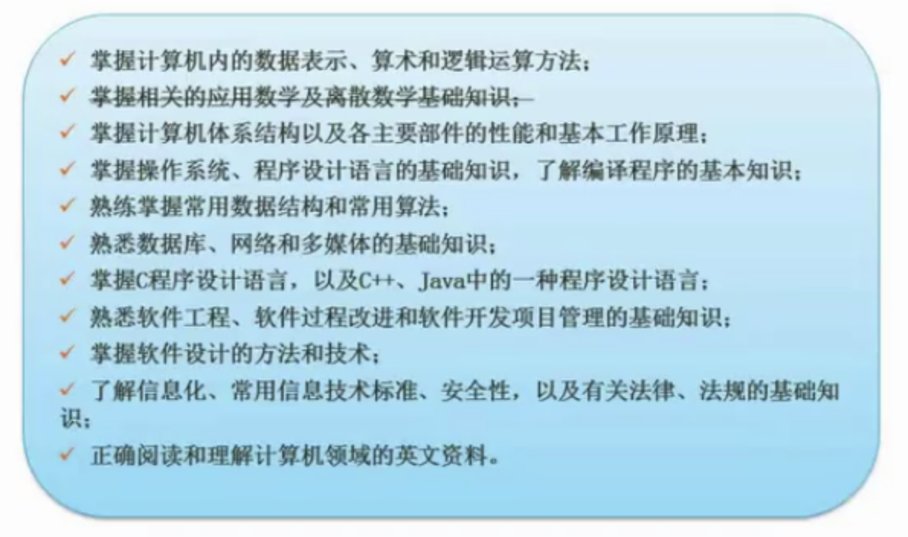
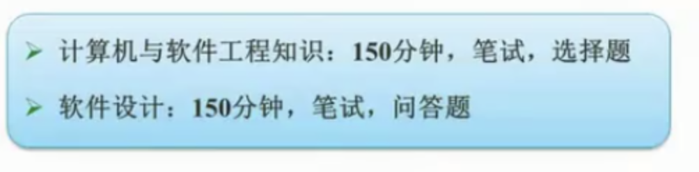
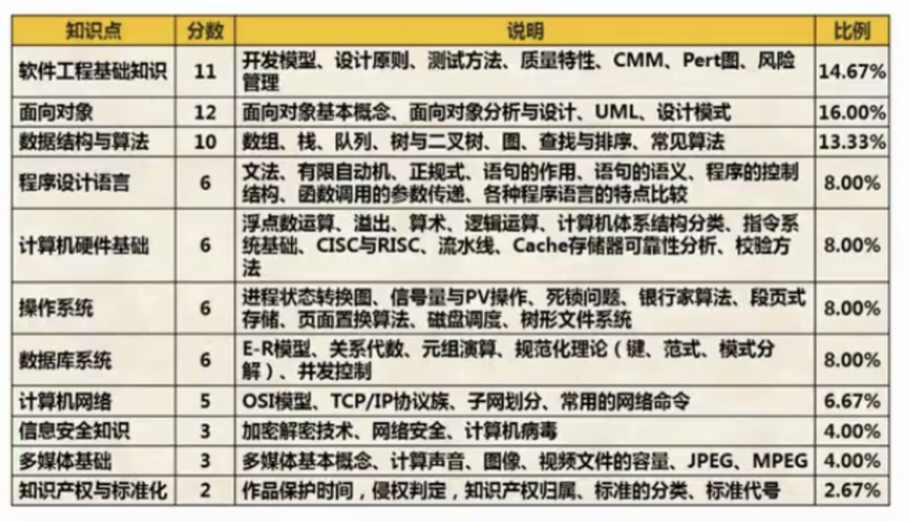
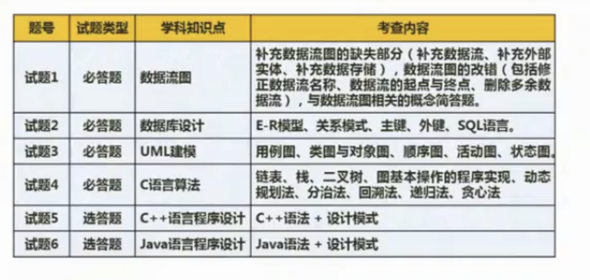
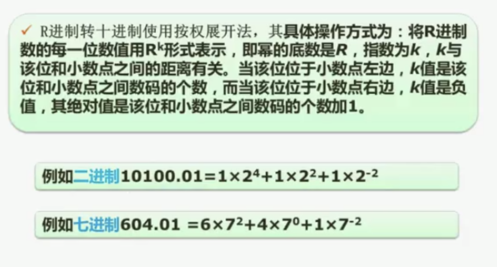
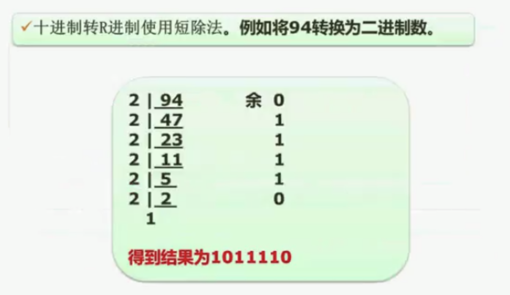
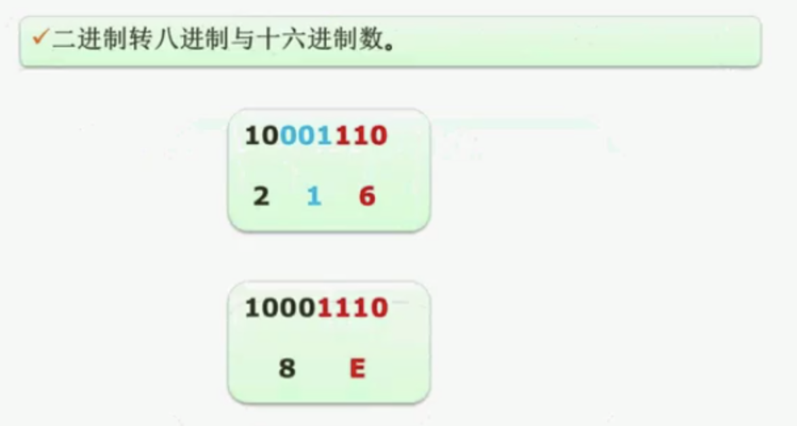
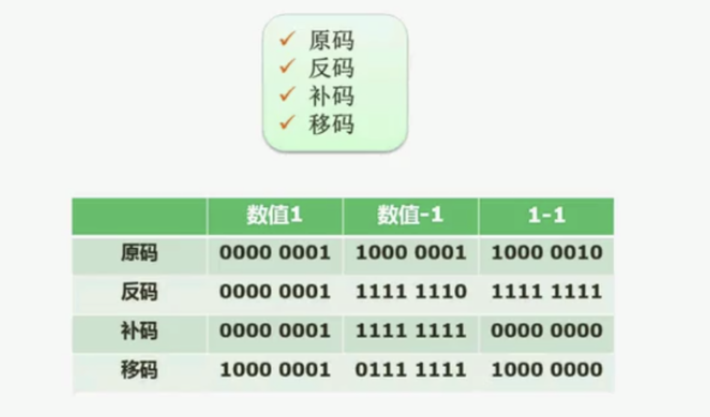
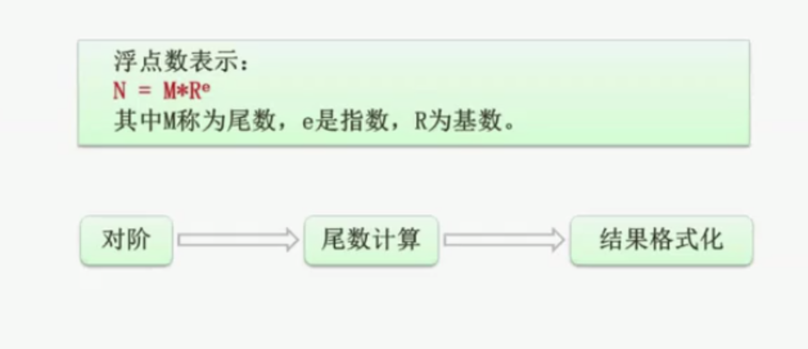

# 0、软件考试介绍

## 1、考试大纲要求



## 2、考试形式

```markdown
# 上午————计算机与软件工程知识————75道选择题,每题1分,45分合格

# 下午————软件设计————1道数据流题、1道数据库题、1道UML题、1道算法题(C语言描述算法/数据结构相关)、1道C++与1道Java面向对象程序设计题(以设计模式为背景,考察程序设计),二选一
```



## 3、历年考试情况

```markdown
# 计算机与软件工程知识考试
```



```markdown
# 软件设计
```



# 1、计算机组成与体系结构(6分)

## 1、数据的表示

### 1、进制的转换

```markdown
# 按权展开法————拆分每一个位置上的数,每个位置上的数和其权值相乘
```



```markdown
# 短除法————进制作为除数求余,直到商为0,倒排余数
```



```markdown
# 二进制、八进制、十六进制之间互相转换
-- 二进制转为八进制————从右到左,每三个二进制位对应一个八进制位

-- 二进制转为十六进制————从右到左,每四个二进制位对应一个十六进制位
```



### 2、原码补码反码移码

```markdown
# 原码
-- 将一个数转换成二进制的表达形式

-- 使用一个字节存储该数据————转成的二进制不足八位,进行补0操作

-- 最高位代表符号位————正数为0,负数为1

-- 不能用来直接在机器中进行运算

-- 表示范围(整数)———— -(2^(n-1)-1)~2^(n-1)-1
	1、n为使用表示数据的bit位数
	2、正0和负0是不同的两种编码(所以可表示范围比补码少表示一位)

# 反码
-- 正数的反码————和原码相同

-- 负数的反码————符号为不变,其他位按位取反(1变0,0变1)

-- 反码之间运算后调解————符号位不变,其他位按位取反,得到运算后的原码结果

-- 表示范围(整数)———— -(2^(n-1)-1)~2^(n-1)-1
	1、n为使用表示数据的bit位数
	2、正0和负0是不同的两种编码(所以可表示范围比补码少表示一位)

# 补码
-- 正数的补码————和原码相同

-- 负数的补码————在原来反码的基础上+1

-- 表示范围(整数)———— -2^(n-1)~2^(n-1)-1 
	1、n为使用表示数据的bit位数
	2、正0和负0是相同的编码(所以可表示范围比原码和反码多表示一位)

# 移码(一般用作浮点运算当中的阶码)
-- 补码的基础上作首位取反

-- 移码的最高位————正数为1,负数为0
```



### 3、浮点数运算

```markdown
# 对阶————使指数相同(一般将低阶向高阶对等,从而避免得到的结果再次需要进行对阶)

# 尾数计算————进行尾数运算操作

# 结果格式化————如果结果不符合科学记数法(1≤|M|<1),进行格式化操作
```



## 2、计算机结构

## 3、Flynn分类法

## 4、CISC与RISC

## 5、流水线技术

## 6、存储系统

## 7、总线系统

## 8、可靠性

## 9、校验码

