# 0、软件考试介绍

## 1、考试大纲要求


## 2、考试形式

```markdown
# 上午————计算机与软件工程知识————75道选择题,每题1分,45分合格

# 下午————软件设计————1道数据流题、1道数据库题、1道UML题、1道算法题(C语言描述算法/数据结构相关)、1道C++与1道Java面向对象程序设计题(以设计模式为背景,考察程序设计),二选一
```


## 3、历年考试情况

```markdown
# 计算机与软件工程知识考试
```


```markdown
# 软件设计
```


# 1、计算机组成与体系结构(6分)

## 1、数据的表示

### 1、进制的转换

```markdown
# 按权展开法————拆分每一个位置上的数,每个位置上的数和其权值相乘
```


```markdown
# 短除法————进制作为除数求余,直到商为0,倒排余数
```


```markdown
# 二进制、八进制、十六进制之间互相转换
-- 二进制转为八进制————从右到左,每三个二进制位对应一个八进制位

-- 二进制转为十六进制————从右到左,每四个二进制位对应一个十六进制位
```


### 2、原码补码反码移码

```markdown
# 原码
-- 将一个数转换成二进制的表达形式

-- 使用一个字节存储该数据————转成的二进制不足八位,进行补0操作

-- 最高位代表符号位————正数为0,负数为1

-- 不能用来直接在机器中进行运算

-- 表示范围(整数)———— -(2^(n-1)-1)~2^(n-1)-1
	1、n为使用表示数据的bit位数
	2、正0和负0是不同的两种编码(所以可表示范围比补码少表示一位)

# 反码
-- 正数的反码————和原码相同

-- 负数的反码————符号为不变,其他位按位取反(1变0,0变1)

-- 反码之间运算后调解————符号位不变,其他位按位取反,得到运算后的原码结果

-- 表示范围(整数)———— -(2^(n-1)-1)~2^(n-1)-1
	1、n为使用表示数据的bit位数
	2、正0和负0是不同的两种编码(所以可表示范围比补码少表示一位)

# 补码
-- 正数的补码————和原码相同

-- 负数的补码————在原来反码的基础上+1

-- 表示范围(整数)———— -2^(n-1)~2^(n-1)-1 
	1、n为使用表示数据的bit位数
	2、正0和负0是相同的编码(所以可表示范围比原码和反码多表示一位)

# 移码(一般用作浮点运算当中的阶码)
-- 补码的基础上作首位取反

-- 移码的最高位————正数为1,负数为0
```


### 3、浮点数运算

```markdown
# 对阶————使指数相同(一般将低阶向高阶对等,从而避免得到的结果再次需要进行对阶)

# 尾数计算————进行尾数运算操作

# 结果格式化————如果结果不符合科学记数法(1≤|M|<1),进行格式化操作
```


## 2、计算机结构

### 1、CPU结构

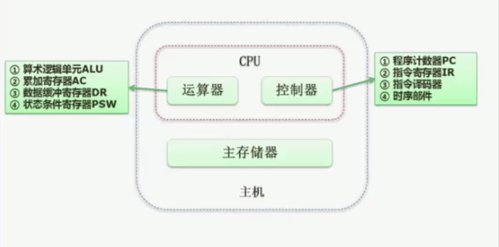

```markdown
# 说明
	主要了解运算器与控制器的组成

# 运算器
-- 算术逻辑单元(ALU)————运算相关

-- 累加寄存器(AC)————通用寄存器,运算过程中,存储需要运算的相应值

-- 数据缓冲寄存器(DR)————对类存储器进行读写操作时,用来暂存数据的寄存器

-- 状态条件寄存器(PSW)————常考:用于存储在运算过程中相关标志位(比如:运算涉及进位、运算会溢出、中断等一些状态的信息需要保存,存储在该存储器中)

# 控制器
-- 程序计数器(PC)————进行程序运行时,运行到当前指令时运行下一条指令,需要了解下一条指令所在的位置,使用程序计数器完成

-- 指令寄存器(IR)————运行程序的时候,调取相应指定代码的内容进行控制

-- 指令译码器————运行程序的时候,对调取的相应指定代码的内容进行译码工作

-- 时序部件————主要由主时钟源、节拍发生器和启停控制逻辑组成
```

## 3、Flynn分类法

```markdown
# 说明————Flynn分类法是一种计算机体系结构分类的方法

# 作用————对常见的计算机进行分类

# 分类依据————两个指标
-- 指令流————分为单指令流和多指令流

-- 数据流————分为单数据流和多数据流

# 分类
-- 单指令流单数据流(SISD)————目前多存在于单片机中

-- 单指令流多数据流(SIMD)————阵列处理器(便于数组操作)
```

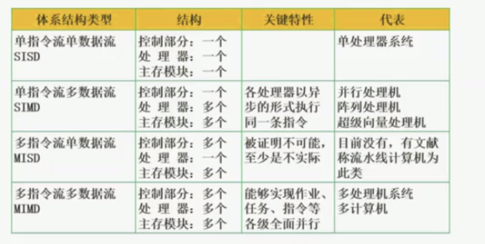

## 4、CISC与RISC

```markdown
# 说明
	考察频度高,主要掌握两种指令系统的区别

# 考察形式
	给出ABCD四个针对CISC和RISC描述的选项,选择哪些说法是对的?或哪些是错的?或哪些不是CISC/RISC的特点?

# CISC/RISC的理解
-- CISC
	1、在计算机还没有大规模通用化的时候(属于奢饰品,硬件和指令系统都是需要定制的),提出的一种常用的指令系统

-- RISC
	2、进行通用化,精简化后的一种指令系统
```

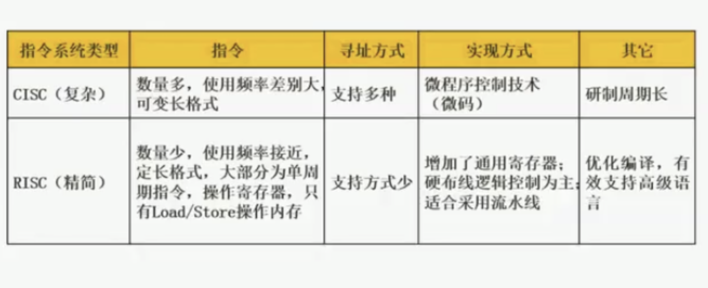

## 5、流水线技术

### 1、基本概念

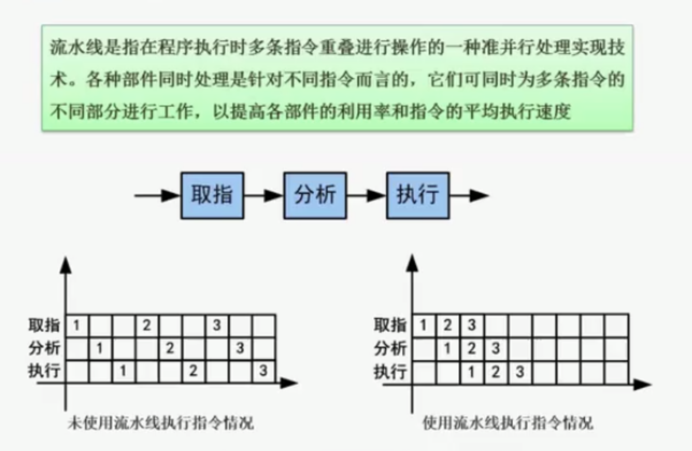

### 2、流水线周期及执行时间计算

```markdown
# 说明
-- k————代表一条指令分为几部分(阶段数)
-- n————代表指令条数
-- △t————代表流水线周期(流水线周期为阶段中执行时间最长的一段)

# 公式使用
-- 理论公式————每部分的耗时之和+(指令条数-1)*流水线周期

-- 实践公式————(阶段数+指令条数-1)*流水线周期

# 例题说明
```


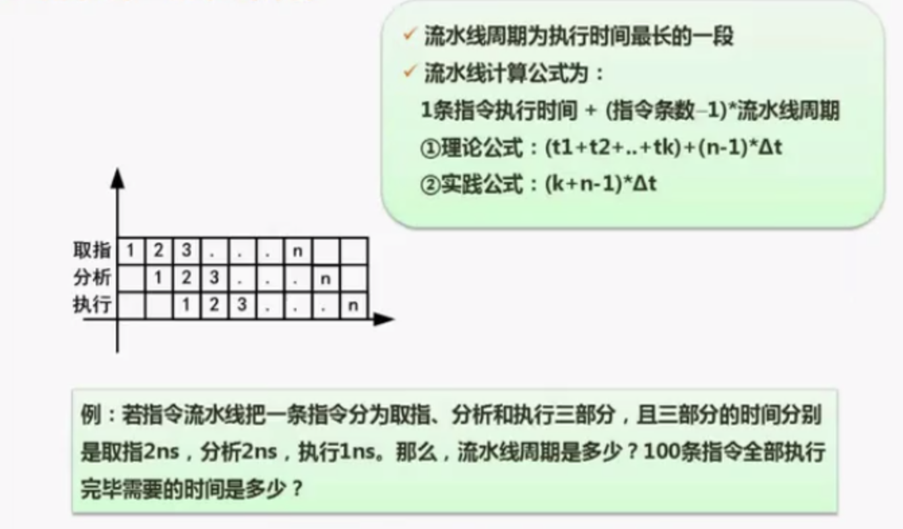

```markdown
答:
	流水线周期为2ns
	理论时间为(2+2+1)+(100-1)*2=203ns————(考试的时候一般先采用理论公式,没有理论公式的答案时,采用实践公式)
	实践时间为(3+100-1)*2=204ns————(考试的时候一般先采用理论公式,没有理论公式的答案时,采用实践公式)
	流水线吞吐率为100/203
	流水线最大吞吐率为1/2
	流水线加速比为(2+2+1)*100/203=500/203
	
```

### 3、流水线吞吐率计算

```markdown
# 说明
	单位时间内,处理的任务的数量
```

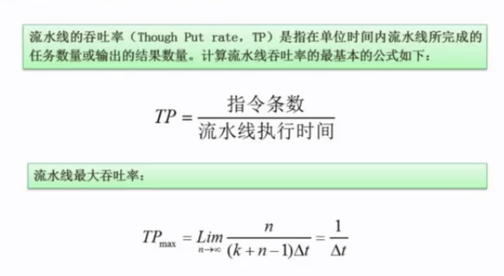

### 4、流水线加速比计算

```markdown
# 流水线的加速比
```

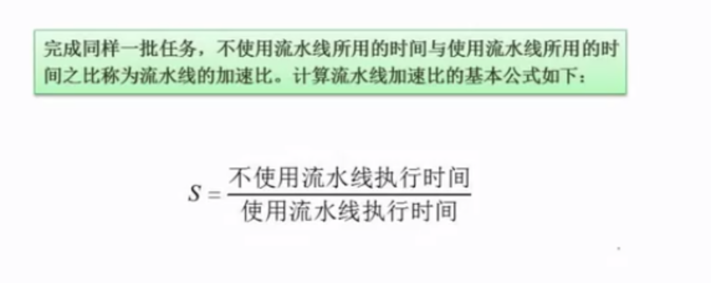

```markdown
# 流水线的效率
-- 说明
	衡量在整个时空图上,到底有多少时间片是被有效利用的,有多少时间片是没有被有效利用的,如下图所示:

-- 作用
	提醒我们如何设计流水线,能够让我们整个的流水线效率最高
-- 例题说明————如下图所示
		1)3△t为流水线的周期
		2)阴影的格子是有效利用的时间片
		3)空白的格子是没有被有效利用的时间片
		4)如下的流水线的效率=(△t+△t+△t+3△t)/(15△t*4)=1/8
```

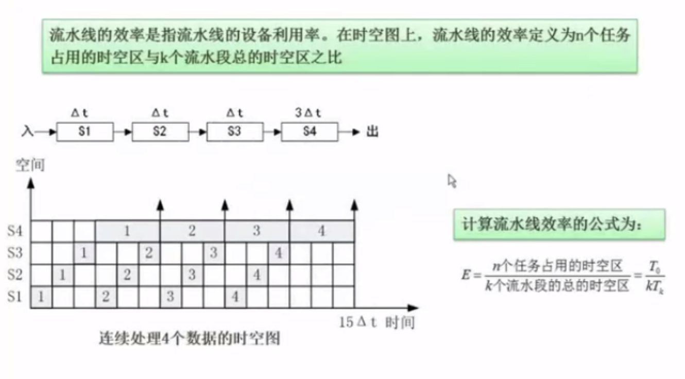

## 6、存储系统

### 1、计算机层次化存储结构

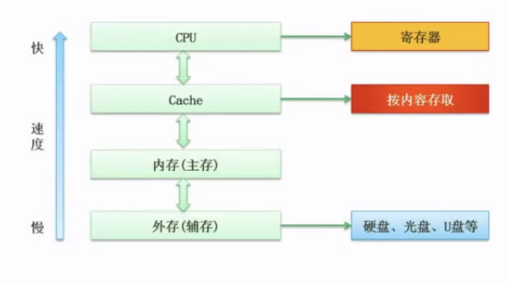

```markdown
# 需要掌握的知识点
-- 基本层级如何划分的
	1、CPU中包含运算器和控制器,运算器和控制器中就会存在相应多的寄存器
		1)寄存器的容量极小
		2)速度非常快
		3)属于存储结构的最高层
	2、Cache是高速缓存存储器.
		1)不是必须的,因为CPU相关数据可以直接和内存进行数据交换,但导致的问题是,速度极慢
		2)一般容量大小以K或M来衡量
		3)因为存在局部性原理(程序运行的过程中,会频繁不断的执行相同块中的指令内容)
		4)按内容存取(也叫相连存储器)————存内容的时候,会考虑信息的内容,不同内容存在不同的区域,读取的时候就会很快.速度和效率远高于按地址存储的方式
	3、内存
		1)一般容量大小以G衡量
	4、外存

-- 哪些存储器性能比较好
	从 寄存器——>Cache——>内存——>外存 性能依次降低

-- 哪些存储器容量比较大
	从 寄存器——>Cache——>内存——>外存 容量依次增加

-- 为何要以层次化的形式来组织存储组
	1、所有的存储器都做成寄存器的话效率很高,但是成本也很高
	2、所有的存储器都做成外存的话,因为CPU的速度极快,外存速度相对于CPU慢很多,所以就存在多级存储器
```

### 2、Cache

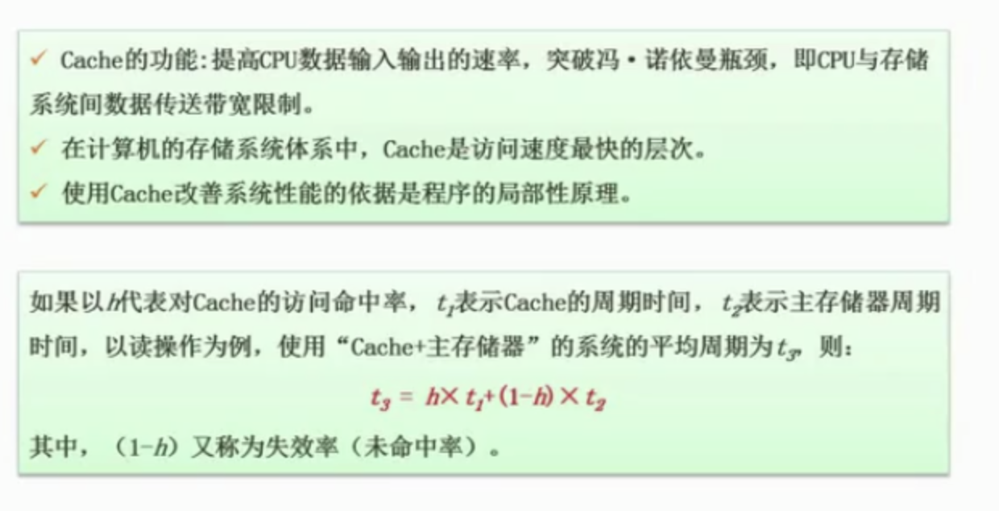

```markdown
# 说明
-- Cache的引入之所以能够提交整个存储体系的存储性能的依据————局部性原理

# 考察注意
-- 如果问以下存储器速度最快的是哪一个?
	有寄存器可选的情况选寄存器,没有寄存器可选的时候选Cache
-- 要会引入Cache之后,如何来计算使用Cache+主存这种梯度式层次型存储体系的存取平均周期时间?
	例题————假设Cache的周期时间为1ns,主存储器周期时间为1ms,CPU对Cache的访问命中率为95%,那么系统的平均周期计算如下:
		系统平均周期=95%*1+(1-95%)*1000=50.95ns
```

### 3、局部性原理

```markdown
# 局部性原理
	局部性原理主要是计算机在处理相关数据和程序的时候,一般都会有某一个时段,集中的去访问某些指令(集中的读取某些空间的数据)的特性.对于采用多级存储体系,来解决存储量和存储速度之间矛盾的一种方案

# 时间局部性
	刚刚访问完的东西再次访问,称之为时间局部性

# 空间局部性
	程序访问一个空间后,立即访问它临近空间,称之为空间局部性	

# 工作集理论————工作集是进程运行时被频繁访问的页面集合(即将要被频繁访问的页面的集合打包起来,使频繁访问的一起掉入Cache,短时间内不被替换出Cache,以提高效率)
```

### 4、主存

#### 1、主存的分类

```markdown
# 随机存取存储器
-- 特点
	内存就属于该类存储器.内存一旦断电,内存中的数据都将被清除,即掉线就丢失数据.

-- 分类
	1、DRAM(Dynamic RAM,动态RAM)——SDRAM

	2、SRAM(Static RAM,静态RAM)

# 只读存储器
-- 特点
	BIOS就属于该类存储器.掉电之后,仍然能够存储信息
-- 分类
	1、MROM(Mask ROM,掩模式ROM)

	2、PROM(Programmable ROM,一次可编程ROM)

	3、EPROM(Erasable PROM,可擦除的PROM)

	4、闪速存储器(flash memory,闪存)
```

#### 2、主存的编址——考察几率较高

```markdown
# 说明
 就是将芯片组成相应的存储器.
 X*Y位的存储器,其中X代表地址空间个数,Y代表每一个地址空间存储的Bit位信息数
```

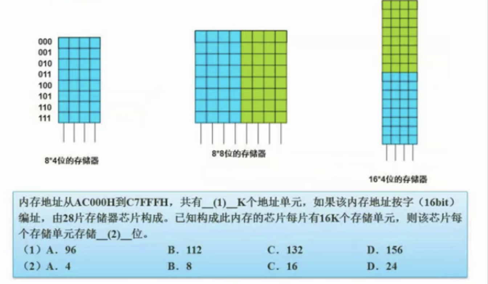

```markdown
# 考察形式,如上图所示
-- 地址单元个数计算(一般是16位进制的减法)
	使用大的内存地址+1-小的内存地址=C7FFFH+1-AC000H=C8000H-AC000H=1C000H=1C000/2^10=112

-- 每个存储单元存储位数
	每个存储单元存储位数=(地址单元个数*编址位数)/(存储器包含的芯片数*每片的存储单元数)=(112*16)/(28*16)=4
```

### 5、磁盘工作原理

#### 1、磁盘结构与参数

```markdown
# 考点
-- 磁盘运作基本原理
	即读取一次数据的过程中,磁盘需要做哪些动做.需要消耗哪些方面的时间 
```

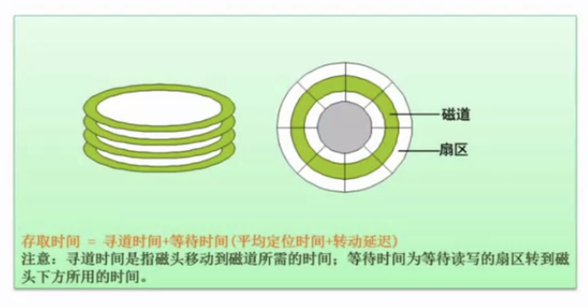

```markdown
-- 试题示例————画环分扇方式
	1、旋转周期为33ms,分为11个物理块————即可知读取一个记录所消耗的时间为3ms
	2、单缓冲区————只有一个缓存区,每次只能缓存一个记录
	3、每个记录处理时间为3ms
	4、磁盘一旦处理起来,就不会停,会一直匀速的转动
	5、所以处理一条记录,并转动到下一条记录开始处理的位置,需要消耗的时间=转动一圈+处理一条记录的时间=33+3=36ms,并且前10个记录都是这样处理的
	6、所以处理11个记录的最长时间=前10个记录的处理时间+最后一个的读取时间+处理时间=(33+3)*10+3+3=366ms
	7、优化分布理想原则————一条记录处理完,磁头刚好停留在下一条要处理数据的开始位置
	8、优化后的最少时间=(每条读取时间+每条处理时间)*总记录数=(3+3)*11=66ms
```

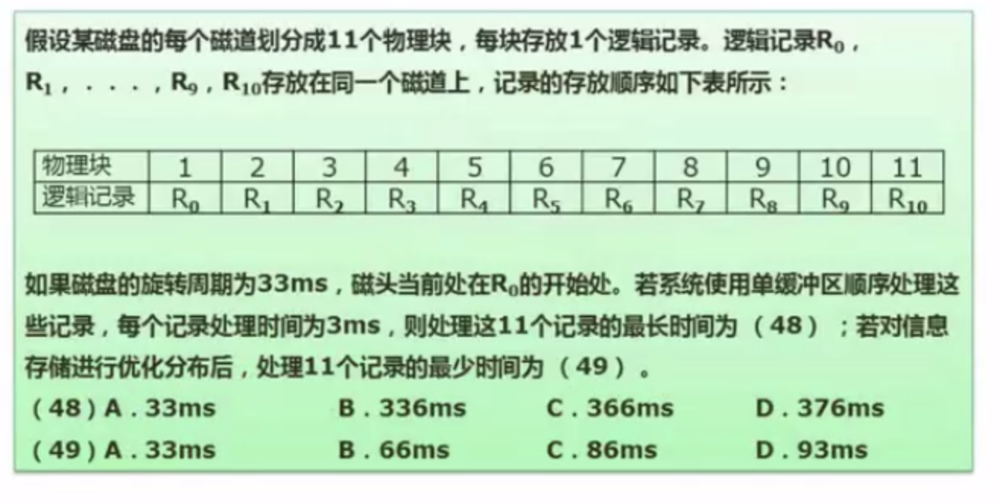

## 7、总线系统

### 1、分类

```markdown
# 考点
-- 各类总线代表的范围,了解总线的基本描述

# 根据总线所处的位置不同,总线通常被分为三种类型,分别是:
-- 内部总线————微机内部各个外围的芯片与处理器之间的总线————芯片级别

-- 系统总线————微机中各个插件板和系统板之间的总线————属于插件版级别的
	1、数据总线————用来传输数据的总线
		假设32位计算机,代表一个计算机的字就是32个bit位(即总线的宽度为32个bit位),一个周期能够传输的数据量就是32个bit位
	2、地址总线
		假设地址总线为32位,说明其代表的地址空间的大小为2^32=4G的宽度,所以32位的操作系统能够管理的内存只有4G,所以如果用到的内存超过4G的话,就可以考虑使用64位操作系统,否则内存管理不了超过4G的空间的
	3、控制总线————发送相应控制信号的总线

-- 外部总线————微机和外部设备之间的总线
```

## 8、可靠性

### 1、系统可靠性分析

#### 1、串联系统与并联系统

```markdown
# 考察点
	主要是计算相关的问题————给一个串并联交织的模型,计算出其相应的可靠度

# 串联模型
	1、图示
```

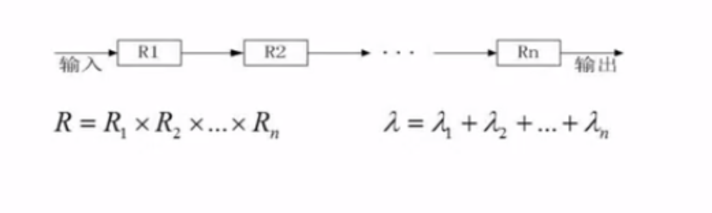

```markdown
	2、特征
		1)n个子系统串在一起,形成一个大的系统
		2)所有的子系统都必须正常运行,整个系统才能正常运行(即只要有一个运行异常,整个系统都不能正常运行)
	3、可靠度————所有的子系统的可靠度的乘积(每个子系统的可靠度+实效率=1)
	4、失效率————各个子系统失效率之和(近似公式——当子系统很多,每个子系统失效率极低的情况下,使用该公式快速计算结果)

# 并联模型
	1、图示
```

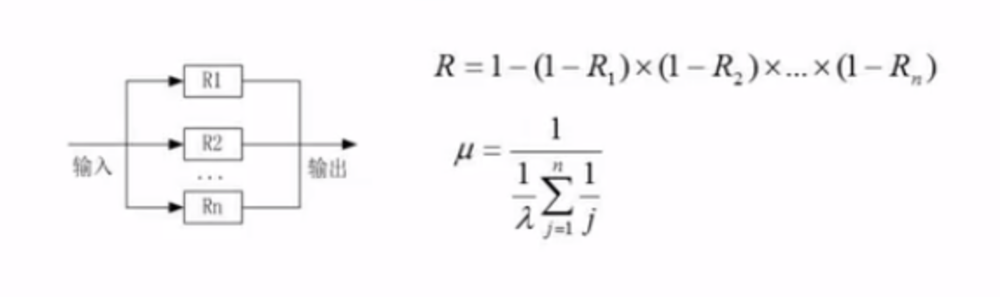

```markdown
	2、特征
		1)多个子系统并联在一起,形成一个大的系统
		2)系统中有一个能正常运行,整个系统就能正常运行(即只有当所有的子系统都不能正常运行的时候,整个系统才失效)
	3、可靠度————1减去每个系统的失效率的乘积(每个子系统的可靠度+实效率=1)
	4、失效率————由于以上公式比较复杂,所以一般先求出可靠度,然后使用1减去可靠度,即得失效率
```

#### 2、n模冗余系统和混合系统

```markdown
# n模冗余系统————现在几乎不会考到
-- 基本思路
	1、软硬件均会应用到,在面向一些高可靠性系统的要求的时候,会考虑如何提高系统的可靠性————可以采用冗余的方式.
	2、如何冗余?————多个模块独立做同样的职能,分别计算的结果通过表决器决定,少数服从多数原则,采用多数产生的结果.通过表决的方式,将一些错误进行屏蔽掉

-- 计算涉及到组合,具体采用如图所示公式
	1、m————代表子系统个数
	2、i————代表当前子系统
```

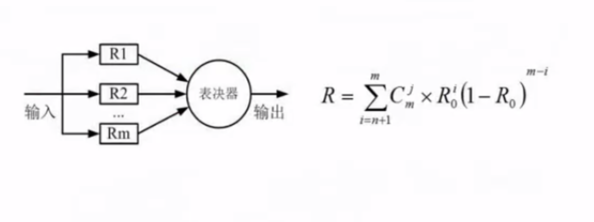

```markdown
# 混合系统————常考
-- 说明
	将串联和并联混合在一起进行考察

-- 整体可靠度求解原则
	1、区分整体的串并结构
	2、如果整体是串联结构,将每个并联看作一个整体,算出每个并联整体可靠度后,所有结果的乘积,便得到整体可靠度
	3、如果整体是并联结构,将每个串联看作一个整体,算出每个串联整体可靠度后,所有结果的和,便得到整体可靠度

-- 图示
```

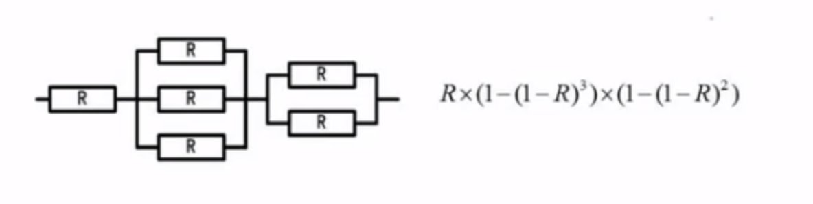

## 9、差错控制——校验码

### 1、校验码的基本概念

```markdown
# 什么是检错和纠错
-- 检错————检查出错误

-- 纠错————不但要检查出来,还要纠正(要达到此目的,往往通过加冗余信息来实现的;在编码的过程中,往往通过增大码距的方式来达到相应的想要的效果)

# 什么是码距————就是一个合法码字变化到另外一个合法码字需要改变的位数
-- 说明————一个编码系统的码距是整个编码系统中任意(所有)两个码字的最小距离

-- 示例,如下图所示:
```

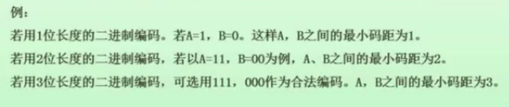

```markdown
# 码距与检错和纠错有何关系
-- 在一个码组内为了检测e个误码,要求最小码距d应该满足————d>=e+1

-- 在一个码组内为了纠正t个误码,要求最小码距d应该满足————d>=2t+1
```

### 2、循环检验码CRC

```markdown
# 说明
	一种可以检错但是不可纠错的编码

# 模2除法,如图所示:
-- 与普通除法的区别(二进制数据比较)
	1、通除法————进行的是被除数与除数进行减法操作,设商得余的方式
	2、模2除法————进行的是被除数与除数进行按位异或操作(相同为0,不同为1)
```

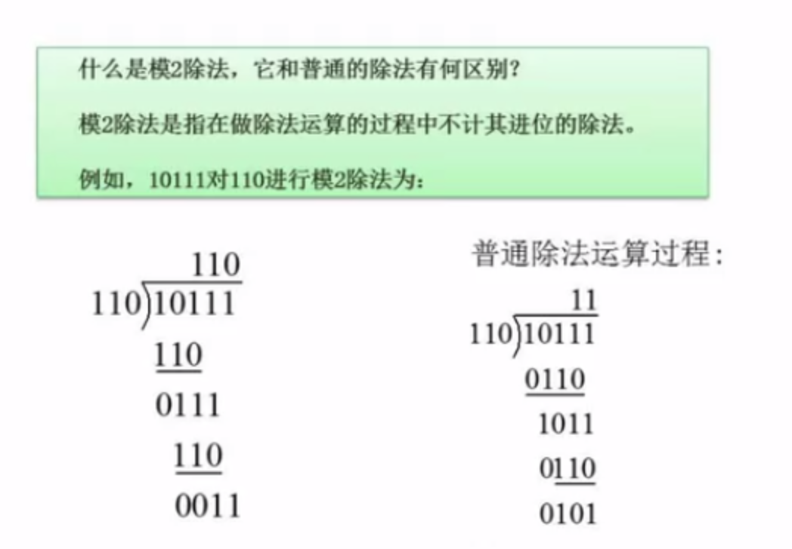

```markdown
# 基本原理
-- 在进行信息编码的时候,在其尾部加入一些校验信息,加入校验信息之后,让编码后的数据能够与循环校验码的生成多项式相除,余数为0

-- 使用的除法是模2的除法

-- 如果接收方校验时,发现除生成多项式的余数不能为0,此时说明传输过程中出现了错误

# 操作流程
-- 1、将多项式转换成二进制形式————多项式中存在x的次方代表2的对应次方为1,不存在指定次方的为0(即x的多少次方代表对应二进制为是1还是0)

-- 2、在原始报文后添加与生成多项式长度减1个0(即补余数的位数)

-- 3、对改变过后的原始报文进行模2除法操作,得到其余数

-- 4、将得到的余数拼接在原始报文后,即得到其CRC编码后的结果

-- 5、在接收到该CRC编码之后,与多项式生成的二进制形式进行模模2除法后,余数为0,即证明其是正确的

# 例题
	1、将多项式转换成二进制形式————x^4+x^3+x+1(代表2的4次方、3次方、1次方、0次方各有一个1)————即为二进制的11011
	2、在原始报文后添加与生成多项式长度减1个0————110010101010000
	3、对改变过后的原始报文进行模2除法操作,得到其余数————0011
	4、将得到的余数拼接在原始报文后,即得到其CRC编码后的结果————110010101010011
	5、在接收到该CRC编码之后,与多项式生成的二进制形式进行模模2除法后,余数为0,即证明其是正确的
```

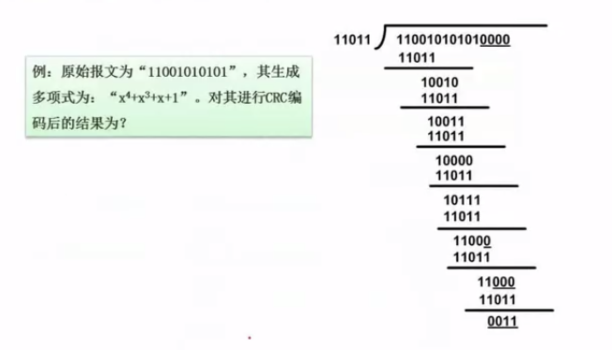

### 3、海明校验码(高频难点)

```markdown
# 编码基本规则
	1、海明校验码中规定,校验位的位置位于编码完成后的串(最终海明码)中2的n次方位置————即2^0=1、2^1=2、2^2=4、……这些位置都位校验位
	2、检验位的位数需满足公式————2^检验位位数>=信息位数+校验位数+1
	3、最终海明码的长度=信息位数+检验位数
	4、确定检验位和信息位
	5、得到信息位对应位数的二进制多项式
	6、确定检验位的二进制多项式在信息位对应位数的二进制多项式是否出现(如果出现,让其对应的信息位数据参与异或操作,最终得到检验位的数据)
	7、将得到的检验位数据与信息位数据进行按位置组合得到最终海明码
	8、海明检验码除了可以检错还可以纠错
	9、按照原来产生校验位的形式,再次产生校验位,得到新的校验码
	10、将收到的检验位和产生的检验位进行异或操作,得到新的结果
	11、因此第四个位置出错了,进行修正(1更正为0,0更正为1)后得到新的结果
```

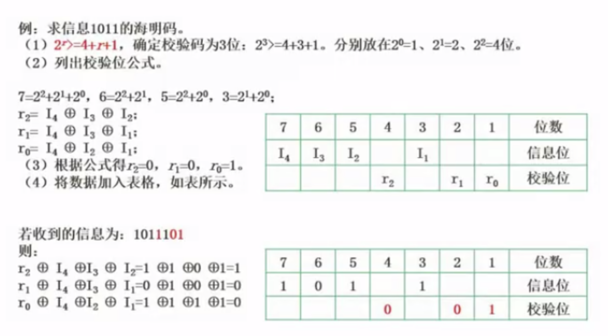

```markdown
-- 操作流程(根据上题所示)
	0、依题可知信息码长度为————4
	1、确定检验位位数————2^r>=4+r+1————r>=3,即确定检验码为3位,分别放在最终海明码的2^0=1、2^1=2、2^2=4位置
	2、确定最终海明码长度=信息位数+检验位数————4+3=7
	3、确定检验位和信息位————检验位位于最终海明码的(4、2、1)位置,信息位位于最终海明码的(7、6、5、3)位置————101?1??
	4、得到信息位对应位数的二进制多项式
		1)7=2^2+2^1+2^0————该信息位值1需要参与r2、r1、r0的异或计算
		2)6=2^2+2^1————该信息位值0需要参与r2、r1的异或计算
		3)5=2^2+2^0————该信息位值1需要参与r2、r0的异或计算
		4)3=2^1+2^0————该信息位值1需要参与r1、r0的异或计算
	5、确定检验位的二进制多项式在信息位对应位数的二进制多项式是否出现(如果出现,让其对应的信息位数据参与异或操作,最终得到检验位的数据)
		1)r2=I4⊕I3⊕I2=1⊕0⊕1=0
		2)r1=I4⊕I3⊕I1=1⊕0⊕1=0
		3)r0=I4⊕I2⊕I1=1⊕1⊕1=1
	6、检验位数据分别为0、0、1,因此最终信息1011的海明码为1010101
	7、海明检验码除了可以检错还可以纠错————如果收到的信息为1011101,则可知信息位为1011,校验位为101
	8、按照原来产生校验位的形式,再次产生校验位,即得到正确的校验码————001
	9、将收到的检验位和产生的检验位进行异或操作,得到新的结果————101⊕001=100=4
	10、因此第4个位置出错了,进行修正(1更正为0,0更正为1)后得到新的结果————1010101
```

# 2、操作系统基本原理(5-7分)

## 1、操作系统概述

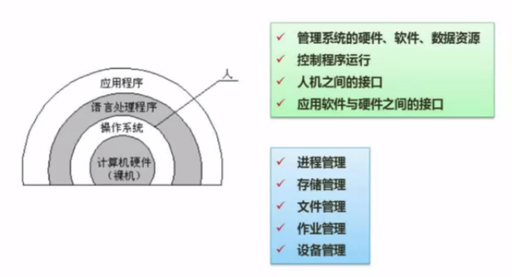

```markdown
# 说明
-- 操作系统是用来管理整个系统软硬件资源的,是人与硬件之间的一种接口,也是应用软件和硬件之间的一种接口

-- 对于人和计算机之间而言,接口往往是命令的形式(Linux),为了方便,出现了图像化的(windows)

-- 应用软件和硬件之间的接口,是指API的这些接口(应用软件要调用一些硬件的资源时,可以通过操作系统专为应用软件提供的API接口来实现相关的功能)

-- 操作系统具备的管理职能包括————进程管理、存储管理、文件管理、作业管理、设备管理
```

## 2、进程管理

### 1、进程的状态

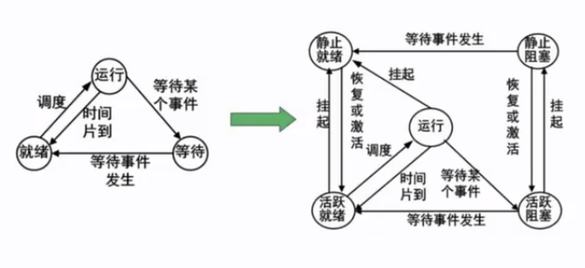

```markdown
# 状态的基本定性(三态模型)
-- 运行态————指进程所需要的所有资源都已经配足了,并且给定了CPU资源,此时就处于运行状态

-- 就绪态————指其他的所有资源都已经配足了,但是缺少CPU资源,此时就处于就绪状态

-- 等待态————指除了没有CPU资源,还缺少其他资源

# 状态之间的转换关系
-- 运行态——>等待态————需要等待某个事件(缺某种资源)

-- 等待态——>就绪态————等待的事件发生(已经调配所需的资源)

-- 就绪态——>运行态————CPU发起了调度指令

-- 运行态——>就绪态————运行态中未能完成任务(因为CPU资源比较宝贵,更多的时候采取时间片轮转的算法进行CPU资源的分配),但是时间片已经用完,因此只能等待下一次的时间片分配

# 五态模型————三种状态不足以涵盖常见的各种情况
-- 运行态————对应三态模型的运行态

-- 活跃就绪态————对应三态模型的就绪态

-- 活跃阻塞态————对应三态模型的等待态

-- 静止就绪态
	1、运行态挂起挂起(人为)后进入静止就绪态
	2、静止就绪态通过
-- 静止阻塞态
```


### 2、前趋图

### 3、PV操作

### 4、死锁问题

## 3、存储管理

### 1、段页式存储

### 2、页面置换算法

## 4、文件管理

### 1、索引文件

### 2、位示图

## 5、微内核操作系统

### 1、虚设备与SPOOLING技术