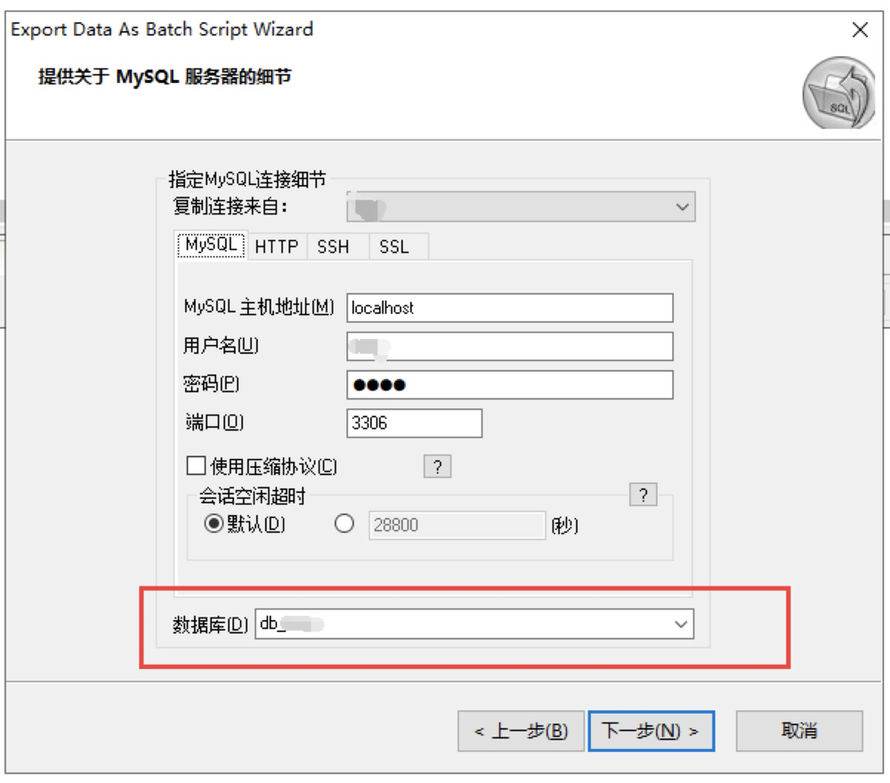
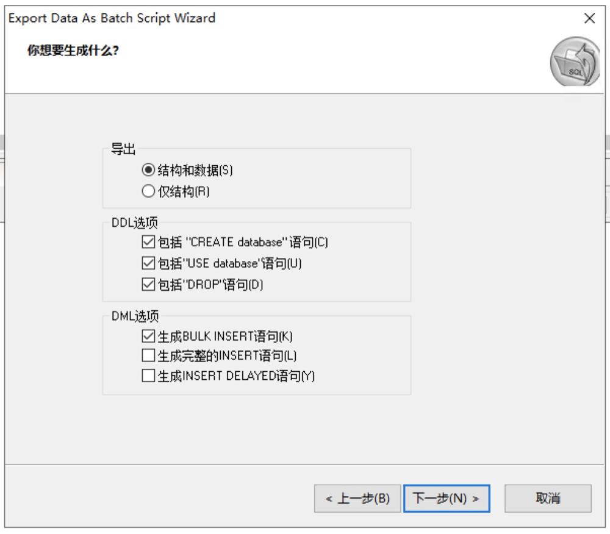
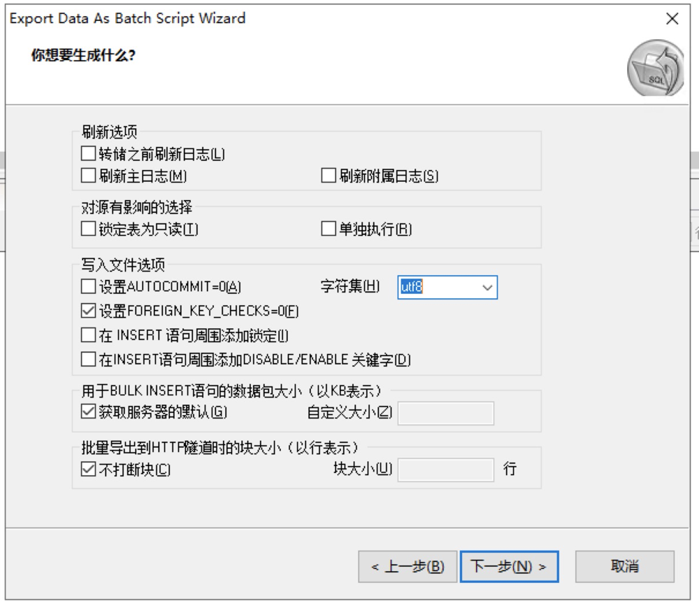
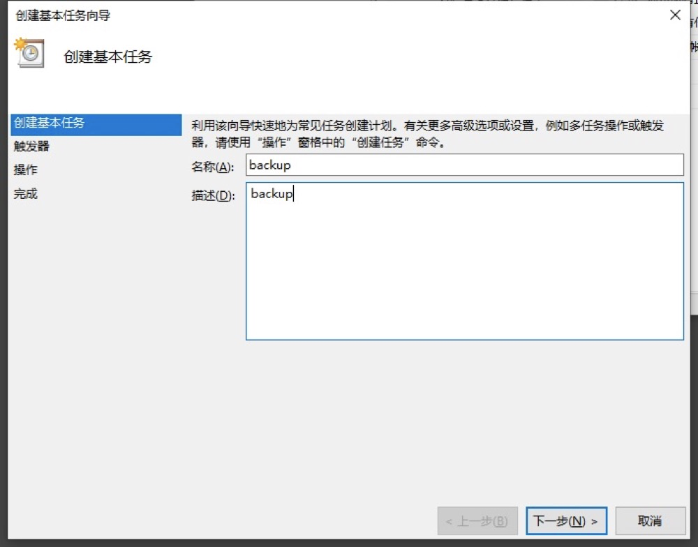

---

---

# 1、OS——终端常用命令

### 1、mac常用命令

```bash
# 查看IP
ipconfig
```

### 2、linux常用命令

```bash
# 数据传输
scp -r [本地文件路径] [远端主机账户]@[远端主机地址]:[远端文件路径]
# 查看端口占用情况
lsof -i:[端口号]
# 强行终止进程
kill -9 [进程号]
# 查看当前目录
pwd
```

# 2、Windows——常用软件环境搭建

### 1、Win10 企业版密钥

```bash
# 密钥 1:
NG4HW-VH26C-733KW-K6F98-J8CK4
# 密钥 2:
XKY4K-2NRWR-8F6P2-448RF-CRYQH
# 密钥 3:
NTVHT-YF2M4-J9FJG-BJD66-YG667
```

### 2、Windows下使用SQLyog定时备份数据库

​		`1、在自己想要备份数据的文件目录中创建三个空文件backup.sql,backup.xml,backuplog.log，分别用于存储备份的数据脚本、配置文件、日志信息:`


​		`2、打开SQLyog，依次选择菜单项中的增强工具——>计划备份，将弹出如下窗:`


​		`3、点击下一步,在弹出的如下窗口中选择需要备份的数据库，点击下一步:`



​		`4、选择导出的对象，点击下一步:`


​		`5、选择第一步创建的以.sql为后缀的文件，并设置脚本生成方式，点击下一步:`


​		`6、选择要生成的选项，点击下一步:`



​		`7、选择备份数据的文件字符集为utf-8,点击下一步:`



​		`8、出现错误终止或者发邮件依个人需求而定，点击下一步:`


​		`9、选择执行任务的方式和第一步创建的以.log为后缀的日志文件，点击下一步:`


​		`10、选择工作文件地址（即为第一步创建的以.xml为后缀的配置文件）以及调度名称，然后点击完成:`


​		`11、点击完成后会弹出对话框，点击计划，点击新建，选择需要执行的时间点，点击确定即可:`


### 3、Windows计划任务设置数据自动备份

​		`1、使用记事本创建文本文件，并设置其内容如备注内容:`

```
@echo off
:: 该行代码的意思是将位于【源文件路径：C:\Downloads\SourceFolder】下的内容复制到【目标文件路径：D:\TargetFolder】中，其中：【/e：拷贝所有子目录，包括空子目录】、【/I： 如果目标文件或目录不存在且拷贝的文件数多于一，则假设目标为目录】、【/d：只拷贝文件日期与在目标文件后的文件（即修改过的源文件）】、【/h：同时拷贝隐藏文件和系统文件】、【/r：拷贝并覆盖只读文件】、【/y： 复制文件审核设置（不显示已有文件覆盖确认）】
xcopy "C:\Downloads\SourceFolder" "D:\TargetFolder" /e/I/d/h/r/y
Exit
```

​		`2、将设置好的文本文件保存关闭。并重新设置其扩展名为.bat，如图所示:`


​		`3、依次打开控制面板——>管理工具——>任务计划程序，打开后界面如图所示:`


​		`4、在弹出界面操作模块中，点击创建基本任务选项，如图红框所示:`


​		`5、在弹出的创建基本任务向导窗口中设置自己想要的名称和描述信息，点击下一步:`



​		`6、设置触发器内容，根据自身需求选择要备份的频次，点击下一步:`


​		`7、设置每次备份的开始时间以及间隔，点击下一步:`


​		`8、此处选择启动程序选项，点击下一步:`


​		`9、点击浏览,选择第二步创建的xxx.bat文件，点击下一步，然后点击完成即可:`


# 3、Mac——常用软件环境搭建

### 1、iTerm2 + Oh My Zsh 终端安装

```bash
1、zsh安装
	1)zsh安装命令
		brew install zsh
	2)查看是否已安装
		zsh --version
	3)设置为默认
		chsh -s /usr/local/bin/zsh
2、iterm2安装
	1)iterm2安装命令
		brew install iterm2
	2)设置其为默认
		iTerm2 -> Make ITerm2 Default Term
3、oh-my-zsh安装/卸载
	1)安装方式一
		sh -c "$(curl -fsSL https://raw.github.com/robbyrussell/oh-my-zsh/master/tools/install.sh)"
	2)安装方式二
		sh -c "$(curl -fsSL https://cdn.jsdelivr.net/gh/ohmyzsh/ohmyzsh/tools/install.sh)"
	3)卸载方式
		uninstall_oh_my_zsh
	4)出现[oh-my-zsh] 提示检测到不安全的完成相关目录，解决方式
4、配置主题【https://github.com/ohmyzsh/ohmyzsh/wiki/Themes】
	ZSH_THEME="agnoster" # 以agnoster为例，编辑【~/.zshrc】文件，修改【ZSH_THEME】配置
5、设置字体
	1)大部分主题用到的字体【Meslo for Powerline】
	【详见:附件1】
	2)agnoster还需要额外安装字体【Powerline Fonts】
	【https://github.com/powerline/fonts】  
	3)选择字体
	【iTerm -> Preferences -> Profiles -> Text -> Change Font】
6、命令自动补全功能【zsh-autosuggestions】
	1)克隆代码到$ZSH_CUSTOM/plugins（默认位于~/.oh-my-zsh/custom/plugins）
		git clone https://gitee.com/imirror/zsh-autosuggestions.git ${ZSH_CUSTOM:-~/.oh-my-zsh/custom}/plugins/zsh-autosuggestions
	2)下载该插件到.oh-my-zsh/plugins目录
		git clone git://github.com/zsh-users/zsh-autosuggestions 
	3)在Oh My Zsh配置启用插件，打开~/.zshrc，找到plugins，追加zsh-autosuggestions
		plugins=(git zsh-autosuggestions)
	4)执行source ~/.zshrc生效
	5)如果有看不到补全到问题，确保以下两个颜色不是相近的：
		iTerm > Preferences > Profiles > Colors > ANSI Colors > Bright > Black
		iTerm > Preferences > Profiles > Colors > Basic Colors > Background
7、语法高亮【zsh-syntax-highlighting】
	1)克隆代码到$ZSH_CUSTOM/plugins（默认位于~/.oh-my-zsh/custom/plugins）
		git clone https://gitee.com/imirror/zsh-syntax-highlighting.git ${ZSH_CUSTOM:-~/.oh-my-zsh/custom}/plugins/zsh-syntax-highlighting
	2)在Oh My Zsh配置启用插件，打开【~/.zshrc】，找到plugins，追加zsh-autosuggestions
		plugins=(git zsh-autosuggestions zsh-syntax-highlighting)
	3)执行【source ~/.zshrc】生效
```

[附件1](attachments/Meslo LG S Regular for Powerline.ttf)

### 2、Brew 安装和卸载

```bash
1、安装命令
/bin/zsh -c "$(curl -fsSL https://gitee.com/cunkai/HomebrewCN/raw/master/Homebrew.sh)"
2、卸载命令
/bin/zsh -c "$(curl -fsSL https://gitee.com/cunkai/HomebrewCN/raw/master/HomebrewUninstall.sh)"
3、brew常用命令
  # 安装软件
  brew install formulae
  # 卸载软件
  brew uninstall formulae
  # 查看软件信息
  brew info／home formulae
  # 升级 brew 自身和包(formulae),建议安装前输入
  brew update 
  # 查找本机版本已经落后的包
  brew outdated 
  # 升级所有版本落后的包
  brew upgrade 
  # 单独升级指定包
  brew upgrade formulae 
  # 锁定指定包的版本,不允许升级
  brew pin formulae
  # 解锁指定包,允许升级
  brew unpin formulae 
  # 清理全部版本过期的包
  brew cleanup 
  # 当你的 brew 运行不正常,试试这个
  brew doctor 
  # 搜索和 ruby 相关的包
  brew search ruby 
  # 显示本机已经安装的包
  brew list 
  # 显示更多brew命令帮助
  man brew 
  # 显示包依赖
  brew deps
```

### 3、Mac OS 环境搭建

```bash
# 解决brew安装软件检测不安全
# 取消安全检测
sudo spctl --master-disable
Security & Privacy->Anywhere
# 开启安全检测
sudo spctl --master-enable
# 说明
 --disable
          Disable one or more rules in the assessment rule database.  Dis-
          abled rules are not considered when performing assessment, but
          remain in the database and can be re-enabled later.
 --enable
          Enable rule(s) in the assessment rule database, counteracting
          earlier disabling.
```

### 4、VMware Fusion 12pro 密钥

```bash
# 许可证密钥一:
ZF3R0-FHED2-M80TY-8QYGC-NPKYF
# 许可证密钥二:
YF390-0HF8P-M81RQ-2DXQE-M2UT6
# 许可证密钥三:
ZF71R-DMX85-08DQY-8YMNC-PPHV8
```

### 5、向日葵远程控制工具

```bash
1、说明
	向日葵是一款阳光的远程控制软件。您可在任何可连入互联网的地方，轻松访问和控制安装了向日葵客户端的设备，且目前支持电脑、手机等多种控制端的方式进行远控。
2、安装
	brew install sunloginclient
3、问题处理
	# mac授权问题————
		-- 进入终端su账户
			sudo su
		-- 执行命令
			tccutil reset Accessibility
		-- 重启电脑
		-- 进行授权
			系统偏好设置——>安全性与隐私——>隐私——>进行相应权限的授权
			授权说明——https://service.oray.com/question/10558.html
```


# 4、Java——开发环境搭建

### 1、jdk安装与配置

```bash
1、安装
	1)获取 Homebrew 历史版本库
		brew tap homebrew/cask-versions
	2)使用 brew install xxx 命令安装对应版本jdk
		# 安装 jdk6，执行如下命令，其将安装到【/Library/Java/JavaVirtualMachines/1.6.0.jdk/Contents/Home】下
		brew install java6
		# 安装 jdk8，执行如下命令，其将安装到【/Library/Java/JavaVirtualMachines/adoptopenjdk-8.jdk/Contents/Home】下
		brew install adoptopenjdk8
2、环境配置
	1)如果安装了zsh,会导致【~/.bash_profile】不会被执行
		执行命令【vim ~/.zshrc】打开【zshrc】文件,并添加【source ~/.bash_profile】,此时【~/.bash_profile】配置的环境变量将有效
	2)执行命令【vim ~/.bash_profile】改【bash_profile】文件,添加如下内容:
		# 配置 jdk 环境
		export JAVA_6_HOME=/Library/Java/JavaVirtualMachines/1.6.0.jdk/Contents/Home
		export JAVA_8_HOME=/Library/Java/JavaVirtualMachines/adoptopenjdk-8.jdk/Contents/Home
		# 编辑一个命令 jdk6，输入则转至 jdk1.6
		alias jdk6="export JAVA_HOME=$JAVA_6_HOME"
		# 编辑一个命令 jdk8，输入则转至 jdk1.8
		alias jdk8="export JAVA_HOME=$JAVA_8_HOME"
		# 最后安装的版本，这样当自动更新时，始终指向最新版本
		export JAVA_HOME=`/usr/libexec/java_home`
```

### 2、IDEA安装与配置

```bash
1、说明
	IDEA 全称 IntelliJ IDEA，是java编程语言开发的集成环境。IntelliJ在业界被公认为最好的java开发工具，尤其在智能代码助手、代码自动提示、重构、JavaEE支持、各类版本工具(git、svn等)、JUnit、CVS整合、代码分析、 创新的GUI设计等方面的功能可以说是超常的。IDEA是JetBrains公司的产品，这家公司总部位于捷克共和国的首都布拉格，开发人员以严谨著称的东欧程序员为主。它的旗舰版本还支持HTML，CSS，PHP，MySQL，Python等。免费版只支持Java,Kotlin等少数语言。
2、安装
	brew install intellij-idea
3、注册激活
	# 插件激活(建议)
		-- 下载安装IDE Eval Reset插件
			IntelliJ IDEA——>Preferences——>Plugins——>Marketplace——>搜索[IDE Eval Reset]
		-- 设置每次开启自动重置注册信息
			Help——>Eval Reset——>勾选[Auto reset before per restart]项
	# 注册码激活
		-- 石墨文档————https://shimo.im/docs/XvW3WpHgHdRHVXgV/read
		-- 文档获取————https://docs.qq.com/doc/DTVh3bkxWSEpvVm5N
		-- 网址激活————http://www.lookdiv.com/————输入[7788]获取激活码
```

### 3、域名访问环境

​		IP访问规则

​			`浏览器输入访问地址————>查看系统内部域名映射规则(有映射:网卡将请求转到映射的域名;没有映射:去网络上的DNS解析域名,DNS公网保存了每一个域名对应的IP地址)`

​		switchhosts用于将本地网路请求转发到指定地址(模拟域名跳转).

​		开发环境结合Nginx实现对域名访问环境的搭建.通过将浏览器发送的请求域名全部转发到指定nginx的对应虚拟机IP地址.生产环境就需要`购买指定域名————>进行注册使用`,开发环境配置如下:

```bash
1、下载安装修改hosts文件的软件
	brew install switchhosts
2、通过该软件修改hosts文件
	1)配置格式如下
		虚拟机IP地址 请求域名
	1)默认规则
    ##
    # Host Database
    #
    # localhost is used to configure the loopback interface
    # when the system is booting. Do not change this entry.
    ##
    127.0.0.1 localhost
    255.255.255.255 broadcasthost
    ::1 localhost
	2)配置示例
		#idea屏蔽更新
    127.0.0.1 account.jetbrains.com
    127.0.0.1 jrebel.npegeek.com
    127.0.0.1 oauth.account.jetbrains.com
    127.0.0.1 SteveCode.jetbrains.com

    #pigskin_mall
    192.168.56.101 pigskinmall.com
    192.168.56.101 search.pigskinmall.com
    192.168.56.101 item.pigskinmall.com
    192.168.56.101 auth.pigskinmall.com
    192.168.56.101 cart.pigskinmall.com
    192.168.56.101 order.pigskinmall.com

    #单点登录演示修改域名
    127.0.0.1 ssoserver.com
    127.0.0.1 client1.com
    127.0.0.1 client2.com
3、测试,请求就会跳转到指定的IP地址
	 http://pigskinmall.com:5601/ ————就会成功跳转到虚拟机中的指定端口
```

### 4、性能测试工具

```

```

### 5、压力测试工具

```
1、下载
https://archive.apache.org/dist/jmeter/binaries/
2、启动
cd /MyInstall/apache-jmeter-5.2.1/bin/
sh jmeter
```

### 6、Git 环境配置

```bash
1、设置 username 和 email
	git config --global user.name "PeppaPigskin"
	git config --global user.email "1789484932@qq.com"
2)通过终端命令创建 ssh key
	ssh-keygen -t rsa -C "1789484932@qq.com"
```

### 7、Tomcat 安装与配置

```bash
1、安装完提示信息
  tomcat@8 is keg-only, which means it was not symlinked into /usr/local,because this is an alternate version of another formula.
  If you need to have tomcat@8 first in your PATH, run:
    echo ‘export PATH=“/usr/local/opt/tomcat@8/bin:$PATH”’ >> ~/.zshrc
  To have launchd start tomcat@8 now and restart at login:
    brew services start tomcat@8
```


### 7、Mysql 安装与配置

#### 1、安装mysql@5.7

```bash
1、安装mysql@5.7
	brew install mysql@5.7
2、配置使用【vim ~/.bash_profile】打开，添加以下内容，使用【source ~/.bash_profile】保存
	export PATH="/usr/local/opt/mysql@5.7/bin:$PATH"
3、修改密码，使用命令【mysql -uroot -p】
	brew services start mysql@5.7 # 启动 mysql
	set password for 'root'@'localhost'=PASSWORD('root123'); # 修改密码
4、刷新修改结果
	FLUSH PRIVILEGES;
```

#### 2、安装mysql 8.0.26

```bash
1、安装mysql 8.0.26
	brew install mysql
2、配置使用【vim ~/.bash_profile】打开，添加以下内容，使用【source ~/.bash_profile】保存
	export PATH="/usr/local/opt/mysql@8.0/bin:$PATH"
3、修改密码，使用命令【mysql -uroot -p】
	brew services start mysql@5.7 # 启动 mysql
	ALTER USER 'root'@'localhost' IDENTIFIED BY 'root123';
4、刷新修改结果
	FLUSH PRIVILEGES;
```

### 8、Nacos环境搭建

```bash
1、下载
	https://github.com/alibaba/nacos/releases
2、启动:进入bin目录,执行以下命令
	sh startup.sh -m standalone
3、网页登陆
	http://127.0.0.1:8848/nacos/# /login
4、终端测试是否启动成功
	curl http://127.0.0.1:8848/nacos
5、关闭：进入bin目录，执行以下命令
	sh shutdown.sh
6、命令关闭不了的情况下，使用杀死进程方式
	1)查看端口占用进程
		lsof -i:8848
	2)终止制定进程
		kill -9 xxx 
```

### 9、Vscode安装与配置

```bash
1、安装
	brew install vscode
2、相关插件
	# 汉化插件
  Chinese (Simplified) Language Pack for Visual Studio Code
  # 彩色括号
  Bracket Pair Colorizer
  # 标签自动补全
  Auto Close Tag
  # 修改标签名自动同步闭合标签
  Auto Rename Tag 
  # 画流程图
  Draw.io Integration
  # Git版本控制
  Git Graph # 可以查看git提交历史 现在所处分支 提交内容明细 以及回滚删除分支等操作
  Git Lens # 可在代码行中查看谁提交的 清晰追溯 目前我只用到这个工具中的这个功能
  # 力扣刷算法题的插件
  LeetCode
  # 可以高亮Vue代码 格式化代码等
  Vetur
```

### 9、Webpack安装

```bash
1、安装
	npm install webpack@4.16.5 -g
	npm i webpack -D
	npm i webpack-cli -D
	npm install  webpack-cli@3.1.0 -g 
2、打包css需安装插件
	npm install --save-dev style-loader@0.19.1 css-loader@0.28.3
3、卸载
	npm uninstall -g webpack webpack-cli
	npm uninstall webpack webpack-cli --save-dev
```

### 10、Node环境搭建(npm同时也会安装好)

```bash
1、安装nvm
	brew install nvm 
2、配置nvm
	export NVM_DIR="$HOME/.nvm"
	[ -s "/usr/local/opt/nvm/nvm.sh" ] && . "/usr/local/opt/nvm/nvm.sh"  #  This loads nvm
	[ -s "/usr/local/opt/nvm/etc/bash_completion.d/nvm" ] && . "/usr/local/opt/nvm/etc/bash_completion.d/nvm"  #  	This loads nvm bash_completion
3、查看所有node版本
	nvm ls-remote
4、下载安装指定版本node
	nvm install v10.14.2
	# 安装完提示信息
  node@14 is keg-only, which means it was not symlinked into /usr/local,
  because this is an alternate version of another formula.
  If you need to have node@14 first in your PATH, run:
    echo 'export PATH="/usr/local/opt/node@14/bin:$PATH"' >> ~/.zshrc
  For compilers to find node@14 you may need to set:
    export LDFLAGS="-L/usr/local/opt/node@14/lib"
    export CPPFLAGS="-I/usr/local/opt/node@14/include"
5、环境配置(nvm安装的不用配置)
	1)进入配置目录
		cd /etc/profile
	2)添加配置
		export NODE_HOME="node安装路径(bin路径的父级路径)" 
		export PATH=$PATH:$NODE_HOME/bin
```


# 5、Java——虚拟机环境搭建

### 1、虚拟机安装

​		本项目使用virtualbox虚拟机.采用homebrew命令进行安装操作,具体安装命令如下:

​		`brew install virtualbox`

​		调整内存大小为3G

​		`设置-->系统-->内存大小`

​		[下载地址](https://www.virtualbox.org/)

​		注:开启CPU虚拟化步骤如下:

​		`BOSS——>Advanced——>CPU Configuration ——>Intel Virtualization Technology[Enable]`

### 2、Vagrant

​		Vagrant 是一个基于 Ruby 的工具，用于创建和部署虚拟化开发环境。它使用 Oracle 的开源 VirtualBox 虚拟化系统，使用 Chef 创建自动化虚拟环境.具体安装步骤如下:

​		`brew install vagrant`

​		安装位置,通过`vagrant`命令检查安装是否成功.

​		[官方镜像仓库](https://app.vagrantup.com/boxes/search )       [下载地址](https://www.vagrantup.com/downloads)

​		[应急网络配置](https://blog.csdn.net/weixin_43745072/article/details/111772144)(可以用来打通两边网络,进行文件导出)

​		1)第一个网卡为NAT Network

​		

​		2)在网络配置中，新建一个网卡2为桥接网卡。					

​		

### 3、Linux虚拟机安装

​		本项目虚拟环境使用centos7系统.通过vagrant进行centos7的安装,具体安装步骤如下:

```bash
1、通过终端命令进入virtualbox安装路径的指定虚拟机中,执行centos7环境初始化命令:
	vagrant init centos/7
	注:virtualbox默认安装路径为「/usr/local/Caskroom/virtualbox/x x x」
2、通过命令启动初始化的centos7,初始化的centtos7默认密码为vagrent:
	vagrant up
3、通过命令连接虚拟机:
	1)vagrant ssh
	2)注:连接虚拟机出现如下警告,解决方案:
		警告信息:「-bash: warning: setlocale: LC_CTYPE: cannot change locale (UTF-8): No such file or directory」
		解决方案:通过「sudo vim /etc/locale.conf」命令给配置中添加如下配置信息:
			LC_ALL=en_US.utf8
			LC_CTYPE=en_US.utf8
			LANG=en_US.utf8
4、切换到root用户:
	su root
5、Virtualbox网络设置
	1)方式一:在网络高级设置的端口转发中设置网络地址转换,具体操作步骤如下:
		指定虚拟机——>设置——>网络——>设置连接方式为「网络地址转换(NAT)」——>高级——>端口转发——>设置端口转发规则
	2)方式二(建议使用):
		修改指定虚拟机的Vagrantfile文件,具体步骤如下:
			打开私有网络配置,修改IP为virtualbox网卡地址,最后一位随便.
		重启命令
			vagrant reload
6、设置为密码登陆(虚拟机内部操作):
	1)通过命令修改sshd_config文件
		vi /etc/ssh/sshd_config
	2)修改PasswordAuthentication为yes
		PasswordAuthentication yes
	3)重启服务
		service sshd restart
7、修改网络设置(虚拟机内部操作——两边能ping通可忽略):
	1)进入网络配置目录
		cd /etc/sysconfig/network-scripts/
	2)修改对应网卡
		vi ifcfg-eth1
	3)添加配置
    #VAGRANT-BEGIN
    # The contents below are automatically generated by Vagrant. Do not modify.
    NM_CONTROLLED=yes
    BOOTPROTO=none
    ONBOOT=yes
    IPADDR=192.168.56.106
    NETMASK=255.255.255.0
	  #网关配置
	  GATEWAY=192.168.56.1
	  #公共DNS
	  DNS1=114.114.114.114
	  #备用DNS
	  DNS2=8.8.8.8
    DEVICE=eth1
    PEERDNS=no
    #VAHRANT-END
	4)重启网卡
		service network restart
8、查看虚拟机内存大小
	free -m
9、虚拟机必要操作及工具安装
	1)修改yum源
		#备份yum源
		mv /etc/yum.repos.d/CentOS-Base.repo /etc/yum.repos.d/CentOS-Base.repo.backup
		#使用新yum源
		curl -o /etc/yum.repos.d/CentOS-Base.repo http://mirrors.163.com/.help/CentOS7-Base-163.repo
		#生成缓存
		yum makecache
	1)wget————wget是Linux中的一个下载文件的工具，wget是在Linux下开发的开放源代码的软件，后来被移植到包括Windows在内的各个平台上。
		yum install wget
	2)unzip————解压工具
		yum install -y unzip ————[-y:代表默认都yes]
		#解压命令[-d指解压路径 ，不写的话默认当前目录]
		unzip file.zip -d /root
```

### 4、Docker安装		

​		Docker 是一个**开源**的应用容器引擎，让开发者可以打包他们的应用以及依赖包到一个可移植的**镜像**中，然后发布到任何流行的 **Linux**或**Windows**操作系统的机器上，也可以实现**虚拟化**。容器是完全使用**沙箱**机制，相互之间不会有任何接口.具体安装步骤如下:

```bash
1、卸载旧的docker
  sudo yum remove docker \
  docker-client \
  docker-client-latest \
  docker-common \
  docker-latest \
  docker-latest-logrotate \
  docker-logrotate \
  docker-engine
2、安装依赖包
	sudo yum install -y yum-utils \
	device-mapper-persistent-data \
	lvm2
3、设置docker地址
	sudo yum-config-manager \
	--add-repo \
  https://download.docker.com/linux/centos/docker-ce.repo
4、安装docker相关[docker引擎社区版、操作docker的客户端、docker容器]
	sudo yum install docker-ce docker-ce-cli containerd.io
5、配置镜像加速(https://cr.console.aliyun.com/cn-hangzhou/instances/mirrors)
	1)创建目录
		sudo mkdir -p /etc/docker
	2)配置镜像加速器地址
		sudo tee /etc/docker/daemon.json <<-'EOF'
		{
  		"registry-mirrors": ["https://fc3ohjfn.mirror.aliyuncs.com"]
		}
		EOF
	3)重启docker伴随线程
		sudo systemctl daemon-reload
	4)重启docker服务
		sudo systemctl restart docker
6、docker常用命令
	docker images————查看所有镜像包
	docker ps————查看正在启动的实例
	docker start 实例名————启动指定实例
	docker restart 实例名————重新启动指定实例
	docker stop 实例名————停止运行指定实例
	docker logs 实例名————查看指定实例的运行日志
```

### 5、Docker中安装mysql

​		MySQL是一个**关系型数据库管理系统**，由瑞典MySQL AB公司开发，属于 [Oracle](https://baike.baidu.com/item/Oracle) 旗下产品。MySQL 是最流行的关系型数据库管理系统之一，在 WEB应用方面，MySQL是最好的 RDBMS(Relational Database Management System，关系数据库管理系统) 应用软件之一。docker中安装步骤如下:

```bash
1、镜像仓库搜索mysql,获取下载命令:
	https://hub.docker.com/
2、使用命令下载指定版本的mysql:
	sudo docker pull mysql:5.7
3、查看所有镜像:
	sudo docker images
4、创建实例并启动
	docker run -p 3306:3306 --name mysql \
	-v /mydata/mysql/log:/var/log/mysql \
	-v /mydata/mysql/data:/var/lib/mysql \
	-v /mydata/mysql/conf:/etc/mysql \
	-e MYSQL_ROOT_PASSWORD=root \
	-d mysql:5.7
	
	参数说明
  -p 3306:3306————将容器的3306端口映射到主机的3306端口
  -v /mydata/mysql/master/conf:/etc/mysql————将配置文件夹挂在到主机
  -v /mydata/mysql/master/log:/var/log/mysql————将日志文件夹挂载到主机
  -v /mydata/mysql/master/data:/var/lib/mysql————将数据文件夹挂载到主机
  -e MYSQL_ROOT_PASSWORD=root————初始化root用户的密码    
  -d ————以后台方式运行指定对应镜像
5、进入容器内部
 	docker exec -it 容器名/id /bin/bash
6、查看安装目录(容器内部)
 	whereis mysql
7、通过挂载配置文件修改配置文件
	1)创建并编辑mysql配置文件
		vi /mydata/mysql/conf/my.cnf
	2)添加如下配置
		[client]
		default-character-set=utf8

		[mysql]
		default-character-set=utf8

		[mysqld]
		init_connect='SET collation_connection = utf8_unicode_ci'
		init_connect='SET NAMES utf8'
		character-set-server=utf8
		collation-server=utf8_unicode_ci
		skip-character-set-client-handshake
		#必须加,不然连接很慢
		skip-name-resolve
8、重启
	docker restart mysql
9、设置开机自启
	sudo docker update mysql --restart=always
```

### 6、Docker中安装redis

​		Redis（Remote Dictionary Server )，即远程字典服务，是一个开源的使用ANSI C语言编写、支持网络、可基于内存亦可持久化的日志型、Key-Value数据库，并提供多种语言的API。从2010年3月15日起，Redis的开发工作由VMware主持。从2013年5月开始，Redis的开发由Pivotal赞助。docker中安装redis步骤如下:

```bash
1、下载redis镜像
	docker pull redis
2、创建redis挂载配置文件
	1)创建目录
		mkdir -p /mydata/redis/conf
	2)创建配置文件
		touch redis.conf
2、创建并启动redis实例
	docker run -p 6379:6379 --name redis \
	-v /mydata/redis/data:/data \
	-v /mydata/redis/conf/redis.conf:/etc/redis/redis.conf \
	-d redis redis-server /etc/redis/redis.conf
	
	参数说明
	-p 6379:6379：将容器的6379端口映射到主机的6379端口
	-v /mydata/redis/data:/data————将数据文件夹挂载到主机
	-v /mydata/redis/conf/redis.conf:/etc/redis/redis.conf————将配置文件挂在到主机对应配置文件
	-d ————以后台方式运行指定对应镜像
	redis-server /etc/redis/redis.conf————指定该服务已指定配置文件启动
3、进入redis客户端
	docker exec -it redis redis-cli
4、持久化(防止重启redis后数据丢失)
	1)修改redis在主机的挂载配置文件
		vi /mydata/redis/conf/redis.conf
	2)添加如下配置信息,启用aof持久化方式
		appendonly yes
	3)重启redis
		docker restart redis
	注:配置文档可配置项参考————https://redis.io/topics/config
5、设置开机自动启动
	sudo docker update redis --restart=always
6、redis可视化客户端
	brew install another-redis-desktop-manager
```

### 7、Docker中安装elasticSearch及kibana

```bash
1、下载镜像文件
	1)存储和检索数据
		docker pull elasticsearch:7.4.2
	2)可视化检索数据
		docker pull kibana:7.4.2
2、创建elasticSearch实例
	1)创建文件夹
		#用于挂载es的配置文件
		mkdir -p /mydata/elasticsearch/config
		#用于挂载es的数据
		mkdir -p /mydata/elasticsearch/data
		#用于挂载es的插件
		mkdir -p /mydata/elasticsearch/plugins
	2)递归设置指定目录及其子目录可读可写权限
		chmod -R 777 /mydata/elasticsearch/
  3)将配置写入执行文件,使es可以被远程任何机器进行访问
		echo  "http.host: 0.0.0.0">> /mydata/elasticsearch/config/elesticsearch.yml
	4)创建并启动elasticsearch实例
		docker run --name elasticsearch -p 9200:9200 -p 9300:9300 \
		-e "discovery.type=single-node" \
		-e ES_JAVA_OPTS="-Xms64m -Xmx512m" \
		-v /mydata/elasticsearch/config/elesticsearch.yml:/usr/share/elasticsearch/config/elesticsearch.yml \
		-v /mydata/elasticsearch/data:/usr/share/elasticsearch/data \
		-v /mydata/elasticsearch/plugins:/usr/share/elasticsearch/plugins \
		-d elasticsearch:7.4.2
		
		参数说明
		docker run --name elasticsearch -p 9200:9200 -p 9300:9300————启动容器,命名为elasticsearch,并暴露两个端口(9200:发送http请求的端口)(9300:分布式集群状态下节点之间的通信端口)
		-e "discovery.type=single-node"————指定参数:以单节点启动
		-e ES_JAVA_OPTS="-Xms64m -Xmx512m"————指定初始内存64m,最大占用128m(不指定会将内存全部占用)
		-v /mydata/elasticsearch/config/elesticsearch.yml:/usr/share/elasticsearch/config/elesticsearch.yml————将容器中得到elasticsearch配置与虚拟机中的外部配置文件挂载
		-v /mydata/elasticsearch/data:/usr/share/elasticsearch/data————挂在data目录
		-v /mydata/elasticsearch/plugins:/usr/share/elasticsearch/plugins————挂载插件目录
		-d elasticsearch:7.4.2————后台启动指定镜像
	5)设置开机自启
		sudo docker update elasticsearch --restart=always
	6)访问测试
		http://虚拟机IP:9200/
	7)
3、创建kibana实例
	1)创建并启动kibana实例
		docker run --name kibana \
		-e ELASTICSEARCH_HOSTS=http://192.168.56.106:9200 \
		-p 5601:5601 \
		-d kibana:7.4.2
		
		参数说明
		-e ELASTICSEARCH_HOSTS=http://虚拟机IP:9200————修改启动参数,设置es的主机地址
		-p 3306:3306————将容器的3306端口映射到主机的3306端口
		-d kibana:7.4.2————后台启动指定镜像
	2)设置开机自启
		sudo docker update kibana --restart=always
	3)访问路径
		http://虚拟机IP:5601/
4、安装ik分词器(需要和es版本同步)
	1)github地址
		https://github.com/medcl/elasticsearch-analysis-ik
	2)下载指定版本ik分词器,复制要下载的版本链接地址,使用wget命令进行下载
		wget https://github.com/medcl/elasticsearch-analysis-ik/releases/download/v7.4.2/elasticsearch-analysis-ik-7.4.2.zip
	3)将下载的ik分词器解压到es映射的插件路径中
		unzip elasticsearch-analysis-ik-7.4.2.zip -d /mydata/elasticsearch/plugins/ik
	4)授权ik文件夹任意用户完全权限(可读可写可执行)
		chmod -R 777 ik/
	5)重启es容器
		docker restart elasticsearch
	6)容器内部检查是否安装成功
		#进入容器内部
		docker  exec -it elasticsearch /bin/bash
		#进入指定目录
		cd /usr/share/elasticsearch/bin
		#通过执行可执行命令,列出es所有安装成功的插件
		elasticsearch-plugin list
	7)kibana中测试
		POST _analyze
    {
      "analyzer":"ik_smart",
      "text":"北京人在紫禁城吃着炸酱面,喝着北冰洋"
    }
5、自定义扩展词库——修改ik分词器的配置
	1)进入ik配置目录
		cd /mydata/elasticsearch/plugins/ik/config
	2)修改配置文件IKAnalyzer.cfg.xml
		vi IKAnalyzer.cfg.xml
	3)进行如下配置
		<?xml version="1.0" encoding="UTF-8"?>
		<!DOCTYPE properties SYSTEM "http://java.sun.com/dtd/properties.dtd">
		<properties>
    	<comment>IK Analyzer 扩展配置</comment>
      <!--用户可以在这里配置自己的扩展字典 -->        
      <entry key="ext_dict"></entry>
      <!--用户可以在这里配置自己的扩展停止词字典-->
      <entry key="ext_stopwords"></entry>
      <!--用户可以在这里配置远程扩展字典 -->
      <entry key="remote_ext_dict">http://192.168.56.106/es/fenci.txt</entry>
      <!--用户可以在这里配置远程扩展停止词字典-->
      <!-- <entry key="remote_ext_stopwords">words_location</entry> -->
    </properties>
	4)说明
		1、可以处理remote_ext_dict设置的请求地址,设置自己的词库,合并旧词库使用
		2、使用nginx存放新词库,以上配置就会将新词库和旧词库合并使用
	5)在nginx的html目录下创建es目录并创建词库文件[fenci.txt]文件,浏览器访问测试
		http://虚拟机IP地址/es/fenci.txt
	6)重启ES进行测试
```

### 8、Docker中安装nginx

```bash
1、创建nginx目录
	mkdir /mydata/nginx
2、使用docker命令,启动一个nginx实例,复制出其中的配置
	docker run -p 80:80 --name nginx -d nginx:1.10
3、将配置复制到创建的目录
	docker container cp nginx:/etc/nginx .
4、停止并移除掉原始启动的nginx
	docker stop nginx
	docker rm nginx
5、将原始创建的nginx目录进行重命名为conf
	mv nginx conf
6、重新创建一个nginx目录
	mkdir nginx
7、将conf文件移动到创建的目录
	mv conf nginx/
8、创建新的nginx
	docker run -p 80:80 --name nginx \
	-v /mydata/nginx/html:/usr/share/nginx/html \
	-v /mydata/nginx/logs:/var/log/nginx \
	-v /mydata/nginx/conf:/etc/nginx \
	-d nginx:1.10
	
	参数说明
	-v /mydata/nginx/html:/usr/share/nginx/html————映射静态资源目录到主机指定目录
	-v /mydata/nginx/logs:/var/log/nginx————映射日志目录到主机指定目录
	-v /mydata/nginx/conf:/etc/nginx————映射配置目录到主机指定目录
	-d nginx:1.10————后台启动执行镜像包
9、设置开机自启动
	sudo docker update nginx --restart=always
10、反向代理配置
	
11、负载均衡配置
	
```

### 9、Docker中安装RabbitMQ

```bash
1、创建并启动kibana实例
	docker run --name rabbitmq \
	-p 5671:5671 \
	-p 5672:5672 \
	-p 4369:4369 \
	-p 25672:25672 \
	-p 15671:15671 \
	-p 15672:15672 \
	-d rabbitmq:management
	
	开放端口说明
	5671,5672(AMQP端口)
	4369,25672(Erlang发现&集群端口)
	15672(web管理后台端口)
	61613,61614(STOMP协议端口)
	1883,8883(MQTT协议端口)
2、设置开机自启
	docker update rabbitmq --restart=always
3、浏览器访问
	http://虚拟机IP地址:15672         默认账号密码都是[guest]
4、文档地址
	https://www.rabbitmq.com/networking.html
5、镜像信息地址
	https://hub.docker.com/_/rabbitmq?tab=tags
```


​		